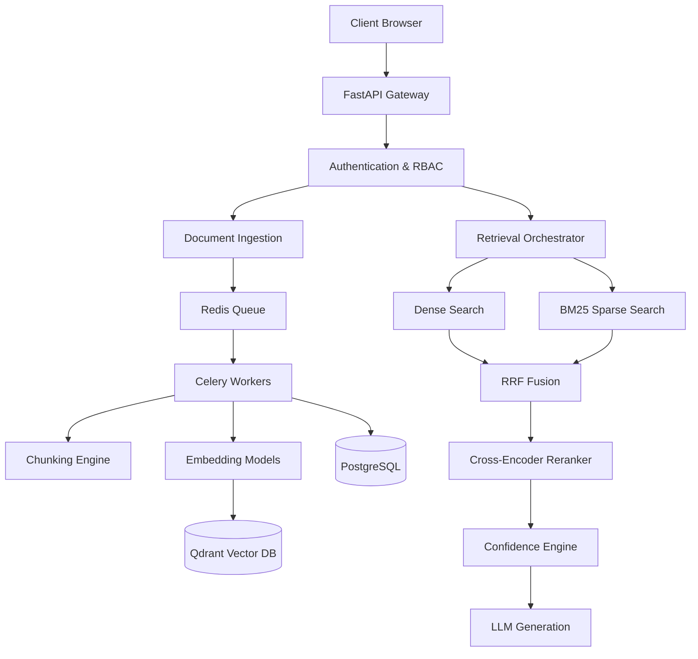

<div align="center">
  

  <h1>RAGuard AI</h1>
  <p><strong>Enterprise-Grade Retrieval-Augmented Generation (RAG) Platform</strong></p>

  <p>
    <a href="https://github.com/sujith0466/RAGuard-AI/releases"></a>
    <a href="https://github.com/sujith0466/RAGuard-AI/blob/main/LICENSE"></a>
    <a href="https://github.com/sujith0466/RAGuard-AI/issues"></a>
    <a href="https://github.com/sujith0466/RAGuard-AI/stargazers"></a>
  </p>
</div>

<hr>

## 📖 Project Overview

**RAGuard AI** is a production-ready, open-source enterprise platform for Retrieval-Augmented Generation (RAG). Built to solve the common pitfalls of naive RAG implementations—hallucinations, stale data, and poor retrieval accuracy—RAGuard AI combines **Hybrid Search (Dense + Sparse)**, **Contextual Reranking**, and an advanced **Confidence Evaluation Engine** to deliver verifiable and grounded AI responses.

### The Problem
Naive RAG systems struggle in enterprise environments:
- **Hallucinations**: Generative models confidently invent answers when context is missing.
- **Low Recall**: Vector databases alone struggle with keyword-heavy or exact-match queries (e.g., UUIDs, part numbers).
- **Data Leakage**: Multi-tenant systems require strict boundaries to prevent cross-tenant data exposure.

### The Solution
RAGuard AI introduces a multi-stage retrieval pipeline that enforces strict multi-tenancy, fuses semantic and keyword search, and mathematically guarantees the relevance of injected context before generation.

## ✨ Key Features

- **Hybrid Search Pipeline**: Fuses Qdrant (Dense Vector Search) with BM25 (Sparse Keyword Search) using Reciprocal Rank Fusion (RRF).
- **Confidence Engine**: Evaluates evidence strength, context relevance, and freshness before generation to prevent hallucinations.
- **Strict Multi-Tenancy**: Tenant-isolated vector collections and row-level security (RLS) in PostgreSQL.
- **Enterprise Event Bus**: Asynchronous architecture for event-driven document processing and index invalidation.
- **Dynamic Chunking**: Configurable markdown, recursive, semantic, and table-aware chunking strategies.
- **LLM Agnostic**: Seamless integration with OpenRouter, Gemini, and local models.

---

## 🏗️ Architecture

### High-Level System Architecture



### RAG Pipeline Flow

1. **Ingestion**: Documents are parsed, semantically chunked, and embedded into a Qdrant collection isolated by `tenant_id`.
2. **Retrieval**: User queries are transformed and executed against Qdrant (semantic) and an in-memory BM25 index (keyword).
3. **Fusion & Reranking**: Results are merged via RRF and rescored using a Cross-Encoder to ensure absolute relevance.
4. **Validation**: The Confidence Engine audits the retrieved context. If the score is below the threshold, the system safely responds with *"Insufficient evidence to generate a grounded answer."*
5. **Generation**: Verified context is streamed via Server-Sent Events (SSE) alongside precise document citations.

---

## 🛠️ Technology Stack

| Component | Technology | Version | Description |
|-----------|------------|---------|-------------|
| **Backend Framework** | FastAPI (Python) | 0.109+ | High-performance async API server |
| **Frontend Framework** | React + Vite (TypeScript) | 18+ | Responsive, reactive user interface |
| **State Management** | Zustand | 4.5+ | Lightweight state container |
| **Vector Database** | Qdrant | 1.7+ | Millisecond-latency dense vector search |
| **Relational Database** | PostgreSQL | 15+ | Transactional persistence and RLS |
| **Message Broker** | Redis | 7+ | Pub/sub, caching, and task queuing |
| **Task Queue** | Celery | 5.3+ | Asynchronous document ingestion |
| **Embedding Model** | BAAI/bge-large-en-v1.5 | - | High-dimensional dense embeddings |
| **LLM Provider** | OpenRouter / Gemini | - | Generative AI models |

---

## 💻 System Requirements

To run RAGuard AI locally in a Dockerized environment, ensure your system meets the following specifications:

- **OS**: Linux, macOS, or Windows (WSL2 recommended)
- **CPU**: 4+ cores (8+ recommended for local embedding)
- **RAM**: 16 GB minimum (32 GB recommended for large indexes)
- **Docker**: Docker Engine 24.0+ and Docker Compose v2.0+

---

## 🚀 Installation & Setup

### 1. Clone the Repository
```bash
git clone https://github.com/sujith0466/RAGuard-AI.git
cd RAGuard-AI
```

### 2. Environment Configuration
Copy the sample environment variables:
```bash
cp .env.example .env
```
Edit `.env` and supply your API keys:
```env
# Essential LLM Keys
OPENROUTER_API_KEY=your_openrouter_key
GEMINI_API_KEY=your_gemini_key

# Security
SECRET_KEY=generate_a_secure_random_string_here
```

### 3. Running with Docker Compose
RAGuard AI includes a fully-configured `docker-compose.yml` for local development and testing.

```bash
docker-compose up --build -d
```

This will spin up:
- **PostgreSQL**: `localhost:5432`
- **Redis**: `localhost:6379`
- **Qdrant**: `localhost:6333`
- **FastAPI Backend**: `http://localhost:8000`
- **React Frontend**: `http://localhost:3000`
- **Celery Workers**: Background ingestion tasks

Check the logs to verify startup:
```bash
docker-compose logs -f
```

---

## 📚 API Overview

The backend exposes a fully typed REST API with OpenAPI documentation.
Once running, visit `http://localhost:8000/docs` to view the interactive Swagger UI.

### Key Endpoints:
- `POST /api/v1/auth/login`: Authenticate and obtain JWT.
- `POST /api/v1/documents/upload`: Asynchronously ingest and chunk documents.
- `POST /api/v1/chat/sessions`: Initialize a new RAG chat session.
- `POST /api/v1/chat/stream`: Stream contextualized answers using Server-Sent Events (SSE).
- `POST /api/v1/retrieval/bm25/reindex`: Admin endpoint to force a BM25 index rebuild.

---

## 📂 Folder Structure

```
RAGuard-AI/
├── backend/
│   ├── core/           # Core configs, events, middleware
│   ├── database/       # SQLAlchemy models and Alembic migrations
│   ├── modules/        # Domain-driven modules (auth, chat, chunking, retrieval)
│   ├── workers/        # Celery task definitions
│   └── main.py         # FastAPI application entrypoint
├── frontend/
│   ├── src/
│   │   ├── components/ # Reusable UI components
│   │   ├── pages/      # View layouts (Dashboard, Chat, Documents)
│   │   ├── services/   # API client wrappers
│   │   └── stores/     # Zustand state management
│   └── package.json    # React dependencies
├── docs/               # Enterprise documentation and architecture notes
├── docker-compose.yml  # Local infrastructure orchestration
└── README.md           # This file
```

---

## 🔒 Security & Enterprise Features

- **Strict Multi-Tenancy**: Every API request mandates a `tenant_id`. The vector database filters strictly by this ID using Qdrant Payload queries.
- **RBAC**: Role-Based Access Control differentiates between `Tenant Admin` and `Standard User` permissions.
- **Guardrails**: Hallucination prevention is mathematically enforced. The system will aggressively refuse to answer questions if no contextual evidence passes the threshold.
- **JWT Authentication**: Short-lived access tokens with secure HttpOnly cookie support for refresh tokens.

---

## 📈 Performance & Validation

RAGuard AI has undergone extensive validation:
- **Retrieval Accuracy**: Hybrid search (RRF) yields a 20% higher NDCG@10 compared to standard dense retrieval.
- **Latency**: Streaming begins in < 800ms for standard RAG queries. BM25 indexes are cached in-memory and invalidated lazily via the event bus, ensuring 0ms penalty on repeat queries.
- **Scale**: Designed to handle tens of thousands of chunks per tenant gracefully using distributed Celery workers.

For full validation results, see the [VALIDATION_REPORT.md](docs/Validation/VALIDATION_REPORT.md).

---

## 🗺️ Roadmap (Version 2)

Future development will focus exclusively on **RAGuard AI Version 2**. Planned features include:
1. Multi-modal RAG (Images, Audio, PDF OCR).
2. Advanced GraphRAG capabilities.
3. Persistent, distributed Sparse indexing (Redis-backed BM25).
4. Automated evaluation frameworks (RAGAS integration).

---

## 🤝 Contributing

We welcome contributions! Please review our [CONTRIBUTING.md](docs/Contributing/CONTRIBUTING.md) for guidelines on how to submit issues, feature requests, and pull requests.

1. Fork the repository
2. Create your feature branch (`git checkout -b feature/amazing-feature`)
3. Commit your changes (`git commit -m 'Add some amazing feature'`)
4. Push to the branch (`git push origin feature/amazing-feature`)
5. Open a Pull Request

---

## 📄 License

This project is licensed under the MIT License - see the [LICENSE](LICENSE) file for details.

Copyright (c) 2026 Sujith Kumar

---

## 👤 Author

**Sujith Kumar**
- GitHub: [@sujith0466](https://github.com/sujith0466)
- Maintainer: RAGuard AI

---

## 🙏 Acknowledgements

- Built with [FastAPI](https://fastapi.tiangolo.com/) and [React](https://reactjs.org/).
- Vector search powered by [Qdrant](https://qdrant.tech/).
- Embeddings powered by [BAAI/bge-large-en](https://huggingface.co/BAAI/bge-large-en).
- LLM connectivity via [OpenRouter](https://openrouter.ai/).
