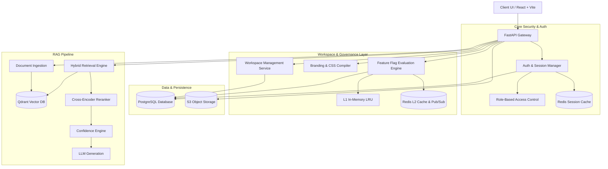

<div align="center">
  

  <h1>RAGuard AI (Version 2)</h1>
  <p><strong>Enterprise-Grade Multi-Tenant Retrieval-Augmented Generation Platform</strong></p>

  <p>
    <a href="https://github.com/sujith0466/RAGuard-AI/releases"></a>
    <a href="https://github.com/sujith0466/RAGuard-AI/blob/main/LICENSE"></a>
    <a href="https://github.com/sujith0466/RAGuard-AI/issues"></a>
    <a href="https://github.com/sujith0466/RAGuard-AI/stargazers"></a>
  </p>
</div>

<hr>

## 📖 Project Overview

**RAGuard AI V2** is a production-grade, open-source enterprise platform for Retrieval-Augmented Generation (RAG). Designed from the ground up with a Domain-Driven Design (DDD) modular monolith architecture, RAGuard AI guarantees strict multi-tenant isolation, enterprise identity & session management, mathematical hallucination prevention, hybrid search indexing, and real-time observability.

---

## ✨ Core Capabilities & Architectural Pillars

### 1. Multi-Tenant Workspace Lifecycle & Governance (Epic 3 ✅ Frozen)
- **Lifecycle Management:** Dedicated workspace states (`ACTIVE`, `ARCHIVED`, `SUSPENDED`, `SOFT_DELETED`) with audit logging.
- **Slug Management:** URL-safe slug generation with collision detection and optimistic locking.
- **JSON Schema Settings:** Typed JSONB workspace configuration with versioned snapshot history, atomic rollback, and key-level diffing.
- **Dynamic Workspace Branding (F3.7):** WCAG AA color luminance & contrast ratio validation ($\ge 4.5:1$), real-time CSS root variable generation, Tailwind design token compilation, and Redis preview staging.
- **Enterprise Feature Flags (F3.8):** Multi-tier evaluation engine featuring a 7-step priority pipeline (Killswitch $\to$ Prerequisites $\to$ Workspace Overrides $\to$ User Targeting $\to$ Role Targeting $\to$ MurmurHash3 Percentage Rollouts $\to$ Date Windows), L1 in-memory / L2 Redis caching, and Redis Pub/Sub cluster invalidation.

### 2. Enterprise Authentication & Identity (Epic 2 ✅ Frozen)
- **Zero Client-Side Trust:** Secure server-side authentication utilizing Argon2id password hashing and cryptographic single-use tokens.
- **Session Tracking & Instant Revocation:** Redis-backed token revocation, active session monitoring, and remote session termination.
- **Multi-Factor & Recovery:** 6-digit time-based email OTP verification, cryptographic password reset, and email confirmation flows.
- **Enterprise SSO:** Extensible OAuth2/OIDC `IdentityProvider` framework supporting Google, GitHub, and custom enterprise providers.

### 3. Foundational Infrastructure & Observability (Epic 1 ✅ Frozen)
- **Async PostgreSQL 15+:** SQLAlchemy 2.0 async engine with PgBouncer connection pooling and tenant-partitioned schemas.
- **Distributed Redis 7+:** Multi-tier caching, distributed mutex locking, token blacklisting, and rate limiting.
- **Vector Search (Qdrant 1.7+):** Tenant-isolated dense vector collections with HNSW indexing and metadata filtering.
- **Object Storage (S3 / MinIO):** Encrypted object store with presigned URL workflows and WORM / Object Lock audit trails.
- **Full Observability:** OpenTelemetry distributed tracing, structured JSON logging with PII scrubbing, Prometheus metric scrapers, and Kubernetes health probes (`/health/live`, `/health/ready`, `/health/startup`).

### 4. Advanced RAG & Confidence Engine
- **Hybrid Retrieval:** Fuses Dense Vector Search (Qdrant) with Sparse Keyword Search (BM25) using Reciprocal Rank Fusion (RRF).
- **Contextual Reranking:** Cross-Encoder neural rescoring to maximize precision.
- **Confidence Evaluation:** Mathematical hallucination prevention that evaluates evidence strength, relevance, and semantic overlap before LLM generation.

---

## 🏗️ System Architecture



---

## 🛠️ Technology Stack

| Component | Technology | Version | Description |
|---|---|---|---|
| **Backend Framework** | FastAPI (Python) | 0.109+ | High-performance asynchronous API server |
| **Relational Database** | PostgreSQL + asyncpg | 15+ | Multi-tenant transactional persistence |
| **ORM & Migrations** | SQLAlchemy 2.0 + Alembic | 2.0+ | Typed async models & schema versioning |
| **In-Memory Cache & Broker** | Redis | 7+ | L1/L2 caching, Pub/Sub, distributed locks |
| **Vector Database** | Qdrant | 1.7+ | Tenant-partitioned vector indexing & search |
| **Object Storage** | AWS S3 / MinIO | - | Presigned uploads and immutable audit logs |
| **Frontend Framework** | React 18 + Vite | 5+ | Responsive TypeScript SPA with Tailwind CSS |
| **State Management** | Zustand + React Context | 4.5+ | Global state container & context providers |
| **Observability** | OpenTelemetry + Prometheus | - | Tracing, structured logs, and metrics |

---

## 🚀 Getting Started

### 1. Prerequisites
- Docker Engine 24.0+ & Docker Compose v2.0+
- Python 3.11+ / Node.js 18+ (for local native development)

### 2. Setup Environment
```bash
git clone https://github.com/sujith0466/RAGuard-AI.git
cd RAGuard-AI
cp .env.example .env
```

### 3. Launch with Docker Compose
```bash
docker-compose up --build -d
```
Services initialized:
- **FastAPI Backend:** `http://localhost:8000` (Swagger UI at `/docs`)
- **React Frontend:** `http://localhost:3000`
- **PostgreSQL:** `localhost:5432`
- **Redis:** `localhost:6379`
- **Qdrant:** `localhost:6333`

---

## 📚 API Endpoint Overview

| Category | Endpoint | Method | Description |
|---|---|---|---|
| **Auth** | `/api/v1/auth/register` | `POST` | User registration with Argon2id |
| **Auth** | `/api/v1/auth/login` | `POST` | Dual-token authentication |
| **Auth** | `/api/v1/auth/refresh` | `POST` | Refresh token rotation |
| **Auth** | `/api/v1/auth/sessions` | `GET` | List active sessions |
| **Workspaces** | `/api/v1/workspaces` | `GET`, `POST` | List & provision workspaces |
| **Workspaces** | `/api/v1/workspaces/{id}` | `GET`, `PATCH`, `DELETE` | Workspace CRUD & lifecycle |
| **Workspaces** | `/api/v1/workspaces/{id}/archive` | `POST` | Archive workspace |
| **Workspaces** | `/api/v1/workspaces/{id}/restore` | `POST` | Restore archived workspace |
| **Branding** | `/api/v1/workspaces/{id}/branding` | `GET` | Get compiled CSS variables & tokens |
| **Branding** | `/api/v1/workspaces/{id}/branding/preview` | `POST` | Stage branding draft preview |
| **Branding** | `/api/v1/workspaces/{id}/branding/publish` | `POST` | Publish branding with cache bust |
| **Feature Flags**| `/api/v1/feature-flags` | `GET`, `POST` | Global feature flag catalog |
| **Feature Flags**| `/api/v1/feature-flags/{key}/killswitch` | `POST` | Emergency global killswitch toggle |
| **Feature Flags**| `/api/v1/workspaces/{id}/feature-flags/evaluate` | `GET` | Bulk workspace flag evaluation |

---

## 📂 Repository Directory Layout

```
RAGuard-AI/
├── backend/
│   ├── api/v1/             # FastAPI routers, request/response schemas, dependencies
│   ├── core/               # Auth context, security, config, events, logging
│   ├── database/           # Async database engine, sessions, Alembic migrations
│   ├── models/entities/    # SQLAlchemy domain entities (Workspaces, Flags, Auth)
│   ├── repositories/       # Async data repositories
│   ├── services/           # Domain business logic (Workspace, FeatureFlag, Auth)
│   └── tests/              # Unit & integration test suites
├── frontend/
│   ├── src/
│   │   ├── components/     # UI components, layouts, guards
│   │   ├── providers/      # React context providers (Auth, Branding, FeatureFlag)
│   │   ├── services/       # Typed API clients
│   │   ├── stores/         # Zustand global stores
│   │   └── pages/          # Application view pages
│   └── tests/              # E2E & unit test suites
├── docs/                   # Architecture specs, ADRs, runbooks, and archives
│   ├── architecture/       # Detailed domain architecture specifications
│   └── archive/            # Historical artifacts for Epics 1, 2, 3
├── infrastructure/         # Terraform IaC, Kubernetes manifests, Docker scripts
├── docker-compose.yml      # Multi-container local orchestration
└── README.md
```

---

## 🗺️ Program 2 Implementation Roadmap

| Epic | Description | Status | Progress |
|---|---|---|---|
| **Epic 1** | Infrastructure & Foundation Layer | ✅ **FROZEN** | 100% |
| **Epic 2** | Authentication & Identity Management | ✅ **FROZEN** | 100% |
| **Epic 3** | Workspace Architecture & Management | ✅ **FROZEN** | 100% |
| **Epic 4** | User & Role Management (RBAC / Invitations / Profiles) | ⏳ **NEXT UP** | 0% |
| **Epic 5** | Document & Folder Management | ⏳ Scheduled | 0% |
| **Epic 6** | Document Ingestion Pipeline | ⏳ Scheduled | 0% |
| **Epic 7** | Vector Search & Qdrant Integration | ⏳ Scheduled | 0% |
| **Epic 8** | Hybrid Search & BM25 Sparse Indexing | ⏳ Scheduled | 0% |
| **Epic 9** | Contextual Reranking & Fusion | ⏳ Scheduled | 0% |
| **Epic 10** | Hallucination Prevention & Confidence Engine | ⏳ Scheduled | 0% |
| **Epic 11** | Generation & LLM Provider Gateway | ⏳ Scheduled | 0% |
| **Epic 12** | Chat & Session Management | ⏳ Scheduled | 0% |
| **Epic 13** | Analytics, Audit Logging & Governance | ⏳ Scheduled | 0% |
| **Epic 14** | Enterprise Security & Compliance | ⏳ Scheduled | 0% |
| **Epic 15** | Cloud Deployment, Helm & Scalability | ⏳ Scheduled | 0% |

---

## 📄 License & Governance

Licensed under the MIT License. See [LICENSE](LICENSE) for details.  
Copyright (c) 2026 Sujith Kumar.
