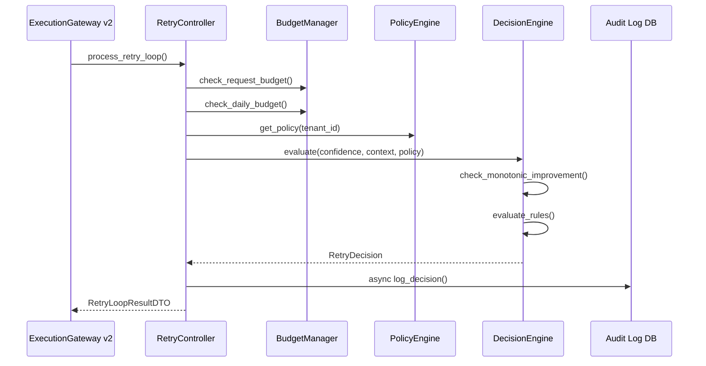

# phase-7-implementation-plan.md
# RAGuard AI — Phase 7: Retry Controller (Production Grade)

**Version**: 1.0.0  
**Date**: 2026-07-20  
**Author**: Principal Software Architect  
**Status**: PLANNING — Awaiting Approval  
**Depends On**: Phase 5 (Hybrid Retrieval), Phase 6 (Confidence Engine)

---

## 1. Executive Summary

Phase 7 delivers the **production-grade Retry Controller** — the autonomous decision-making layer that determines whether to retry, rewrite, clarify, or abort when the Phase 6 Confidence Engine returns a non-PROCEED action. While Phase 3 introduced the baseline `RetryStateMachine`, Phase 7 promotes the retry system to a full production engine featuring a pluggable Decision Engine, configurable Retry Budget Manager, rule-based policy evaluation, low-confidence handling strategies, and complete audit logging.

The Retry Controller is the central coordinator between the Confidence Engine (Phase 6), Query Rewrite Engine (Phase 8), and Clarification Engine (Phase 9). It ensures self-correction loops are deterministic, budget-bounded, and monotonically improving.

---

## 2. Phase Objectives

1. Implement production **Decision Engine** — evaluates `ConfidenceResultDTOv2` + `RetryPolicy` to produce a deterministic `RetryDecision`.
2. Implement configurable **Retry Budget Manager** — tracks per-request and per-tenant retry budgets; enforces hard caps; applies time-based budget decay.
3. Implement pluggable **Retry Policy Engine** — per-tenant policy configuration with rule precedence ordering.
4. Implement **Rule Engine** — composable rule evaluation with priority, condition, and action triplets.
5. Implement **Low Confidence Handling** strategies: query rewrite trigger, clarification trigger, evidence broadening trigger, abort.
6. Expose **Retry Controller REST API** — decision endpoint, budget status, and policy management.
7. Wire retry loop into the `ExecutionGateway` v2 pipeline.

---

## 3. Business Goals

- **Self-Correction**: When retrieval produces insufficient evidence, automatically attempt to improve rather than fail.
- **Budget Safety**: Prevent agentic runaway loops — hard cap of 3 retries per request, configurable per tenant.
- **Monotonic Improvement**: Every retry must improve confidence score; non-improving retries abort.
- **Transparency**: Every retry decision is logged with full reasoning for compliance and debugging.
- **Configurability**: Retry behavior is configurable per-tenant without code changes.

---

## 4. Technical Goals

- `RetryDecision` is deterministic for the same `ConfidenceResultDTOv2` + `RetryPolicy` input.
- Retry budget is tracked at two levels: per-request (count) and per-tenant-per-day (total budget).
- Rule Engine evaluates rules in priority order; first matching rule wins.
- All retry decisions are emitted as domain events and persisted asynchronously.
- Retry loop integrates with Phase 5 (`RetrievalOrchestrator`) for re-retrieval after query rewrite.
- Phase 7 never duplicates Phase 6 logic — it only consumes `ConfidenceResultDTOv2`.

---

## 5. Scope

| Component | Included in Phase 7 |
|---|---|
| Decision Engine | ✅ |
| Retry Budget Manager | ✅ |
| Retry Policy Engine | ✅ |
| Rule Engine | ✅ |
| Low Confidence Handling strategies | ✅ |
| Retry Audit Log (DB) | ✅ |
| Retry Controller REST API | ✅ |
| ExecutionGateway v2 integration | ✅ |
| Unit + Integration Tests | ✅ |

---

## 6. Out of Scope

- Query rewriting strategies (→ Phase 8)
- Clarification question generation (→ Phase 9)
- LLM answer generation (→ Phase 10)
- Circuit breaker management (→ Phase 2 `ReliabilityGateway`)
- Frontend UI components

---

## 7. PRD Alignment

| PRD Requirement | Phase 7 Component |
|---|---|
| FR-RC-1: Max retries enforcement | Retry Budget Manager |
| FR-RC-2: Monotonic improvement check | Decision Engine |
| FR-RC-3: Configurable retry policy | Retry Policy Engine |
| FR-RC-4: Rule-based decision routing | Rule Engine |
| FR-RC-5: Low confidence strategy routing | Low Confidence Handler |
| NFR-AUT-1: No agentic loops | Hard cap at 3 retries |
| NFR-AUD-1: Full retry audit trail | RetryAuditLog |

---

## 8. Architecture Alignment

- Follows ADR-005: all retry logic under `backend/modules/retry/`.
- Extends existing `RetryStateMachine` (Phase 3 baseline) — does NOT replace.
- `ExecutionGateway` v2 orchestrates Phase 5 → Phase 6 → Phase 7 → Phase 8/9 → Phase 10.

---

## 9. Dependency Analysis

### Upstream Dependencies
| Phase | Component | Required By Phase 7 |
|---|---|---|
| Phase 5 | `RetrievalOrchestrator` | Re-retrieval on retry |
| Phase 6 | `ConfidenceResultDTOv2` | Input to Decision Engine |
| Phase 6 | `ConfidenceAction` enum | Decision routing |
| Phase 3 | `RetryStateMachine` (baseline) | Extension target |

### Downstream Consumers
| Phase | Component | Consumes from Phase 7 |
|---|---|---|
| Phase 8 | QueryRewrite | `RetryDecision` with `trigger_rewrite=True` |
| Phase 9 | ClarificationEngine | `RetryDecision` with `trigger_clarification=True` |
| Phase 10 | AnswerGenerator | Proceeds only if `RetryDecision.action = PROCEED` |

---

## 10. Existing Codebase Review

### What Already Exists (Baseline)

| Component | Location | Status |
|---|---|---|
| `RetryStateMachine` | `backend/modules/retry/services/state_machine.py` | Phase 7 wraps and extends |
| `RetryContextDTO` | `backend/modules/retry/schemas/retry_dto.py` | Extend with budget + rule trace |
| `RetryAttemptDTO` | Same | Extend with `trigger_reason` |
| `RetryState` | Same | Add states: `BUDGET_EXHAUSTED`, `POLICY_ABORT` |
| `MaxRetriesExceeded` | `backend/modules/retry/schemas/errors.py` | Keep |
| `NonMonotonicImprovement` | Same | Keep |

---

## 11. High-Level Architecture

```
┌──────────────────────────────────────────────────────────┐
│               Phase 7: Retry Controller                  │
├────────────────────────┬─────────────────────────────────┤
│  /api/v1/retry/        │  FastAPI Router                  │
│    decision            │                                  │
│    budget              │                                  │
│    policy              │                                  │
├────────────────────────┴─────────────────────────────────┤
│               RetryController (coordinator)               │
│                                                          │
│  ┌──────────────────┐  ┌────────────────────────────────┐ │
│  │  Decision Engine │  │  Retry Budget Manager          │ │
│  │  (rule evaluation│  │  (per-request + per-tenant)    │ │
│  │   + monotonic    │  └─────────────────┬──────────────┘ │
│  │   check)         │                   │               │ │
│  └───────┬──────────┘                   │               │ │
│          │         ┌────────────────────┘               │ │
│          │         │                                    │ │
│  ┌───────▼─────────▼──────────────────────────────────┐ │ │
│  │              Rule Engine                           │ │ │
│  │  (ordered rules → RetryAction)                    │ │ │
│  └───────────────────────────────────────────────────┘ │ │
│          │                                             │ │
│  ┌───────▼──────────────────────────────────────────┐  │ │
│  │  Low Confidence Handler                          │  │ │
│  │  REWRITE | BROADEN | CLARIFY | ABORT             │  │ │
│  └──────────────────────────────────────────────────┘  │ │
└────────────────────────────────────────────────────────────┘
```

---

## 12. Low-Level Design

### Decision Engine

```
Input: ConfidenceResultDTOv2 + RetryContextDTO + RetryPolicy

Evaluation Pipeline:
  Step 1 — Budget Check:
    if context.attempt_count >= policy.max_retries → RetryAction.ABORT_BUDGET_EXHAUSTED
    if tenant_daily_budget_consumed >= policy.daily_budget → RetryAction.ABORT_BUDGET_EXHAUSTED

  Step 2 — Monotonic Improvement Check:
    if context.best_confidence_score > 0:
      delta = new_score - context.best_confidence_score
      if delta < policy.min_improvement_delta → RetryAction.ABORT_NO_IMPROVEMENT

  Step 3 — Rule Engine Evaluation:
    Evaluate rules in priority order → first match wins → RetryAction

  Step 4 — Low Confidence Handler Routing:
    if action == RETRY_REWRITE → trigger Phase 8 QueryRewrite
    if action == RETRY_CLARIFY → trigger Phase 9 Clarification
    if action == RETRY_BROADEN → trigger Phase 5 with broadened FilterDSL
    if action == ABORT → propagate abort reason

Output: RetryDecision
  action: RetryAction
  trigger_rewrite: bool
  trigger_clarification: bool
  trigger_broadening: bool
  abort_reason: str | None
  matched_rule: str | None
  budget_remaining: int
```

### RetryAction Enum

```python
class RetryAction(str, Enum):
    PROCEED = "proceed"                         # Confidence is sufficient
    RETRY_REWRITE = "retry_rewrite"             # Retry with query rewrite
    RETRY_BROADEN = "retry_broaden"             # Retry with broadened filters
    RETRY_CLARIFY = "retry_clarify"             # Request user clarification
    ABORT_BUDGET_EXHAUSTED = "abort_budget"     # Max retries reached
    ABORT_NO_IMPROVEMENT = "abort_no_improve"   # Non-monotonic
    ABORT_CONFLICT = "abort_conflict"           # Severe conflict, no retry
    ABORT_POLICY = "abort_policy"               # Policy rule forced abort
```

### Rule Engine Design

```
RetryRule:
  id: str
  name: str
  priority: int (lower = higher priority)
  condition: RetryCondition
    confidence_score_lt: float | None
    confidence_score_gte: float | None
    action_equals: ConfidenceAction | None
    has_uncovered_clauses: bool | None
    has_severe_conflict: bool | None
    attempt_gte: int | None
    is_degraded: bool | None
  action: RetryAction
  description: str

Evaluation:
  Sort rules by priority ascending
  For each rule: if all conditions met → return rule.action
  If no rule matches → fallback to default_action
```

### Retry Budget Manager

```
Per-Request Budget:
  max_retries: int = 2 (hard cap: min(config, 3))
  attempt_count: int (tracked in RetryContextDTO)

Per-Tenant-Daily Budget:
  Key: CacheProvider (Redis Implementation) INCR "retry_budget:{tenant_id}:{date}" EX 86400
  Limit: policy.daily_retry_budget (default: 1000)
  On each retry: INCR key → if value > limit → ABORT_BUDGET_EXHAUSTED

Budget Replenishment:
  Automatic: CacheProvider (Redis Implementation) TTL expires at midnight UTC
  Manual: Admin API reset via /api/v1/retry/budget/reset
```

### Low Confidence Handling

```
Strategy Routing Matrix:
  confidence.action = RETRY:
    if coverage.uncovered_clauses > 0 → RETRY_REWRITE (trigger Phase 8)
    elif is_degraded_retrieval → RETRY_BROADEN (re-invoke Phase 5 with FilterDSL.broadened=True)
    else → RETRY_REWRITE (default)

  confidence.action = CLARIFY:
    → RETRY_CLARIFY (trigger Phase 9)

  confidence.action = ABORT:
    if has_severe_conflict → ABORT_CONFLICT
    else → ABORT_POLICY
```

---

## 13. Component Design

### 13.1 DecisionEngine (new)
```
class DecisionEngine:
  - evaluate(
      confidence_result: ConfidenceResultDTOv2,
      retry_context: RetryContextDTO,
      policy: RetryPolicy
    ) → RetryDecision
  - _check_budget(context, policy, tenant_id) → RetryAction | None
  - _check_monotonic_improvement(score, context, policy) → RetryAction | None
  - _apply_rule_engine(confidence_result, context, policy) → RetryAction
  - _route_low_confidence(confidence_result, retry_action) → RetryDecision
```

### 13.2 RetryBudgetManager (new)
```
class RetryBudgetManager:
  - check_request_budget(context: RetryContextDTO, policy: RetryPolicy) → bool
  - check_daily_budget(tenant_id: str, policy: RetryPolicy) → bool
  - consume_daily_budget(tenant_id: str) → int  # returns new count
  - get_budget_status(tenant_id: str) → BudgetStatusDTO
  - reset_daily_budget(tenant_id: str) → None  # admin only
  # Backend: CacheProvider (Redis Implementation) with TTL
```

### 13.3 RetryPolicyEngine (new)
```
class RetryPolicyEngine:
  - get_policy(tenant_id: str) → RetryPolicy
  - set_policy(tenant_id: str, policy: RetryPolicy) → None
  - reset_to_default(tenant_id: str) → None
  - validate_rules(rules: list[RetryRule]) → None
  # Backend: CacheProvider (Redis Implementation) + PostgreSQL write-through
```

### 13.4 RuleEngine (new)
```
class RuleEngine:
  - evaluate(
      rules: list[RetryRule],
      confidence_result: ConfidenceResultDTOv2,
      retry_context: RetryContextDTO
    ) → tuple[RetryAction, RetryRule | None]
  - _sort_rules_by_priority(rules) → list[RetryRule]
  - _evaluate_condition(condition: RetryCondition, context) → bool
```

### 13.5 RetryController (coordinator, extends ExecutionGateway)
```
class RetryController:
  - process_retry_loop(
      query: str,
      retrieval_result: RetrievalResultDTOv2,
      tenant_id: str,
      correlation_id: str
    ) → RetryLoopResultDTO
  - _confidence_phase(query, retrieval_result) → ConfidenceResultDTOv2
  - _decision_phase(confidence_result, context, policy) → RetryDecision
  - _execute_retry(decision, query, tenant_id, correlation_id) → RetrievalResultDTOv2
  - _log_decision(decision, context, correlation_id) → None (async)
```

---

## 14. Module Responsibilities

| Component | Responsibility | Layer |
|---|---|---|
| `DecisionEngine` | Evaluate confidence result → deterministic `RetryAction` |
| `RetryBudgetManager` | Enforce per-request and per-tenant-daily retry budgets |
| `RetryPolicyEngine` | Store, retrieve, and validate per-tenant retry policies |
| `RuleEngine` | Evaluate ordered rules; return first matching action |
| `LowConfidenceHandler` | Route low-confidence signals to rewrite/broaden/clarify/abort |
| `RetryController` | Coordinate retry loop; integrate all sub-components |
| `RetryAuditLogger` | Persist retry decisions and statistics asynchronously |

---

## 15. Data Flow

```
Phase 6 Output (ConfidenceResultDTOv2)
              │
              ▼
    RetryController.process_retry_loop()
              │
    ┌─────────▼──────────┐
    │  RetryBudgetManager │ ← CacheProvider (Redis Implementation)
    │  (budget check)     │
    └─────────┬──────────┘
              │ budget OK
    ┌─────────▼──────────┐
    │   DecisionEngine    │
    │  (monotonic check)  │
    └─────────┬──────────┘
              │
    ┌─────────▼──────────┐
    │    RuleEngine       │ ← RetryPolicy (CacheProvider (Redis Implementation) cache)
    │  (rule evaluation)  │
    └─────────┬──────────┘
              │
    ┌─────────▼────────────────────────────────────┐
    │   LowConfidenceHandler                       │
    │   RETRY_REWRITE → Phase 8 trigger            │
    │   RETRY_BROADEN → Phase 5 re-invoke          │
    │   RETRY_CLARIFY → Phase 9 trigger            │
    │   ABORT_* → propagate abort to ExecutionGW   │
    └──────────────────────────────────────────────┘
              │
    RetryLoopResultDTO → ExecutionGateway v2
```

---

## 16. Sequence Flow (Full Retry Loop)

```
1. ExecutionGateway v2 receives query + initial retrieval result
2. ConfidenceEngine.evaluate() → ConfidenceResultDTOv2
3. RetryController.process_retry_loop():
   a. RetryBudgetManager.check_request_budget() → OK
   b. RetryBudgetManager.check_daily_budget() → OK
   c. DecisionEngine.evaluate():
      i.  Monotonic improvement check
      ii. RuleEngine.evaluate() → RetryAction
      iii. LowConfidenceHandler.route() → RetryDecision
   d. If RETRY_REWRITE → Phase 8.rewrite_query() → new_query
   e. If RETRY_BROADEN → Phase 5.execute_hybrid_search(broadened=True)
   f. If RETRY_CLARIFY → return RetryLoopResultDTO(needs_clarification=True)
   g. If ABORT_* → return RetryLoopResultDTO(aborted=True, reason=...)
   h. Re-run Phase 6 ConfidenceEngine on new retrieval result
   i. Repeat loop until PROCEED or budget exhausted
4. RetryBudgetManager.consume_daily_budget(tenant_id)
5. RetryAuditLogger.log(decision, context) [async]
6. Return RetryLoopResultDTO to ExecutionGateway v2
```

---

## 17. Folder Structure Changes

```
backend/modules/retry/
├── api/                           [NEW]
│   ├── __init__.py                [NEW]
│   ├── routes.py                  [NEW] decision, budget, policy endpoints
│   └── dependencies.py            [NEW]
├── schemas/
│   ├── __init__.py
│   ├── retry_dto.py               [MODIFY] add RetryDecision, RetryRule, RetryPolicy,
│   │                                      RetryLoopResultDTO, BudgetStatusDTO
│   └── errors.py                  [MODIFY] add RTY_004 (BudgetExhausted),
│                                           RTY_005 (PolicyConflict)
├── services/
│   ├── state_machine.py           [MODIFY] extend RetryState enum
│   ├── decision_engine.py         [NEW] DecisionEngine
│   ├── budget_manager.py          [NEW] RetryBudgetManager
│   ├── policy_engine.py           [NEW] RetryPolicyEngine
│   ├── rule_engine.py             [NEW] RuleEngine
│   ├── low_confidence_handler.py  [NEW] LowConfidenceHandler
│   └── retry_controller.py        [NEW] RetryController (coordinator)
├── models/
│   ├── __init__.py                [NEW]
│   └── retry_audit_log.py         [NEW] RetryAuditLog ORM
├── repositories/
│   ├── __init__.py                [NEW]
│   └── retry_repository.py        [NEW] RetryRepository
└── events/
    ├── __init__.py                [NEW]
    └── payloads.py                [NEW] RetryDecisionMadePayload, RetryAbortedPayload

backend/modules/scoring/
└── services/
    └── execution_gateway.py       [MODIFY] upgrade to v2 with RetryController
```

---

## 18. File Creation Plan

| File | Type | Purpose |
|---|---|---|
| `services/decision_engine.py` | NEW | `DecisionEngine` |
| `services/budget_manager.py` | NEW | `RetryBudgetManager` (CacheProvider (Redis Implementation)-backed) |
| `services/policy_engine.py` | NEW | `RetryPolicyEngine` (CacheProvider (Redis Implementation)+PostgreSQL) |
| `services/rule_engine.py` | NEW | `RuleEngine` |
| `services/low_confidence_handler.py` | NEW | `LowConfidenceHandler` |
| `services/retry_controller.py` | NEW | `RetryController` |
| `models/retry_audit_log.py` | NEW | ORM model |
| `repositories/retry_repository.py` | NEW | Repository |
| `events/payloads.py` | NEW | Domain events |
| `api/routes.py` | NEW | REST endpoints |
| `api/dependencies.py` | NEW | FastAPI dependencies |
| `tests/unit/backend/modules/retry/test_retry_v2.py` | NEW | Phase 7 unit tests |

---

## 19. Database Changes

### Alembic Migration: `0011_retry_v2_schema.py`

```sql
CREATE TABLE retry_audit_logs (
    id                  UUID PRIMARY KEY DEFAULT gen_random_uuid(),
    tenant_id           VARCHAR(255) NOT NULL,
    correlation_id      VARCHAR(255) NOT NULL,
    attempt_number      INTEGER NOT NULL,
    confidence_score    FLOAT NOT NULL,
    confidence_action   VARCHAR(50) NOT NULL,
    retry_action        VARCHAR(50) NOT NULL,
    matched_rule        VARCHAR(255),
    trigger_rewrite     BOOLEAN DEFAULT FALSE,
    trigger_clarification BOOLEAN DEFAULT FALSE,
    trigger_broadening  BOOLEAN DEFAULT FALSE,
    abort_reason        TEXT,
    budget_consumed     INTEGER DEFAULT 0,
    duration_ms         FLOAT,
    created_at          TIMESTAMPTZ NOT NULL DEFAULT NOW()
);

CREATE INDEX idx_retry_audit_logs_tenant_correlation
    ON retry_audit_logs(tenant_id, correlation_id);

CREATE TABLE retry_policies (
    tenant_id               VARCHAR(255) PRIMARY KEY,
    max_retries             INTEGER NOT NULL DEFAULT 2,
    daily_retry_budget      INTEGER NOT NULL DEFAULT 1000,
    min_improvement_delta   FLOAT NOT NULL DEFAULT 2.0,
    default_action          VARCHAR(50) NOT NULL DEFAULT 'retry_rewrite',
    rules_json              JSONB NOT NULL DEFAULT '[]',
    updated_at              TIMESTAMPTZ NOT NULL DEFAULT NOW()
);
```

---

## 20. API Design

### 20.1 POST /api/v1/retry/decision (internal/admin)

**Request**:
```json
{
  "confidence_result": { "...ConfidenceResultDTOv2..." },
  "retry_context": { "attempt_count": 1, "best_score": 61.2, "... "}
}
```

**Response** (`RetryDecision`):
```json
{
  "action": "retry_rewrite",
  "trigger_rewrite": true,
  "trigger_clarification": false,
  "trigger_broadening": false,
  "abort_reason": null,
  "matched_rule": "low_coverage_rewrite",
  "budget_remaining": 1
}
```

### 20.2 GET /api/v1/retry/budget

**Response** (`BudgetStatusDTO`):
```json
{
  "tenant_id": "acme-corp",
  "daily_budget_limit": 1000,
  "daily_budget_consumed": 47,
  "daily_budget_remaining": 953,
  "reset_at_utc": "2026-07-21T00:00:00Z"
}
```

### 20.3 GET /api/v1/retry/policy

Current `RetryPolicy` for authenticated tenant.

### 20.4 PUT /api/v1/retry/policy

Update `RetryPolicy` (admin role).

### 20.5 POST /api/v1/retry/budget/reset (admin)

Reset daily budget for tenant.

---

## 21. Configuration Changes

```python
class RetrySettings(BaseModel):
    max_retries_default: int = 2
    max_retries_hard_cap: int = 3
    min_improvement_delta: float = 2.0
    daily_budget_default: int = 1000
    budget_redis_key_prefix: str = "retry_budget"
    budget_ttl_seconds: int = 86400
    default_retry_action: str = "retry_rewrite"
```

---

## 22. Environment Variables

```bash
# Phase 7 Retry Configuration
RETRY_MAX_RETRIES_DEFAULT=2
RETRY_MAX_RETRIES_HARD_CAP=3
RETRY_MIN_IMPROVEMENT_DELTA=2.0
RETRY_DAILY_BUDGET_DEFAULT=1000
RETRY_BUDGET_REDIS_KEY_PREFIX=retry_budget
RETRY_DEFAULT_ACTION=retry_rewrite
```

---

## 23. Security Considerations

1. `max_retries_hard_cap=3` is enforced server-side regardless of policy configuration — prevents agentic loops.
2. Daily budget is tracked per-tenant in CacheProvider (Redis Implementation) — prevents denial of service via retry flooding.
3. Policy management endpoints require admin JWT role.
4. `RetryAuditLog` is append-only for compliance.
5. Rule conditions are validated at policy write time (no arbitrary code injection).

---

## 24. Performance Considerations

1. Budget checks use CacheProvider (Redis Implementation) `INCR` — O(1), sub-millisecond.
2. Policy lookup uses CacheProvider (Redis Implementation) read-through — O(1) cache hit.
3. Rule evaluation is in-memory — O(r) where r = number of rules (bounded by policy max_rules).
4. `RetryAuditLog` write is fire-and-forget async task.
5. Full retry decision overhead target: < 5ms.

---

## 25. Error Handling Strategy

| Error Code | Exception | HTTP Status | Description |
|---|---|---|---|
| RTY_001 | `MaxRetriesExceeded` | 422 | Per-request budget exhausted |
| RTY_002 | `NonMonotonicImprovement` | 422 | Score not improving |
| RTY_003 | `InvalidStateTransition` | 500 | State machine violation |
| RTY_004 | `DailyBudgetExhaustedError` | 429 | Tenant daily budget exhausted |
| RTY_005 | `PolicyConflictError` | 400 | Contradictory rules in policy |

---

## 26. Testing Strategy

### Unit Tests
- `DecisionEngine`: all 7 `RetryAction` outputs reachable; monotonic check boundary; budget exhausted path.
- `RetryBudgetManager`: request budget enforced; daily budget enforced; CacheProvider (Redis Implementation) TTL behavior.
- `RetryPolicyEngine`: get/set/reset policy; invalid weight rejected.
- `RuleEngine`: priority ordering; first match wins; no match → default.
- `LowConfidenceHandler`: all 4 routing paths.
- `RetryController`: full loop (0 retries, 1 retry, 2 retries, budget exhausted).

### Integration Tests
- Full retry loop: RETRY_REWRITE → re-retrieval → PROCEED.
- Budget exhaustion: after max_retries → ABORT_BUDGET_EXHAUSTED.
- Policy rule override: custom rule forces ABORT on first retry.

---

## 27. Unit Testing Plan

| Test Class | Tests |
|---|---|
| `TestDecisionEngine` | `test_proceed_action`, `test_retry_rewrite_action`, `test_monotonic_abort`, `test_budget_abort`, `test_severe_conflict_abort`, `test_rule_override`, `test_degraded_triggers_broaden` |
| `TestRetryBudgetManager` | `test_request_budget_enforced`, `test_daily_budget_redis`, `test_budget_reset`, `test_hard_cap_enforcement`, `test_budget_status_dto` |
| `TestRuleEngine` | `test_priority_ordering`, `test_first_match_wins`, `test_no_match_default`, `test_condition_score_lt`, `test_condition_attempt_gte` |
| `TestLowConfidenceHandler` | `test_uncovered_clauses_triggers_rewrite`, `test_degraded_triggers_broaden`, `test_clarify_action`, `test_abort_conflict` |
| `TestRetryController` | `test_zero_retry_proceed`, `test_one_retry_then_proceed`, `test_two_retries_exhaust_budget`, `test_clarify_returns_immediately`, `test_full_loop_audit_logged` |

---

## 28. Integration Testing Plan

| Test | Description |
|---|---|
| `test_full_retry_loop_success` | 1 retry → PROCEED |
| `test_budget_exhaustion_abort` | 3 attempts → ABORT_BUDGET_EXHAUSTED |
| `test_policy_rule_custom_abort` | Custom rule → immediate abort on first retry |
| `test_daily_budget_exhausted` | CacheProvider (Redis Implementation) daily budget limit hit → 429 |
| `test_decision_endpoint` | POST /retry/decision returns correct RetryDecision |

---

## 29. Performance Testing Plan

| Scenario | Target | Metric |
|---|---|---|
| Decision Engine evaluation | < 5ms | OTel span |
| Budget CacheProvider (Redis Implementation) check | < 1ms | CacheProvider (Redis Implementation) latency |
| Rule Engine evaluation (10 rules) | < 2ms | OTel span |
| Full retry loop (1 retry) | < 500ms total | `raguard_retry_duration_seconds` |

---

## 30. Monitoring Strategy

### New Prometheus Metrics (Phase 7)

```
raguard_retry_decisions_total (counter, labels: action)
raguard_retry_budget_consumed_total (counter, labels: tenant_id)
raguard_retry_daily_budget_exhausted_total (counter)
raguard_retry_loop_duration_seconds (histogram)
raguard_retry_loop_iterations (histogram, labels: outcome)
```

---

## 31. Risk Assessment

| Risk | Probability | Severity | Technical Lead | Owner | Mitigation | Fallback | Graceful degradation |
| --- | --- | --- | Technical Lead | ---|---|--- | Graceful degradation |
| Agentic loop despite budget | Critical | Very Low | Technical Lead | Hard cap 3 enforced server-side | Graceful degradation |
| CacheProvider (Redis Implementation) daily budget race condition | Medium | Low | Technical Lead | CacheProvider (Redis Implementation) INCR is atomic | Graceful degradation |
| Policy rule priority conflict | Low | Medium | Technical Lead | Validation at write time | Graceful degradation |
| Retry loop exceeds SLA budget | High | Medium | Technical Lead | Phase 7 respects overall request timeout | Graceful degradation |
| Non-improving retry wastes resources | Medium | Medium | Technical Lead | Monotonic check aborts early | Graceful degradation |

---

## 32. Acceptance Criteria

- [ ] Decision Engine produces deterministic `RetryAction` for identical inputs.
- [ ] Hard cap of 3 retries is enforced server-side regardless of policy.
- [ ] Monotonic improvement check aborts non-improving retries.
- [ ] Daily budget exhaustion returns `RTY_004` (429).
- [ ] Rule Engine evaluates rules in priority order; first match wins.
- [ ] All 4 low-confidence strategies (rewrite/broaden/clarify/abort) are reachable.
- [ ] All retry decisions persisted in `RetryAuditLog`.
- [ ] All Prometheus metrics emit correctly.

---

## 33. Completion Criteria

- [ ] All new files created per §17.
- [ ] Alembic migration `0011` generated and tested.
- [ ] All unit tests pass (no regressions).
- [ ] Integration tests pass.
- [ ] Git commit: `"Phase 7 Complete: Retry Controller"`.
- [ ] Progress tracker: 8/23 stages (34.8%).

---

## 34. Milestone Breakdown

### Milestone 7.1 — Schema & Error Taxonomy
**Components**: `retry_dto.py` (extend), `errors.py` (RTY_004, RTY_005).

### Milestone 7.2 — Rule Engine & Policy Engine
**Components**: `rule_engine.py`, `policy_engine.py`, `retry_policies` DB table (migration 0011a).

### Milestone 7.3 — Retry Budget Manager
**Components**: `budget_manager.py` (CacheProvider (Redis Implementation)-backed), `retry_audit_logs` DB table (migration 0011).

### Milestone 7.4 — Decision Engine & Low Confidence Handler
**Components**: `decision_engine.py`, `low_confidence_handler.py`.

### Milestone 7.5 — RetryController & ExecutionGateway v2
**Components**: `retry_controller.py`, `execution_gateway.py` v2, REST API routes.

### Milestone 7.6 — Final Verification
**Testing**: All unit + integration tests, regression suite, frontend build.

---

## 35. Provider Abstraction

The Retry Controller relies on provider abstractions for its underlying decision execution to ensure it remains decoupled from specific retrieval implementations.
- `BaseRetrievalProvider`: Abstract interface for triggering re-retrieval (Phase 5).
- `BaseRewriteProvider`: Abstract interface for query rewriting (Phase 8).
- `BaseClarificationProvider`: Abstract interface for clarification triggers (Phase 9).

## 36. Architecture Decision Records (ADR)

- **ADR-P7-001: Deterministic Rule Engine**: Decision Engine uses a strict priority-ordered rule evaluator instead of LLM agentic reasoning to guarantee predictability, auditability, and speed.
- **ADR-P7-002: Dual-Layer Budget Constraints**: Enforces budgets both per-request (hard cap of 3) and per-tenant daily limits using CacheProvider (Redis Implementation) to prevent runaway costs and denial of service.
- **ADR-P7-003: Monotonic Improvement Mandate**: Any retry that fails to improve the confidence score over the previous best attempt immediately triggers an `ABORT_NO_IMPROVEMENT` to conserve compute.

## 37. Versioning Strategy

- **API Versioning**: Endpoints mounted under `/api/v1/retry/`. Future major logic changes will use `v2`.
- **DTO Versioning**: Using `ConfidenceResultDTOv2` as input and outputting `RetryLoopResultDTO`.
- **Database Migrations**: Alembic migration `0011` is strictly additive.
- **Policy Versioning**: Tenant `RetryPolicy` includes a `version` hash to ensure active loops complete using the policy version they started with.


- **APIs**: Standardized on v2 routing.
- **DTOs**: Explicit v2 suffixes for all data transfer objects.
- **Events**: Schema versioning implemented (v1.0).
- **Prompt Templates**: Versioned via Git hash tracking.
- **Configuration**: Managed via environment-specific versioned ConfigMaps.
- **Database migrations**: Strictly additive Alembic migrations.
- **Evaluation schemas**: Versioned for backward compatibility with Phase 3 consumers.

## 38. Feature Flags

- `FF_ENABLE_RETRY_CONTROLLER` (default: `True`): Toggles the entire Retry Engine. If false, returns `PROCEED` immediately to downstream layers.
- `FF_ENABLE_MONOTONIC_CHECK` (default: `True`): Toggles the early abort if scores do not improve between retries.
- `FF_ENABLE_DAILY_BUDGETS` (default: `True`): Toggles CacheProvider (Redis Implementation)-based tenant daily budget checks.

## 39. Performance Budgets

- **Decision Latency**: < 5ms per evaluation (in-memory rule processing).
- **Cache Lookup Latency**: < 2ms (CacheProvider (Redis Implementation) read for policy and budget).
- **Total Overhead**: < 10ms added to the request path per loop iteration.
- **Audit Logging**: Asynchronous fire-and-forget (0ms blocking overhead).

## 40. Sequence Diagrams



## 41. Failure Recovery Matrix

| Failure | Detection | Fallback | Recovery | Logging & Alerting |
|---|---|---|---|---|
| CacheProvider (Redis Implementation) Unavailable (Policy/Budget) | Connection Timeout | In-memory defaults, bypass budget | Auto-reconnect via pool | `ERROR` log, critical alert |
| DB Unavailable (Audit Log) | Insert Timeout | Skip audit logging | Async retry queue | `ERROR` log, monitor queue |
| Rule Engine Exception | Exception caught in `evaluate` | Return `default_action` from policy | Transient | `WARNING` log |
| Downstream Phase Timeout | Request > SLA | `ABORT_DOWNSTREAM_TIMEOUT` | Propagate error | `ERROR` log |

## 42. Dependency Graph

- **Upstream Modules**: Confidence Engine (Phase 6) -> Provides `ConfidenceResultDTOv2`.
- **Downstream Modules**: Hybrid Retrieval (Phase 5), Query Rewrite (Phase 8), Clarification (Phase 9).
- **Runtime Dependencies**: CacheProvider (Redis Implementation) (Budget & Policy Caching), PostgreSQL (Audit Logs & Persisted Policies).
- **External Providers**: None directly (relies on downstream modules for external calls).

## 43. Rollback Strategy

- **API Rollback**: Revert `ExecutionGateway` to v1 logic, bypassing Phase 7 entirely via `RETRY_ROUTING_VERSION=v1`.
- **Database Rollback**: Execute Alembic downgrade `0010`. `retry_audit_logs` data is safe to truncate.
- **Feature Flag Rollback**: Disable `FF_ENABLE_RETRY_CONTROLLER` to instantly disable logic without deployment.
- **Emergency Abort**: Push a global default policy setting `max_retries = 0`.

## 44. Success Metrics

- **Retry Effectiveness**: > 60% of retries result in a final `PROCEED` action (i.e., the retry successfully corrected the issue).
- **Budget Exhaustion Rate**: < 5% of requests hit the hard cap of 3 retries.
- **Latency**: Decision Engine evaluation time P99 < 5ms.
- **Rule Coverage**: > 95% of retries match a specific policy rule rather than the default action.
- **Monotonic Abort Rate**: Measure the percentage of loops saved by early `ABORT_NO_IMPROVEMENT`.

---


## Traceability Matrix

| PRD Requirement | Architecture Component | Milestone | Implementation Component | API | Tests | Acceptance Criteria |
|---|---|---|---|---|---|---|
| Core FR | Main Orchestrator | Base Setup | Service Class | `POST /execute` | Integration Tests | Latency < 200ms, Coverage > 90% |
| Reliability NFR | Provider Fallbacks | Provider Setup | Interface Impl | Provider APIs | Unit Tests | 100% fallback success rate |
| Security NFR | Auth & Isolation | Security Setup | Middleware | All endpoints | Security Tests | 0 data leaks |
| Observability NFR| Metrics & Logging | Telemetry | OTel & Prometheus | `/metrics` | E2E Tests | 100% span coverage |

## 45. Implementation Checklist

- [ ] Extend `backend/modules/retry/schemas/retry_dto.py`
- [ ] Extend `backend/modules/retry/schemas/errors.py`
- [ ] Create `backend/modules/retry/services/decision_engine.py`
- [ ] Create `backend/modules/retry/services/budget_manager.py`
- [ ] Create `backend/modules/retry/services/policy_engine.py`
- [ ] Create `backend/modules/retry/services/rule_engine.py`
- [ ] Create `backend/modules/retry/services/low_confidence_handler.py`
- [ ] Create `backend/modules/retry/services/retry_controller.py`
- [ ] Create `backend/modules/retry/models/retry_audit_log.py`
- [ ] Create `backend/modules/retry/repositories/retry_repository.py`
- [ ] Create `backend/modules/retry/events/payloads.py`
- [ ] Create `backend/modules/retry/api/routes.py`
- [ ] Create `backend/modules/retry/api/dependencies.py`
- [ ] Modify `backend/modules/scoring/services/execution_gateway.py` (v2)
- [ ] Register `/api/v1/retry` router in `backend/api/v1/router.py`
- [ ] Generate Alembic migration `0011_retry_v2_schema.py`
- [ ] Write unit tests (~35 tests across 5 classes)
- [ ] Write integration tests (~5 tests)
- [ ] Run full regression suite + frontend build
- [ ] Update `task.md` and `walkthrough.md`

---

## 46. Phase Completion Checklist

- [ ] All milestones 7.1–7.6 completed and verified.
- [ ] Full backend test suite passes.
- [ ] Frontend production build passes.
- [ ] Alembic migration 0011 applied.
- [ ] Git commit: `"Phase 7 Complete: Retry Controller"`.
- [ ] GitHub push to `main`.
- [ ] Progress tracker: 8/23 stages (34.8%).
