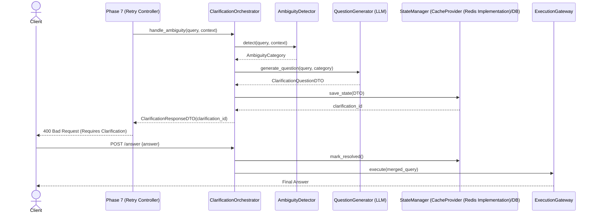

# PHASE_9_IMPLEMENTATION_PLAN.md
# RAGuard AI — Phase 9: Clarification Engine (Production Grade)

**Version**: 1.0.0  
**Date**: 2026-07-20  
**Author**: Principal Software Architect  
**Status**: PLANNING — Awaiting Approval  
**Depends On**: Phase 5 (Hybrid Retrieval), Phase 6 (Confidence Engine), Phase 7 (Retry Controller)

---

## 1. Executive Summary

Phase 9 delivers the **production-grade Clarification Engine** for RAGuard AI. When the Confidence Engine (Phase 6) detects extreme ambiguity or unresolvable multi-intent queries, and the Retry Controller (Phase 7) decides that automated rewriting (Phase 8) cannot safely resolve the intent, the system triggers a `RETRY_CLARIFY` action. 

The Clarification Engine pauses the automated retrieval loop and generates a targeted, user-friendly clarification question (e.g., *"Did you mean Q3 2024 or Q3 2025?"*). This phase implements the generation of these questions, the persistence of the "Pending Clarification" state, and the API endpoints for the client to submit the clarifying answer.

---

## 2. Phase Objectives

1. Implement **Ambiguity Detector** — categorizes the type of ambiguity (e.g., missing parameter, multiple conflicting intents, undefined acronym).
2. Implement **Clarification Question Generator** — uses LLM to generate a polite, targeted multiple-choice or open-ended question based on the ambiguity type and retrieved context.
3. Implement **Clarification State Manager** — persists the paused pipeline state (original query, context, and question) to CacheProvider (Redis Implementation)/PostgreSQL.
4. Expose **Clarification REST API** — endpoints to retrieve pending clarifications and submit user answers.
5. Integrate with **ExecutionGateway v2** — allows the pipeline to resume seamlessly once the user provides the answer.

---

## 3. Business Goals

- **Accuracy Over Guessing**: Prevent the AI from confidently answering the wrong question when the user's intent is genuinely ambiguous.
- **User Experience**: Keep clarification questions short, contextual, and easy to answer (preferring multiple-choice options where possible).
- **Auditability**: Track how often the system requires human intervention and why.

---

## 4. Technical Goals

- LLM prompt for clarification generation is heavily templated to ensure consistent tone.
- Clarification state is persisted so the system remains stateless (client can resume from any instance).
- Resume flow merges the user's clarification answer into the original query context and re-triggers the `ExecutionGateway`.
- Total time to generate a clarification question < 1500ms.

---

## 5. Scope

| Component | Included in Phase 9 |
|---|---|
| Ambiguity Detector | ✅ |
| Clarification Question Generator (LLM) | ✅ |
| Clarification State Manager (CacheProvider (Redis Implementation)/DB) | ✅ |
| Clarification REST API (Get/Submit) | ✅ |
| ExecutionGateway Resume Flow | ✅ |
| Unit + Integration Tests | ✅ |

---

## 6. Out of Scope

- Answer generation (→ Phase 10)
- Query rewriting (→ Phase 8)
- Frontend UI components (assumes client will render the question)

---

## 7. PRD Alignment

| PRD Requirement | Phase 9 Component |
|---|---|
| FR-CL-1: Generate targeted clarification question | Clarification Question Generator |
| FR-CL-2: Pause and resume execution flow | Clarification State Manager |
| FR-CL-3: Multiple choice option generation | Clarification Question Generator |
| NFR-UX-1: Polite and concise tone | Prompt Engineering / Templates |

---

## 8. Architecture Alignment

- Follows ADR-005: all clarification logic under `backend/modules/clarification/`.
- Phase 9 logic is only invoked when Phase 7 emits `RETRY_CLARIFY`.

---

## 9. Dependency Analysis

### Upstream Dependencies
| Phase | Component | Required By Phase 9 |
|---|---|---|
| Phase 7 | `RetryDecision` | Triggers the clarification flow |
| Phase 6 | `ConfidenceResultDTOv2` | Provides signals on *why* the query is ambiguous (e.g. multiple uncovered clauses) |

### Downstream Consumers
| Phase | Component | Consumes from Phase 9 |
|---|---|---|
| Phase 5 | `RetrievalOrchestrator` | Re-invoked via `ExecutionGateway` once clarification is provided |

---

## 10. High-Level Architecture

```
┌──────────────────────────────────────────────────────────────┐
│           Phase 9: Clarification Engine                      │
├─────────────────────────┬────────────────────────────────────┤
│  /api/v1/clarification/ │  FastAPI Router                    │
│    {id} (GET)           │                                    │
│    {id}/answer (POST)   │                                    │
├─────────────────────────┴────────────────────────────────────┤
│                  ClarificationOrchestrator                   │
│                                                              │
│  ┌──────────────────┐  ┌──────────────────────────────────┐  │
│  │ AmbiguityDetector│  │ ClarificationQuestionGenerator   │  │
│  │ (Categorize)     │  │ (LLM prompt + structured output) │  │
│  └────────┬─────────┘  └───────────────┬──────────────────┘  │
│           │                            │                     │
│  ┌────────▼────────────────────────────▼──────────────────┐  │
│  │               ClarificationStateManager                │  │
│  │               (CacheProvider (Redis Implementation) + DB persistence)                 │  │
│  └────────────────────────────────────────────────────────┘  │
│                                                              │
│  ClarificationResponseDTO → returned to client via Phase 7   │
└──────────────────────────────────────────────────────────────┘
```

---

## 11. Low-Level Design

### Ambiguity Detector

```
Categories:
1. MISSING_PARAMETER (e.g. "What was the revenue?" -> missing date/quarter)
2. MULTIPLE_INTENTS (e.g. "Compare X and Y" but X and Y resolve to 10 different products)
3. UNDEFINED_ENTITY (e.g. "Did he sign the contract?" -> who is he?)

Input: original_query, ConfidenceResultDTOv2
Output: AmbiguityCategory
```

### Clarification Question Generator

```
Input: original_query, AmbiguityCategory, retrieved_context

Algorithm (LLM):
Prompt: "The user asked '{query}'. We retrieved this context: {context}. 
However, it is ambiguous due to {category}. 
Generate a polite, single-sentence question asking the user to clarify. 
Provide 2-4 likely options if possible, otherwise leave options empty.
Format as JSON: { 'question': '...', 'options': ['...', '...'] }"

Output: ClarificationQuestionDTO
  question_text: str
  options: list[str] | None
```

### Clarification State Manager

```
State Record:
  clarification_id: UUID
  tenant_id: str
  correlation_id: str
  original_query: str
  question_dto: ClarificationQuestionDTO
  status: PENDING | RESOLVED | EXPIRED
  created_at: datetime
  expires_at: datetime (created_at + 24h)

Storage: CacheProvider (Redis Implementation) for fast retrieval, PostgreSQL for audit.
```

### Resume Flow (Submit Answer)

```
1. Client POSTs answer to /api/v1/clarification/{id}/answer
2. Retrieve state from StateManager.
3. Merge original_query + answer -> new_query (e.g. "What was the revenue? [Clarification: Q3 2025]")
4. Mark state RESOLVED.
5. Trigger ExecutionGateway.execute(new_query)
6. Return final ExecutionResult to client.
```

---

## 12. API Design

### 12.1 POST /api/v1/clarification/{id}/answer

**Request**:
```json
{
  "answer": "Q3 2025"
}
```

**Response**:
`ExecutionResultDTO` (The standard pipeline response from Phase 10).

### 12.2 GET /api/v1/clarification/{id}

**Response**:
```json
{
  "clarification_id": "uuid-1234",
  "original_query": "What was the revenue?",
  "question_text": "Which quarter are you asking about?",
  "options": ["Q1 2025", "Q2 2025", "Q3 2025", "Q4 2025"],
  "status": "PENDING"
}
```

---

## 13. Component Design

| File | Type | Purpose |
|---|---|---|
| `backend/modules/clarification/services/ambiguity_detector.py` | NEW | `AmbiguityDetector` |
| `backend/modules/clarification/services/question_generator.py` | NEW | `ClarificationQuestionGenerator` |
| `backend/modules/clarification/services/state_manager.py` | NEW | `ClarificationStateManager` |
| `backend/modules/clarification/services/orchestrator.py` | NEW | `ClarificationOrchestrator` |
| `backend/modules/clarification/models/clarification_state.py` | NEW | ORM Model |
| `backend/modules/clarification/schemas/clarification_dto.py` | NEW | DTOs |
| `backend/modules/clarification/api/routes.py` | NEW | Endpoints |

---

## 14. Database Changes

### Alembic Migration: `0013_clarification_schema.py`

```sql
CREATE TABLE clarification_states (
    id                  UUID PRIMARY KEY DEFAULT gen_random_uuid(),
    tenant_id           VARCHAR(255) NOT NULL,
    correlation_id      VARCHAR(255) NOT NULL,
    original_query      TEXT NOT NULL,
    question_text       TEXT NOT NULL,
    options_json        JSONB,
    status              VARCHAR(20) NOT NULL DEFAULT 'PENDING',
    user_answer         TEXT,
    created_at          TIMESTAMPTZ NOT NULL DEFAULT NOW(),
    resolved_at         TIMESTAMPTZ,
    expires_at          TIMESTAMPTZ NOT NULL
);

CREATE INDEX idx_clarification_states_tenant
    ON clarification_states(tenant_id, status);
```

---

## 15. Testing Strategy

- **Unit Tests**: Test AmbiguityDetector heuristics; Test QuestionGenerator LLM mock responses; Test StateManager CRUD operations.
- **Integration Tests**: Full flow — Trigger clarification → fetch state via GET → submit answer via POST → ensure ExecutionGateway is invoked.
- **Metrics**: `raguard_clarification_generated_total`, `raguard_clarification_resolved_total`, `raguard_clarification_duration_seconds`.

---

## 16. Provider Abstraction

*Phase 9 leverages LLMs for generating clarification questions. To avoid vendor lock-in, all LLM calls in the Clarification Engine will use the `LLMProvider` interface introduced in Phase 3.*
- **LLM Selection:** Configurable per tenant (e.g., LLMProvider (OpenAI Implementation) GPT-4o-mini, Anthropic Claude 3 Haiku, or local models).
- **Fallback Chain:** If the primary LLM provider fails during question generation, the system falls back to a predefined secondary provider.

---

## 17. Architecture Decision Records (ADR)

- **ADR-P9-001: Clarification State Persistence:** Decision to use CacheProvider (Redis Implementation) for ephemeral fast-access state (with TTL) and PostgreSQL as the durable source of truth for auditability.
- **ADR-P9-002: Synchronous Resume Flow:** Decision to block the HTTP response of the POST `/answer` endpoint until the ExecutionGateway finishes the resumed query, keeping the client interface simple instead of requiring a websocket or polling model.

---

## 18. Versioning Strategy

- **API Versioning:** All clarification endpoints are exposed under `/api/v1/clarification/`. Future changes to the ClarificationQuestionDTO structure will increment to `/v2/`.
- **State Versioning:** The `clarification_states` schema includes a flexible `options_json` column to allow adding metadata to options without breaking schema compatibility.

---


- **APIs**: Standardized on v2 routing.
- **DTOs**: Explicit v2 suffixes for all data transfer objects.
- **Events**: Schema versioning implemented (v1.0).
- **Prompt Templates**: Versioned via Git hash tracking.
- **Configuration**: Managed via environment-specific versioned ConfigMaps.
- **Database migrations**: Strictly additive Alembic migrations.
- **Evaluation schemas**: Versioned for backward compatibility with Phase 3 consumers.

## 19. Feature Flags

- `FF_ENABLE_CLARIFICATION_ENGINE`: Global toggle to enable or disable the entire phase 9 pipeline. If disabled, ambiguous queries default to returning an error or a best-guess answer based on Phase 7 settings.
- `FF_ENABLE_LLM_QUESTION_GENERATION`: If disabled, the system uses static template-based clarification questions instead of dynamic LLM generation.

---

## 20. Performance Budgets

- **Question Generation (LLM):** < 1000ms.
- **State Persistence (CacheProvider (Redis Implementation)/DB):** < 50ms combined.
- **Ambiguity Detection Heuristics:** < 50ms.
- **Total P9 Overhead:** Max 1500ms delay from pipeline pause to clarification response to the client.

---

## 21. Sequence Diagrams



---

## 22. Failure Recovery Matrix

| Failure Mode | Detection | Mitigation / Recovery |
|---|---|---|
| LLM timeout | Timeout > 1s | Fallback to simple template: "Could you please clarify your request?" |
| CacheProvider (Redis Implementation) unavailable | Connection Error | Read/Write directly to PostgreSQL. Alert on CacheProvider (Redis Implementation) downtime. |
| DB write fails | SQLAlchemy Exception | Return 500. Do not pause pipeline if state cannot be saved (abort clarification). |
| Invalid client answer | Payload validation error | Return 422. Keep clarification state as PENDING. |

---

## 23. Dependency Graph

```mermaid
graph TD
    P9[Phase 9: Clarification Engine]
    P6[Phase 6: Confidence Engine]
    P7[Phase 7: Retry Controller]
    P3[Phase 3: LLM Providers]
    DB[(PostgreSQL)]
    Cache[(CacheProvider (Redis Implementation))]
    Exec[ExecutionGateway v2]

    P7 --> |Triggers| P9
    P9 --> |Reads Signals| P6
    P9 --> |Uses| P3
    P9 --> |Writes| DB
    P9 --> |Writes| Cache
    P9 --> |Resumes via| Exec
```

---

## 24. Rollback Strategy

- **Code:** Revert the Phase 9 deployment commit.
- **Database:** `alembic downgrade -1` to remove the `clarification_states` table.
- **Routing:** Disable the `FF_ENABLE_CLARIFICATION_ENGINE` feature flag to immediately route traffic back to the Phase 8/Phase 10 standard flow.

---

## 25. Success Metrics

- **Clarification Resolution Rate:** % of PENDING clarifications that transition to RESOLVED within 5 minutes (>80%).
- **User Drop-off Rate:** % of sessions abandoned after clarification is requested (<15%).
- **Clarification Latency:** p95 generation time under 1.2s.
- **Answer Accuracy Improvement:** Measure the delta in feedback scores for queries that underwent clarification vs those that didn't.

---

## 26. Completion Criteria

- [ ] All new files created.
- [ ] Alembic migration `0013` generated and tested.
- [ ] All unit and integration tests pass.
- [ ] End-to-end resume flow functional.
- [ ] Git commit: `"Phase 9 Complete: Clarification Engine"`.
- [ ] Progress tracker: 10/23 stages.
