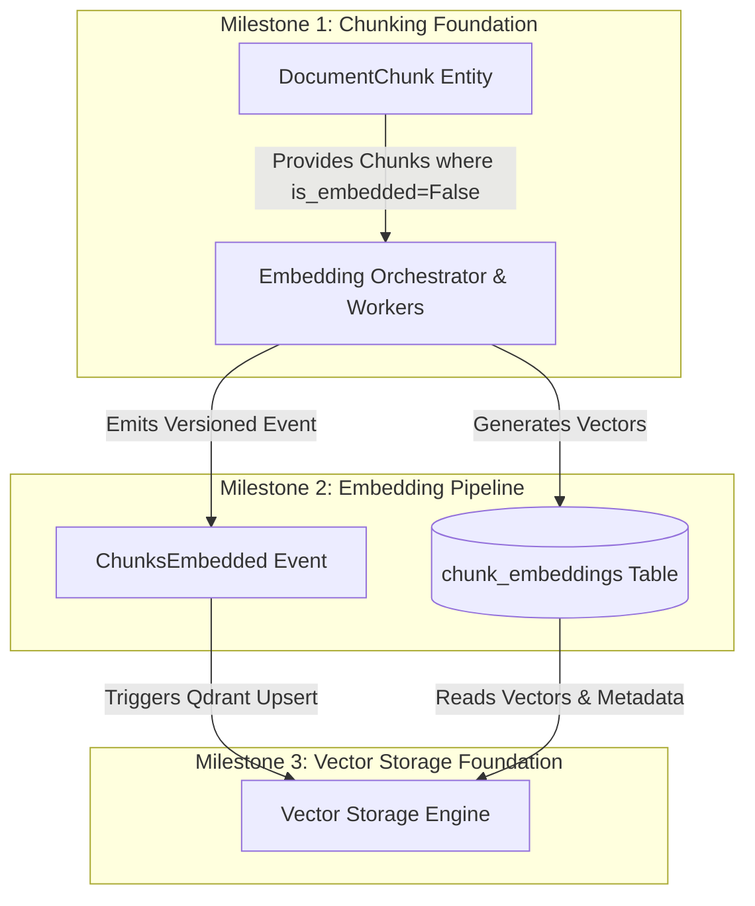

# RAGuard AI — Phase 2 Milestone 2: Embedding Pipeline
## Document 1: Executive Architecture

**Document Version**: 1.0.0  
**Milestone**: Phase 2 Milestone 2 (`Embedding Pipeline`)  
**Status**: Architectural Blueprint (Strict Planning Only — No Code)  
**Author**: Principal AI Infrastructure Engineer & Software Architect  

---

## 1. Executive Summary

The **Phase 2 Milestone 2: Embedding Pipeline** establishes the asynchronous, multi-provider vectorization engine that converts validated text chunks from Milestone 1 into high-dimensional dense floating-point vector representations (`embeddings`). 

Operating within `backend/modules/embedding/` under strict **Domain-Oriented Modular Architecture (`ADR-005`)**, this module orchestrates high-throughput batch vectorization, token quota tracking, rate-limit exponential backoff, and provider-independent fallback chains across OpenAI (`text-embedding-3-large`, `text-embedding-3-small`), Cohere (`embed-multilingual-v3.0`), and self-hosted local models (`HuggingFace / BAAI/bge-large-en-v1.5`).

---

## 2. Business Goal & Purpose

In enterprise AI environments, embedding generation is both a cost center and a major point of latency and rate-limit vulnerability. Without a dedicated, decoupled embedding pipeline:
1. External API rate limits (`HTTP 429`) cause synchronous user requests to timeout.
2. Vendor lock-in prevents switching to cheaper or self-hosted embedding models.
3. Duplicate embedding of unchanged chunks inflates API costs.

The **Embedding Pipeline** decouples vector generation from ingestion, ensuring **idempotent vectorization** via SHA-256 content hashes, strict multi-tenant token quota governance, and resilient background execution via Celery workers.

---

## 3. Scope & Objectives

### In Scope
- Multi-provider embedding abstraction (`OpenAIEmbeddingProvider`, `CohereEmbeddingProvider`, `LocalHuggingFaceProvider`).
- Batch embedding orchestration (`batch_size=100`) via asynchronous Celery workers (`process_embedding_batch_task`).
- Database tracking for embedding jobs (`embedding_jobs`) and chunk embedding states (`chunk_embeddings`).
- Idempotency verification verifying `content_hash` against existing embeddings before invoking external APIs.
- Token consumption tracking (`token_count`) per tenant and model for cost allocation.
- REST API endpoints (`/api/v1/embeddings/*`) for triggering batch jobs, querying job status, inspecting provider models, and viewing token usage KPIs.
- Frontend Infrastructure UI (`/embeddings`) allowing administrators to configure provider fallback chains, monitor batch jobs, and track tenant token budgets.

### Out of Scope (Strict Boundaries)
- **NO Vector Storage**: No connection, schema management, or upsert operations against Qdrant (`reserved for Milestone 3`).
- **NO Retrieval or Search**: No vector similarity queries, cosine distance calculations, or keyword search (`reserved for Milestone 4`).
- **NO Reliability Fallbacks for Search**: No circuit breakers or degraded retrieval paths (`reserved for Milestone 5`).
- **NO LLM Generation**: No prompt construction, self-correction, or completion calls (`reserved for Phase 3`).

---

## 4. Deliverables

1. **Executive Architecture** (`this document`): High-level strategy, boundaries, and trade-offs.
2. **Technical Design (`phase2_m2_2_technical_design.md`)**: Complete DORA domain architecture, Mermaid data flows, database schemas (`embedding_jobs`, `chunk_embeddings`), REST APIs, Celery workers, provider interfaces, security, performance (`batching`), and observability (`structlog/Prometheus`).
3. **Implementation Roadmap (`phase2_m2_3_roadmap.md`)**: Phased execution plan from base interfaces through API/UI integration.
4. **Verification & Freeze Checklist (`phase2_m2_4_verification_checklist.md`)**: Comprehensive multi-layer audit gates required prior to freezing Milestone 2.

---

## 5. Architectural Boundaries & Dependencies

### Previous Dependencies (`Prerequisites`)
- `DocumentChunk` records with non-empty `content`, calculated `content_hash`, and valid `tenant_id` (`Phase 2 Milestone 1`).
- Celery `ingestion` queue and Redis message broker (`Phase 1 Milestone 5`).
- `DocumentEventLog` ledger for recording domain transitions (`Phase 1 Milestone 6`).

### Future Dependencies (`Enables`)
- **Milestone 3 (`Vector Storage Foundation`)**: Consumes `ChunksEmbedded` events and reads from `chunk_embeddings` to batch upsert points into Qdrant.
- **Milestone 6 (`Knowledge Health`)**: Monitors `chunk_embeddings` for stale model versions when tenant embedding providers rotate.

---

## 6. Architecture Decisions (`ADR-Style Rationale`)

### ADR-M2-001: Separation of Vector Generation from Vector Storage
- **Context**: We need to generate dense vectors from chunks and store them in Qdrant.
- **Decision**: We strictly separate embedding generation (`Milestone 2`) from vector indexing (`Milestone 3`), storing raw generated float arrays temporarily/permanently in PostgreSQL (`chunk_embeddings`) before or alongside Qdrant indexing.
- **Rationale**: If Qdrant experiences downtime or requires collection migration, having the generated vectors persisted in PostgreSQL (`chunk_embeddings`) allows full index replay (`sync_vectors_to_qdrant_task`) without re-calling expensive external embedding APIs.
- **Consequences**: Increases PostgreSQL storage requirements (approx. 6KB per chunk for 1536-dim float arrays), mitigated by compression and optional purging post-indexing (`M6`).

### ADR-M2-002: Dynamic Batching with Exponential Backoff
- **Context**: External providers (`OpenAI`, `Cohere`) enforce strict tokens-per-minute (`TPM`) and requests-per-minute (`RPM`) limits.
- **Decision**: All chunk embedding requests must pass through `Celery` workers grouping chunks into chunks of 100 (`batch_size=100`) and enforcing jittered exponential backoff upon `HTTP 429 / RateLimitExceeded`.
- **Rationale**: Prevents cascading timeouts across tenant ingestion pipelines. Guarantees 100% ingestion completion even under severe external throttling.

---

## 7. Success Criteria

- **Throughput**: Capable of vectorizing $1,000$ chunks/minute per worker instance on standard OpenAI tiers without dropping tasks.
- **Idempotency**: $100\%$ detection of pre-existing `content_hash` vectors, resulting in zero redundant API calls when documents are re-uploaded.
- **Provider Interchangeability**: Switching a tenant from `OpenAI` to `LocalHuggingFace` requires zero changes to chunking or vector storage logic—only a configuration update in `TenantEmbeddingConfig`.
