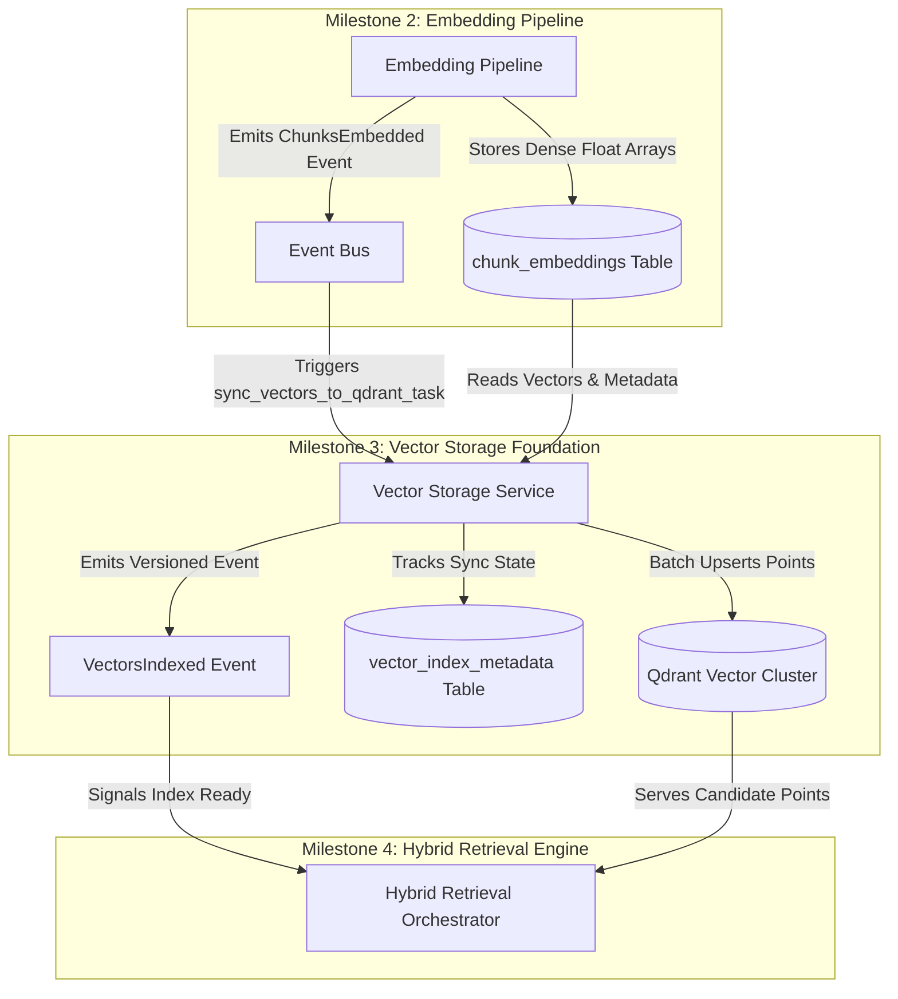

# RAGuard AI — Phase 2 Milestone 3: Vector Storage Foundation
## Document 1: Executive Architecture

**Document Version**: 1.0.0  
**Milestone**: Phase 2 Milestone 3 (`Vector Storage Foundation`)  
**Status**: Architectural Blueprint (Strict Planning Only — No Code)  
**Author**: Principal Database Architect & AI Infrastructure Engineering Team  

---

## 1. Executive Summary

The **Phase 2 Milestone 3: Vector Storage Foundation** establishes the enterprise-grade, high-throughput vector storage infrastructure responsible for persisting, indexing, and organizing dense embedding vectors and structured metadata inside self-hosted **Qdrant (`ADR-004`)**.

Operating within `backend/modules/vector/` under strict **Domain-Oriented Modular Architecture (`ADR-005`)**, this module decouples storage engine mechanics from vectorization and retrieval. It implements multi-tenant collection topology, strict payload index structures for instantaneous namespace filtering, asynchronous batch point upserts via Celery workers, connection pooling (`gRPC / REST`), and index synchronization state tracking (`VectorIndexMetadata`).

---

## 2. Business Goal & Purpose

In multi-tenant, high-scale AI retrieval platforms, vector databases are vulnerable to severe architectural bottlenecks and security flaws if not properly governed:
1. **Cross-Tenant Data Bleed**: Storing multiple tenants in unpartitioned or unindexed collections allows queries to accidentally leak vectors across organizational boundaries.
2. **Slow Payload Filtering**: Unindexed metadata fields inside vector payloads cause approximate nearest neighbor (`ANN`) search algorithms to scan millions of irrelevant points sequentially (`full index scan`).
3. **Index Drift**: Out-of-sync vector indices between PostgreSQL (`chunk_embeddings`) and Qdrant cause retrieval failures during document updates or deletions.

The **Vector Storage Foundation** solves these challenges by enforcing a strict **Collection-per-Domain + Payload Tenant Filter** architecture (`ADR-M3-001`), mandatory payload indexing (`tenant_id`, `document_version_id`), and idempotent batch indexing workers.

---

## 3. Scope & Objectives

### In Scope
- Abstract vector database provider interface (`BaseVectorDBProvider`) and concrete self-hosted `QdrantVectorDBProvider` (`gRPC + REST`).
- Multi-tenant collection management (`ensure_collection`, schema upgrades, payload index configuration).
- Asynchronous Celery worker (`sync_vectors_to_qdrant_task`) consuming `ChunksEmbedded` events to batch upsert points into Qdrant.
- PostgreSQL metadata synchronization registry (`vector_index_metadata`) tracking collection states, point counts, and indexing health.
- REST API endpoints (`/api/v1/vectors/*`) for inspecting collection health, triggering re-indexing, verifying point counts, and purging tenant namespaces.
- Frontend Infrastructure UI (`/vectors`) enabling administrators to view Qdrant cluster status, inspect payload index structures, and audit tenant point distributions.

### Out of Scope (Strict Boundaries)
- **NO Retrieval or Similarity Search**: No cosine similarity search, ANN querying, or keyword filtering (`reserved for Milestone 4`).
- **NO Reranking**: No cross-encoder reranking or candidate re-ordering (`reserved for Milestone 4`).
- **NO Embedding Generation**: No call to OpenAI, Cohere, or local models (`reserved for Milestone 2`).
- **NO Reliability Circuit Breakers**: No fallback handling for search operations (`reserved for Milestone 5`).

---

## 4. Deliverables

1. **Executive Architecture** (`this document`): High-level strategy, collection topology decisions, and boundaries.
2. **Technical Design (`phase2_m3_2_technical_design.md`)**: Complete DORA structure, Mermaid sequence/class diagrams, Qdrant payload schema, PostgreSQL synchronization tables, REST APIs, Celery workers, security, and performance (`gRPC batching`).
3. **Implementation Roadmap (`phase2_m3_3_roadmap.md`)**: Phased execution plan from Qdrant client abstraction through API/UI integration.
4. **Verification & Freeze Checklist (`phase2_m3_4_verification_checklist.md`)**: Strict multi-layer audit gates required prior to freezing Milestone 3.

---

## 5. Architectural Boundaries & Dependencies

### Previous Dependencies (`Prerequisites`)
- `chunk_embeddings` records containing `content_hash`, `embedding_vector` (`float[]`), and `dimension` (`Phase 2 Milestone 2`).
- `DocumentChunk` records containing `section_path`, `page_numbers`, and `metadata_json` (`Phase 2 Milestone 1`).
- `Qdrant` container instance deployed in `docker-compose.yml` (`Phase 1 Milestone 5 / ADR-004`).

### Future Dependencies (`Enables`)
- **Milestone 4 (`Hybrid Retrieval Engine`)**: Queries the Qdrant collections established and populated by M3 using strict `tenant_id` payload filters.
- **Milestone 6 (`Knowledge Health`)**: Executes point deletion across Qdrant when `DocumentChunk` records are purged from PostgreSQL.

---

## 6. Architecture Decisions (`ADR-Style Rationale`)

### ADR-M3-001: Collection-per-Domain with Payload Tenant Filtering
- **Context**: How should multi-tenant vector points be organized across Qdrant collections?
- **Decision**: We will maintain **one shared Qdrant collection per embedding model/domain** (e.g., `raguard_knowledge_openai_1536`, `raguard_knowledge_bge_1024`) and enforce strict multi-tenant isolation via indexed payload attributes (`tenant_id`).
- **Rationale**: Creating a dedicated Qdrant collection per tenant scales poorly ($10,000+$ tenants require $10,000+$ memory-mapped HNSW graphs, leading to RAM exhaustion). A shared collection with an indexed `Keyword` payload schema for `tenant_id` provides microsecond filtering overhead while sharing underlying HNSW index memory efficiently.
- **Consequences**: Requires strict enforcement of payload filters at the API and provider layer (`ADR-004`).

### ADR-M3-002: gRPC Batch Upserts with Connection Pooling
- **Context**: Upserting $100,000+$ points over standard HTTP/REST introduces significant JSON serialization and TCP overhead.
- **Decision**: All vector point upserts to Qdrant must execute via `gRPC` protocol using connection-pooled `QdrantClient(prefer_grpc=True)` in batches of $500$ points (`batch_size=500`).
- **Rationale**: `gRPC` protocol buffers reduce payload serialization size by $\approx 60\%$ and eliminate HTTP/1.1 connection blocking, achieving sustained indexing rates $> 5,000$ points/second per worker.

---

## 7. Success Criteria

- **Indexing Throughput**: Capable of upserting and indexing $5,000$ points/second via `gRPC` on standard local container architecture.
- **Payload Filter Latency**: HNSW payload filtering on `tenant_id` adds $\le 5\text{ms}$ latency overhead compared to unpartitioned collection scans.
- **Index Synchronization Fidelity**: $100\%$ consistency between PostgreSQL `chunk_embeddings` count and Qdrant point count per document version (`verified via VectorIndexMetadata audit check`).
