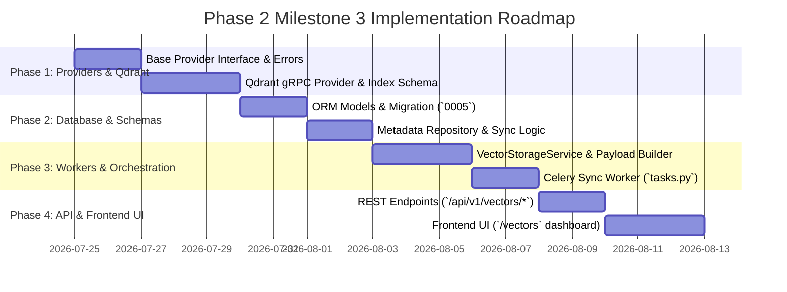

# RAGuard AI — Phase 2 Milestone 3: Vector Storage Foundation
## Document 3: Implementation Roadmap

**Document Version**: 1.0.0  
**Milestone**: Phase 2 Milestone 3 (`Vector Storage Foundation`)  
**Status**: Planning Roadmap (Strict No-Code Specification)  

---

## 1. Roadmap Overview & Execution Phases

The implementation of **Milestone 3 (`Vector Storage Foundation`)** is structured across **4 sequential phases**, moving from Qdrant client interfaces and payload schema builders to database metadata tables, Celery synchronization workers, REST APIs, and Frontend UI dashboards.

---

## 2. Phase 1: Provider Abstractions & Qdrant gRPC Integration

### Objectives
Establish the provider interface (`BaseVectorDBProvider`), error taxonomy (`VEC_xxx`), and self-hosted `QdrantVectorDBProvider` with `gRPC` pooling and scalar quantization.

### Tasks
1. Define abstract class `BaseVectorDBProvider` (`backend/modules/vector/providers/base.py`) declaring `ensure_collection()`, `create_payload_indexes()`, `upsert_points()`, `delete_points_by_filter()`, and `get_collection_info()`.
2. Implement domain error hierarchy (`backend/modules/vector/schemas/errors.py`):
   - `VEC_001`: `InvalidPayloadSchemaError` (`RECOVERABLE=False`)
   - `VEC_002`: `CollectionNotFoundError` (`RECOVERABLE=False`)
   - `VEC_003`: `QdrantConnectionError` (`RECOVERABLE=True`)
   - `VEC_004`: `DimensionMismatchError` (`RECOVERABLE=False`)
   - `VEC_005`: `IndexSyncTimeoutError` (`RECOVERABLE=True`)
3. Implement `QdrantVectorDBProvider` (`providers/qdrant_provider.py`):
   - Uses `AsyncQdrantClient(prefer_grpc=True)`.
   - Configures HNSW indexes with `ScalarQuantizationConfig(type=ScalarType.INT8)` during `ensure_collection()`.
   - Configures `create_payload_index` for `tenant_id`, `document_id`, `document_version_id`, `content_hash`, and `strategy_used`.
4. Implement `VectorProviderFactory` (`factory.py`) resolving vector storage engine configurations.

### Deliverables
- `providers/base.py`, `factory.py`, `qdrant_provider.py`, `schemas/errors.py`.
- **Quality Gate**: Unit/mock tests verifying Qdrant `PointStruct` generation and payload index configuration commands.

---

## 3. Phase 2: Database Models, Repositories & Sync State Tracking

### Objectives
Create database tables for tracking index synchronization status between PostgreSQL and Qdrant (`vector_index_metadata`).

### Tasks
1. Define ORM model `VectorIndexMetadata` (`backend/modules/vector/models/vector_metadata.py`) with strict `tenant_id` indexing and foreign keys (`documents.id`, `document_versions.id`).
2. Plan Alembic migration (`0005_vector_storage_schema.py`) establishing `vector_index_metadata` table, unique constraints (`tenant_id, document_version_id`), and status indexes.
3. Implement `VectorMetadataRepository` (`repositories/vector_repository.py`) supporting:
   - `get_or_create_index_metadata(version_id, tenant_id)`
   - `update_sync_status(version_id, status, point_count, error_message)`
   - `get_tenant_collection_summary(tenant_id)`

### Deliverables
- `models/vector_metadata.py`, `repositories/vector_repository.py`.
- **Quality Gate**: Integration tests verifying metadata status transitions (`PENDING -> PROCESSING -> COMPLETED/FAILED`).

---

## 4. Phase 3: Service Orchestration & Celery Workers

### Objectives
Build the high-level domain orchestration service (`VectorStorageService`) and asynchronous Celery worker (`sync_vectors_to_qdrant_task`).

### Tasks
1. Implement `VectorStorageService` (`services/vector_service.py`):
   - `sync_document_vectors(document_id, version_id, tenant_id)`: Fetches dense vectors (`chunk_embeddings`) and chunk attributes (`DocumentChunk`), resolves collection name, calls `ensure_collection`, builds standardized payloads, executes `gRPC` batch upsert, and updates metadata state.
   - `delete_document_points(document_id, tenant_id)`: Executes Qdrant payload filter deletion across all collections where `document_id == document_id` and `tenant_id == tenant_id`.
2. Define event payload schemas `VectorsIndexed` and `VectorIndexFailed` (`events/payloads.py` with `schema_version: "1.0.0"`).
3. Implement `sync_vectors_to_qdrant_task` Celery task (`workers/tasks.py` on `ingestion` queue):
   - Wraps `sync_document_vectors`.
   - Enforces exponential backoff: `self.retry(exc=e, countdown=2**self.request.retries * 5, max_retries=7)` for `VEC_003` and `VEC_005`.
   - Dispatches `VectorsIndexed` via `EventDispatcher` upon completion.

### Deliverables
- `services/vector_service.py`, `events/payloads.py`, `workers/tasks.py`.
- **Quality Gate**: Celery worker resilience tests verifying clean point upsert recovery after simulated Qdrant container restart.

---

## 5. Phase 4: REST API Layer & Frontend Infrastructure UI

### Objectives
Expose secure REST endpoints under `/api/v1/vectors` and construct the interactive admin management UI under `/vectors`.

### Tasks
1. Implement Pydantic v2 DTOs (`schemas/vector_dto.py`: `VectorPointDTO`, `VectorIndexMetadataDTO`, `QdrantClusterHealthDTO`, `CollectionDetailDTO`).
2. Implement REST endpoints (`api/routes.py`) mounted inside `backend/api/v1/router.py`:
   - `POST /api/v1/vectors/sync/{version_id}`
   - `GET /api/v1/vectors/document/{document_id}`
   - `GET /api/v1/vectors/health`
   - `GET /api/v1/vectors/collections`
   - `DELETE /api/v1/vectors/document/{document_id}`
3. Build React TypeScript components (`frontend/src/pages/vectors/`):
   - `VectorsPage.tsx`: Main overview container.
   - `CollectionHealthCard.tsx`: Collection topology cards (`points count`, `scalar quantization status`).
   - `IndexSyncTable.tsx`: Real-time index sync status table with manual `Resync` triggers.
   - `PayloadInspectorModal.tsx`: Interactive payload viewer verifying exact JSON structure indexed.
4. Add `/vectors` link to `Sidebar.tsx` navigation right below `/embeddings`.

### Deliverables
- `api/routes.py`, `schemas/vector_dto.py`, `frontend/src/pages/vectors/*.tsx`.
- **Exit Criteria**: End-to-end audit passing all verification gates (`Document 4`), confirming zero retrieval operations, zero reranking calls, and $100\%$ test coverage across all M3 modules.
