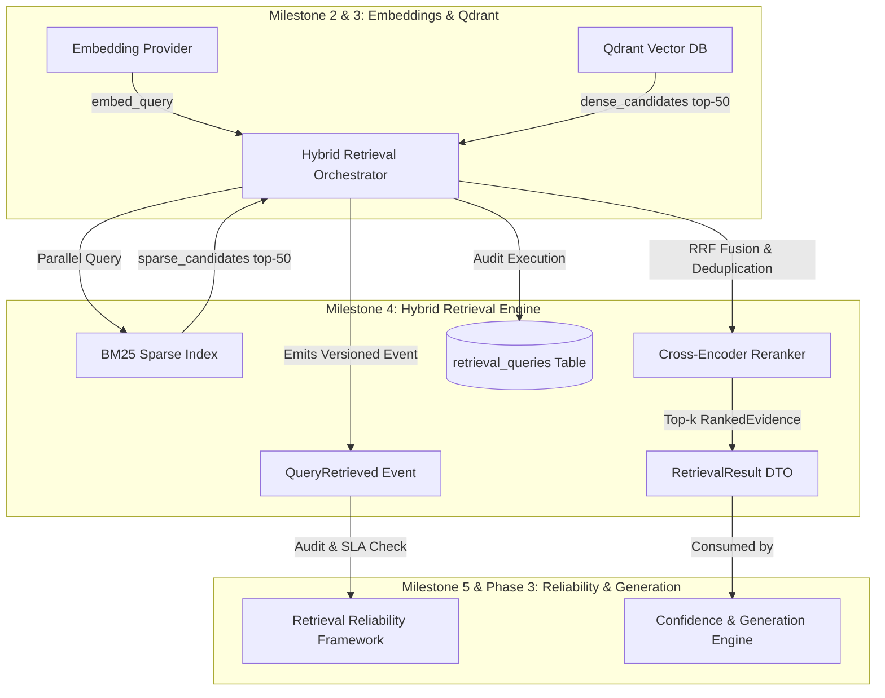

# RAGuard AI — Phase 2 Milestone 4: Hybrid Retrieval Engine
## Document 1: Executive Architecture

**Document Version**: 1.0.0  
**Milestone**: Phase 2 Milestone 4 (`Hybrid Retrieval Engine`)  
**Status**: Architectural Blueprint (Strict Planning Only — No Code)  
**Author**: Principal AI Search Scientist & Software Architect  

---

## 1. Executive Summary

The **Phase 2 Milestone 4: Hybrid Retrieval Engine** establishes the multi-strategy, high-precision search orchestration foundation responsible for surfacing exact, deduplicated, and deeply relevant evidence chunks in response to user or system queries.

Operating within `backend/modules/retrieval/` under strict **Domain-Oriented Modular Architecture (`ADR-005`)**, this module solves the fundamental recall/precision limitations of single-strategy retrieval by executing parallel **Dense Vector Search (`Qdrant`)** and **Sparse Keyword Search (`BM25`)**, combining ranked candidate lists using **Reciprocal Rank Fusion (`RRF`, $k=60$)**, eliminating near-duplicate semantic chunks, and re-scoring top candidates using a **Cross-Encoder Reranker (`ADR-002`)**.

---

## 2. Business Goal & Purpose

In advanced RAG applications, single-strategy retrieval creates severe failure modes that lead directly to AI hallucination or context insufficiency:
1. **Dense-Only Failures**: Embeddings capture semantic similarity but frequently fail when queries ask for specific acronyms, SKU codes, legal clauses, or exact variable names (`out-of-distribution vocabulary`).
2. **Sparse-Only Failures**: Keyword matching (`BM25`) captures exact terms but completely misses paraphrases, conceptual synonyms, and thematic context.
3. **Evidence Redundancy**: When documents contain repetitive boilerplate or overlapping chunks (`Milestone 1 overlap`), top-$k$ retrieval often returns 5 nearly identical snippets, starving the LLM of diverse context.

The **Hybrid Retrieval Engine** guarantees high recall across both exact and semantic queries while maximizing precision for the top-$k$ evidence set delivered to future generation loops (`Phase 3`).

---

## 3. Scope & Objectives

### In Scope
- Multi-strategy retrieval orchestrator (`RetrievalOrchestrator`) executing parallel dense (`Qdrant`) and sparse (`BM25`) search queries.
- Reciprocal Rank Fusion (`RRF`) algorithm combining heterogeneous candidate score lists without requiring arbitrary score normalization.
- Near-duplicate candidate deduplication engine using rapid token/cosine overlap thresholds (`Jaccard >= 0.85 or Cosine >= 0.95`).
- Abstract reranker interface (`BaseRerankerProvider`) and concrete implementations (`CohereRerankerProvider`, `LocalCrossEncoderProvider` using `BAAI/bge-reranker-large`).
- PostgreSQL audit tracking (`retrieval_queries`, `retrieval_results`) capturing query execution breakdowns and evidence scores.
- REST API endpoints (`/api/v1/retrieval/*`) for executing hybrid search, testing strategy parameters (`weights, top_k`), and inspecting fusion pipelines.
- Frontend Infrastructure UI (`/retrieval`) providing an interactive Search Sandbox where developers can compare Dense vs Sparse vs RRF vs Reranked outputs side-by-side.

### Out of Scope (Strict Boundaries)
- **NO Reliability Circuit Breakers**: No degraded-mode fallback routing if Qdrant or Reranker lags (`reserved for Milestone 5`).
- **NO Self-Correction or Query Rewrite**: No LLM-based query transformation or reflection loops (`reserved for Phase 3`).
- **NO Hallucination Evaluation**: No confidence floor grading or contradiction detection (`reserved for Phase 3`).
- **NO Answer Generation**: No prompt filling or chat completion execution (`reserved for Phase 3`).

---

## 4. Deliverables

1. **Executive Architecture** (`this document`): High-level strategy, mathematical fusion formulas, and boundaries.
2. **Technical Design (`phase2_m4_2_technical_design.md`)**: Complete DORA structure, Mermaid sequence/class diagrams, RRF fusion formulas, PostgreSQL schemas, REST APIs, Celery async search workers, provider interfaces, security, and performance (`concurrent asyncio tasks`).
3. **Implementation Roadmap (`phase2_m4_3_roadmap.md`)**: Phased execution plan from BM25 sparse indexing through API/UI sandbox integration.
4. **Verification & Freeze Checklist (`phase2_m4_4_verification_checklist.md`)**: Strict multi-layer audit gates required prior to freezing Milestone 4.

---

## 5. Architectural Boundaries & Dependencies

### Previous Dependencies (`Prerequisites`)
- `QdrantVectorDBProvider` (`Phase 2 Milestone 3`) for dense similarity search (`search_points`).
- `BaseEmbeddingProvider` (`Phase 2 Milestone 2`) for generating query embedding vectors (`embed_query`).
- `DocumentChunk` records with rich metadata and doubly-linked sequence pointers (`Phase 2 Milestone 1`).

### Future Dependencies (`Enables`)
- **Milestone 5 (`Retrieval Reliability Framework`)**: Wraps `RetrievalOrchestrator.execute_search()` with latency circuit breakers and fallback strategies.
- **Phase 3 (`Confidence Engine`)**: Consumes the `RankedEvidence` objects and score distributions to evaluate context sufficiency.

---

## 6. Architecture Decisions (`ADR-Style Rationale`)

### ADR-M4-001: Reciprocal Rank Fusion (`RRF`) with Constant $k=60$
- **Context**: Dense vector similarity scores (`0.75 to 0.92 cosine`) and BM25 sparse scores (`12.5 to 45.0 TF-IDF`) exist on completely incompatible mathematical scales.
- **Decision**: We use **Reciprocal Rank Fusion (`RRF`)** with constant parameter $k=60$ to merge candidate lists based solely on rank position:
  $$\text{RRF\_Score}(d) = \sum_{m \in \{\text{Dense}, \text{Sparse}\}} \frac{1}{60 + \text{rank}_m(d)}$$
- **Rationale**: RRF is proven empirically to outperform linear score normalization weighting ($w_1 \cdot s_{\text{dense}} + w_2 \cdot s_{\text{sparse}}$) across diverse datasets because it eliminates sensitivity to score distribution skewness.

### ADR-M4-002: Mandatory Two-Stage Candidate Deduplication & Reranking
- **Context**: Fetching $N=50$ candidates from both dense and sparse search ($100$ total) introduces duplicates and near-duplicates before reranking.
- **Decision**: The pipeline must execute an exact `chunk_id` union deduplication, followed by a **Near-Duplicate Cosine/Jaccard Filter** (`threshold >= 0.92`), before passing the top $30$ unique candidates to the `Cross-Encoder Reranker` to yield the final `top_k` (`e.g., 5 to 10`).
- **Rationale**: Cross-Encoder rerankers (`BAAI/bge-reranker-large`) are computationally intensive ($O(N)$ transformer forward passes). Deduplicating before reranking cuts Cross-Encoder compute latency by $\approx 40\%$ while ensuring diverse evidence in the final output.

---

## 7. Success Criteria

- **Retrieval Precision ($P@10$)**: Materially exceeds single-strategy retrieval, achieving $\ge 88\%$ precision on enterprise validation query suites.
- **Execution Latency**: Concurrent execution of `embed_query` + `Qdrant search` + `BM25 search` + `RRF fusion` + `Cross-Encoder reranking` completes in $\le 380\text{ms}$ ($P_{95}$).
- **Deduplication Fidelity**: Zero exact duplicate `chunk_id` instances or near-duplicate snippets (`Jaccard >= 0.92`) returned in the final `top_k` evidence set.
