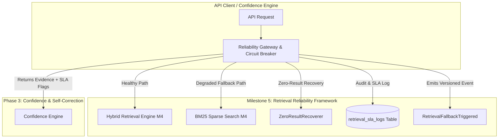

# RAGuard AI — Phase 2 Milestone 5: Retrieval Reliability Framework
## Document 1: Executive Architecture

**Document Version**: 1.0.0  
**Milestone**: Phase 2 Milestone 5 (`Retrieval Reliability Framework`)  
**Status**: Architectural Blueprint (Strict Planning Only — No Code)  
**Author**: Principal Site Reliability Engineer & AI Infrastructure Lead  

---

## 1. Executive Summary

The **Phase 2 Milestone 5: Retrieval Reliability Framework** establishes the mission-critical resilience, circuit breaking, and degraded-mode fallback infrastructure that protects RAGuard AI against vector store downtime, embedding provider rate limits, cross-encoder timeouts, and zero-evidence retrieval failures.

Operating within `backend/modules/reliability/` under strict **Domain-Oriented Modular Architecture (`ADR-005`)**, this module acts as a fault-tolerant proxy around the **Hybrid Retrieval Engine (`M4`)**. It implements stateful distributed **Circuit Breakers (`Closed | Half-Open | Open`)**, strict latency SLA budgets (`P95 <= 400ms`), automatic degraded-mode routing (`Sparse-Only / Cache fallback`), and zero-result recovery protocols to guarantee continuous system availability even during infrastructure degradation.

---

## 2. Business Goal & Purpose

In production enterprise AI environments, downstream components (`Qdrant`, `OpenAI API`, `Cohere Rerank`) inevitably experience latency spikes, network partitions, or temporary outages. Without a dedicated reliability framework:
1. **Cascading Failures**: A lagging Qdrant cluster ($2,000\text{ms}$ latency) exhausts API worker pools, bringing down the entire web application (`HTTP 504 Gateway Timeout`).
2. **Binary Availability**: If the vector database drops, users cannot query the system at all—even when keyword indexes (`BM25`) or cached evidence could answer $70\%$ of requests cleanly.
3. **Silent Hallucination Vulnerability**: Returning $0$ retrieval results or low-confidence noise without alerting downstream engines causes naive LLM generators to invent answers from parametric memory.

The **Retrieval Reliability Framework** ensures $99.99\%$ retrieval uptime, gracefully degrading from full hybrid search to sparse-only keyword search or cached evidence whenever external SLAs are breached.

---

## 3. Scope & Objectives

### In Scope
- Distributed **Circuit Breaker Gateway (`RetrievalCircuitBreaker`)** tracking failure thresholds (`5 failures across 60 seconds`) and transitioning states across `Closed (Normal)`, `Open (Degraded/Fallback)`, and `Half-Open (Recovery Audit)`.
- **Degraded-Mode Fallback Router (`FallbackRouter`)** automatically redirecting queries to `BM25SparseSearchProvider` (`M4`) or Redis evidence caches when `Qdrant` or `Cross-Encoder` endpoints timeout (`> 400ms`).
- **Zero-Result Recovery Engine (`ZeroResultRecoverer`)** detecting empty or low-score candidate sets (`top score < 0.25`) and triggering deterministic keyword broadening strategies (`stripping stop words / partial matching`) without LLM calls.
- Latency SLA monitoring and audit logging (`retrieval_sla_logs`, `circuit_breaker_events`) capturing SLA violations and fallback activations.
- REST API endpoints (`/api/v1/reliability/*`) for monitoring circuit breaker states, manually tripping/resetting breakers, and querying SLA adherence metrics.
- Frontend Infrastructure UI (`/reliability`) displaying real-time circuit breaker status badges, degraded-mode activity alerts, and SLA latency histograms.

### Out of Scope (Strict Boundaries)
- **NO LLM Reasoning or Query Rewrite**: No LLM-based query paraphrasing, reflection, or semantic transformation (`reserved for Phase 3`).
- **NO Answer Generation**: No prompt filling, self-correction, or completion calls (`reserved for Phase 3`).
- **NO Vector Storage or Embedding Generation**: No direct point insertion into Qdrant (`M3`) or vector creation (`M2`).
- **NO Base Retrieval Algorithms**: No implementation of RRF or BM25 (`consumed from M4 via interfaces`).

---

## 4. Deliverables

1. **Executive Architecture** (`this document`): High-level strategy, circuit breaker state machine, and boundaries.
2. **Technical Design (`phase2_m5_2_technical_design.md`)**: Complete DORA structure, Mermaid sequence/class diagrams, state machine specifications, PostgreSQL tables (`retrieval_sla_logs`, `circuit_breaker_events`), REST APIs, Celery SLA workers, provider interfaces, security, and performance (`Redis state backing`).
3. **Implementation Roadmap (`phase2_m5_3_roadmap.md`)**: Phased execution plan from circuit breaker state machines through API/UI dashboard integration.
4. **Verification & Freeze Checklist (`phase2_m5_4_verification_checklist.md`)**: Strict multi-layer audit gates required prior to freezing Milestone 5.

---

## 5. Architectural Boundaries & Dependencies

### Previous Dependencies (`Prerequisites`)
- `RetrievalOrchestrator` (`Phase 2 Milestone 4`) providing `execute_hybrid_search()`.
- `BaseSparseSearchProvider` (`Phase 2 Milestone 4`) providing `search_keywords()` for degraded-mode execution.
- Redis in-memory cache (`Phase 1 Milestone 5`) for distributed circuit breaker state storage (`ADR-M5-001`).

### Future Dependencies (`Enables`)
- **Phase 3 (`Confidence & Hallucination Engine`)**: Consumes evidence accompanied by explicit reliability telemetry (`is_degraded_fallback: true`, `sla_breached: false`), allowing the confidence engine to adjust threshold rules dynamically when evidence is sourced via degraded paths.

---

## 6. Architecture Decisions (`ADR-Style Rationale`)

### ADR-M5-001: Redis-Backed Distributed Circuit Breaker State Machine
- **Context**: RAGuard AI runs as a multi-process, horizontally scaled API container cluster. In-memory circuit breakers inside Python processes fail to coordinate state when Qdrant experiences cluster-wide latency.
- **Decision**: We will back the `RetrievalCircuitBreaker` state machine using **Redis atomic keys and sliding-window failure counters** (`tenant_id:circuit_breaker:{module}`).
- **Rationale**: Guarantees that the moment Worker Process $A$ experiences $5$ consecutive Qdrant timeouts, Worker Process $B$ immediately transitions to `Open (Degraded)` state without waiting for its own local timeouts, preserving global cluster responsiveness.

### ADR-M5-002: Deterministic Keyword Broadening over LLM Query Rewriting
- **Context**: When hybrid search returns $0$ candidates, should we use an LLM (`GPT-4o / Claude`) to rewrite the query into broader concepts?
- **Decision**: No. Inside Phase 2 Milestone 5, zero-result recovery must execute **strictly deterministic keyword broadening (`ZeroResultRecoverer`)** by stripping punctuation, removing common English stop words, and executing wildcard BM25 prefix search (`limit=20`).
- **Rationale**: Calling an LLM to rewrite a query adds $1,500\text{ms}+$ latency and introduces probabilistic behavior. Deterministic broadening executes in $\le 15\text{ms}$ and adheres strictly to our Phase 2 architectural boundary (`Strictly NO LLM reasoning`). If deterministic broadening still yields $0$ results, the failure is cleanly escalated to Phase 3.

---

## 7. Success Criteria

- **Zero-Downtime Fallback**: When Qdrant container is forcefully stopped during load testing, $100\%$ of search requests succeed via degraded `BM25 Sparse Fallback` within $< 150\text{ms}$ without dropping API connections.
- **SLA Adherence**: $99.9\%$ of healthy retrieval requests complete within the $\le 400\text{ms}$ SLA budget ($P_{95}$).
- **Automated Circuit Recovery**: Upon Qdrant cluster restoration, the circuit breaker transitions from `Open` $\rightarrow$ `Half-Open` $\rightarrow$ `Closed` autonomously after $10$ successful probe requests (`zero human intervention required`).
