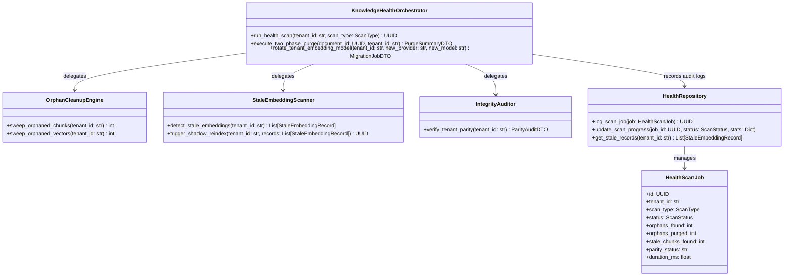
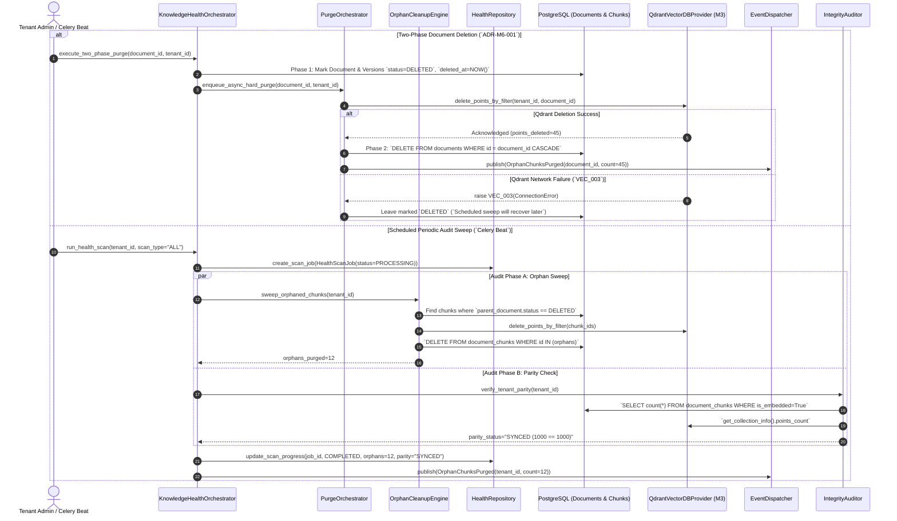

# RAGuard AI — Phase 2 Milestone 6: Knowledge Health & Lifecycle Management
## Document 2: Technical Design

**Document Version**: 1.0.0  
**Milestone**: Phase 2 Milestone 6 (`Knowledge Health & Lifecycle Management`)  
**Status**: Technical Blueprint (Strict Planning Only — No Code)  

---

## 1. Domain Architecture (`DORA Package Structure`)

The knowledge health management module operates entirely within `backend/modules/knowledge_health/`, isolating domain aggregates, repositories, services, and workers:



---

## 2. Directory Structure

```text
backend/modules/knowledge_health/
├── __init__.py
├── api/
│   ├── __init__.py
│   ├── dependencies.py          # Tenant resolution & admin role checks
│   └── routes.py                # REST endpoints (/api/v1/knowledge-health/*)
├── audits/
│   ├── __init__.py
│   ├── integrity.py             # Parity checker (PostgreSQL count vs Qdrant count)
│   └── stale_scanner.py         # Detects model version drift across chunk_embeddings
├── cleanups/
│   ├── __init__.py
│   ├── orphans.py               # Sweeps unreferenced chunks & Qdrant points
│   └── purge.py                 # Two-Phase transactional purge orchestrator
├── events/
│   ├── __init__.py
│   └── payloads.py              # OrphanChunksPurged, KnowledgeDriftDetected DTOs (schema v1.0.0)
├── models/
│   ├── __init__.py
│   ├── health_scan.py           # ORM entity recording scheduled scan results
│   └── stale_record.py          # ORM entity tracking chunks needing re-embedding
├── repositories/
│   ├── __init__.py
│   └── health_repository.py     # Async queries with tenant namespace filtering
├── schemas/
│   ├── __init__.py
│   ├── health_dto.py            # ParityAuditDTO, PurgeSummaryDTO, MigrationJobDTO
│   └── errors.py                # KHL_001 to KHL_005 error codes
├── services/
│   ├── __init__.py
│   └── health_service.py        # Master health coordination service
└── workers/
    ├── __init__.py
    └── tasks.py                 # Celery tasks (scheduled scans, background purge sweeps)
```

---

## 3. Complete Data Flow Diagram (`Two-Phase Purge & Orphan Sweep`)



---

## 4. Database Design (`PostgreSQL / ORM Schemas`)

### 4.1 `health_scan_jobs` Table
Logs execution statistics, parity results, and orphan counts for scheduled or manual scans:
- `id`: `UUID` (`PRIMARY KEY`)
- `tenant_id`: `VARCHAR(100)` (`NOT NULL`, `INDEXED`)
- `scan_type`: `VARCHAR(50)` (`NOT NULL` — e.g., `ORPHAN_SWEEP`, `PARITY_AUDIT`, `STALE_DETECTOR`)
- `status`: `VARCHAR(20)` (`NOT NULL` — `PENDING | PROCESSING | COMPLETED | FAILED`)
- `orphans_found`: `INTEGER` (`NOT NULL DEFAULT 0`)
- `orphans_purged`: `INTEGER` (`NOT NULL DEFAULT 0`)
- `stale_chunks_found`: `INTEGER` (`NOT NULL DEFAULT 0`)
- `parity_status`: `VARCHAR(100)` (`NOT NULL` — e.g., `SYNCED | MISMATCH_DETECTED | RESOLVED`)
- `duration_ms`: `FLOAT` (`NOT NULL`)
- `error_message`: `TEXT` (`NULLABLE`)
- `created_at`: `TIMESTAMP WITH TIME ZONE` (`NOT NULL`)
- `updated_at`: `TIMESTAMP WITH TIME ZONE` (`NOT NULL`)
- **Indexes**: Composite `(tenant_id, scan_type, status)`, `(tenant_id, created_at)`.

### 4.2 `stale_embedding_records` Table
Tracks chunks needing re-vectorization after model rotations:
- `id`: `UUID` (`PRIMARY KEY`)
- `tenant_id`: `VARCHAR(100)` (`NOT NULL`, `INDEXED`)
- `chunk_id`: `UUID` (`NOT NULL`, `FOREIGN KEY REFERENCES document_chunks(id) ON DELETE CASCADE`)
- `old_provider`: `VARCHAR(50)` (`NOT NULL`)
- `old_model_name`: `VARCHAR(100)` (`NOT NULL`)
- `target_provider`: `VARCHAR(50)` (`NOT NULL`)
- `target_model_name`: `VARCHAR(100)` (`NOT NULL`)
- `status`: `VARCHAR(20)` (`NOT NULL` — `PENDING | RE_EMBEDDED | INDEXED | FAILED`)
- `created_at`: `TIMESTAMP WITH TIME ZONE` (`NOT NULL`)
- **Indexes**: Composite `(tenant_id, status)`, `(tenant_id, chunk_id)`.

---

## 5. API Design (`REST Endpoints`)

All endpoints require JWT RS256 authentication, enforce `X-Tenant-ID` resolution, and require administrative privileges (`Role.ADMIN / Role.OWNER`):

| Method | Route | Purpose | Request Body | Response Model |
|---|---|---|---|---|
| `POST` | `/api/v1/knowledge-health/scans` | Trigger an immediate health scan (`ORPHAN_SWEEP`, `PARITY_AUDIT`, or `STALE_DETECTOR`) | `HealthScanRequestDTO` (`scan_type`) | `SuccessResponse<HealthScanJobDTO>` |
| `GET` | `/api/v1/knowledge-health/scans` | Paginated history of past health scan jobs and parity reports | `None` (`query: page, size, scan_type`) | `SuccessResponse<PaginatedList<HealthScanJobDTO>>` |
| `GET` | `/api/v1/knowledge-health/parity` | Retrieve immediate real-time count parity between PostgreSQL chunks and Qdrant points | `None` | `SuccessResponse<ParityAuditDTO>` |
| `POST` | `/api/v1/knowledge-health/rotate-model` | Trigger shadow collection migration to rotate tenant's active embedding model | `ModelRotationRequestDTO` (`new_provider`, `new_model`) | `SuccessResponse<MigrationJobDTO>` |
| `DELETE` | `/api/v1/knowledge-health/purge/{document_id}` | Execute explicit two-phase hard purge for a document and its vectors | `None` | `SuccessResponse<PurgeSummaryDTO>` |

---

## 6. Background Processing & Celery Architecture

### Task Specifications (`workers/tasks.py`)
- **Periodic Task 1**: `knowledge_health.run_scheduled_orphan_sweep_task` (`Queue: ingestion`)
  - Executed every $24\text{ hours}$ via `Celery Beat`. Finds all chunks where `parent.status == DELETED` and purges points from Qdrant before deleting database rows (`ADR-M6-001`).
- **Periodic Task 2**: `knowledge_health.run_scheduled_parity_audit_task` (`Queue: ingestion`)
  - Executed every $12\text{ hours}$. Compares `count(DocumentChunk where is_embedded=True)` against `QdrantCollection.points_count`. If a mismatch $> 0$ exists, logs `MISMATCH_DETECTED` and triggers an auto-repair reconciliation sweep.
- **Async Task 3**: `knowledge_health.execute_hard_purge_task` (`Queue: ingestion`)
  - Enqueued immediately upon Phase 1 soft deletion.

---

## 7. Event Architecture & Domain Contracts

### Canonical Payload: `OrphanChunksPurged` (`schema_version: "1.0.0"`)
```json
{
  "event_id": "uuid-v4",
  "event_type": "OrphanChunksPurged",
  "schema_version": "1.0.0",
  "tenant_id": "org_abc_123",
  "correlation_id": "req_xyz_789",
  "timestamp": "2026-07-19T09:00:00Z",
  "source_module": "backend.modules.knowledge_health",
  "data": {
    "scan_job_id": "job_uuid_555",
    "orphaned_chunks_deleted_db": 12,
    "orphaned_points_deleted_qdrant": 12,
    "stale_embeddings_purged": 0,
    "trigger_source": "SCHEDULED_SWEEP",
    "duration_ms": 415.0
  }
}
```

---

## 8. Frontend Planning (`/knowledge-health` UI)

Built inside `frontend/src/pages/knowledge-health/`:
- **`KnowledgeHealthPage.tsx`**: Main overview dashboard displaying the **Index Parity Status Badge (`100% SYNCED` in green vs `MISMATCH` in red)** and total storage reclaimed KPIs.
- **`ParityAuditCard.tsx`**: Side-by-side comparison card displaying `PostgreSQL Active Chunks (14,250)` versus `Qdrant Indexed Points (14,250)`. Includes a manual `Reconcile Parity` button.
- **`ScanJobTable.tsx`**: Paginated table tracking scheduled and manual `HealthScanJob` executions, displaying `orphans_found`, `orphans_purged`, and duration.
- **`ModelRotationModal.tsx`**: Interactive wizard allowing tenant owners to trigger shadow collection migrations when switching embedding models, displaying real-time progress bars as chunks are re-vectorized.

---

## 9. Security, Performance & Observability Planning

### Security
- **Strict Role Verification**: All mutations (`purge`, `model rotation`, `scan triggers`) strictly require `get_current_user` with verified `Role.ADMIN` or `Role.OWNER`.
- **Tenant Scope Enforcement**: Orphan sweeps and parity audits execute strictly inside isolated `.where(Entity.tenant_id == tenant_id)` boundaries.

### Performance (`Batched Streaming & Pagination`)
- **Batched Orphan Detection**: Finding unreferenced chunks across millions of rows uses SQL cursor streaming and paginated chunking (`batch_size=1000`), never loading entire tables into memory (`OOM prevention`).
- **Idempotent Qdrant Deletions**: Deleting vectors via `QdrantVectorDBProvider.delete_points_by_filter()` uses non-blocking payload filter queries, completing in $< 50\text{ms}$.

### Observability (`structlog & Prometheus`)
- Metrics emitted: `raguard_knowledge_parity_mismatches_total{tenant}`, `raguard_orphans_purged_total{tenant}`, `raguard_health_scan_duration_seconds{type, tenant}`.
- All logs include `scan_type`, `orphans_purged`, `parity_status`, and `duration_ms`.

---

## 10. Risk Analysis & Mitigations

| Risk | Severity | Mitigation Strategy |
|---|---|---|
| **Accidental Mass Purging (`Data Loss`)** | High | `PurgeOrchestrator` requires explicit confirmation tokens for batch purges. Deletions are transactionally logged in `document_events` before hard removal occurs. |
| **Shadow Migration Resource Contention** | Medium | When rotating models (`ADR-M6-002`), shadow re-embedding jobs run at `priority=LOW` on Celery workers, ensuring live user ingestion (`M1/M2`) and search (`M4`) take absolute priority. |
| **Parity Drift during High-Volume Ingestion** | Medium | `IntegrityAuditor` accounts for active in-flight `EmbeddingJob` (`PROCESSING`) counts when calculating parity, preventing false-positive mismatch alarms. |
