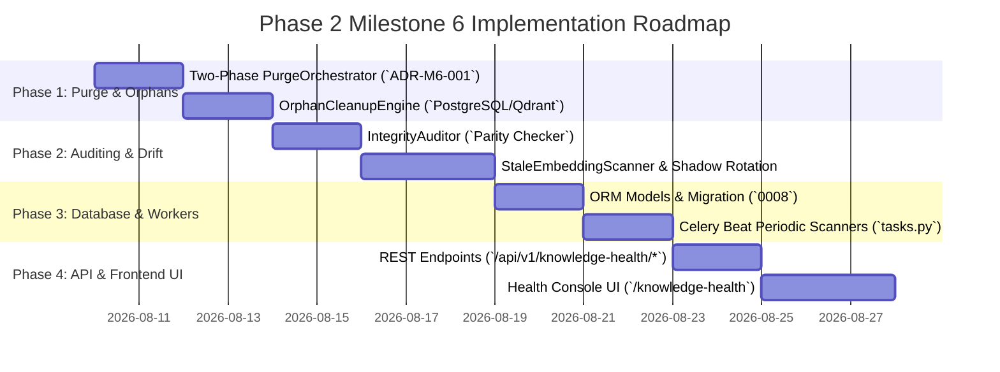

# RAGuard AI — Phase 2 Milestone 6: Knowledge Health & Lifecycle Management
## Document 3: Implementation Roadmap

**Document Version**: 1.0.0  
**Milestone**: Phase 2 Milestone 6 (`Knowledge Health & Lifecycle Management`)  
**Status**: Planning Roadmap (Strict No-Code Specification)  

---

## 1. Roadmap Overview & Execution Phases

The implementation of **Milestone 6 (`Knowledge Health & Lifecycle Management`)** is structured across **4 sequential phases**, moving from two-phase purge orchestrators and orphan cleanup engines to model drift scanners, database schemas, Celery periodic tasks, REST APIs, and Frontend Health Consoles.

---

## 2. Phase 1: Two-Phase Purge Orchestrator & Orphan Cleanup Engine

### Objectives
Establish the two-phase transactional deletion orchestrator (`PurgeOrchestrator`) and automated orphan sweep engine (`OrphanCleanupEngine`).

### Tasks
1. Implement domain error hierarchy (`backend/modules/knowledge_health/schemas/errors.py`):
   - `KHL_001`: `InvalidScanTypeError` (`RECOVERABLE=False`)
   - `KHL_002`: `ParityMismatchError` (`RECOVERABLE=True` — triggers auto-reconciliation)
   - `KHL_003`: `PurgeSynchronizationError` (`RECOVERABLE=True`)
   - `KHL_004`: `ModelRotationConflictError` (`RECOVERABLE=False`)
   - `KHL_005`: `StaleEmbeddingScanError` (`RECOVERABLE=True`)
2. Implement `PurgeOrchestrator` (`cleanups/purge.py`):
   - `execute_two_phase_purge(document_id, tenant_id)`: Marks `documents` row as `status=DELETED`, enqueues `execute_hard_purge_task`.
   - `finalize_hard_purge(document_id, tenant_id)`: Calls `QdrantVectorDBProvider.delete_points_by_filter(tenant_id, document_id)`. Upon confirmation, executes `DELETE FROM documents WHERE id = document_id CASCADE`.
3. Implement `OrphanCleanupEngine` (`cleanups/orphans.py`):
   - `sweep_orphaned_chunks(tenant_id)`: Finds unreferenced chunks/embeddings lacking valid parent documents, purges Qdrant points, deletes DB rows, and returns total count cleaned.

### Deliverables
- `cleanups/purge.py`, `cleanups/orphans.py`, `schemas/errors.py`.
- **Quality Gate**: Unit tests verifying two-phase transactional recovery when Qdrant network errors occur midway through deletion (`ADR-M6-001`).

---

## 3. Phase 2: Integrity Auditor & Stale Embedding Scanner

### Objectives
Build the $1:1$ count parity auditor (`IntegrityAuditor`) and model rotation shadow migration engine (`StaleEmbeddingScanner`).

### Tasks
1. Implement `IntegrityAuditor` (`audits/integrity.py`):
   - `verify_tenant_parity(tenant_id)`: Compares `count(DocumentChunk where is_embedded=True)` against `QdrantVectorDBProvider.get_collection_info().points_count`.
   - If counts match, returns `parity_status = SYNCED`. If mismatched, returns `MISMATCH_DETECTED` and triggers reconciliation.
2. Implement `StaleEmbeddingScanner` (`audits/stale_scanner.py`):
   - `detect_stale_embeddings(tenant_id)`: Identifies chunks where `(provider, model_name)` differ from active tenant configuration.
   - `trigger_shadow_reindex(tenant_id, stale_records)`: Creates shadow Qdrant collection, enqueues batch re-embedding tasks (`M2`), and prepares atomic pointer swap (`ADR-M6-002`).

### Deliverables
- `audits/integrity.py`, `audits/stale_scanner.py`.
- **Quality Gate**: Integration tests confirming clean identification and shadow re-indexing of stale vectors without taking active retrieval offline.

---

## 4. Phase 3: Database Models, Repositories & Celery Periodic Workers

### Objectives
Create database tables for scan job audit tracking (`health_scan_jobs`, `stale_embedding_records`) and configure scheduled Celery Beat tasks.

### Tasks
1. Define ORM models `HealthScanJob` and `StaleEmbeddingRecord` (`models/*.py`) with `tenant_id` namespace indexing.
2. Plan Alembic migration (`0008_knowledge_health_schema.py`) establishing tables and status indices.
3. Implement `HealthRepository` (`repositories/health_repository.py`) supporting scan job logging and progress updating.
4. Define event payload schemas `OrphanChunksPurged` and `KnowledgeDriftDetected` (`events/payloads.py` with `schema_version: "1.0.0"`).
5. Configure Celery Beat periodic schedules and tasks (`workers/tasks.py` on `ingestion` queue):
   - `run_scheduled_orphan_sweep_task` (`every 24 hours`)
   - `run_scheduled_parity_audit_task` (`every 12 hours`)
   - `execute_hard_purge_task` (`async on demand`)

### Deliverables
- `models/*.py`, `repositories/health_repository.py`, `events/payloads.py`, `workers/tasks.py`.
- **Quality Gate**: Celery Beat simulation tests confirming scheduled tasks execute cleanly and emit accurate `OrphanChunksPurged` telemetry.

---

## 5. Phase 4: REST API Layer & Frontend Health Console UI

### Objectives
Expose secure REST endpoints under `/api/v1/knowledge-health` and construct the administrative Health Console under `/knowledge-health`.

### Tasks
1. Implement Pydantic v2 DTOs (`schemas/health_dto.py`: `HealthScanRequestDTO`, `HealthScanJobDTO`, `ParityAuditDTO`, `PurgeSummaryDTO`, `ModelRotationRequestDTO`).
2. Implement REST endpoints (`api/routes.py`) mounted inside `backend/api/v1/router.py`:
   - `POST /api/v1/knowledge-health/scans`
   - `GET /api/v1/knowledge-health/scans`
   - `GET /api/v1/knowledge-health/parity`
   - `POST /api/v1/knowledge-health/rotate-model`
   - `DELETE /api/v1/knowledge-health/purge/{document_id}`
3. Build React TypeScript components (`frontend/src/pages/knowledge-health/`):
   - `KnowledgeHealthPage.tsx`: Main overview container with live Parity Badge (`100% SYNCED`).
   - `ParityAuditCard.tsx`: Count comparison between PostgreSQL and Qdrant with `Reconcile` trigger button.
   - `ScanJobTable.tsx`: Paginated history table tracking scan durations and orphans purged.
   - `ModelRotationModal.tsx`: Shadow collection migration wizard with real-time progress indicators.
4. Add `/knowledge-health` link to `Sidebar.tsx` navigation right below `/reliability`.

### Deliverables
- `api/routes.py`, `schemas/health_dto.py`, `frontend/src/pages/knowledge-health/*.tsx`.
- **Exit Criteria**: End-to-end audit passing all verification gates (`Document 4`), confirming zero evaluation or analytics dashboard contamination, and $100\%$ test coverage across all M6 modules.
