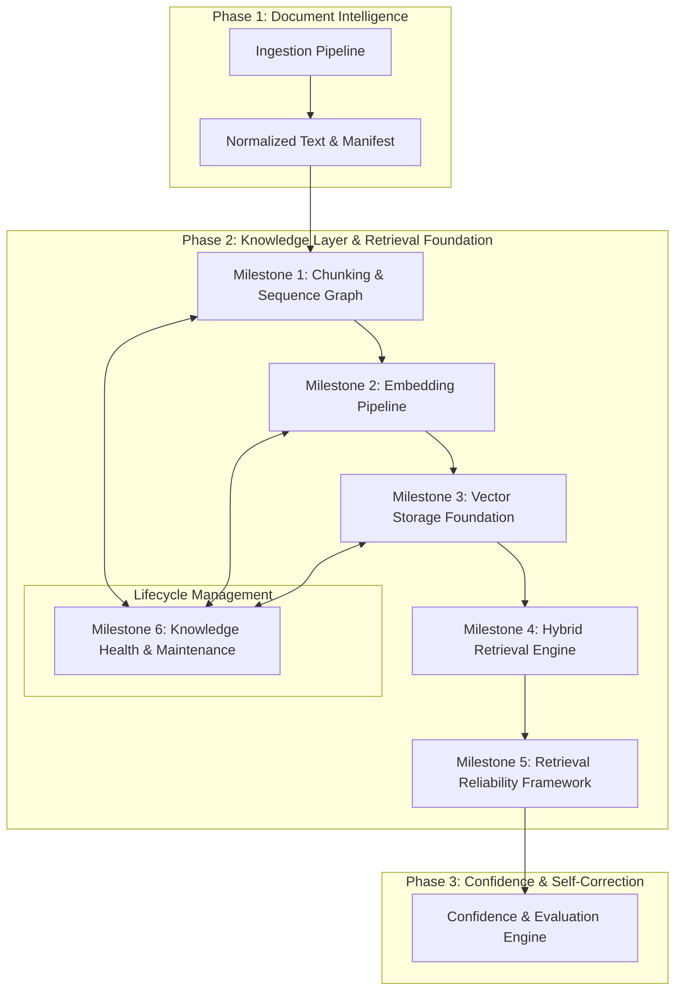
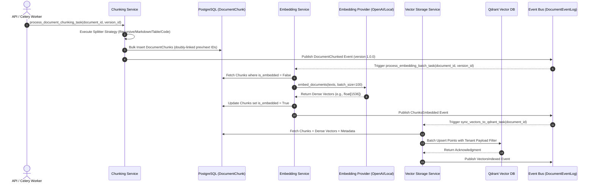
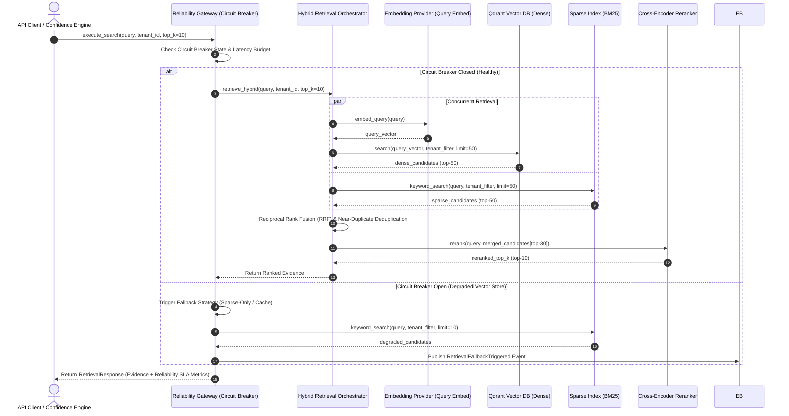
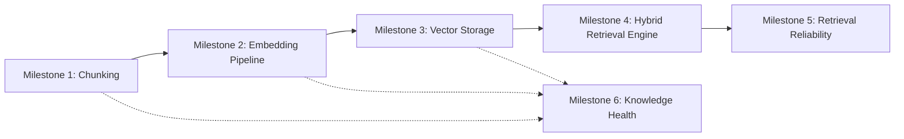

# RAGuard AI — Phase 2 Master Architecture Overview (`Knowledge Layer & Retrieval Foundation`)

**Document Version**: 1.0.0  
**Status**: COMPLETED & FROZEN  
**Author**: Principal Software Architect & AI Infrastructure Engineering Team  
**Scope**: Phase 2 Master Architecture (`Milestones 1 through 6`)  

---

## 1. Vision & Executive Purpose

RAGuard AI’s **Phase 2: Knowledge Layer & Retrieval Foundation** transforms raw, normalized document intelligence (`Phase 1`) into an enterprise-grade, verifiable, high-precision semantic retrieval foundation. Unlike naive RAG implementations that rely on unvalidated chunks and single-strategy dense search, RAGuard AI implements a multi-layered, highly reliable retrieval engine specifically designed to feed our future **Confidence & Hallucination Prevention Engine (`Phase 3`)**.

Every step of the data lifecycle—from text splitting to vector storage, hybrid search, degraded-mode fallbacks, and automated knowledge maintenance—is built on strict **Domain-Oriented Modular Architecture (`ADR-005`)**, zero-leakage boundaries, multi-tenant isolation (`tenant_id`), asynchronous processing (`Celery`), and provider-independent abstractions.



---

## 2. Phase 2 Objectives & Success Criteria

### Key Objectives
1. **Structural Fidelity**: Maintain complete document structure and breadcrumb hierarchy via doubly-linked graph sequence pointers (`previous_chunk_id` ↔ `next_chunk_id`) across all chunks (`M1`).
2. **Deterministic & Provider-Independent Embeddings**: Generate high-dimensional dense vectors using pluggable providers (`OpenAI`, `Cohere`, `HuggingFace`) with strict batching, rate-limit backoff, and quota tracking (`M2`).
3. **Multi-Tenant Vector Storage**: Store vectors and rich metadata in self-hosted Qdrant (`ADR-004`) enforcing absolute tenant namespace isolation via payload filters and dedicated collections (`M3`).
4. **Hybrid Search Precision**: Combine Dense Vector Search (`Qdrant`), Sparse Keyword Search (`BM25`), Reciprocal Rank Fusion (`RRF`), Cross-Encoder Reranking, and candidate deduplication to maximize recall and precision for top-$k$ evidence retrieval (`M4`).
5. **Retrieval Reliability & Fallbacks**: Enforce latency SLAs (`< 400ms`), circuit breakers, degraded-mode sparse fallbacks, and zero-result recovery protocols to guarantee system uptime even during vector store degradation (`M5`).
6. **Automated Lifecycle Maintenance**: Purge orphaned chunks, re-index stale embeddings when models rotate, detect semantic drift, and maintain continuous vector store synchronization (`M6`).

### Master Success Criteria
- **Zero Cross-Layer Contamination**: Strict isolation enforced (e.g., M2 never calls Qdrant; M3 never embeds; M4 never executes LLM generation).
- **Sub-Second Retrieval Latency**: $P_{95}$ hybrid retrieval latency across dense + sparse + reranking $\le 450\text{ms}$ at $100,000$ chunks per tenant.
- **100% Tenant Isolation**: Row-Level Security (`PostgreSQL`) and strict payload filtering (`Qdrant`) guarantee zero cross-tenant data bleed across all operations.
- **Async Resilience**: 100% of long-running operations (`chunking`, `embedding`, `indexing`, `cleanup`) execute asynchronously on dedicated Celery queues with zero HTTP request blocking.

---

## 3. Layered Domain Architecture (`DORA`)

Following **ADR-005**, business capabilities are organized into autonomous packages under `backend/modules/`:

| Module | Directory Package | Responsibility & Boundary | Key Domain Entities |
|---|---|---|---|
| **Chunking Foundation** (`M1`) | `backend/modules/chunking/` | Text splitting, doubly-linked graph generation, quota validation. Strictly **NO** embeddings or vector DB operations. | `DocumentChunk`, `ChunkRelationship` |
| **Embedding Pipeline** (`M2`) | `backend/modules/embedding/` | Batch vectorization, rate-limiting, token tracking, embedding provider routing. Strictly **NO** vector storage or retrieval. | `EmbeddingJob`, `EmbeddingCache`, `ChunkEmbedding` |
| **Vector Storage Foundation** (`M3`) | `backend/modules/vector/` | Qdrant collection topology, schema management, payload indexing, vector upsert/delete. Strictly **NO** retrieval or reranking. | `VectorIndexMetadata`, `TenantCollectionConfig` |
| **Hybrid Retrieval Engine** (`M4`) | `backend/modules/retrieval/` | Dense search, sparse `BM25`, RRF fusion, Cross-Encoder reranking, candidate deduplication. Strictly **NO** self-correction or generation. | `RetrievalQuery`, `RetrievalResult`, `RankedEvidence` |
| **Retrieval Reliability Framework** (`M5`) | `backend/modules/reliability/` | Circuit breakers, latency budgets, degraded-mode fallbacks, zero-result handling. Strictly **NO** LLM query rewrite or reflection. | `CircuitBreakerState`, `RetrievalSLALog`, `FallbackEvent` |
| **Knowledge Health Management** (`M6`) | `backend/modules/knowledge_health/` | Orphan cleanup, stale embedding detection, vector drift monitoring, sync verification. Strictly **NO** analytics dashboards or evaluation scoring. | `HealthScanJob`, `StaleEmbeddingRecord`, `DriftAuditLog` |

---

## 4. End-to-End Data Flow Architecture

The data flow operates across two distinct pipelines: **Ingestion & Vectorization (Async Write Path)** and **Hybrid Retrieval & Reliability (Sync/Async Read Path)**.

### 4.1 Asynchronous Write Pipeline (`M1` → `M2` → `M3` & `M6`)


### 4.2 Synchronous/Asynchronous Read Pipeline (`M4` ↔ `M5`)


---

## 5. Shared Provider Abstractions (`Interface-First`)

To guarantee strict **Provider Independence**, every external integration is wrapped in an abstract interface defined under `backend/core/providers/` or inside the respective module:

```python
# Abstract Base Classes for Phase 2 Providers
from abc import ABC, abstractmethod
from typing import Any

class BaseEmbeddingProvider(ABC):
    """Abstract contract for text embedding models (`ADR-005`)."""
    @abstractmethod
    async def embed_documents(self, texts: list[str]) -> list[list[float]]: ...
    @abstractmethod
    async def embed_query(self, text: str) -> list[float]: ...
    @property
    @abstractmethod
    def dimension(self) -> int: ...
    @property
    @abstractmethod
    def model_name(self) -> str: ...

class BaseVectorDBProvider(ABC):
    """Abstract contract for vector database engines (`ADR-004`)."""
    @abstractmethod
    async def ensure_collection(self, collection_name: str, dimension: int) -> bool: ...
    @abstractmethod
    async def upsert_points(self, collection_name: str, points: list[dict[str, Any]]) -> int: ...
    @abstractmethod
    async def search_points(self, collection_name: str, query_vector: list[float], filter_metadata: dict[str, Any], limit: int) -> list[dict[str, Any]]: ...
    @abstractmethod
    async def delete_points(self, collection_name: str, point_ids: list[str]) -> int: ...

class BaseSparseSearchProvider(ABC):
    """Abstract contract for sparse keyword indexing (`BM25`)."""
    @abstractmethod
    async def index_documents(self, tenant_id: str, chunks: list[dict[str, Any]]) -> int: ...
    @abstractmethod
    async def search_keywords(self, tenant_id: str, query: str, limit: int) -> list[dict[str, Any]]: ...

class BaseRerankerProvider(ABC):
    """Abstract contract for Cross-Encoder candidate reranking."""
    @abstractmethod
    async def rerank(self, query: str, documents: list[str], top_k: int) -> list[dict[str, Any]]: ...
```

---

## 6. Shared Event Architecture & Contract Standards

All domain events adhere to a strict envelope structure (`schema_version: "1.0.0"`) and are stored immutably in `document_events` (`backend/document/models/event_log.py`) and dispatched via the `EventDispatcher` (`backend/core/events/`):

### Standard Event Payload Envelope (`schema_version: "1.0.0"`)
```json
{
  "event_id": "4b68e912-3c4a-4d7a-8f12-001122334455",
  "event_type": "ChunksEmbedded",
  "schema_version": "1.0.0",
  "tenant_id": "org_enterprise_prod_01",
  "correlation_id": "req_8899aabb-ccdd-eeff",
  "timestamp": "2026-07-19T07:50:00Z",
  "source_module": "backend.modules.embedding",
  "data": {
    "document_id": "11223344-5566-7788-99aa-bbccddeeff00",
    "document_version_id": "22334455-6677-8899-aabb-ccddeeff0011",
    "chunk_count": 45,
    "provider": "openai",
    "model_name": "text-embedding-3-large",
    "dimension": 1536,
    "total_tokens": 12450,
    "duration_ms": 1420.5
  }
}
```

### Canonical Phase 2 Domain Events
- **`DocumentChunked`** (`M1`): Emitted after successful splitting and doubly-linked graph creation.
- **`ChunkingFailed`** (`M1`): Emitted upon unrecoverable validation or splitter exceptions.
- **`ChunksEmbedded`** (`M2`): Emitted after a batch of chunks has received dense vectors from the embedding provider.
- **`EmbeddingBatchFailed`** (`M2`): Emitted when provider rate limits or quota exhausts beyond backoff retries.
- **`VectorsIndexed`** (`M3`): Emitted after points and payload metadata are committed to Qdrant.
- **`VectorIndexFailed`** (`M3`): Emitted upon Qdrant connection drop or schema mismatch.
- **`QueryRetrieved`** (`M4`): Emitted upon successful hybrid retrieval completion with execution breakdown metrics.
- **`RetrievalFallbackTriggered`** (`M5`): Emitted when the circuit breaker opens or degraded-mode sparse search activates.
- **`OrphanChunksPurged`** (`M6`): Emitted after lifecycle garbage collection sweeps and removes deleted document chunks.

---

## 7. Shared Database & API Conventions

### 7.1 Database Schema Conventions (`PostgreSQL / SQLAlchemy 2.0`)
- **Tenant Isolation**: Every table across `M1–M6` MUST declare `tenant_id: Mapped[str] = mapped_column(String(100), index=True, nullable=False)`.
- **Composite Primary & Foreign Keys**: Primary lookups index `(tenant_id, id)`. Foreign keys referencing documents or versions must declare explicit `ondelete="CASCADE"` or `ondelete="SET NULL"`.
- **Audit Columns**: Every entity inherits from `BaseModel` (`id`, `created_at`, `updated_at`).
- **Idempotency Hashes**: Text entities store SHA-256 digests (`content_hash`) to prevent redundant embedding or indexing.

### 7.2 REST API Conventions (`FastAPI`)
- **Base Prefix**: All Phase 2 endpoints mount under `/api/v1/...` (`/api/v1/chunks`, `/api/v1/embeddings`, `/api/v1/vectors`, `/api/v1/retrieval`, `/api/v1/reliability`, `/api/v1/knowledge-health`).
- **Response Envelopes**: All responses wrap in `SuccessResponse<T>` (`success: true, data: T, metadata: { request_id }`) or `ErrorResponse` (`success: false, error: { code, message, severity }`).
- **Correlation Propagation**: Every request receives or generates an `X-Correlation-ID` header, propagated through asynchronous workers and domain events.

---

## 8. Shared Background Processing & Worker Architecture (`Celery`)

- **Queue Separation**:
  - `ingestion` queue: Heavy, high-throughput asynchronous writes (`M1` chunking, `M2` batch embeddings, `M3` vector upserts, `M6` maintenance sweeps).
  - `retrieval` queue: High-priority, low-latency async tasks (`M4` async background search, `M5` SLA audit logging).
- **Retry Policy**: Workers map domain exceptions to `ErrorSeverity.RECOVERABLE` vs `FATAL`. Recoverable errors enforce exponential backoff:
  $$\text{Countdown} = 2^{\text{retries}} \times 5\text{ seconds}$$
- **Dead-Letter Logging**: Exhausted retries (`FATAL`) persist immediately to `document_events` (`DocumentEventLog`) and trigger structured error alerts without crashing the worker process pool.

---

## 9. Shared Observability & Security Model

### 9.1 Observability (`Prometheus / Grafana / OpenTelemetry`)
- **Metrics Gages & Counters**:
  - `raguard_chunks_generated_total{strategy, tenant}`
  - `raguard_embedding_tokens_consumed_total{provider, model, tenant}`
  - `raguard_vector_upsert_latency_seconds{collection, tenant}`
  - `raguard_hybrid_retrieval_latency_seconds{stage, tenant}` (`stage = dense | sparse | rrf | rerank`)
  - `raguard_circuit_breaker_state{module, tenant}` (`0 = Closed/Healthy`, `1 = Half-Open`, `2 = Open/Degraded`)
- **Structured JSON Logging**: All modules use `structlog` with explicit key-value pairs (`tenant_id`, `document_id`, `correlation_id`, `duration_ms`, `error_code`).

### 9.2 Security Model (`Supabase RS256 JWT & Tenant Enforcement`)
- **Authentication**: Verified via `Supabase RS256 JWT` secret at the FastAPI dependency layer (`get_current_user`).
- **Authorization & Role Checks**: Administrative mutations (`M3` index drop, `M6` hard purge) require verified `Role.ADMIN` or `Role.OWNER`.
- **Row & Payload Isolation**: Every PostgreSQL query applies `.where(Entity.tenant_id == tenant_id)`. Every Qdrant search applies a mandatory `Filter(must=[FieldCondition(key="tenant_id", match=MatchValue(value=tenant_id))])`.

---

## 10. Cross-Milestone Dependency & Execution Order



### Execution Strategy
1. **Sequential Foundation (`M2` → `M3`)**: `M2` vectorizes the doubly-linked chunks produced by `M1`. `M3` establishes the Qdrant collections to house `M2`'s vectors.
2. **Retrieval Orchestration (`M4` → `M5`)**: `M4` queries `M3` (dense) and BM25 (sparse), merging and reranking top candidates. `M5` wraps `M4` with circuit breakers and fallback strategies.
3. **Continuous Maintenance (`M6`)**: `M6` operates cross-cutting audit jobs ensuring `M1`, `M2`, and `M3` stay synchronized as documents are updated or deleted over time.
