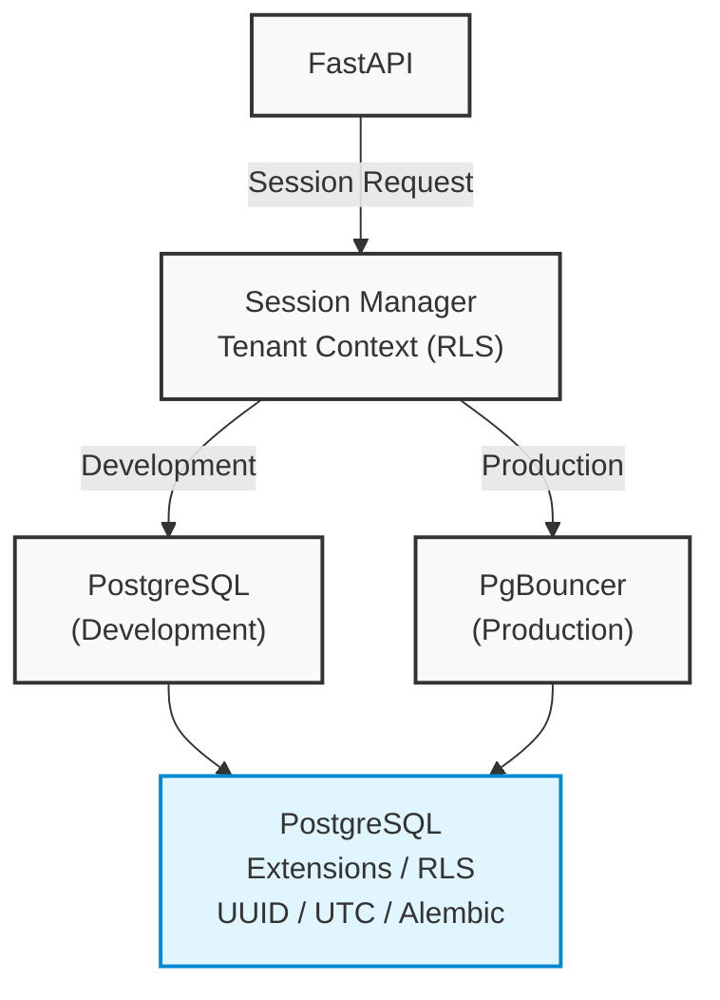

# PostgreSQL Database Architecture

This document describes the foundational persistence architecture for Veritas RAG Version 2, focusing on the connection lifecycle, multi-tenant isolation, and conventions.

## Architecture Overview



## Engine Lifecycle

Veritas RAG utilizes SQLAlchemy 2.x `AsyncEngine` to interact with PostgreSQL.
The engine lifecycle is strictly isolated per asyncio event loop to ensure thread safety across concurrent requests in FastAPI and Celery.

- **FastAPI Applications:** Engines are instantiated using the parameters specified in the `.env` (e.g., `DB_POOL_SIZE`, `DB_MAX_OVERFLOW`).
- **Celery Workers:** Background tasks disable SQLAlchemy pooling (`NullPool`) to allow the underlying Celery worker pre-fork model to manage connections cleanly without resource exhaustion.

## PgBouncer (High Concurrency)

To support horizontal scaling, connection pooling can be deferred to an external PgBouncer instance configured in **transaction pooling mode**.

- **Development:** Applications can bypass PgBouncer and connect directly to PostgreSQL. (`USE_PGBOUNCER=false`)
- **Production:** Applications must connect to PgBouncer. (`USE_PGBOUNCER=true` and `PGBOUNCER_URL` defined).

Health checks automatically detect PgBouncer routing. If active, they will probe both the PgBouncer endpoint and the raw PostgreSQL cluster to provide a comprehensive health view.

## Multi-Tenant Strategy (RLS)

All tenant-scoped data isolation is enforced at the database level using PostgreSQL Row-Level Security (RLS).
The foundational ORM class `TenantAwareBaseModel` injects a non-nullable `tenant_id` UUID column into every tenant-scoped entity.

### Session Context Injection
Instead of using generic SQLAlchemy event listeners (`before_cursor_execute`), tenant isolation is enforced strictly at the session initialization level via a dedicated context manager:

```python
async with rls_session(tenant_id) as session:
    # `SET LOCAL app.current_tenant_id = '...'` is executed.
    # All queries executed here are isolated.
    ...
```
Because `SET LOCAL` is transaction-scoped, it automatically expires upon session commit or rollback, preventing cross-contamination in connection pools.

## UTC Time Policy

- **Database:** The database always remains in `UTC`.
- **API Boundaries:** The API layer always receives and returns ISO 8601 strings in `UTC`.
- **Application Logic:** Any required timezone conversions (for analytics or reporting) must occur exclusively in memory or at the UI layer.

## Connection Resilience

Veritas RAG employs an exponential backoff retry strategy for database connections.
- **Startup:** The `/health/startup` probe will refuse to pass until `check_db_health()` verifies connectivity.
- **Runtime:** Dropped connections within the pool will trigger standard SQLAlchemy `pool_pre_ping` verifications. Invalidated connections are pruned transparently before query execution.

## SQLAlchemy Naming Conventions

To guarantee deterministic schema definitions during Alembic migrations, all tables bound to the `DeclarativeBase` utilize a unified `MetaData` naming convention:
- Index (`ix`): `ix_%(column_0_label)s`
- Unique (`uq`): `uq_%(table_name)s_%(column_0_name)s`
- Check (`ck`): `ck_%(table_name)s_%(constraint_name)s`
- Foreign Key (`fk`): `fk_%(table_name)s_%(column_0_name)s_%(referred_table_name)s`
- Primary Key (`pk`): `pk_%(table_name)s`

## Migration Workflow

Database schemas are strictly version-controlled via Alembic.
- **Extensions:** Foundational migrations enable standard extensions like `pgcrypto`, `uuid-ossp`, and `citext`.
- **Policies:** RLS policies are generated incrementally as domain models are created. Speculative schema creation is prohibited.
- **Execution:** Alembic is configured to run asynchronously (`async_engine_from_config` via `env.py`), preserving uniformity between runtime applications and database upgrades.
