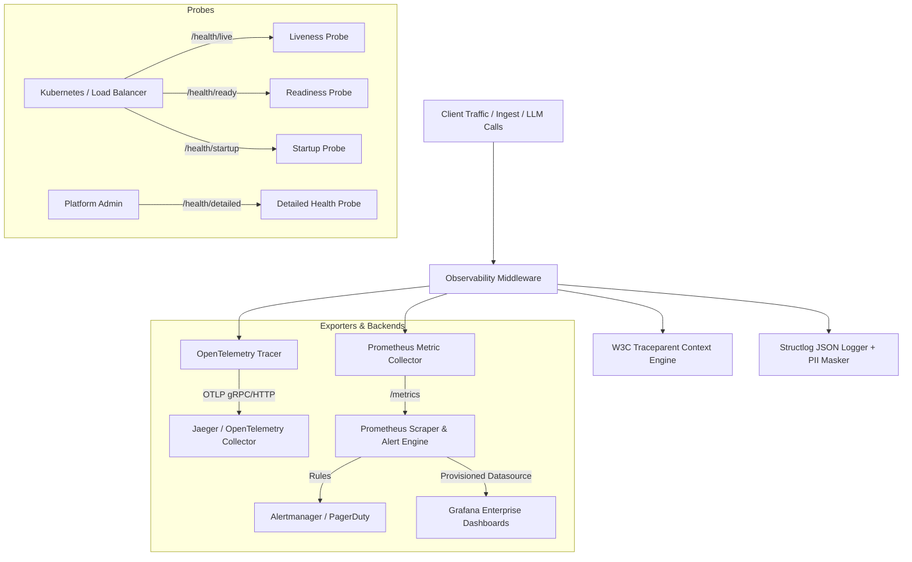

# Veritas RAG Observability & Production Monitoring Architecture (Epic 14)

**Status:** ✅ **CERTIFIED & FROZEN**
**Version:** 2.0.0
**Scope:** Distributed Tracing, Structured JSON Logging, PII Redaction, Prometheus Metric Scraping, Grafana Dashboards, SEV-1/2/3 Alerting, and Kubernetes Probes.

---

## 1. Executive Summary & Pillars

Veritas RAG implements a comprehensive observability stack designed for high-throughput, low-overhead SRE operations across multi-tenant retrieval and generative AI pipelines.

---

## 2. Distributed Tracing Architecture (F14.1 & F14.2)

- **Tracer Engine:** Built on `opentelemetry-sdk` with custom `AsyncTracerProvider` wrappers in `backend/observability/tracing/tracer.py`.
- **Context Propagation:** Fully compliant with the W3C `traceparent` standard (`00-{trace_id}-{span_id}-{flags}`).
- **Asynchronous Task Propagation:** Celery task triggers and signal handlers (`task_prerun`, `before_task_publish`) automatically propagate traceparent headers across asynchronous Celery worker processes.
- **Fail-Open Guarantees:** Any telemetry exporter outage or network partition fails open without degrading user-facing API performance or dropping requests.
- **FastAPI URL Exclusions:** Standard health check and metric scraping routes (`/health/*`, `/metrics`, `/api/v1/metrics`, `/docs`, `/openapi.json`) are automatically excluded from tracing pipelines.

---

## 3. Structured JSON Logging & PII Masking (F14.3)

- **Structured Log Emission:** Formatted via `structlog` as single-line JSON with standard ISO-8601 UTC timestamps, log level, event, service tags, and active `trace_id` / `span_id`.
- **Zero-Data-Leakage PII Masking:** High-performance pre-compiled regex processors in `backend/observability/logging/pii_masker.py` scrub:
  - Email addresses (`[EMAIL_MASKED]`)
  - JWT tokens (`[JWT_MASKED]`)
  - API Keys / Bearer tokens (`[KEY_MASKED]`)
  - Sensitive dictionary keys (`password`, `secret`, `token`, `authorization`, `api_key`, `credentials`)
- **Query String Sanitization:** Request query parameters containing sensitive tokens (e.g. `?token=...`, `?key=...`) are sanitized in HTTP access logs.

---

## 4. Prometheus Metrics & Grafana Dashboards (F14.4)

- **Metric Scrape Endpoints:** Exposed at `/metrics` and `/api/v1/metrics`.
- **Bounded Cardinality Invariant:** No unbounded dimensions (`tenant_id`, `user_id`, `document_id`, `request_id`, `query_text`) are exposed in Prometheus metric labels.
- **Canonical Grafana Dashboard:** 14-panel production dashboard (`infrastructure/monitoring/grafana/dashboards/raguard_enterprise_dashboard.json`) covering:
  1. Active In-Flight HTTP Requests
  2. Request Throughput (QPS)
  3. HTTP 5xx Error Rate (%)
  4. Active SSE Streams
  5. API Request Latency (P50, P95, P99)
  6. AI Pipeline Stage Latency Breakdown (P95)
  7. AI Query Outcomes (Success, Degraded, Failed)
  8. Reliability & Self-Correction Interventions
  9. Pre-Gen Confidence Distribution Heatmap
  10. Post-Gen Reliability Score Distribution Heatmap
  11. Redis Cache Hit vs Miss Ratio
  12. Qdrant Vector Search Latency (P95)
  13. Object Storage Throughput (Bytes/sec)
  14. LLM Token Consumption by Model

---

## 5. Production Alerting Architecture (F14.5)

Configured in `infrastructure/monitoring/prometheus/rules/alert_rules.yml`:

- **SEV-1 Critical:**
  - `ServiceUnavailable` (`up{job="raguard-backend"} == 0` for 1m)
  - `CriticalAPIErrorRate` (5xx > 15% for 2m)
  - `QdrantVectorDBUnavailable` (`up{job="raguard-qdrant"} == 0` for 1m)
  - `SevereHallucinationRate` (High Severity > 25% for 5m)
  - `CircuitBreakerTripped` (`errors{CIRCUIT_BREAKER_OPEN} > 0` for 1m)
- **SEV-2 Major:**
  - `ElevatedAPIErrorRate` (5xx > 5% for 5m)
  - `HighAPIRequestLatency` (HTTP P95 > 2.5s for 5m)
  - `HighPipelineStageLatency` (Stage P95 > 3.0s for 5m)
  - `QdrantSearchLatencyHigh` (Search P95 > 1.0s for 5m)
  - `ObjectStorageHighFailureRate` (Failures > 5/s for 5m)
  - `HighSelfCorrectionRetryRate` (Retries > 15% for 10m)
- **SEV-3 Warning:**
  - `LowCacheHitRatio` (Redis Hits < 50% for 15m)
  - `RedisConnectionRetriesElevated` (Redis Retries > 2/s for 5m)
  - `EarlyLatencyDegradation` (HTTP P95 > 1.0s for 10m)
  - `WorkspaceCleanupFailureDetected` (Cleanup Failures > 0 for 15m)

---

## 6. Health & Readiness Probes (F14.6)

- `/health/live`: Unauthenticated process liveness & uptime counter.
- `/health/ready`: Evaluates PostgreSQL, Redis, Qdrant, and MinIO connectivity.
- `/health/startup`: Validates DB migration completion and cache warmup before Kubernetes traffic routing.
- `/health/detailed`: Authenticated probe restricted to `PLATFORM_ADMIN` and `WORKSPACE_ADMIN`.
