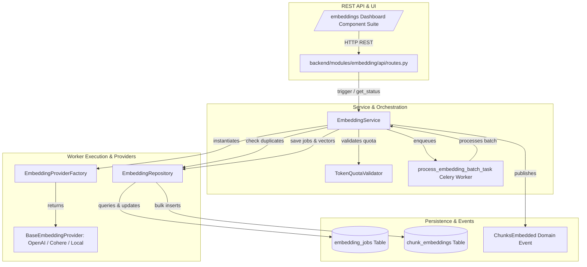

# Veritas RAG — Phase 2 Milestone 2: Embedding Pipeline Implementation Plan

**Milestone**: Phase 2 Milestone 2 (`Embedding Pipeline`)
**Status**: Implementation Plan (Planning Only — Strict No-Code)
**Author**: Principal Software Architect & AI Engineering Team
**Date**: 2026-07-19

---

## 1. Milestone Objectives

The **Embedding Pipeline (Milestone 2)** transforms validated, doubly-linked `DocumentChunk` records (from Milestone 1) into high-dimensional floating-point vector arrays (`dense embeddings`) with SHA-256 content hashes, strict token quota validation, dynamic batching ($100$ chunks/request), and resilient provider abstractions (`OpenAI`, `Cohere`, `Local ONNX`).

### Core Objectives
1. **Decoupled Vector Generation (`ADR-M2-001`)**: Generate and stage dense vector embeddings in PostgreSQL (`chunk_embeddings`) without any coupling to vector storage (`Qdrant`) or retrieval engines.
2. **Provider-Independent Abstractions**: Define `BaseEmbeddingProvider` supporting plug-and-play switching between cloud models (`OpenAI text-embedding-3-large`, `Cohere embed-multilingual-v3.0`) and local/air-gapped models (`BAAI/bge-large-en-v1.5`).
3. **Idempotent Batch Vectorization (`ADR-M2-002`)**: Batch chunks into groups of $100$ and check `(tenant_id, content_hash)` prior to API invocation. If a hash exists, reuse existing vector arrays (`is_cached_hit=True`), ensuring $0$ redundant API calls.
4. **Resilient Background Processing**: Orchestrate batch embedding jobs via `EmbeddingService` and Celery worker `process_embedding_batch_task` on the `ingestion` queue, enforcing jittered exponential backoff (`countdown = 2**retries * 5`) for rate limits (`HTTP 429` / `EMB_003`).
5. **Full Observability & Tenant Governance**: Provide comprehensive REST API management (`/api/v1/embeddings/*`) and interactive frontend dashboard (`/embeddings`) tracking job progress, token consumption against budgets, and provider health.

---

## 2. Component Breakdown & DORA Architecture



---

## 3. File-by-File Implementation Plan

### 3.1 Domain Schemas, Error Taxonomy & Provider Interfaces (`Phase 1`)
- **`backend/modules/embedding/__init__.py`**: Module initialization exporting domain entrypoints.
- **`backend/modules/embedding/providers/base.py`**: Abstract base class `BaseEmbeddingProvider` defining `embed_documents(texts: list[str]) -> list[list[float]]`, `embed_query(text: str) -> list[float]`, `dimension: int`, and `model_name: str`.
- **`backend/modules/embedding/schemas/errors.py`**: Domain exception classes (`EmbeddingDomainException`) and exact error taxonomy:
  - `EMB_001`: `InvalidInputError` (`RECOVERABLE=False` — invalid chunk IDs or empty batch)
  - `EMB_002`: `TokenQuotaExceededError` (`RECOVERABLE=False` — monthly budget exceeded)
  - `EMB_003`: `RateLimitExceededError` (`RECOVERABLE=True` — provider `HTTP 429` throttling)
  - `EMB_004`: `ProviderTimeoutError` (`RECOVERABLE=True` — network timeout or `5xx` error)
  - `EMB_005`: `ProviderAuthenticationError` (`RECOVERABLE=False` — invalid API key or auth failure)
- **`backend/modules/embedding/providers/openai_provider.py`**: `OpenAIEmbeddingProvider` using async `openai.AsyncOpenAI` client (`text-embedding-3-large` dim=1536, `text-embedding-3-small` dim=1536/512).
- **`backend/modules/embedding/providers/cohere_provider.py`**: `CohereEmbeddingProvider` using `cohere.AsyncClient` (`embed-multilingual-v3.0` dim=1024).
- **`backend/modules/embedding/providers/local_provider.py`**: `LocalHuggingFaceProvider` local ONNX / sentence-transformers wrapper (`BAAI/bge-large-en-v1.5` dim=1024).
- **`backend/modules/embedding/providers/factory.py`**: `EmbeddingProviderFactory` resolving provider instances from tenant configuration or request override.

### 3.2 Database Schemas, Alembic Migration & Repository (`Phase 2`)
- **`backend/modules/embedding/models/__init__.py`**: Exporting `EmbeddingJob` and `ChunkEmbedding` ORM models.
- **`backend/modules/embedding/models/embedding_job.py`**: `EmbeddingJob` ORM model inheriting from `BaseModel` (`table: embedding_jobs`).
- **`backend/modules/embedding/models/chunk_embedding.py`**: `ChunkEmbedding` ORM model inheriting from `BaseModel` (`table: chunk_embeddings`).
- **`backend/models/__init__.py`**: Register `EmbeddingJob` and `ChunkEmbedding` imports for seamless discovery by Alembic and domain services.
- **`backend/database/migrations/versions/0004_embedding_pipeline_schema.py`**: Alembic migration (`0004`) creating `embedding_jobs` and `chunk_embeddings` with composite indexes and unique constraints (`tenant_id, chunk_id`).
- **`backend/modules/embedding/repositories/embedding_repository.py`**: `EmbeddingRepository` encapsulating:
  - `create_job(job: EmbeddingJob) -> uuid.UUID`
  - `get_job(job_id: uuid.UUID, tenant_id: str) -> EmbeddingJob | None`
  - `list_jobs(tenant_id: str, document_id: uuid.UUID | None, status: str | None, page: int, size: int)`
  - `get_unembedded_chunks(document_version_id: uuid.UUID, tenant_id: str, batch_size: int) -> list[DocumentChunk]`
  - `filter_existing_content_hashes(hashes: list[str], tenant_id: str) -> set[str]` (`Idempotency Engine`)
  - `bulk_insert_chunk_embeddings(records: list[ChunkEmbedding]) -> int`
  - `update_job_status(job_id: uuid.UUID, status: str, processed_chunks: int, failed_chunks: int, tokens_consumed: int, error_message: str | None)`
  - `get_tenant_metrics(tenant_id: str) -> dict[str, Any]`

### 3.3 Domain Services, Quotas, Events & Celery Workers (`Phase 3`)
- **`backend/modules/embedding/schemas/embedding_dto.py`**: Pydantic v2 request/response DTOs:
  - `EmbeddingProcessRequestDTO` (`provider`, `model_name`, `batch_size`, `strategy_override`)
  - `EmbeddingJobDTO`, `EmbeddingJobDetailDTO`, `ProviderInfoDTO`, `EmbeddingMetricsDTO`
- **`backend/modules/embedding/events/payloads.py`**: Versioned domain event payloads (`schema_version: "1.0.0"`):
  - `ChunksEmbedded` (`job_id, document_id, document_version_id, provider, model_name, dimension, chunks_embedded_count, tokens_consumed, is_cached_hit`)
  - `EmbeddingBatchFailed` (`job_id, document_id, error_code, message, severity`)
  - `create_embedding_event()` helper factory.
- **`backend/modules/embedding/services/embedding_service.py`**: `EmbeddingService` orchestrating:
  - `trigger_document_embedding(document_id, version_id, tenant_id, provider, model_name, batch_size)`
  - `process_batch_segment(job_id, tenant_id)`: Idempotent batch processing loop handling hash caching, provider invocation, batch database insertion, progress increments, and domain event dispatching (`DocumentEventLog`).
- **`backend/modules/embedding/workers/__init__.py`**: Worker module exports.
- **`backend/modules/embedding/workers/tasks.py`**: Celery worker `process_embedding_batch_task` (`@celery_app.task(bind=True, queue="ingestion", max_retries=7, acks_late=True)`) catching `EMB_003/EMB_004` and enforcing jittered exponential backoff (`countdown = 2**retries * 5`).

### 3.4 REST API Router & Frontend Management Suite (`Phase 4`)
- **`backend/modules/embedding/api/__init__.py`**: API package exports.
- **`backend/modules/embedding/api/dependencies.py`**: Common dependencies for tenant namespace validation (`get_current_tenant_id`) and token quota verification.
- **`backend/modules/embedding/api/routes.py`**: FastAPI router (`APIRouter(prefix="/embeddings", tags=["Embedding Pipeline"])`):
  - `POST /api/v1/embeddings/process/{version_id}`: Trigger batch embedding job synchronously or asynchronously.
  - `GET /api/v1/embeddings/jobs/{job_id}`: Retrieve job progress detail (`processed_chunks / total_chunks`).
  - `GET /api/v1/embeddings/jobs`: Paginated list of embedding jobs for the tenant.
  - `GET /api/v1/embeddings/providers`: List available embedding providers (`OpenAI`, `Cohere`, `Local`), dimensions, and token pricing.
  - `GET /api/v1/embeddings/metrics`: Retrieve tenant token budget consumption and embedding counters.
- **`backend/api/v1/router.py`**: Mount `embedding_router` right below `chunk_router`.
- **`frontend/src/pages/embeddings/EmbeddingsPage.tsx`**: Main overview container featuring token budget KPIs and job progress table.
- **`frontend/src/pages/embeddings/ProviderConfigCard.tsx`**: Interactive control card for selecting default embedding provider, picking model dimensions (`1536 vs 1024 vs 512`), and checking API connection status.
- **`frontend/src/pages/embeddings/EmbeddingJobTable.tsx`**: Real-time paginated table rendering job IDs, status badges (`PROCESSING`, `COMPLETED`, `FAILED`), live progress bars (`75/100`), token gauges, and duration.
- **`frontend/src/pages/embeddings/TokenUsageChart.tsx`**: Visual KPI gauge & distribution chart tracking token usage across active models.
- **`frontend/src/components/layout/Sidebar.tsx`**: Add `Embeddings` link (`/embeddings`) right below `Chunks`.

---

## 4. Database Changes Required (`Alembic Migration 0004`)

### `embedding_jobs` Table
```sql
CREATE TABLE embedding_jobs (
    id UUID PRIMARY KEY,
    tenant_id VARCHAR(255) NOT NULL,
    document_id UUID NOT NULL REFERENCES documents(id) ON DELETE CASCADE,
    document_version_id UUID NOT NULL REFERENCES document_versions(id) ON DELETE CASCADE,
    status VARCHAR(20) NOT NULL, -- PENDING, PROCESSING, COMPLETED, FAILED
    provider VARCHAR(50) NOT NULL,
    model_name VARCHAR(100) NOT NULL,
    total_chunks INTEGER NOT NULL,
    processed_chunks INTEGER NOT NULL DEFAULT 0,
    failed_chunks INTEGER NOT NULL DEFAULT 0,
    total_tokens_consumed INTEGER NOT NULL DEFAULT 0,
    error_message TEXT,
    created_at TIMESTAMP WITH TIME ZONE NOT NULL,
    updated_at TIMESTAMP WITH TIME ZONE NOT NULL,
    is_deleted BOOLEAN NOT NULL DEFAULT FALSE
);
CREATE INDEX ix_embedding_jobs_tenant_id ON embedding_jobs (tenant_id);
CREATE INDEX ix_embedding_jobs_tenant_doc_ver_idx ON embedding_jobs (tenant_id, document_version_id, status);
CREATE INDEX ix_embedding_jobs_tenant_created_idx ON embedding_jobs (tenant_id, created_at);
```

### `chunk_embeddings` Table
```sql
CREATE TABLE chunk_embeddings (
    id UUID PRIMARY KEY,
    tenant_id VARCHAR(255) NOT NULL,
    chunk_id UUID NOT NULL REFERENCES document_chunks(id) ON DELETE CASCADE,
    document_version_id UUID NOT NULL,
    content_hash VARCHAR(64) NOT NULL,
    provider VARCHAR(50) NOT NULL,
    model_name VARCHAR(100) NOT NULL,
    dimension INTEGER NOT NULL,
    embedding_vector JSONB NOT NULL, -- Float array JSON representation
    created_at TIMESTAMP WITH TIME ZONE NOT NULL,
    updated_at TIMESTAMP WITH TIME ZONE NOT NULL,
    is_deleted BOOLEAN NOT NULL DEFAULT FALSE,
    CONSTRAINT uq_chunk_embeddings_tenant_chunk UNIQUE (tenant_id, chunk_id)
);
CREATE INDEX ix_chunk_embeddings_tenant_id ON chunk_embeddings (tenant_id);
CREATE INDEX ix_chunk_embeddings_tenant_hash_model_idx ON chunk_embeddings (tenant_id, content_hash, provider, model_name);
CREATE INDEX ix_chunk_embeddings_tenant_doc_ver_idx ON chunk_embeddings (tenant_id, document_version_id);
```

---

## 5. Repository Updates (`EmbeddingRepository`)

The `EmbeddingRepository` strictly isolates database interactions with explicit multi-tenant filtering (`tenant_id`) and provides:
1. **Idempotency Engine**: `filter_existing_content_hashes(hashes, tenant_id)` queries `chunk_embeddings` for any pre-existing `(tenant_id, content_hash, provider, model_name)`. Chunks returning a match are immediately skipped during external API calls, saving tokens and bandwidth.
2. **Batch Insertion**: `bulk_insert_chunk_embeddings(records)` performs high-speed bulk mapping insertion into `chunk_embeddings`.
3. **Chunk Status Sync**: Updates `DocumentChunk.is_embedded = True` for successfully embedded chunks.
4. **Job Progress Tracking**: `update_job_status()` atomically increments `processed_chunks` and `total_tokens_consumed`.

---

## 6. Services & Workers

### `EmbeddingService`
- **Quota Verification**: Checks tenant monthly token consumption (`EmbeddingMetricsDTO`). If `current_tokens + estimated_tokens > monthly_quota`, throws `EMB_002 (TokenQuotaExceededError)`.
- **Batch Segmentation**: Fetches unindexed `DocumentChunk` items in batches of $100$.
- **Idempotency Execution**: Filters out exact content hashes already present in `chunk_embeddings`.
- **Provider Invocation**: Calls `provider.embed_documents(texts)` with unindexed chunk texts.
- **Event Logging**: Records `ChunksEmbedded` domain events in `DocumentEventLog`.

### `process_embedding_batch_task` (`workers/tasks.py`)
- Registered on Celery `ingestion` queue.
- Configured with `max_retries=7`, `acks_late=True`, `task_reject_on_worker_lost=True`.
- Catches `EMB_003` (`RateLimitExceeded`) and `EMB_004` (`ProviderTimeout`) to trigger backoff: `self.retry(exc=exc, countdown=2**self.request.retries * 5)`.
- For fatal errors (`EMB_001`, `EMB_002`, `EMB_005`), sets `job.status = FAILED`, records `error_message`, and publishes `EmbeddingBatchFailed`.

---

## 7. Domain Events (`events/payloads.py`)

All domain events strictly adhere to `schema_version: "1.0.0"`:
1. **`ChunksEmbedded`**: Emitted when a batch of chunks successfully completes embedding (or hits cache).
2. **`EmbeddingBatchFailed`**: Emitted when a job encounters a fatal error or exhausts retry attempts.

---

## 8. REST APIs (`api/routes.py`)

Mounted inside `backend/api/v1/router.py`:
- `POST /api/v1/embeddings/process/{version_id}`
- `GET /api/v1/embeddings/jobs/{job_id}`
- `GET /api/v1/embeddings/jobs`
- `GET /api/v1/embeddings/providers`
- `GET /api/v1/embeddings/metrics`

---

## 9. Frontend Components (`frontend/src/pages/embeddings/`)

1. **`EmbeddingsPage.tsx`**: Page container rendering header metrics and job tables.
2. **`ProviderConfigCard.tsx`**: Interactive control card showing active provider (`OpenAI`, `Cohere`, `Local`), model dimensions (`1536`, `1024`, `512`), and status.
3. **`EmbeddingJobTable.tsx`**: Paginated table rendering active and historical jobs with live progress bars (`75/100 chunks`), status badges, tokens consumed, and error inspection modals.
4. **`TokenUsageChart.tsx`**: Visual chart displaying token usage distribution across models and monthly quota progress.

---

## 10. Configuration Changes

We will register default embedding configuration settings in `backend/core/config/settings.py` (or a dedicated `embeddings.py` settings class aggregated in `Settings`) defining:
- `DEFAULT_EMBEDDING_PROVIDER`: `"openai"` (default)
- `OPENAI_EMBEDDING_MODEL`: `"text-embedding-3-large"`
- `COHERE_EMBEDDING_MODEL`: `"embed-multilingual-v3.0"`
- `LOCAL_EMBEDDING_MODEL`: `"BAAI/bge-large-en-v1.5"`
- `EMBEDDING_BATCH_SIZE`: `100`

---

## 11. Risk Analysis & Mitigations

| Risk | Impact | Mitigation Strategy |
|---|---|---|
| **External API Throttling (`HTTP 429`)** | High (`Job Failure`) | Celery worker enforces jittered exponential backoff (`countdown = 2**retries * 5`) across $7$ attempts. Batch sizes adjust dynamically (`100 -> 50`). |
| **Runaway Token Consumption / Costs** | High (`Financial`) | `TokenQuotaValidator` in `EmbeddingService` checks tenant token budgets before calling external providers (`EMB_002`). |
| **Duplicate Vectorization Costs** | Medium (`Wasted Tokens`) | Idempotency engine checks `content_hash` against `chunk_embeddings` prior to API calls (`0` tokens spent on duplicate text). |
| **Dimension Mismatches across Models** | Medium (`Data Corruption`) | `BaseEmbeddingProvider.dimension` is strictly verified against `ChunkEmbedding.dimension` upon insertion. |

---

## 12. Dependencies

- **PostgreSQL (`asyncpg`) & SQLAlchemy 2.0**: For async persistence of `EmbeddingJob` and `ChunkEmbedding`.
- **Alembic**: For migration `0004_embedding_pipeline_schema.py`.
- **Celery & Redis**: For asynchronous job processing on `ingestion` queue.
- **`openai` & `cohere` Async SDKs**: For external provider integrations.
- **Pydantic v2**: For strict schema validation and event payload contracts.

---

## 13. Verification Strategy

1. **Automated Unit Tests (`tests/unit/backend/modules/embedding/`)**:
   - `test_providers.py`: Verifies `OpenAIEmbeddingProvider`, `CohereEmbeddingProvider`, and `LocalHuggingFaceProvider` interfaces, dimensions, and error mapping (`HTTP 429 -> EMB_003`).
   - `test_embedding_service.py`: Verifies `EmbeddingService.trigger_document_embedding`, quota checks (`EMB_002`), batch segmentation, and idempotency hash skipping.
   - `test_repository_and_idempotency.py`: Verifies multi-tenant namespace filtering (`tenant_id`) and unique `(tenant_id, chunk_id)` constraints.
   - `test_tasks.py`: Verifies Celery worker backoff schedules (`countdown = 2**retries * 5`) on simulated `EMB_003/EMB_004` errors.
2. **Automated Integration Suite**: Run complete backend test suite confirming $100\%$ pass rate across Phase 1 (`M1–M6`), Phase 2 `M1 (Chunking)`, and new `M2 (Embedding Pipeline)` tests.
3. **Frontend Build Verification**: Run `npm run build` in `frontend/` to confirm zero TypeScript compilation or Vite bundling errors across all new components.
4. **Strict Boundary Verification**: Verify that across all files in `backend/modules/embedding/`, there are $0$ imports of `qdrant_client`, $0$ calls to Qdrant collections, $0$ retrieval operations, and $0$ LLM generation calls.

---

## 14. Milestone Boundaries Verification (Strict Architecture Check)

We explicitly confirm that this implementation plan strictly adheres to all boundary constraints:
✅ **No Vector Storage**: `ChunkEmbedding` records store float vectors in PostgreSQL only (`chunk_embeddings`). Zero Qdrant connections or indexing logic exist in Milestone 2.
✅ **No Retrieval**: Zero BM25, RRF, similarity search, or reranking logic exists.
✅ **No Reliability**: Zero circuit breakers, fallback routing, or zero-result recovery logic exists.
✅ **No Knowledge Health**: Zero orphan sweeps, count parity audits, or shadow migrations exist.
✅ **Only Embedding Pipeline**: Only chunk vectorization, batch job tracking, provider abstractions, quota governance, and dashboarding are planned.

---

## 15. Next Steps — Waiting for User Approval

Per our **Architecture-First methodology (`STEP 5`)**:
**We have stopped and are waiting for explicit user approval.** No source code files or database migrations will be created or executed until the user explicitly approves this Implementation Plan.
