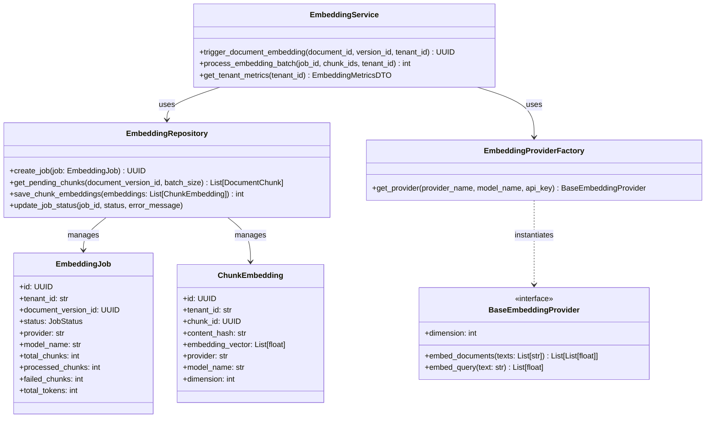
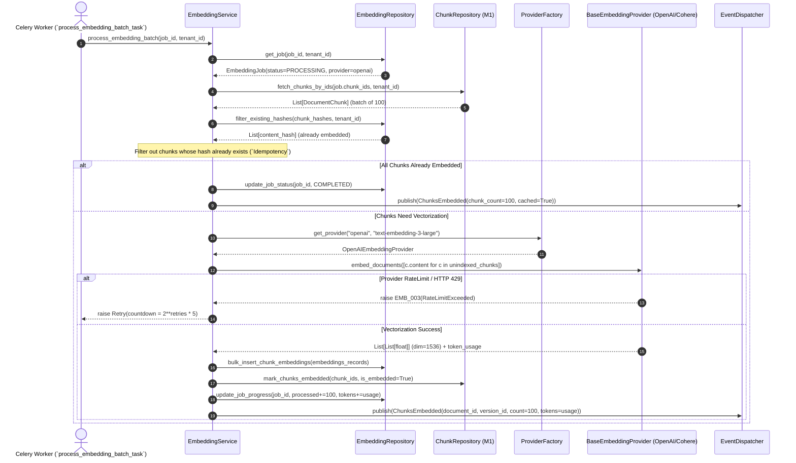

# RAGuard AI — Phase 2 Milestone 2: Embedding Pipeline
## Document 2: Technical Design

**Document Version**: 1.0.0
**Milestone**: Phase 2 Milestone 2 (`Embedding Pipeline`)
**Status**: Technical Blueprint (Strict Planning Only — No Code)

---

## 1. Domain Architecture (`DORA Package Structure`)

The embedding pipeline operates entirely within `backend/modules/embedding/`, isolating domain aggregates, repositories, services, and workers:



---

## 2. Directory Structure

```text
backend/modules/embedding/
├── __init__.py
├── api/
│   ├── __init__.py
│   ├── dependencies.py          # Tenant & quota resolution dependencies
│   └── routes.py                # REST endpoints (/api/v1/embeddings/*)
├── events/
│   ├── __init__.py
│   └── payloads.py              # ChunksEmbedded, EmbeddingBatchFailed DTOs (schema v1.0.0)
├── models/
│   ├── __init__.py
│   ├── embedding_job.py         # ORM entity for embedding progress & audit
│   └── chunk_embedding.py       # ORM entity storing dense vector arrays & hashes
├── providers/
│   ├── __init__.py
│   ├── base.py                  # BaseEmbeddingProvider interface
│   ├── factory.py               # Provider resolution factory
│   ├── openai_provider.py       # OpenAI API client wrapper (async)
│   ├── cohere_provider.py       # Cohere API client wrapper (async)
│   └── local_provider.py        # Local HuggingFace/ONNX inference wrapper
├── repositories/
│   ├── __init__.py
│   └── embedding_repository.py  # Async queries with tenant namespace filtering
├── schemas/
│   ├── __init__.py
│   ├── embedding_dto.py         # Pydantic request/response models
│   └── errors.py                # EMB_001 to EMB_005 error codes
├── services/
│   ├── __init__.py
│   └── embedding_service.py     # Batch orchestration & quota checks
└── workers/
    ├── __init__.py
    └── tasks.py                 # Celery task (process_embedding_batch_task)
```

---

## 3. Complete Data Flow Diagram



---

## 4. Database Design (`PostgreSQL / ORM Schemas`)

### 4.1 `embedding_jobs` Table
Tracks asynchronous batch vectorization jobs per document version:
- `id`: `UUID` (`PRIMARY KEY`)
- `tenant_id`: `VARCHAR(100)` (`NOT NULL`, `INDEXED`)
- `document_id`: `UUID` (`NOT NULL`, `FOREIGN KEY REFERENCES documents(id) ON DELETE CASCADE`)
- `document_version_id`: `UUID` (`NOT NULL`, `FOREIGN KEY REFERENCES document_versions(id) ON DELETE CASCADE`)
- `status`: `VARCHAR(20)` (`NOT NULL` — `PENDING | PROCESSING | COMPLETED | FAILED`)
- `provider`: `VARCHAR(50)` (`NOT NULL` — e.g., `openai`, `cohere`, `local`)
- `model_name`: `VARCHAR(100)` (`NOT NULL` — e.g., `text-embedding-3-large`)
- `total_chunks`: `INTEGER` (`NOT NULL`)
- `processed_chunks`: `INTEGER` (`NOT NULL DEFAULT 0`)
- `failed_chunks`: `INTEGER` (`NOT NULL DEFAULT 0`)
- `total_tokens_consumed`: `INTEGER` (`NOT NULL DEFAULT 0`)
- `error_message`: `TEXT` (`NULLABLE`)
- `created_at`: `TIMESTAMP WITH TIME ZONE` (`NOT NULL`)
- `updated_at`: `TIMESTAMP WITH TIME ZONE` (`NOT NULL`)
- **Indexes**: Composite `(tenant_id, document_version_id, status)`, `(tenant_id, created_at)`.

### 4.2 `chunk_embeddings` Table
Persists generated raw dense vectors and content hashes prior to Qdrant indexing:
- `id`: `UUID` (`PRIMARY KEY`)
- `tenant_id`: `VARCHAR(100)` (`NOT NULL`, `INDEXED`)
- `chunk_id`: `UUID` (`NOT NULL`, `FOREIGN KEY REFERENCES document_chunks(id) ON DELETE CASCADE`, `UNIQUE(tenant_id, chunk_id)`)
- `document_version_id`: `UUID` (`NOT NULL`, `INDEXED`)
- `content_hash`: `VARCHAR(64)` (`NOT NULL`, `INDEXED` — SHA-256 for duplicate check)
- `provider`: `VARCHAR(50)` (`NOT NULL`)
- `model_name`: `VARCHAR(100)` (`NOT NULL`)
- `dimension`: `INTEGER` (`NOT NULL` — e.g., `1536`, `1024`, `384`)
- `embedding_vector`: `JSONB` or `ARRAY(FLOAT)` (`NOT NULL` — stores the float array)
- `created_at`: `TIMESTAMP WITH TIME ZONE` (`NOT NULL`)
- **Indexes**: `(tenant_id, content_hash, provider, model_name)`, `(tenant_id, document_version_id)`.

---

## 5. API Design (`REST Endpoints`)

All endpoints require JWT RS256 authentication and enforce `X-Tenant-ID` resolution:

| Method | Route | Purpose | Request Body | Response Model |
|---|---|---|---|---|
| `POST` | `/api/v1/embeddings/process/{version_id}` | Trigger asynchronous batch embedding for a document version | `EmbeddingProcessRequestDTO` (`provider`, `model_name`, `batch_size`) | `SuccessResponse<EmbeddingJobDTO>` |
| `GET` | `/api/v1/embeddings/jobs/{job_id}` | Check status, token consumption, and progress of an embedding job | `None` | `SuccessResponse<EmbeddingJobDetailDTO>` |
| `GET` | `/api/v1/embeddings/jobs` | Paginated list of tenant embedding jobs filtered by status/document | `None` (`query: page, size, status`) | `SuccessResponse<PaginatedList<EmbeddingJobDTO>>` |
| `GET` | `/api/v1/embeddings/providers` | List available embedding providers, models, dimensions, and token costs | `None` | `SuccessResponse<List<ProviderInfoDTO>>` |
| `GET` | `/api/v1/embeddings/metrics` | Retrieve tenant token budgets, total vectors generated, and error rates | `None` | `SuccessResponse<EmbeddingMetricsDTO>` |

---

## 6. Background Processing & Celery Architecture

### Task Specification (`workers/tasks.py`)
- **Task Name**: `embedding.process_batch`
- **Queue**: `ingestion`
- **Arguments**: `job_id: str`, `chunk_ids: list[str]`, `tenant_id: str`
- **Idempotency Guarantee**: Before invoking `embed_documents`, the worker checks `chunk_embeddings` for existing `(tenant_id, content_hash, provider, model_name)`. If found, it copies the vector or skips API calls entirely.
- **Retry Policy**:
  - `EMB_003` (`RateLimitExceeded / HTTP 429`): Automatic `self.retry(exc=e, countdown=2**self.request.retries * 5, max_retries=7)`.
  - `EMB_004` (`ProviderTimeout`): Automatic retry up to 3 times.
  - `EMB_005` (`InvalidApiKey / QuotaExhausted`): `FATAL` error. Immediately sets `job.status = FAILED` and emits `EmbeddingBatchFailed` event.

---

## 7. Event Architecture & Domain Contracts

### Canonical Payload: `ChunksEmbedded` (`schema_version: "1.0.0"`)
```json
{
  "event_id": "uuid-v4",
  "event_type": "ChunksEmbedded",
  "schema_version": "1.0.0",
  "tenant_id": "org_abc_123",
  "correlation_id": "req_xyz_789",
  "timestamp": "2026-07-19T08:00:00Z",
  "source_module": "backend.modules.embedding",
  "data": {
    "job_id": "job_uuid_111",
    "document_id": "doc_uuid_222",
    "document_version_id": "ver_uuid_333",
    "provider": "openai",
    "model_name": "text-embedding-3-large",
    "dimension": 1536,
    "chunks_embedded_count": 100,
    "tokens_consumed": 3420,
    "is_cached_hit": false
  }
}
```

---

## 8. Frontend Planning (`/embeddings` UI)

Built inside `frontend/src/pages/embeddings/`:
- **`EmbeddingsPage.tsx`**: Main overview dashboard featuring top-level token budget gauges and provider health cards.
- **`ProviderConfigCard.tsx`**: Allows tenant admins to select default embedding providers (`OpenAI` vs `Cohere` vs `Local`), input API keys safely (`vault-backed`), and configure fallback chains (`If OpenAI fails -> fallback to Local BGE`).
- **`EmbeddingJobTable.tsx`**: Real-time progress tracker displaying `EmbeddingJob` status (`PROCESSING`, `COMPLETED`), progress bars (`75/100 chunks`), token usage, and duration.
- **`TokenUsageChart.tsx`**: Visual bar chart tracking tokens consumed per day/model against tenant monthly budgets.

---

## 9. Security, Performance & Observability Planning

### Security
- API keys for external providers are never stored in plaintext in `embedding_jobs`; they are fetched dynamically from secure tenant secrets (`environment / Supabase Vault`).
- Strict tenant namespace filtering on every repository read/write: `.where(ChunkEmbedding.tenant_id == tenant_id)`.

### Performance
- **Batch Vectorization**: Chunks are never embedded one-by-one. They are chunked into arrays of $100$ strings per HTTP call, maximizing network throughput and satisfying provider API efficiency.
- **Connection Pooling**: `httpx.AsyncClient` instances inside `OpenAIEmbeddingProvider` are pooled across requests to eliminate TLS handshake overhead.

### Observability (`structlog & Prometheus`)
- Metrics emitted: `raguard_embedding_tokens_total{tenant, provider, model}`, `raguard_embedding_latency_seconds{provider}`, `raguard_embedding_errors_total{code}`.
- All logs include `job_id`, `document_version_id`, `batch_size`, and `token_usage`.

---

## 10. Risk Analysis & Mitigations

| Risk | Severity | Mitigation Strategy |
|---|---|---|
| **External API Throttling (`HTTP 429`)** | High | Enforce Celery jittered exponential backoff and batch size throttling (`batch_size=100 -> 50`). |
| **Runaway API Costs (`Quota Exhaustion`)** | High | Implement `TokenQuotaValidator` inside `EmbeddingService`. If `tenant.tokens_consumed + estimated_tokens > tenant.quota`, reject job (`EMB_002`) before calling API. |
| **Model Dimension Mismatch** | Medium | `BaseEmbeddingProvider` exposes `.dimension`. Database schema enforces consistency check when inserting into `chunk_embeddings`. |
