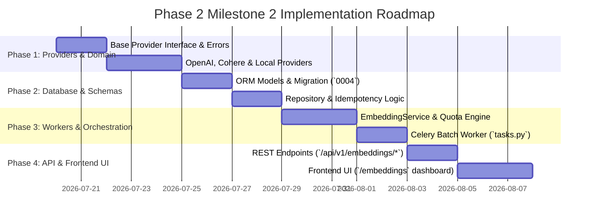

# RAGuard AI — Phase 2 Milestone 2: Embedding Pipeline
## Document 3: Implementation Roadmap

**Document Version**: 1.0.0
**Milestone**: Phase 2 Milestone 2 (`Embedding Pipeline`)
**Status**: Planning Roadmap (Strict No-Code Specification)

---

## 1. Roadmap Overview & Execution Phases

The implementation of **Milestone 2 (`Embedding Pipeline`)** is structured across **4 sequential phases**, moving from base domain abstractions and provider integrations to database schemas, Celery worker orchestration, REST APIs, and Frontend UI dashboards.

---

## 2. Phase 1: Provider Abstractions & Domain Taxonomy

### Objectives
Establish the provider-independent interfaces (`BaseEmbeddingProvider`), strict error taxonomy (`EMB_xxx`), and concrete provider wrappers (`OpenAI`, `Cohere`, `Local`).

### Tasks
1. Define abstract class `BaseEmbeddingProvider` (`backend/modules/embedding/providers/base.py`) declaring `embed_documents()`, `embed_query()`, `dimension`, and `model_name`.
2. Implement domain error hierarchy (`backend/modules/embedding/schemas/errors.py`):
   - `EMB_001`: `InvalidInputError` (`RECOVERABLE=False`)
   - `EMB_002`: `TokenQuotaExceededError` (`RECOVERABLE=False`)
   - `EMB_003`: `RateLimitExceededError` (`RECOVERABLE=True`)
   - `EMB_004`: `ProviderTimeoutError` (`RECOVERABLE=True`)
   - `EMB_005`: `ProviderAuthenticationError` (`RECOVERABLE=False`)
3. Implement `OpenAIEmbeddingProvider` using async `openai.AsyncOpenAI` client supporting `text-embedding-3-large` (1536-dim) and `text-embedding-3-small` (1536/512-dim).
4. Implement `CohereEmbeddingProvider` using `cohere.AsyncClient` supporting `embed-multilingual-v3.0` (1024-dim).
5. Implement `LocalHuggingFaceProvider` using local ONNX runtime (`BAAI/bge-large-en-v1.5`, 1024-dim) for offline/air-gapped tenants.
6. Implement `EmbeddingProviderFactory` (`factory.py`) dynamically resolving providers from tenant configuration.

### Deliverables
- `providers/base.py`, `factory.py`, `openai_provider.py`, `cohere_provider.py`, `local_provider.py`, `schemas/errors.py`.
- **Quality Gate**: Unit tests verifying provider interfaces, dimension properties, and mock HTTP response/error mapping.

---

## 3. Phase 2: Database Models, Repositories & Idempotency Engine

### Objectives
Create database tables for tracking asynchronous batch jobs (`embedding_jobs`) and storing generated dense vectors with content hashes (`chunk_embeddings`).

### Tasks
1. Define ORM models `EmbeddingJob` and `ChunkEmbedding` inside `backend/modules/embedding/models/` with strict `tenant_id` indexing and foreign keys (`document_chunks.id`, `document_versions.id`).
2. Plan Alembic migration (`0004_embedding_pipeline_schema.py`) establishing tables, unique constraints (`tenant_id, chunk_id`), and composite indexes `(tenant_id, content_hash)`.
3. Implement `EmbeddingRepository` (`repositories/embedding_repository.py`) supporting:
   - `get_unembedded_chunks(document_version_id, batch_size=100, tenant_id)`
   - `filter_existing_content_hashes(hashes: list[str], tenant_id) -> set[str]` (`Idempotency check`)
   - `bulk_insert_chunk_embeddings(records: list[ChunkEmbedding])`
   - `update_job_status(job_id, status, processed, failed, tokens, error)`

### Deliverables
- `models/embedding_job.py`, `models/chunk_embedding.py`, `repositories/embedding_repository.py`.
- **Quality Gate**: Integration tests verifying multi-tenant isolation, unique hash constraints, and bulk insertion performance ($1,000$ records $< 100\text{ms}$).

---

## 4. Phase 3: Service Orchestration & Celery Workers

### Objectives
Build the high-level domain orchestration service (`EmbeddingService`) and asynchronous Celery worker (`process_embedding_batch_task`).

### Tasks
1. Implement `EmbeddingService` (`services/embedding_service.py`):
   - `trigger_document_embedding(document_id, version_id, tenant_id, provider, model)`: Validates tenant token quota, creates `EmbeddingJob` in `PENDING` state, chunks unindexed `DocumentChunk` IDs into batches of $100$, and enqueues Celery tasks.
   - `process_batch_segment(job_id, chunk_ids, tenant_id)`: Orchestrates hash lookup, provider execution, vector storage, and job progress incrementing.
2. Define event payload schemas `ChunksEmbedded` and `EmbeddingBatchFailed` (`events/payloads.py` with `schema_version: "1.0.0"`).
3. Implement `process_embedding_batch_task` Celery task (`workers/tasks.py` on `ingestion` queue):
   - Wraps `process_batch_segment`.
   - Enforces exponential backoff: `self.retry(exc=e, countdown=2**self.request.retries * 5, max_retries=7)` for `EMB_003` and `EMB_004`.
   - Dispatches `ChunksEmbedded` via `EventDispatcher` upon completion.

### Deliverables
- `services/embedding_service.py`, `events/payloads.py`, `workers/tasks.py`.
- **Quality Gate**: Celery worker resilience tests verifying exponential backoff retry schedules under simulated provider `HTTP 429` rate limits.

---

## 5. Phase 4: REST API Layer & Frontend Infrastructure UI

### Objectives
Expose secure REST endpoints under `/api/v1/embeddings` and construct the interactive admin management UI under `/embeddings`.

### Tasks
1. Implement Pydantic v2 DTOs (`schemas/embedding_dto.py`: `EmbeddingProcessRequestDTO`, `EmbeddingJobDTO`, `ProviderInfoDTO`, `EmbeddingMetricsDTO`).
2. Implement REST endpoints (`api/routes.py`) mounted inside `backend/api/v1/router.py`:
   - `POST /api/v1/embeddings/process/{version_id}`
   - `GET /api/v1/embeddings/jobs/{job_id}`
   - `GET /api/v1/embeddings/jobs`
   - `GET /api/v1/embeddings/providers`
   - `GET /api/v1/embeddings/metrics`
3. Build React TypeScript components (`frontend/src/pages/embeddings/`):
   - `EmbeddingsPage.tsx`: Main overview container.
   - `ProviderConfigCard.tsx`: Provider selector, model picker, and API key vault configuration.
   - `EmbeddingJobTable.tsx`: Real-time job status table with progress bars (`processed / total chunks`) and error tooltip display.
   - `TokenUsageChart.tsx`: Bar chart displaying tenant token consumption across models.
4. Add `/embeddings` link to `Sidebar.tsx` navigation right below `/chunks`.

### Deliverables
- `api/routes.py`, `schemas/embedding_dto.py`, `frontend/src/pages/embeddings/*.tsx`.
- **Exit Criteria**: End-to-end audit passing all verification gates (`Document 4`), confirming zero Qdrant calls, zero retrieval attempts, and $100\%$ test coverage across all M2 modules.
