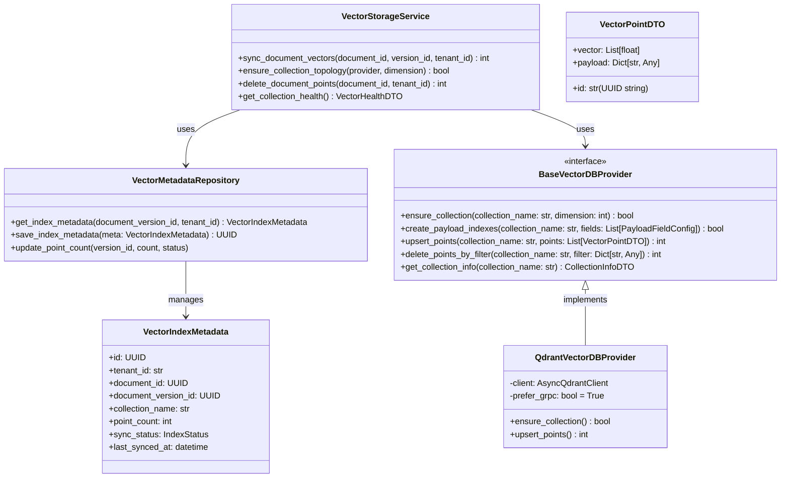
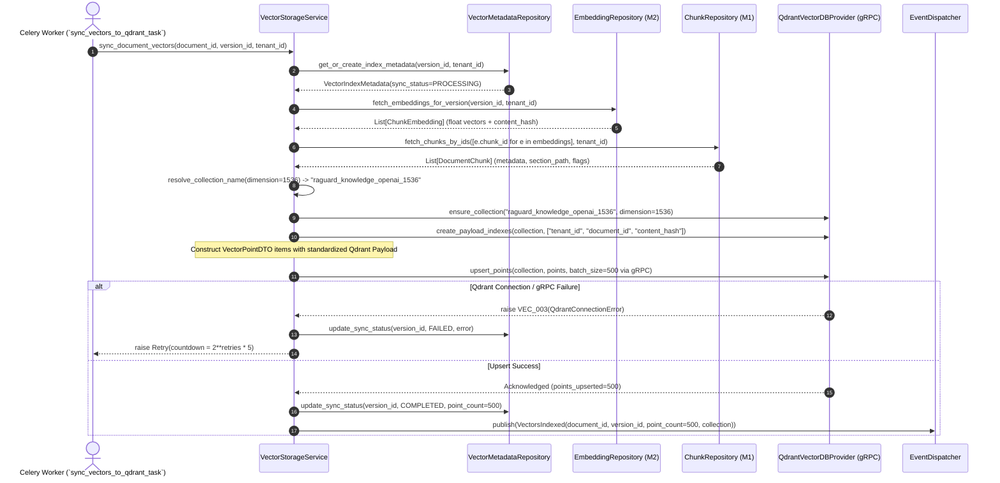

# Veritas RAG — Phase 2 Milestone 3: Vector Storage Foundation
## Document 2: Technical Design

**Document Version**: 1.0.0
**Milestone**: Phase 2 Milestone 3 (`Vector Storage Foundation`)
**Status**: Technical Blueprint (Strict Planning Only — No Code)

---

## 1. Domain Architecture (`DORA Package Structure`)

The vector storage foundation operates entirely within `backend/modules/vector/`, isolating domain aggregates, repositories, services, and workers:



---

## 2. Directory Structure

```text
backend/modules/vector/
├── __init__.py
├── api/
│   ├── __init__.py
│   ├── dependencies.py          # Tenant resolution & Qdrant health check dependency
│   └── routes.py                # REST endpoints (/api/v1/vectors/*)
├── events/
│   ├── __init__.py
│   └── payloads.py              # VectorsIndexed, VectorIndexFailed DTOs (schema v1.0.0)
├── models/
│   ├── __init__.py
│   └── vector_metadata.py       # ORM entity tracking index synchronization states
├── providers/
│   ├── __init__.py
│   ├── base.py                  # BaseVectorDBProvider interface
│   ├── factory.py               # Vector DB provider factory
│   └── qdrant_provider.py       # AsyncQdrantClient (gRPC) concrete implementation
├── repositories/
│   ├── __init__.py
│   └── vector_repository.py     # Async metadata queries with tenant filtering
├── schemas/
│   ├── __init__.py
│   ├── vector_dto.py            # Pydantic point structures, payload schemas, DTOs
│   └── errors.py                # VEC_001 to VEC_005 error codes
├── services/
│   ├── __init__.py
│   └── vector_service.py        # Collection management & batch indexing orchestrator
└── workers/
    ├── __init__.py
    └── tasks.py                 # Celery task (sync_vectors_to_qdrant_task)
```

---

## 3. Complete Data Flow Diagram



---

## 4. Qdrant Payload Schema & Database Design

### 4.1 Canonical Qdrant Point Schema & Indexed Payloads
Every vector point stored in Qdrant must conform to this standardized payload schema, with mandatory keyword indices created for fast filtering:

```json
{
  "id": "55667788-99aa-bbcc-ddeeff001122",
  "vector": [0.0123, -0.0456, 0.0789, "...", -0.0112],
  "payload": {
    "tenant_id": "org_enterprise_prod_01",
    "document_id": "11223344-5566-7788-99aa-bbccddeeff00",
    "document_version_id": "22334455-6677-8899-aabb-ccddeeff0011",
    "chunk_id": "55667788-99aa-bbcc-ddeeff001122",
    "chunk_index": 12,
    "content_hash": "a1b2c3d4e5f6...",
    "strategy_used": "markdown",
    "section_path": ["# Chapter 2", "## Section 2.3"],
    "has_table_headers": false,
    "is_code_block": false,
    "content_preview": "This section outlines the financial risk governance controls..."
  }
}
```

**Mandatory Qdrant Payload Indexes (`create_payload_index`)**:
- `tenant_id`: `PayloadSchemaType.KEYWORD` (`CRITICAL for multi-tenant isolation`)
- `document_id`: `PayloadSchemaType.KEYWORD`
- `document_version_id`: `PayloadSchemaType.KEYWORD`
- `content_hash`: `PayloadSchemaType.KEYWORD`
- `strategy_used`: `PayloadSchemaType.KEYWORD`

### 4.2 PostgreSQL Table: `vector_index_metadata`
Tracks synchronization state between PostgreSQL chunks and Qdrant points:
- `id`: `UUID` (`PRIMARY KEY`)
- `tenant_id`: `VARCHAR(100)` (`NOT NULL`, `INDEXED`)
- `document_id`: `UUID` (`NOT NULL`, `FOREIGN KEY REFERENCES documents(id) ON DELETE CASCADE`)
- `document_version_id`: `UUID` (`NOT NULL`, `FOREIGN KEY REFERENCES document_versions(id) ON DELETE CASCADE`, `UNIQUE(tenant_id, document_version_id)`)
- `collection_name`: `VARCHAR(100)` (`NOT NULL` — e.g., `raguard_knowledge_openai_1536`)
- `point_count`: `INTEGER` (`NOT NULL DEFAULT 0`)
- `sync_status`: `VARCHAR(20)` (`NOT NULL` — `PENDING | PROCESSING | COMPLETED | FAILED`)
- `error_message`: `TEXT` (`NULLABLE`)
- `last_synced_at`: `TIMESTAMP WITH TIME ZONE` (`NULLABLE`)
- `created_at`: `TIMESTAMP WITH TIME ZONE` (`NOT NULL`)
- `updated_at`: `TIMESTAMP WITH TIME ZONE` (`NOT NULL`)
- **Indexes**: Composite `(tenant_id, sync_status)`, `(tenant_id, collection_name)`.

---

## 5. API Design (`REST Endpoints`)

All endpoints require JWT RS256 authentication and enforce `X-Tenant-ID` resolution:

| Method | Route | Purpose | Request Body | Response Model |
|---|---|---|---|---|
| `POST` | `/api/v1/vectors/sync/{version_id}` | Trigger asynchronous batch synchronization of embeddings into Qdrant | `None` | `SuccessResponse<VectorIndexMetadataDTO>` |
| `GET` | `/api/v1/vectors/document/{document_id}` | Retrieve synchronization state and point count for a document across collections | `None` | `SuccessResponse<List<VectorIndexMetadataDTO>>` |
| `GET` | `/api/v1/vectors/health` | Inspect Qdrant cluster health, memory usage, and active collections | `None` | `SuccessResponse<QdrantClusterHealthDTO>` |
| `GET` | `/api/v1/vectors/collections` | List all active tenant vector collections, dimensions, and indexed payload keys | `None` | `SuccessResponse<List<CollectionDetailDTO>>` |
| `DELETE` | `/api/v1/vectors/document/{document_id}` | Purge all vector points for a document from Qdrant (`tenant namespace bound`) | `None` | `SuccessResponse<PurgeSummaryDTO>` |

---

## 6. Background Processing & Celery Architecture

### Task Specification (`workers/tasks.py`)
- **Task Name**: `vector.sync_to_qdrant`
- **Queue**: `ingestion`
- **Arguments**: `document_id: str`, `version_id: str`, `tenant_id: str`
- **Trigger**: Automatically invoked by `ChunksEmbedded` event handler or manual REST sync.
- **Idempotency Guarantee**: `Qdrant` point ID equals `chunk_id`. Calling `upsert_points` multiple times with identical points overwrites cleanly without creating duplicate vector entries.
- **Retry Policy**:
  - `VEC_003` (`QdrantConnectionError / gRPC Timeout`): Automatic `self.retry(exc=e, countdown=2**self.request.retries * 5, max_retries=7)`.
  - `VEC_004` (`DimensionMismatch`): `FATAL` error. Immediately marks `vector_index_metadata.sync_status = FAILED` and emits `VectorIndexFailed` event.

---

## 7. Event Architecture & Domain Contracts

### Canonical Payload: `VectorsIndexed` (`schema_version: "1.0.0"`)
```json
{
  "event_id": "uuid-v4",
  "event_type": "VectorsIndexed",
  "schema_version": "1.0.0",
  "tenant_id": "org_abc_123",
  "correlation_id": "req_xyz_789",
  "timestamp": "2026-07-19T08:15:00Z",
  "source_module": "backend.modules.vector",
  "data": {
    "document_id": "doc_uuid_222",
    "document_version_id": "ver_uuid_333",
    "collection_name": "raguard_knowledge_openai_1536",
    "point_count": 100,
    "duration_ms": 310.2
  }
}
```

---

## 8. Frontend Planning (`/vectors` UI)

Built inside `frontend/src/pages/vectors/`:
- **`VectorsPage.tsx`**: Main overview dashboard featuring Qdrant cluster RAM/CPU gauges and total vector point counts across the tenant namespace.
- **`CollectionHealthCard.tsx`**: Displays active collection topology (`collection_name`, `dimension=1536`, `points_count`, `indexed_payload_fields`).
- **`IndexSyncTable.tsx`**: Paginated registry displaying document synchronization statuses (`COMPLETED`, `PROCESSING`, `FAILED`), last synced timestamps, and a `Resync` button for manual re-indexing.
- **`PayloadInspectorModal.tsx`**: Interactive modal allowing admins to inspect the exact Qdrant payload schema generated for any processed document version.

---

## 9. Security, Performance & Observability Planning

### Security
- **Multi-Tenant Payload Enforcement**: `QdrantVectorDBProvider.upsert_points()` and all future search wrappers strictly inject `Filter(must=[FieldCondition(key="tenant_id", match=MatchValue(value=tenant_id))])`.
- **Admin-Only Mutations**: Collection dropping and schema alterations require `Role.ADMIN`.

### Performance
- **gRPC Protocol Buffer Batching**: Points are serialized using `gRPC` and upserted in batches of $500$ points per call, minimizing network latency.
- **Connection Pooling**: A singleton `AsyncQdrantClient(prefer_grpc=True, grpc_port=6334)` is maintained across worker lifecycles (`ADR-M3-002`).

### Observability (`structlog & Prometheus`)
- Metrics emitted: `raguard_vector_points_total{collection, tenant}`, `raguard_vector_upsert_latency_seconds{collection}`, `raguard_vector_sync_errors_total{code}`.
- All logs include `collection_name`, `points_upserted`, `duration_ms`, and `tenant_id`.

---

## 10. Risk Analysis & Mitigations

| Risk | Severity | Mitigation Strategy |
|---|---|---|
| **Qdrant RAM Exhaustion (`OOM`)** | High | Enforce HNSW scalar quantization (`ScalarQuantizationConfig(type=ScalarType.INT8)`) in `ensure_collection()`, reducing vector memory usage by $75\%$. |
| **Index Lock / Connection Drops during Upsert** | Medium | Use Celery exponential backoff retries (`VEC_003`). |
| **Stale Index during Document Update** | Medium | `sync_vectors_to_qdrant_task` executes `delete_points_by_filter` for old versions prior to upserting new version points. |
