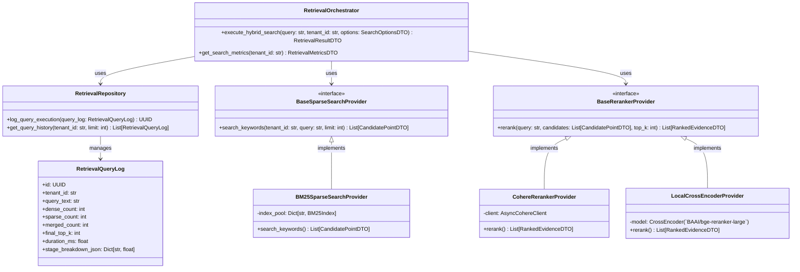
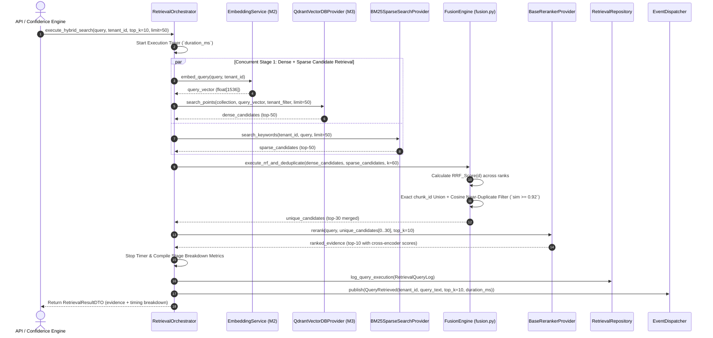

# RAGuard AI — Phase 2 Milestone 4: Hybrid Retrieval Engine
## Document 2: Technical Design

**Document Version**: 1.0.0
**Milestone**: Phase 2 Milestone 4 (`Hybrid Retrieval Engine`)
**Status**: Technical Blueprint (Strict Planning Only — No Code)

---

## 1. Domain Architecture (`DORA Package Structure`)

The hybrid retrieval engine operates entirely within `backend/modules/retrieval/`, isolating domain aggregates, repositories, services, and workers:



---

## 2. Directory Structure

```text
backend/modules/retrieval/
├── __init__.py
├── api/
│   ├── __init__.py
│   ├── dependencies.py          # Tenant resolution & search option dependencies
│   └── routes.py                # REST endpoints (/api/v1/retrieval/*)
├── events/
│   ├── __init__.py
│   └── payloads.py              # QueryRetrieved DTO (schema v1.0.0)
├── models/
│   ├── __init__.py
│   └── retrieval_log.py         # ORM entity recording query execution breakdowns
├── providers/
│   ├── __init__.py
│   ├── sparse/
│   │   ├── base.py              # BaseSparseSearchProvider interface
│   │   └── bm25_provider.py     # In-memory/local BM25 keyword search engine
│   └── reranker/
│       ├── base.py              # BaseRerankerProvider interface
│       ├── cohere_reranker.py   # Cohere Rerank API wrapper
│       └── local_reranker.py    # Local ONNX cross-encoder reranker
├── repositories/
│   ├── __init__.py
│   └── retrieval_repository.py  # Async audit logging & metric aggregation
├── schemas/
│   ├── __init__.py
│   ├── retrieval_dto.py         # SearchOptionsDTO, CandidatePointDTO, RankedEvidenceDTO
│   └── errors.py                # RET_001 to RET_005 error codes
├── services/
│   ├── __init__.py
│   ├── fusion.py                # Reciprocal Rank Fusion (RRF) & Near-Duplicate Filter
│   └── retrieval_service.py     # Multi-stage hybrid search orchestrator
└── workers/
    ├── __init__.py
    └── tasks.py                 # Celery task for background/async batch retrieval
```

---

## 3. Complete Data Flow Diagram (`Multi-Stage Execution`)



---

## 4. Database Design (`PostgreSQL / ORM Schemas`)

### 4.1 `retrieval_queries` Table
Logs execution statistics, stage latencies, and candidate counts for every search:
- `id`: `UUID` (`PRIMARY KEY`)
- `tenant_id`: `VARCHAR(100)` (`NOT NULL`, `INDEXED`)
- `correlation_id`: `VARCHAR(100)` (`NOT NULL`, `INDEXED`)
- `query_text`: `TEXT` (`NOT NULL`)
- `dense_candidate_count`: `INTEGER` (`NOT NULL`)
- `sparse_candidate_count`: `INTEGER` (`NOT NULL`)
- `merged_unique_count`: `INTEGER` (`NOT NULL`)
- `final_top_k`: `INTEGER` (`NOT NULL`)
- `total_duration_ms`: `FLOAT` (`NOT NULL`)
- `stage_breakdown_json`: `JSONB` (`NOT NULL` — e.g., `{"dense_ms": 110.5, "sparse_ms": 45.2, "fusion_ms": 12.1, "rerank_ms": 185.0}`)
- `created_at`: `TIMESTAMP WITH TIME ZONE` (`NOT NULL`)
- **Indexes**: Composite `(tenant_id, created_at)`, `(tenant_id, correlation_id)`.

### 4.2 `retrieval_results` Table (`Optional Audit Cache / Debug Log`)
Stores top-$k$ returned `chunk_id` references for historical replay:
- `id`: `UUID` (`PRIMARY KEY`)
- `query_log_id`: `UUID` (`NOT NULL`, `FOREIGN KEY REFERENCES retrieval_queries(id) ON DELETE CASCADE`)
- `tenant_id`: `VARCHAR(100)` (`NOT NULL`, `INDEXED`)
- `chunk_id`: `UUID` (`NOT NULL`, `INDEXED`)
- `rank_position`: `INTEGER` (`NOT NULL`)
- `fusion_score`: `FLOAT` (`NOT NULL`)
- `rerank_score`: `FLOAT` (`NOT NULL`)
- `created_at`: `TIMESTAMP WITH TIME ZONE` (`NOT NULL`)
- **Indexes**: Composite `(tenant_id, query_log_id, rank_position)`.

---

## 5. API Design (`REST Endpoints`)

All endpoints require JWT RS256 authentication and enforce `X-Tenant-ID` resolution:

| Method | Route | Purpose | Request Body | Response Model |
|---|---|---|---|---|
| `POST` | `/api/v1/retrieval/search` | Execute real-time hybrid search across dense, sparse, and reranked stages | `SearchRequestDTO` (`query`, `top_k=10`, `dense_weight`, `sparse_weight`, `filters`) | `SuccessResponse<RetrievalResultDTO>` |
| `POST` | `/api/v1/retrieval/sandbox` | Execute multi-stage comparative search returning side-by-side Dense vs Sparse vs RRF vs Reranked outputs | `SearchRequestDTO` | `SuccessResponse<SearchSandboxResponseDTO>` |
| `GET` | `/api/v1/retrieval/history` | Paginated query history with stage latency breakdowns and candidate metrics | `None` (`query: page, size, min_duration_ms`) | `SuccessResponse<PaginatedList<RetrievalQueryLogDTO>>` |
| `GET` | `/api/v1/retrieval/metrics` | Retrieve tenant search KPIs ($P_{95}$ latency, average candidate density, top queries) | `None` | `SuccessResponse<RetrievalMetricsDTO>` |

---

## 6. Background Processing & Celery Architecture

### Task Specification (`workers/tasks.py`)
- **Task Name**: `retrieval.execute_async_batch_search`
- **Queue**: `retrieval`
- **Arguments**: `queries: list[str]`, `tenant_id: str`, `top_k: int`, `webhook_url: str`
- **Purpose**: Enables high-volume batch evaluation or asynchronous evidence mining without tying up synchronous HTTP worker threads.
- **Retry Policy**:
  - `RET_003` (`RerankerTimeout` / `ProviderThrottled`): Automatic `self.retry(exc=e, countdown=2**self.request.retries * 3, max_retries=3)`.
  - `RET_004` (`VectorStoreUnavailable`): Propagates error up to trigger `Milestone 5` degraded handling.

---

## 7. Event Architecture & Domain Contracts

### Canonical Payload: `QueryRetrieved` (`schema_version: "1.0.0"`)
```json
{
  "event_id": "uuid-v4",
  "event_type": "QueryRetrieved",
  "schema_version": "1.0.0",
  "tenant_id": "org_abc_123",
  "correlation_id": "req_xyz_789",
  "timestamp": "2026-07-19T08:30:00Z",
  "source_module": "backend.modules.retrieval",
  "data": {
    "query_text": "What is the policy on mutual TLS rotation?",
    "top_k_requested": 10,
    "dense_candidates_found": 50,
    "sparse_candidates_found": 48,
    "unique_merged_candidates": 68,
    "reranker_model": "BAAI/bge-reranker-large",
    "duration_ms": 312.4,
    "stage_latencies": {
      "dense_ms": 95.2,
      "sparse_ms": 32.1,
      "rrf_fusion_ms": 8.4,
      "rerank_ms": 176.7
    }
  }
}
```

---

## 8. Frontend Planning (`/retrieval` UI)

Built inside `frontend/src/pages/retrieval/`:
- **`RetrievalPage.tsx`**: Main overview dashboard tracking $P_{95}$ search latencies and stage breakdown charts.
- **`SearchSandbox.tsx`**: Interactive testing workbench where developers input a query and view 4 synchronized columns: **Dense Results**, **Sparse (BM25) Results**, **RRF Merged List**, and **Final Cross-Encoder Reranked Evidence**.
- **`EvidenceCard.tsx`**: Renders candidate chunks with section path breadcrumbs (`# Chapter > ## Section`), cosine/BM25 scores, final rerank scores, and explicit badges (`[Dense Match] [Sparse Match]`).
- **`QueryHistoryTable.tsx`**: Paginated audit log of past queries, stage latency indicators, and detailed JSON breakdown view.

---

## 9. Security, Performance & Observability Planning

### Security
- **Strict Tenant Payload & Index Filtering**: Every query passed from `RetrievalOrchestrator` into Qdrant (`M3`) or BM25 (`sparse`) enforces mandatory `tenant_id` namespace filters.
- **Input Sanitization**: Query text is stripped of control characters and capped at $2,000$ characters before vectorization (`RET_001`).

### Performance (`asyncio Concurrent Execution`)
- **Parallel Stage Execution**: Dense search (`Qdrant`) and sparse search (`BM25`) are dispatched concurrently using `await asyncio.gather(dense_task, sparse_task)`, saving $\approx 40\text{ms}$ per query.
- **Bounded Reranking Input**: The Cross-Encoder (`rerank`) is strictly bounded to the top $N=30$ unique candidates post-RRF (`never reranking all 100 candidates`), keeping latency $\le 200\text{ms}$.

### Observability (`structlog & Prometheus`)
- Metrics emitted: `raguard_retrieval_queries_total{tenant}`, `raguard_retrieval_latency_seconds{stage, tenant}`, `raguard_retrieval_candidates_merged_avg{tenant}`.
- All logs include `correlation_id`, `query_length`, `top_k`, and `stage_breakdown_json`.

---

## 10. Risk Analysis & Mitigations

| Risk | Severity | Mitigation Strategy |
|---|---|---|
| **Cross-Encoder Compute Latency Bottleneck** | High | Strictly cap reranking input to $top\_n=30$. Provide local ONNX quantized models (`INT8`) or fallback to pure RRF if latency exceeds SLA. |
| **BM25 Memory Footprint** | Medium | Partition BM25 sparse index by `tenant_id` using LRU memory cache (`max_tenants=500 in RAM`), persisting inactive sparse indexes to local storage. |
| **Duplicate Content Dominating Top-k** | Medium | Enforce Cosine Near-Duplicate Filter (`sim >= 0.92`) inside `fusion.py` before candidate reranking (`ADR-M4-002`). |
