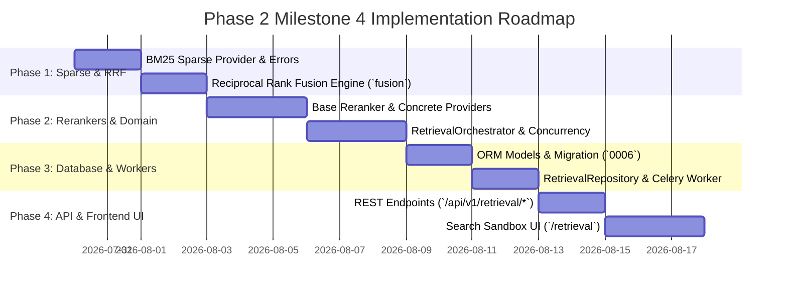

# Veritas RAG — Phase 2 Milestone 4: Hybrid Retrieval Engine
## Document 3: Implementation Roadmap

**Document Version**: 1.0.0
**Milestone**: Phase 2 Milestone 4 (`Hybrid Retrieval Engine`)
**Status**: Planning Roadmap (Strict No-Code Specification)

---

## 1. Roadmap Overview & Execution Phases

The implementation of **Milestone 4 (`Hybrid Retrieval Engine`)** is structured across **4 sequential phases**, moving from sparse BM25 indexers and RRF mathematical engines to cross-encoder rerankers, multi-stage orchestrators, REST APIs, and Frontend Sandbox UIs.

---

## 2. Phase 1: Sparse Indexing (`BM25`) & RRF Fusion Engine

### Objectives
Establish the sparse search interface (`BaseSparseSearchProvider`), local BM25 implementation, and mathematical Reciprocal Rank Fusion (`RRF`) plus Near-Duplicate Deduplication engine.

### Tasks
1. Define abstract class `BaseSparseSearchProvider` (`backend/modules/retrieval/providers/sparse/base.py`) declaring `index_documents()` and `search_keywords()`.
2. Implement domain error hierarchy (`backend/modules/retrieval/schemas/errors.py`):
   - `RET_001`: `InvalidQueryError` (`RECOVERABLE=False`)
   - `RET_002`: `SparseIndexNotFoundError` (`RECOVERABLE=False`)
   - `RET_003`: `RerankerTimeoutError` (`RECOVERABLE=True`)
   - `RET_004`: `VectorStoreUnavailableError` (`RECOVERABLE=True`)
   - `RET_005`: `FusionPipelineError` (`RECOVERABLE=False`)
3. Implement `BM25SparseSearchProvider` (`sparse/bm25_provider.py`) with tenant LRU memory caching and tokenized keyword matching.
4. Implement `FusionEngine` (`services/fusion.py`):
   - `execute_rrf_fusion(dense_list, sparse_list, k=60)`: Calculates exact RRF score across ranks (`ADR-M4-001`).
   - `deduplicate_candidates(merged_list, threshold=0.92)`: Eliminates exact `chunk_id` duplicates and cosine near-duplicates (`ADR-M4-002`).

### Deliverables
- `providers/sparse/base.py`, `bm25_provider.py`, `services/fusion.py`, `schemas/errors.py`.
- **Quality Gate**: Unit tests verifying RRF mathematical ranking invariance across skewed score distributions and exact near-duplicate elimination.

---

## 3. Phase 2: Cross-Encoder Rerankers & Multi-Stage Orchestration

### Objectives
Build the cross-encoder reranker wrappers and the master concurrent retrieval orchestrator (`RetrievalOrchestrator`).

### Tasks
1. Define abstract class `BaseRerankerProvider` (`providers/reranker/base.py`) declaring `rerank(query, candidates, top_k) -> list[RankedEvidenceDTO]`.
2. Implement `CohereRerankerProvider` (`cohere_reranker.py`) wrapping async `cohere.AsyncClient.rerank()`.
3. Implement `LocalCrossEncoderProvider` (`local_reranker.py`) wrapping local ONNX inference for `BAAI/bge-reranker-large`.
4. Implement `RetrievalOrchestrator` (`services/retrieval_service.py`):
   - Orchestrates concurrent `asyncio.gather(embed_and_dense_search, sparse_search)` across `M2/M3` and `BM25`.
   - Passes merged candidates through `FusionEngine` (`RRF + Deduplication`).
   - Invokes `BaseRerankerProvider` on top $N=30$ candidates to produce final `top_k`.
   - Compiles stage latency breakdown timers (`dense_ms`, `sparse_ms`, `rrf_ms`, `rerank_ms`).

### Deliverables
- `providers/reranker/*`, `services/retrieval_service.py`.
- **Quality Gate**: Concurrency benchmarks confirming parallel dense + sparse retrieval executes within $\le 120\text{ms}$ ($P_{95}$).

---

## 4. Phase 3: Database Models, Repositories & Celery Workers

### Objectives
Create database tables for audit logging query execution history (`retrieval_queries`) and background async batch search workers.

### Tasks
1. Define ORM models `RetrievalQueryLog` and `RetrievalResultLog` (`models/retrieval_log.py`) with composite indexes on `(tenant_id, created_at)`.
2. Plan Alembic migration (`0006_hybrid_retrieval_schema.py`) establishing tables and stage breakdown JSONB indices.
3. Implement `RetrievalRepository` (`repositories/retrieval_repository.py`) supporting query execution insertion and paginated history retrieval.
4. Define event payload schema `QueryRetrieved` (`events/payloads.py` with `schema_version: "1.0.0"`).
5. Implement `execute_async_batch_search` Celery task (`workers/tasks.py` on `retrieval` queue).

### Deliverables
- `models/retrieval_log.py`, `repositories/retrieval_repository.py`, `events/payloads.py`, `workers/tasks.py`.
- **Quality Gate**: Integration tests verifying clean async audit logging without adding blocking overhead to synchronous search requests.

---

## 5. Phase 4: REST API Layer & Frontend Search Sandbox UI

### Objectives
Expose secure REST endpoints under `/api/v1/retrieval` and construct the interactive Search Sandbox under `/retrieval`.

### Tasks
1. Implement Pydantic v2 DTOs (`schemas/retrieval_dto.py`: `SearchRequestDTO`, `CandidatePointDTO`, `RankedEvidenceDTO`, `RetrievalResultDTO`, `SearchSandboxResponseDTO`).
2. Implement REST endpoints (`api/routes.py`) mounted inside `backend/api/v1/router.py`:
   - `POST /api/v1/retrieval/search`
   - `POST /api/v1/retrieval/sandbox`
   - `GET /api/v1/retrieval/history`
   - `GET /api/v1/retrieval/metrics`
3. Build React TypeScript components (`frontend/src/pages/retrieval/`):
   - `RetrievalPage.tsx`: Main overview container with latency charts.
   - `SearchSandbox.tsx`: 4-column side-by-side comparison workbench (`Dense vs Sparse vs RRF vs Reranked`).
   - `EvidenceCard.tsx`: Candidate display card with scores, breadcrumbs, and badges.
   - `QueryHistoryTable.tsx`: Paginated query audit table with stage breakdown modals.
4. Add `/retrieval` link to `Sidebar.tsx` navigation right below `/vectors`.

### Deliverables
- `api/routes.py`, `schemas/retrieval_dto.py`, `frontend/src/pages/retrieval/*.tsx`.
- **Exit Criteria**: End-to-end audit passing all verification gates (`Document 4`), confirming zero self-correction or generation attempts, and $100\%$ test coverage across all M4 modules.
