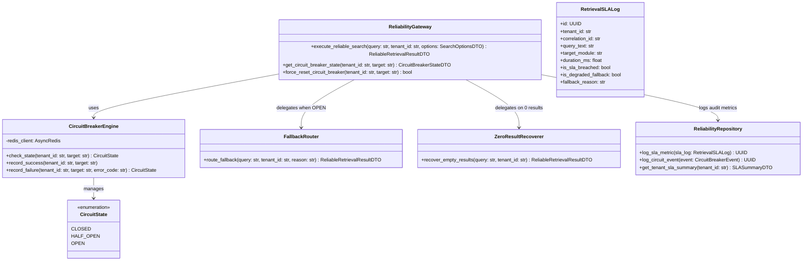
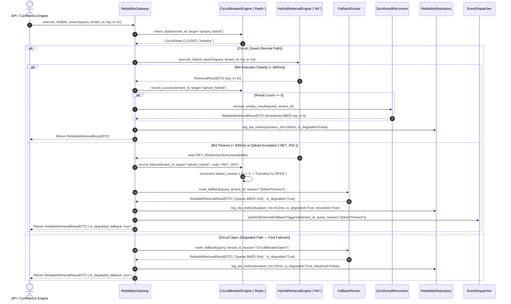
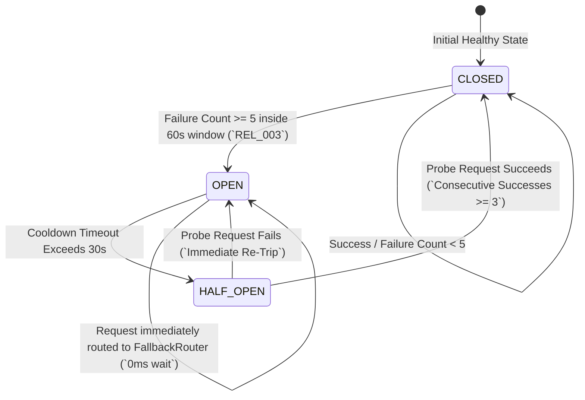

# Veritas RAG — Phase 2 Milestone 5: Retrieval Reliability Framework
## Document 2: Technical Design

**Document Version**: 1.0.0
**Milestone**: Phase 2 Milestone 5 (`Retrieval Reliability Framework`)
**Status**: Technical Blueprint (Strict Planning Only — No Code)

---

## 1. Domain Architecture (`DORA Package Structure`)

The retrieval reliability framework operates entirely within `backend/modules/reliability/`, isolating domain aggregates, repositories, services, and workers:



---

## 2. Directory Structure

```text
backend/modules/reliability/
├── __init__.py
├── api/
│   ├── __init__.py
│   ├── dependencies.py          # Tenant resolution & circuit breaker check dependency
│   └── routes.py                # REST endpoints (/api/v1/reliability/*)
├── circuit_breaker/
│   ├── __init__.py
│   ├── engine.py                # Redis-backed state machine (Closed -> Open -> Half-Open)
│   └── states.py                # CircuitState enum & transition definitions
├── events/
│   ├── __init__.py
│   └── payloads.py              # RetrievalFallbackTriggered, CircuitBreakerTripped DTOs (schema v1.0.0)
├── fallbacks/
│   ├── __init__.py
│   ├── router.py                # Degraded-mode fallback orchestrator
│   └── zero_result.py           # Deterministic keyword broadening recoverer
├── models/
│   ├── __init__.py
│   ├── circuit_event.py         # ORM entity logging circuit state transitions
│   └── sla_log.py               # ORM entity logging latency SLA compliance & fallback flags
├── repositories/
│   ├── __init__.py
│   └── reliability_repository.py# Async queries with tenant namespace filtering
├── schemas/
│   ├── __init__.py
│   ├── reliability_dto.py       # ReliableRetrievalResultDTO, CircuitBreakerStateDTO, SLASummaryDTO
│   └── errors.py                # REL_001 to REL_005 error codes
├── services/
│   ├── __init__.py
│   └── reliability_gateway.py   # Primary entry point wrapping M4 Hybrid Retrieval Engine
└── workers/
    ├── __init__.py
    └── tasks.py                 # Celery task for SLA aggregation & circuit breaker decay sweeps
```

---

## 3. Complete Data Flow Diagram (`Circuit Breaker & Fallback Routing`)



---

## 4. State Machine Specification (`RetrievalCircuitBreaker`)



**State Transition Rules**:
- **`CLOSED`**: All queries pass to `M4 HybridRetrievalEngine`. Every timeout (`> 400ms`) or connection error increments a sliding 60-second Redis failure counter.
- **`OPEN`**: Tripped when failure counter reaches $5$. All queries bypass `M4` entirely (`0ms overhead`) and execute directly via `FallbackRouter (`BM25 Sparse-Only`)`. A Redis TTL timer (`30 seconds cooldown`) is initialized.
- **`HALF_OPEN`**: Entered automatically when the 30-second cooldown expires. The next incoming query is allowed through as a health probe against `M4`. If the probe succeeds for $3$ consecutive requests, the state resets to `CLOSED`. If any probe fails, state reverts immediately to `OPEN` for another 30 seconds.

---

## 5. Database Design (`PostgreSQL / ORM Schemas`)

### 5.1 `retrieval_sla_logs` Table
Records latency compliance, fallback triggers, and reliability flags for every search:
- `id`: `UUID` (`PRIMARY KEY`)
- `tenant_id`: `VARCHAR(100)` (`NOT NULL`, `INDEXED`)
- `correlation_id`: `VARCHAR(100)` (`NOT NULL`, `INDEXED`)
- `query_text`: `TEXT` (`NOT NULL`)
- `target_module`: `VARCHAR(50)` (`NOT NULL` — e.g., `qdrant_hybrid`, `bm25_fallback`)
- `duration_ms`: `FLOAT` (`NOT NULL`)
- `is_sla_breached`: `BOOLEAN` (`NOT NULL DEFAULT FALSE` — `True if duration_ms > 400.0`)
- `is_degraded_fallback`: `BOOLEAN` (`NOT NULL DEFAULT FALSE`)
- `fallback_reason`: `VARCHAR(100)` (`NULLABLE` — e.g., `CircuitBreakerOpen`, `QdrantTimeout`, `ZeroResult`)
- `created_at`: `TIMESTAMP WITH TIME ZONE` (`NOT NULL`)
- **Indexes**: Composite `(tenant_id, is_degraded_fallback, created_at)`, `(tenant_id, is_sla_breached)`.

### 5.2 `circuit_breaker_events` Table
Audit log tracking state machine transitions across cluster nodes:
- `id`: `UUID` (`PRIMARY KEY`)
- `tenant_id`: `VARCHAR(100)` (`NOT NULL`, `INDEXED`)
- `target_module`: `VARCHAR(50)` (`NOT NULL`)
- `previous_state`: `VARCHAR(20)` (`NOT NULL` — `CLOSED | HALF_OPEN | OPEN`)
- `new_state`: `VARCHAR(20)` (`NOT NULL`)
- `trigger_reason`: `VARCHAR(200)` (`NOT NULL` — e.g., `5 failures reached across 60s window`)
- `created_at`: `TIMESTAMP WITH TIME ZONE` (`NOT NULL`)
- **Indexes**: Composite `(tenant_id, target_module, created_at)`.

---

## 6. API Design (`REST Endpoints`)

All endpoints require JWT RS256 authentication and enforce `X-Tenant-ID` resolution:

| Method | Route | Purpose | Request Body | Response Model |
|---|---|---|---|---|
| `POST` | `/api/v1/reliability/search` | Primary reliable search gateway wrapping M4 with circuit breaking & fallbacks | `SearchRequestDTO` (`query`, `top_k=10`, `sla_budget_ms=400`) | `SuccessResponse<ReliableRetrievalResultDTO>` |
| `GET` | `/api/v1/reliability/circuit-breakers` | Inspect real-time circuit breaker states (`Closed/Open`) across all target modules | `None` | `SuccessResponse<List<CircuitBreakerStateDTO>>` |
| `POST` | `/api/v1/reliability/circuit-breakers/{target}/reset` | Manually force reset a tripped circuit breaker back to `CLOSED` state (`Admin Only`) | `None` | `SuccessResponse<CircuitBreakerStateDTO>` |
| `GET` | `/api/v1/reliability/sla-summary` | Retrieve tenant SLA compliance percentages, total fallbacks triggered, and breach counts | `None` (`query: time_window_hours`) | `SuccessResponse<SLASummaryDTO>` |

---

## 7. Background Processing & Celery Architecture

### Task Specification (`workers/tasks.py`)
- **Task Name**: `reliability.aggregate_sla_metrics_task`
- **Queue**: `retrieval`
- **Schedule**: Periodic Celery Beat task executed every 15 minutes.
- **Purpose**: Aggregates raw `retrieval_sla_logs` entries into hourly tenant SLA summaries and sweeps stale Redis circuit breaker counters.
- **Idempotency**: Uses time-window bounds (`window_start` to `window_end`) to ensure repeated aggregations produce identical statistical summaries.

---

## 8. Event Architecture & Domain Contracts

### Canonical Payload: `RetrievalFallbackTriggered` (`schema_version: "1.0.0"`)
```json
{
  "event_id": "uuid-v4",
  "event_type": "RetrievalFallbackTriggered",
  "schema_version": "1.0.0",
  "tenant_id": "org_abc_123",
  "correlation_id": "req_xyz_789",
  "timestamp": "2026-07-19T08:45:00Z",
  "source_module": "backend.modules.reliability",
  "data": {
    "query_text": "What are the compliance rules for data retention?",
    "target_module": "qdrant_hybrid",
    "circuit_state_at_trigger": "OPEN",
    "fallback_reason": "QdrantConnectionTimeout",
    "fallback_strategy_used": "BM25SparseSearchProvider",
    "fallback_duration_ms": 34.2,
    "candidates_surfaced_count": 8
  }
}
```

---

## 9. Frontend Planning (`/reliability` UI)

Built inside `frontend/src/pages/reliability/`:
- **`ReliabilityPage.tsx`**: Main overview dashboard featuring top-level **System Availability Gauge (`99.98%`)** and active circuit breaker status cards.
- **`CircuitBreakerGrid.tsx`**: Visual grid rendering status cards (`Qdrant Hybrid Search: CLOSED [Healthy]`, `Cohere Rerank: OPEN [Tripped - Cooldown 18s]`). Includes an administrative `Force Reset` action button (`Role.ADMIN required`).
- **`SLALatencyHistogram.tsx`**: Bar chart plotting retrieval latencies over time, clearly highlighting requests that breached the $400\text{ms}$ SLA threshold in red versus healthy responses in green.
- **`FallbackActivityTable.tsx`**: Real-time log of recently triggered degraded fallbacks and zero-result recovery broadenings with detail inspection drawers.

---

## 10. Security, Performance & Observability Planning

### Security
- **Admin Circuit Governance**: Manual resetting or tripping of circuit breakers (`POST /api/v1/reliability/circuit-breakers/{target}/reset`) strictly enforces `get_current_user` with verified `Role.ADMIN`.
- **Tenant Isolation**: Circuit breaker state keys inside Redis are strictly namespaced (`tenant_id:circuit_breaker:{target}`), preventing one tenant's noisy failures from tripping the circuit breaker for neighboring tenants.

### Performance (`Zero-Overhead Closed State`)
- **Fast Redis Atomic Check**: Checking circuit breaker status when `CLOSED` requires a single async Redis `GET` operation (`< 1.5ms overhead`).
- **Immediate Fallback Routing**: When `OPEN`, the gateway completely skips calling `M4/Qdrant` (`0ms network blocking`), directly invoking in-memory `BM25` search (`< 35ms total response`).

### Observability (`structlog & Prometheus`)
- Metrics emitted: `raguard_circuit_breaker_state{target, tenant}`, `raguard_retrieval_sla_breaches_total{tenant}`, `raguard_fallback_activations_total{reason, tenant}`.
- All logs include `is_degraded_fallback`, `fallback_reason`, `circuit_state`, and `duration_ms`.

---

## 11. Risk Analysis & Mitigations

| Risk | Severity | Mitigation Strategy |
|---|---|---|
| **Redis Broker Latency / Outage** | High | If Redis connection drops during `check_state()`, `CircuitBreakerEngine` fails open gracefully, defaulting to local in-memory `CLOSED` state (`never blocking healthy searches`). |
| **Thundering Herd on Half-Open Probe** | Medium | When state transitions to `HALF_OPEN`, `CircuitBreakerEngine` allows only **one probe request per second** through to `Qdrant`; all concurrent queries continue using `FallbackRouter` until the circuit confirms full recovery. |
| **Zero-Result Broadening Returning Noise** | Medium | `ZeroResultRecoverer` attaches explicit `confidence_floor_warning: true` metadata to broadened results, notifying downstream Confidence Engines (`Phase 3`) to grade the evidence rigorously. |
