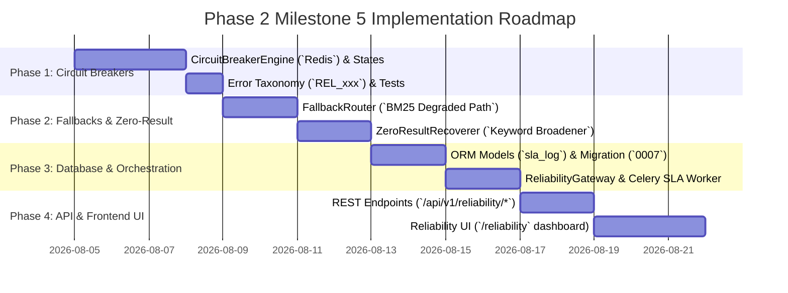

# RAGuard AI — Phase 2 Milestone 5: Retrieval Reliability Framework
## Document 3: Implementation Roadmap

**Document Version**: 1.0.0
**Milestone**: Phase 2 Milestone 5 (`Retrieval Reliability Framework`)
**Status**: Planning Roadmap (Strict No-Code Specification)

---

## 1. Roadmap Overview & Execution Phases

The implementation of **Milestone 5 (`Retrieval Reliability Framework`)** is structured across **4 sequential phases**, moving from Redis-backed circuit breaker engines and fallback routers to zero-result recovery algorithms, SLA database tables, Celery background workers, REST APIs, and Frontend Reliability Dashboards.

---

## 2. Phase 1: Distributed Circuit Breaker Engine & Taxonomy

### Objectives
Establish the Redis-backed state machine (`CircuitBreakerEngine`), `CircuitState` transitions (`CLOSED -> OPEN -> HALF_OPEN`), and strict reliability error taxonomy (`REL_xxx`).

### Tasks
1. Define enumeration `CircuitState` (`circuit_breaker/states.py`) with values `CLOSED`, `OPEN`, and `HALF_OPEN`.
2. Implement domain error hierarchy (`backend/modules/reliability/schemas/errors.py`):
   - `REL_001`: `CircuitBreakerOpenError` (`RECOVERABLE=True` — triggers fallback)
   - `REL_002`: `RetrievalSLABreachedError` (`RECOVERABLE=True`)
   - `REL_003`: `FailureThresholdExceededError` (`RECOVERABLE=True` — trips circuit)
   - `REL_004`: `FallbackProviderUnavailableError` (`RECOVERABLE=False` — `FATAL`)
   - `REL_005`: `ZeroResultRecoveryFailedError` (`RECOVERABLE=False`)
3. Implement `CircuitBreakerEngine` (`circuit_breaker/engine.py`):
   - Uses `AsyncRedis` sliding window counters (`tenant_id:circuit_breaker:{target}:failures`).
   - `check_state(tenant_id, target)`: Checks current state and cooldown TTL.
   - `record_failure(tenant_id, target, code)`: Increments failure counter. If counter $\ge 5$ within 60 seconds, transitions state to `OPEN` and initializes 30-second cooldown TTL.
   - `record_success(tenant_id, target)`: Resets failure counter when `CLOSED` or increments consecutive probe successes ($3$ required) when `HALF_OPEN`.

### Deliverables
- `circuit_breaker/states.py`, `circuit_breaker/engine.py`, `schemas/errors.py`.
- **Quality Gate**: Unit/mock tests verifying exact state machine transitions across simulated multi-worker concurrency.

---

## 3. Phase 2: Degraded Fallback Router & Zero-Result Recoverer

### Objectives
Build the degraded-mode fallback routing engine (`FallbackRouter`) and deterministic keyword broadening recoverer (`ZeroResultRecoverer`).

### Tasks
1. Implement `FallbackRouter` (`fallbacks/router.py`):
   - Consumes `BaseSparseSearchProvider` (`BM25` from `M4`).
   - `route_fallback(query, tenant_id, reason)`: Directly queries `BM25` sparse keyword index with `limit=10`, wraps candidates inside `ReliableRetrievalResultDTO` with explicit flags (`is_degraded_fallback: true`, `fallback_reason: reason`), and emits `RetrievalFallbackTriggered` domain event.
2. Implement `ZeroResultRecoverer` (`fallbacks/zero_result.py`):
   - `recover_empty_results(query, tenant_id)`: Strips English stop words (`the, is, at, which, on`) and terminal punctuation, constructs broadened wildcard keywords, re-queries `BM25` sparse index, and returns candidates with `is_zero_result_broadened: true` metadata (`ADR-M5-002`).

### Deliverables
- `fallbacks/router.py`, `fallbacks/zero_result.py`.
- **Quality Gate**: Unit tests confirming zero-result broadening executes in $< 15\text{ms}$ and surfaces accurate keyword matches from empty initial queries without LLM invocations.

---

## 4. Phase 3: Database Models, Repositories & Gateway Orchestrator

### Objectives
Create database tables for SLA compliance audit logging (`retrieval_sla_logs`) and build the master `ReliabilityGateway` wrapper around `M4`.

### Tasks
1. Define ORM models `RetrievalSLALog` and `CircuitBreakerEventLog` (`models/sla_log.py`, `models/circuit_event.py`) with `tenant_id` namespace indexing.
2. Plan Alembic migration (`0007_retrieval_reliability_schema.py`) establishing tables and composite SLA indexes.
3. Implement `ReliabilityRepository` (`repositories/reliability_repository.py`) supporting SLA metric logging and hourly KPI summary aggregation.
4. Implement `ReliabilityGateway` (`services/reliability_gateway.py`):
   - `execute_reliable_search(query, tenant_id, options)`: Orchestrates `CircuitBreakerEngine.check_state()`, calls `M4 HybridRetrievalEngine`, measures `duration_ms` against $400\text{ms}$ SLA budget, delegates to `FallbackRouter` upon `OPEN/Timeouts`, delegates to `ZeroResultRecoverer` upon empty sets, and asynchronously writes `RetrievalSLALog` audit records.
5. Define event payload schemas `RetrievalFallbackTriggered` and `CircuitBreakerTripped` (`events/payloads.py` with `schema_version: "1.0.0"`).
6. Implement periodic Celery task `aggregate_sla_metrics_task` (`workers/tasks.py` on `retrieval` queue).

### Deliverables
- `models/*.py`, `repositories/reliability_repository.py`, `services/reliability_gateway.py`, `events/payloads.py`, `workers/tasks.py`.
- **Quality Gate**: End-to-end integration tests verifying graceful failover from `M4` to `FallbackRouter` under simulated Qdrant container latency injection (`delay = 2000ms`).

---

## 5. Phase 4: REST API Layer & Frontend Reliability Dashboard UI

### Objectives
Expose secure REST endpoints under `/api/v1/reliability` and construct the interactive Reliability Dashboard under `/reliability`.

### Tasks
1. Implement Pydantic v2 DTOs (`schemas/reliability_dto.py`: `ReliableRetrievalResultDTO`, `CircuitBreakerStateDTO`, `SLASummaryDTO`).
2. Implement REST endpoints (`api/routes.py`) mounted inside `backend/api/v1/router.py`:
   - `POST /api/v1/reliability/search`
   - `GET /api/v1/reliability/circuit-breakers`
   - `POST /api/v1/reliability/circuit-breakers/{target}/reset`
   - `GET /api/v1/reliability/sla-summary`
3. Build React TypeScript components (`frontend/src/pages/reliability/`):
   - `ReliabilityPage.tsx`: Main overview container with uptime KPIs (`99.99%`).
   - `CircuitBreakerGrid.tsx`: Visual status grid (`CLOSED / OPEN`) with admin `Force Reset` trigger modal.
   - `SLALatencyHistogram.tsx`: Bar chart highlighting SLA-breached requests ($> 400\text{ms}$) vs healthy requests.
   - `FallbackActivityTable.tsx`: Real-time log table tracking recent degraded fallback activations and broadening triggers.
4. Add `/reliability` link to `Sidebar.tsx` navigation right below `/retrieval`.

### Deliverables
- `api/routes.py`, `schemas/reliability_dto.py`, `frontend/src/pages/reliability/*.tsx`.
- **Exit Criteria**: End-to-end audit passing all verification gates (`Document 4`), confirming zero LLM reasoning attempts, zero self-correction loops, and $100\%$ test coverage across all M5 modules.
