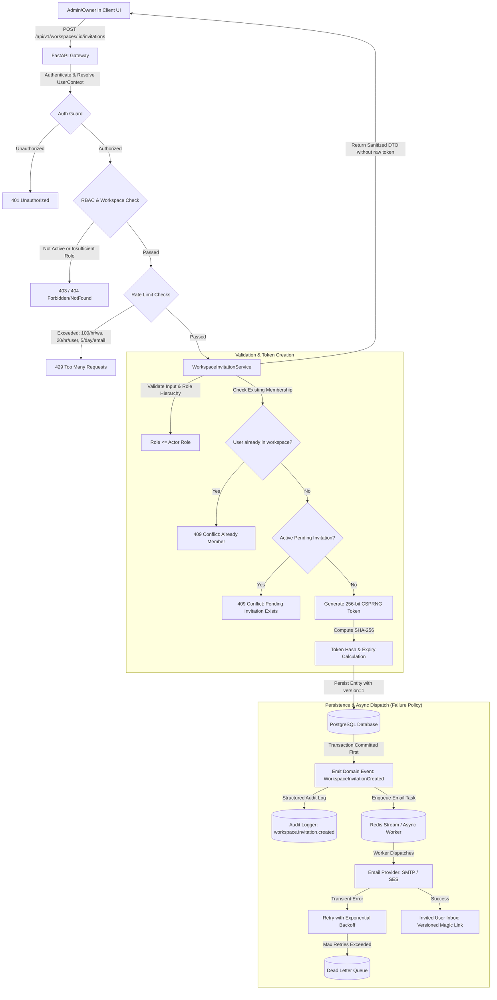
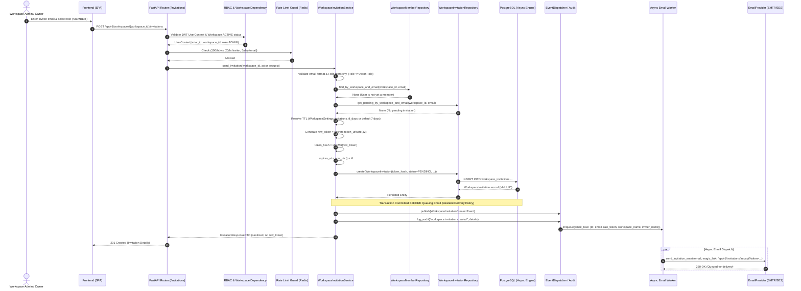
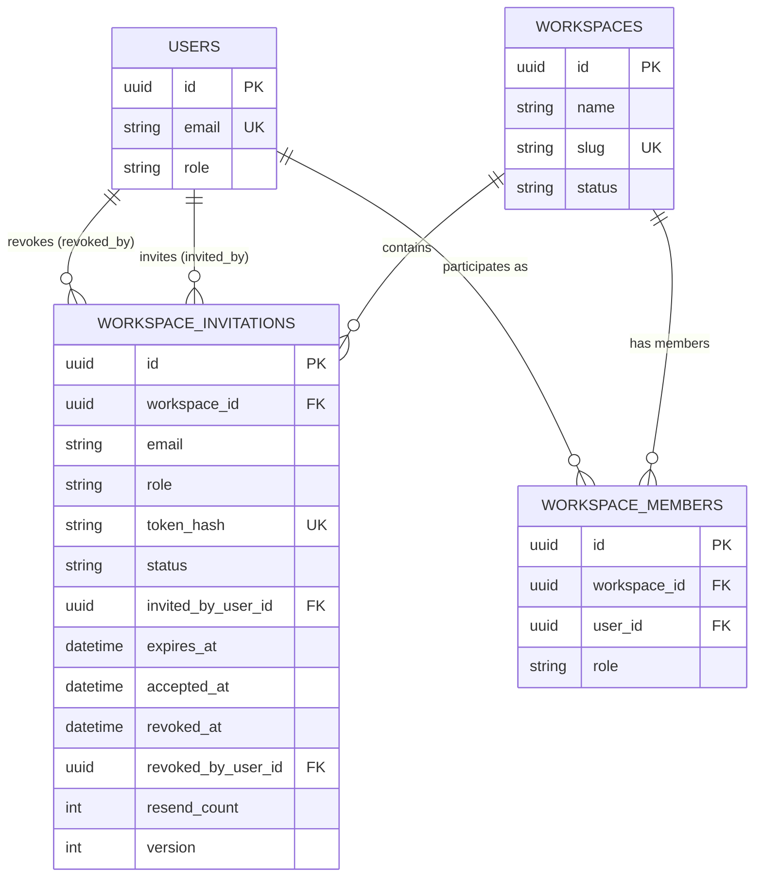
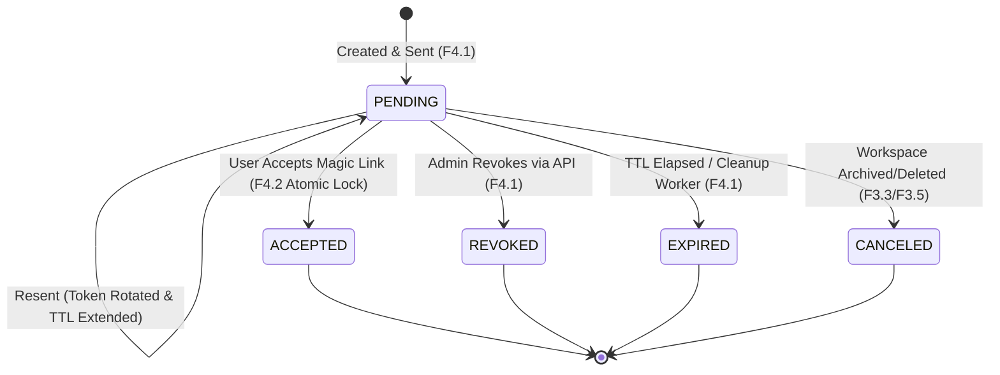
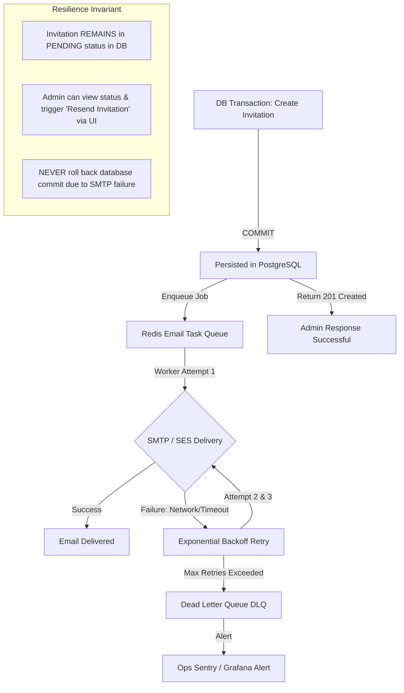

# Architecture & Design Blueprint: F4.1 — Workspace Invitation (Send, Token, Expiry)

**Epic:** Epic 4 — User & Role Management  
**Feature:** F4.1 — Workspace Invitation (Send, Token, Expiry)  
**Status:** 📐 Architecture & Design Phase (Production-Hardened Blueprint)  
**Author:** Antigravity Principal Systems & Security Architect  
**Target Version:** RAGuard V2.0  

---

## 1. Business Objectives

The Workspace Invitation system serves as the primary gateway for tenant collaboration, role delegation, and controlled onboarding within RAGuard AI. The core business objectives are:

1. **Controlled Tenant Onboarding:** Enable workspace administrators and owners to invite colleagues, stakeholders, and external collaborators directly into their workspace with pre-assigned permissions.
2. **Strict Principle of Least Privilege:** Enforce role assignment at invitation time (`ADMIN`, `MEMBER`, `VIEWER`), ensuring invitees only receive necessary permissions upon onboarding and preventing privilege escalation.
3. **Enterprise Security & Zero-Trust Token Design:** Prevent invitation hijacking, brute-force token harvesting, replay attacks, email spoofing, and account enumeration through cryptographic token hashing (`SHA-256`), ephemeral high-entropy tokens, and strict email ownership binding.
4. **Resilient Async Email Pipeline:** Decouple API response latency from external email provider network roundtrips via asynchronous dispatching, maintaining p99 API response times $< 50$ms while ensuring reliable delivery and DLQ observability.
5. **Deterministic Multi-Tenant Governance:** Guarantee that invitations are strictly bound to a single workspace, immutable in target role, rate-limited at three granular tiers, and audited with an 8-stage comprehensive audit trail.

---

## 2. High-Level Workflow



---

## 3. End-to-End Sequence Diagram



---

## 4. Database Design

### 4.1 Table Schema: `workspace_invitations`

```sql
CREATE TYPE invitation_status AS ENUM (
    'PENDING',
    'ACCEPTED',
    'REVOKED',
    'EXPIRED',
    'CANCELED'
);

CREATE TABLE workspace_invitations (
    id UUID PRIMARY KEY DEFAULT gen_random_uuid(),
    workspace_id UUID NOT NULL REFERENCES workspaces(id) ON DELETE CASCADE,
    email VARCHAR(255) NOT NULL,
    role VARCHAR(50) NOT NULL,
    token_hash VARCHAR(64) NOT NULL,
    status invitation_status NOT NULL DEFAULT 'PENDING',
    
    invited_by_user_id UUID REFERENCES users(id) ON DELETE SET NULL,
    
    expires_at TIMESTAMPTZ NOT NULL,
    accepted_at TIMESTAMPTZ NULL,
    revoked_at TIMESTAMPTZ NULL,
    revoked_by_user_id UUID REFERENCES users(id) ON DELETE SET NULL,
    
    resend_count INTEGER NOT NULL DEFAULT 0,
    last_resent_at TIMESTAMPTZ NULL,
    
    -- Optimistic Concurrency Control
    version INTEGER NOT NULL DEFAULT 1,
    
    -- Standard Audit Timestamps & Soft Deletion
    created_at TIMESTAMPTZ NOT NULL DEFAULT (NOW() AT TIME ZONE 'UTC'),
    updated_at TIMESTAMPTZ NOT NULL DEFAULT (NOW() AT TIME ZONE 'UTC'),
    is_deleted BOOLEAN NOT NULL DEFAULT FALSE
);
```

### 4.2 Indexes & Unique Constraints

```sql
-- 1. Cryptographic token lookup index (O(1) lookups during acceptance / validation)
CREATE UNIQUE INDEX uq_workspace_invitations_token_hash 
ON workspace_invitations (token_hash) 
WHERE is_deleted = FALSE;

-- 2. Partial unique index: Strict constraint preventing multiple PENDING invitations for same email in a workspace
CREATE UNIQUE INDEX uq_workspace_invitations_active_email 
ON workspace_invitations (workspace_id, LOWER(email)) 
WHERE status = 'PENDING' AND is_deleted = FALSE;

-- 3. Workspace tenant listing index (ordered by creation date for paginated lists)
CREATE INDEX idx_workspace_invitations_workspace_status_created 
ON workspace_invitations (workspace_id, status, created_at DESC) 
WHERE is_deleted = FALSE;

-- 4. TTL / Expiration cleanup index (Optimized for scheduled Expiration Worker)
CREATE INDEX idx_workspace_invitations_pending_expiry 
ON workspace_invitations (status, expires_at) 
WHERE status = 'PENDING' AND is_deleted = FALSE;
```

---

## 5. Required New Entities

### 5.1 `InvitationStatus` (Enum)
```python
import enum

class InvitationStatus(str, enum.Enum):
    PENDING = "PENDING"
    ACCEPTED = "ACCEPTED"
    REVOKED = "REVOKED"
    EXPIRED = "EXPIRED"
    CANCELED = "CANCELED"
```

### 5.2 `WorkspaceInvitation` (SQLAlchemy Entity)
```python
import datetime
import uuid
from sqlalchemy import Boolean, DateTime, ForeignKey, Integer, String
from sqlalchemy.dialects.postgresql import UUID
from sqlalchemy.orm import Mapped, mapped_column, relationship

from backend.models.base import BaseModel

class WorkspaceInvitation(BaseModel):
    """Represents a time-bounded invitation to join a workspace."""
    
    __tablename__ = "workspace_invitations"

    workspace_id: Mapped[uuid.UUID] = mapped_column(
        UUID(as_uuid=True), 
        ForeignKey("workspaces.id", ondelete="CASCADE"), 
        nullable=False, 
        index=True
    )
    email: Mapped[str] = mapped_column(String(255), nullable=False)
    role: Mapped[str] = mapped_column(String(50), nullable=False)
    token_hash: Mapped[str] = mapped_column(String(64), unique=True, index=True, nullable=False)
    status: Mapped[str] = mapped_column(String(50), default=InvitationStatus.PENDING.value, nullable=False)
    
    invited_by_user_id: Mapped[uuid.UUID | None] = mapped_column(
        UUID(as_uuid=True), 
        ForeignKey("users.id", ondelete="SET NULL"), 
        nullable=True
    )
    
    expires_at: Mapped[datetime.datetime] = mapped_column(DateTime(timezone=True), nullable=False)
    accepted_at: Mapped[datetime.datetime | None] = mapped_column(DateTime(timezone=True), nullable=True)
    revoked_at: Mapped[datetime.datetime | None] = mapped_column(DateTime(timezone=True), nullable=True)
    revoked_by_user_id: Mapped[uuid.UUID | None] = mapped_column(
        UUID(as_uuid=True), 
        ForeignKey("users.id", ondelete="SET NULL"), 
        nullable=True
    )
    
    resend_count: Mapped[int] = mapped_column(Integer, default=0, nullable=False)
    last_resent_at: Mapped[datetime.datetime | None] = mapped_column(DateTime(timezone=True), nullable=True)
    
    version: Mapped[int] = mapped_column(Integer, default=1, nullable=False)
    
    # ORM Relationships
    workspace = relationship("Workspace", backref="invitations", lazy="selectin")
    invited_by = relationship("User", foreign_keys=[invited_by_user_id], lazy="selectin")
    revoked_by = relationship("User", foreign_keys=[revoked_by_user_id], lazy="selectin")
```

---

## 6. Entity Relationships



---

## 7. Required Alembic Migration

**Migration ID:** `20260802_d4e5f6a7b8c9_f4_1_workspace_invitations.py`  
**Down Revision:** `20260802_c3d4e5f6a7b8` (Feature Flags migration)

```python
"""Add workspace_invitations entity for F4.1

Revision ID: 20260802_d4e5f6a7b8c9
Revises: 20260802_c3d4e5f6a7b8
Create Date: 2026-08-02
"""
from alembic import op
import sqlalchemy as sa
from sqlalchemy.dialects import postgresql

revision = '20260802_d4e5f6a7b8c9'
down_revision = '20260802_c3d4e5f6a7b8'
branch_labels = None
depends_on = None

def upgrade() -> None:
    op.create_table(
        'workspace_invitations',
        sa.Column('id', postgresql.UUID(as_uuid=True), primary_key=True, server_default=sa.text('gen_random_uuid()')),
        sa.Column('workspace_id', postgresql.UUID(as_uuid=True), sa.ForeignKey('workspaces.id', ondelete='CASCADE'), nullable=False),
        sa.Column('email', sa.String(length=255), nullable=False),
        sa.Column('role', sa.String(length=50), nullable=False),
        sa.Column('token_hash', sa.String(length=64), nullable=False),
        sa.Column('status', sa.String(length=50), nullable=False, server_default='PENDING'),
        sa.Column('invited_by_user_id', postgresql.UUID(as_uuid=True), sa.ForeignKey('users.id', ondelete='SET NULL'), nullable=True),
        sa.Column('expires_at', sa.DateTime(timezone=True), nullable=False),
        sa.Column('accepted_at', sa.DateTime(timezone=True), nullable=True),
        sa.Column('revoked_at', sa.DateTime(timezone=True), nullable=True),
        sa.Column('revoked_by_user_id', postgresql.UUID(as_uuid=True), sa.ForeignKey('users.id', ondelete='SET NULL'), nullable=True),
        sa.Column('resend_count', sa.Integer(), nullable=False, server_default='0'),
        sa.Column('last_resent_at', sa.DateTime(timezone=True), nullable=True),
        sa.Column('version', sa.Integer(), nullable=False, server_default='1'),
        sa.Column('created_at', sa.DateTime(timezone=True), server_default=sa.text('(now() AT TIME ZONE \'UTC\')'), nullable=False),
        sa.Column('updated_at', sa.DateTime(timezone=True), server_default=sa.text('(now() AT TIME ZONE \'UTC\')'), nullable=False),
        sa.Column('is_deleted', sa.Boolean(), server_default='false', nullable=False),
    )

    op.create_index('uq_workspace_invitations_token_hash', 'workspace_invitations', ['token_hash'], unique=True, postgresql_where=sa.text('is_deleted = false'))
    op.create_index('uq_workspace_invitations_active_email', 'workspace_invitations', ['workspace_id', sa.text('LOWER(email)')], unique=True, postgresql_where=sa.text("status = 'PENDING' AND is_deleted = false"))
    op.create_index('idx_workspace_invitations_workspace_status_created', 'workspace_invitations', ['workspace_id', 'status', 'created_at'], postgresql_where=sa.text('is_deleted = false'))
    op.create_index('idx_workspace_invitations_pending_expiry', 'workspace_invitations', ['status', 'expires_at'], postgresql_where=sa.text("status = 'PENDING' AND is_deleted = false"))

def downgrade() -> None:
    op.drop_index('idx_workspace_invitations_pending_expiry', table_name='workspace_invitations')
    op.drop_index('idx_workspace_invitations_workspace_status_created', table_name='workspace_invitations')
    op.drop_index('uq_workspace_invitations_active_email', table_name='workspace_invitations')
    op.drop_index('uq_workspace_invitations_token_hash', table_name='workspace_invitations')
    op.drop_table('workspace_invitations')
```

---

## 8. Repository Design

### `WorkspaceInvitationRepository` Interface
Located in `backend/repositories/workspace_invitation.py`:

```python
class WorkspaceInvitationRepository:
    def __init__(self, session: AsyncSession):
        self.session = session

    async def create(self, invitation: WorkspaceInvitation) -> WorkspaceInvitation:
        """Persists a new invitation entity."""

    async def get_by_id(self, invitation_id: uuid.UUID, workspace_id: uuid.UUID) -> WorkspaceInvitation | None:
        """Fetch invitation ensuring workspace tenant boundary."""

    async def get_by_token_hash(self, token_hash: str) -> WorkspaceInvitation | None:
        """Fetch invitation by cryptographic token hash for acceptance validation."""

    async def get_by_token_hash_for_update(self, token_hash: str) -> WorkspaceInvitation | None:
        """Fetch invitation by token hash with row-level lock (SELECT ... FOR UPDATE) for atomic acceptance."""

    async def get_pending_by_workspace_and_email(self, workspace_id: uuid.UUID, email: str) -> WorkspaceInvitation | None:
        """Check for existing pending invitation for email in workspace."""

    async def list_by_workspace(
        self, 
        workspace_id: uuid.UUID, 
        status: str | None = None, 
        skip: int = 0, 
        limit: int = 50
    ) -> tuple[list[WorkspaceInvitation], int]:
        """Paginated list of invitations for a workspace with total count."""

    async def update_with_optimistic_lock(self, invitation: WorkspaceInvitation) -> WorkspaceInvitation:
        """Update invitation enforcing version matching (optimistic concurrency)."""

    async def batch_expire_stale(self, before_timestamp: datetime.datetime) -> list[WorkspaceInvitation]:
        """Bulk transition PENDING invitations past expiration to EXPIRED status and return affected entities."""
```

---

## 9. Service Layer Design

### `WorkspaceInvitationService`
Located in `backend/services/workspace/invitation_service.py`:

```python
class WorkspaceInvitationService:
    def __init__(
        self,
        invitation_repo: WorkspaceInvitationRepository,
        member_repo: WorkspaceMemberRepository,
        workspace_repo: WorkspaceRepository,
        settings_service: WorkspaceSettingsService,
        email_provider: EmailProvider,
        event_dispatcher: EventDispatcher,
        audit_logger: AuditLogger
    ): ...

    async def send_invitation(
        self,
        workspace_id: uuid.UUID,
        actor: UserContext,
        request: SendInvitationRequest
    ) -> WorkspaceInvitationData:
        """
        1. Validate workspace ACTIVE state.
        2. Validate actor permissions (OWNER or ADMIN).
        3. Validate role hierarchy (actor cannot grant role > actor.role).
        4. Normalize email to lowercase.
        5. Check if user is already an active member of workspace -> 409 Conflict.
        6. Check for active PENDING invitation -> 409 Conflict (prompt to resend).
        7. Compute expiration date dynamically using WorkspaceSettings.invitations.ttl_days (clamped [1, 30], default 7).
        8. Generate 256-bit CSPRNG token & compute SHA-256 hash.
        9. Persist WorkspaceInvitation record (version=1).
        10. DB Commit completes.
        11. Emit WorkspaceInvitationCreatedEvent.
        12. Record structured audit log: workspace.invitation.created.
        13. Enqueue async email delivery task with versioned acceptance link.
        14. Return sanitized response DTO (no raw token).
        """

    async def resend_invitation(
        self,
        workspace_id: uuid.UUID,
        invitation_id: uuid.UUID,
        actor: UserContext
    ) -> WorkspaceInvitationData:
        """
        1. Retrieve invitation within workspace boundary.
        2. Verify status == PENDING.
        3. Verify cooldown period (min 60 seconds since last_resent_at or created_at).
        4. Verify resend cap (max 5 resends).
        5. Generate new CSPRNG token & update token_hash, expires_at, resend_count, version.
        6. Persist with optimistic concurrency check.
        7. DB Commit completes.
        8. Emit WorkspaceInvitationResentEvent & enqueue email.
        9. Record audit log: workspace.invitation.resent.
        """

    async def revoke_invitation(
        self,
        workspace_id: uuid.UUID,
        invitation_id: uuid.UUID,
        actor: UserContext
    ) -> None:
        """
        1. Retrieve invitation within workspace boundary.
        2. Verify status == PENDING.
        3. Set status = REVOKED, revoked_at = now_utc(), revoked_by_user_id = actor.user_id.
        4. Persist with optimistic lock.
        5. Emit WorkspaceInvitationRevokedEvent.
        6. Record audit log: workspace.invitation.revoked.
        """

    async def run_expiration_cleanup(self) -> int:
        """
        Executed hourly by background worker:
        1. Find all PENDING invitations where expires_at < now_utc().
        2. Batch update status = EXPIRED.
        3. For each expired invitation:
           - Publish WORKSPACE_INVITATION_EXPIRED event.
           - Write audit log: workspace.invitation.expired.
        4. Record worker completion audit log: workspace.invitation.cleanup_worker.
        5. Return count of expired records.
        """
```

---

## 10. API Design

### 10.1 Endpoint Catalog

| Endpoint | HTTP Verb | Minimum Role | Rate Limit | Description |
|---|---|---|---|---|
| `/api/v1/workspaces/{workspace_id}/invitations` | `POST` | `ADMIN` | 100/hr/ws, 20/hr/user | Create & send new invitation |
| `/api/v1/workspaces/{workspace_id}/invitations` | `GET` | `ADMIN` | 60 / min | List workspace invitations |
| `/api/v1/workspaces/{workspace_id}/invitations/{id}` | `GET` | `ADMIN` | 60 / min | Get invitation details (Logs `viewed`) |
| `/api/v1/workspaces/{workspace_id}/invitations/{id}/resend` | `POST` | `ADMIN` | 5 / min (60s cooldown) | Resend invitation email & rotate token |
| `/api/v1/workspaces/{workspace_id}/invitations/{id}` | `DELETE` | `ADMIN` | 20 / min | Revoke pending invitation |
| `/api/v1/invitations/accept` | `POST` | Authenticated User | 10 / min | Versioned acceptance endpoint (Prepared for F4.2) |
| `/api/v1/invitations/verify` | `GET` | Public / Token Holder | 30 / min | Validate token metadata without consuming (Logs `viewed`) |

---

## 11. Request / Response Schemas

### 11.1 Request Schemas
```python
class SendInvitationRequest(BaseModel):
    email: EmailStr = Field(..., description="Target user email address to invite")
    role: str = Field(
        default="MEMBER",
        description="Target workspace role (e.g. 'ADMIN', 'MEMBER', 'VIEWER')"
    )
    custom_message: str | None = Field(
        default=None,
        max_length=500,
        description="Optional custom message included in invitation email"
    )

    @field_validator("email")
    @classmethod
    def normalize_email(cls, v: str) -> str:
        return v.strip().lower()

    @field_validator("role")
    @classmethod
    def validate_role(cls, v: str) -> str:
        valid_roles = {"ADMIN", "MEMBER", "VIEWER"}
        role_upper = v.strip().upper()
        if role_upper not in valid_roles:
            raise ValueError(f"Invalid role '{v}'. Allowed roles: {valid_roles}")
        return role_upper
```

### 11.2 Response Schemas
```python
class WorkspaceInvitationData(BaseModel):
    id: uuid.UUID
    workspace_id: uuid.UUID
    email: str
    role: str
    status: str
    invited_by_user_id: uuid.UUID | None
    invited_by_email: str | None = None
    expires_at: datetime.datetime
    resend_count: int
    last_resent_at: datetime.datetime | None
    created_at: datetime.datetime
    updated_at: datetime.datetime

class WorkspaceInvitationResponse(BaseModel):
    success: bool = True
    message: str = "Workspace invitation created successfully."
    data: WorkspaceInvitationData

class WorkspaceInvitationListResponse(BaseModel):
    success: bool = True
    total: int
    page: int
    page_size: int
    items: list[WorkspaceInvitationData]
```

---

## 12. Validation & Security Rules

1. **Email Normalization & Anti-Enumeration:**
   - Email strictly normalized to lowercase (`email.strip().lower()`).
   - If an external unauthenticated user tries to query workspace memberships or trigger actions, the API returns generic `404 Not Found` or `400 Bad Request` responses to prevent membership and user existence probing.
   - Detailed rejection causes (e.g., "Email already registered in system") are recorded **only** in internal audit logs.
2. **Role Hierarchy Enforcement:**
   - `OWNER` can invite: `ADMIN`, `MEMBER`, `VIEWER`.
   - `ADMIN` can invite: `MEMBER`, `VIEWER` (and `ADMIN` if workspace policy permits).
   - An actor cannot invite a user to a role higher than their own.
3. **Workspace Status:** Workspace must be in `ACTIVE` state.
4. **Existing Member Check:** Cannot invite an email that already corresponds to an active `WorkspaceMember`.

---

## 13. Invitation Token Design

```
Raw Token Format:  sec_inv_[32 random URL-safe bytes]
Example Raw Token: sec_inv_9qF3kL8pT2xV4mY7zW1bN5cR6dE8gH0jK2lM4nP6qS8
Entropy:           256 bits (CSPRNG via os.urandom / secrets)
Storage Format:    SHA-256(Raw Token) -> 64-character lowercase hex string
```

---

## 14. Token Generation Strategy

```python
import hashlib
import secrets

def generate_invitation_token() -> tuple[str, str]:
    """
    Generates a secure high-entropy invitation token.
    
    Returns:
        tuple[str, str]: (raw_token, token_hash)
        - raw_token is sent ONLY to the user via email.
        - token_hash is stored in the database.
    """
    raw_token = f"sec_inv_{secrets.token_urlsafe(32)}"
    token_hash = hashlib.sha256(raw_token.encode("utf-8")).hexdigest()
    return raw_token, token_hash
```

---

## 15. Token Storage Strategy

- **Zero Plaintext Storage:** The raw token is **never** written to PostgreSQL, Redis, or application logs.
- **Hex Digest Storage:** Only `token_hash` (VARCHAR(64)) is saved to `workspace_invitations.token_hash`.
- **Database Compromise Resilience:** Even with a full database dump, attackers cannot construct magic invitation links because SHA-256 is mathematically irreversible.

---

## 16. Token Expiry & TTL Policy

- **Default Lifetime:** 7 days (168 hours) from generation.
- **Configurable Workspace Settings:** Overridable per workspace in `WorkspaceSettings`:
  ```json
  {
    "invitations": {
      "ttl_days": 14
    }
  }
  ```
- **Bounds & Constraints:**
  - **Minimum TTL:** 1 day (24 hours).
  - **Maximum Allowed TTL:** 30 days (720 hours).
  - **Platform Fallback:** If `WorkspaceSettings.invitations.ttl_days` is unset or invalid, platform defaults to 7 days.
- **Validation Formula:**
  $$\text{now\_utc}() < \text{expires\_at} \quad \land \quad \text{status} = \text{'PENDING'} \quad \land \quad \text{is\_deleted} = \text{FALSE}$$

---

## 17. Token Revocation Strategy

- **Immediate Invalidation:** Transition status to `REVOKED`, stamp `revoked_at = now_utc()` and `revoked_by_user_id = actor.user_id`.
- **Instant Barrier:** Acceptance queries verify `status == 'PENDING'`, instantly rejecting revoked tokens in $O(1)$.
- **No Token Blacklist Required:** Stateful DB lookup eliminates need for Redis token blacklisting.

---

## 18. Duplicate Invitation Rules

| Scenario | Condition | System Action | Response Code |
|---|---|---|---|
| **A** | Email already has a `PENDING` invitation | Reject with explanatory message | `409 Conflict` |
| **B** | Email has an `EXPIRED` or `REVOKED` invitation | Allow creating a new invitation record | `201 Created` |
| **C** | Email is already an active `WorkspaceMember` | Reject with membership collision | `409 Conflict` |
| **D** | Concurrent duplicate requests (Race condition) | Caught by partial unique index `uq_workspace_invitations_active_email` | `409 Conflict` |

---

## 19. Re-send Invitation Strategy

When an admin calls `POST .../invitations/{id}/resend`:
1. System validates `status == 'PENDING'`.
2. Checks `last_resent_at`: if $\text{now}() - \text{last\_resent\_at} < 60\text{s}$, rejects with `429 Too Many Requests`.
3. If `resend_count` $\ge 5$, rejects with `400 Bad Request`.
4. Generates a **new** raw token and `token_hash`, overwriting the previous hash and instantly invalidating old email links.
5. Recalculates `expires_at = now() + TTL`, increments `resend_count`, sets `last_resent_at = now()`.
6. Enqueues a fresh email with the updated versioned acceptance link.
7. Logs `workspace.invitation.resent`.

---

## 20. Invitation Status Lifecycle



---

## 21. Invitation Acceptance Concurrency (Atomic Lock)

To prevent race conditions during acceptance (F4.2 readiness):
1. **Row-Level Locking:** During acceptance processing, the invitation row is retrieved using:
   ```sql
   SELECT * FROM workspace_invitations 
   WHERE token_hash = :hash AND status = 'PENDING' AND is_deleted = false 
   FOR UPDATE;
   ```
2. **Atomic Transition:**
   - In the same database transaction, status is updated from `PENDING` $\to$ `ACCEPTED`, and `accepted_at` is set.
   - `WorkspaceMember` record is created.
   - Concurrency check verifies `rowcount == 1`.
3. **Second Concurrent Acceptance Handling:** If two concurrent requests attempt to accept the same token, the first transaction commits the status change to `ACCEPTED`. The second transaction finds `status != 'PENDING'` and **immediately returns `409 Conflict: Invitation has already been accepted`**.

---

## 22. Email Ownership Validation

To prevent invitation token theft and forwarding attacks:
1. **Authentication Requirement:** The user accepting the invitation must be authenticated with a valid JWT.
2. **Strict Identity Match:**
   ```python
   if current_user.email.strip().lower() != invitation.email.strip().lower():
       logger.warning("Invitation email mismatch", 
                      expected=invitation.email, 
                      actor=current_user.email)
       audit_logger.log("workspace.invitation.acceptance_failed", {
           "invitation_id": str(invitation.id),
           "reason": "EMAIL_MISMATCH",
           "attempted_by": current_user.email
       })
       raise HTTPException(
           status_code=status.HTTP_403_FORBIDDEN,
           detail="Authenticated user email does not match the invitation recipient."
       )
   ```
3. **SSO / Unregistered User Flow:** If the user does not have an account, the versioned link redirects to signup with email prefilled and locked to `invitation.email`.

---

## 23. Invitation Rate Limits

Enforced at Redis layer using sliding-window rate limiters:

| Rate Limit Tier | Window | Limit | Target Entity | Response on Exceeded |
|---|---|---|---|---|
| **Workspace Tier** | 1 Hour | 100 Invitations | `workspace_id` | `429 Too Many Requests: Workspace invitation rate limit exceeded` |
| **Inviter Tier** | 1 Hour | 20 Invitations | `user_id` (Actor) | `429 Too Many Requests: Inviter hourly invitation limit reached` |
| **Target Email Tier** | 24 Hours | 5 Invitations | `LOWER(email)` | `429 Too Many Requests: Daily invitation limit for this email exceeded` |

---

## 24. Versioned Acceptance Endpoint

All magic links dispatched in invitation emails must use the explicit, versioned API endpoint:

```
https://{{ app_domain }}/api/v1/invitations/accept?token={{ raw_token }}
```

- **Frontend SPA Intercept:** Frontend routing redirects `/invite/accept?token=...` to the backend `/api/v1/invitations/accept` POST endpoint.
- **Token Verification:** Public verification endpoint `/api/v1/invitations/verify?token=...` allows UI to display workspace name and inviter details before the user clicks "Accept".

---

## 25. Complete 8-Stage Audit Lifecycle

Every transition in the invitation lifecycle writes a structured audit record:

| Event Type | Trigger | Logged Metadata |
|---|---|---|
| `workspace.invitation.created` | Admin sends invitation | `invitation_id`, `workspace_id`, `actor_id`, `target_email`, `role`, `expires_at` |
| `workspace.invitation.viewed` | Invitee opens verification link | `invitation_id`, `workspace_id`, `ip_address`, `user_agent` |
| `workspace.invitation.resent` | Admin resends invitation | `invitation_id`, `workspace_id`, `actor_id`, `resend_count`, `new_expires_at` |
| `workspace.invitation.accepted` | User accepts invitation | `invitation_id`, `workspace_id`, `user_id`, `role_assigned` |
| `workspace.invitation.acceptance_failed` | Mismatched email / expired / revoked | `invitation_id`, `workspace_id`, `attempted_by`, `failure_reason` |
| `workspace.invitation.revoked` | Admin revokes invitation | `invitation_id`, `workspace_id`, `actor_id`, `revoked_at` |
| `workspace.invitation.expired` | Expiration worker transitions record | `invitation_id`, `workspace_id`, `expired_at` |
| `workspace.invitation.cleanup_worker` | Hourly background worker completes | `records_processed`, `records_expired`, `duration_ms` |

---

## 26. Email Delivery Failure & Resilience Policy



---

## 27. Expiration Worker Specification

- **Schedule:** Recurring hourly cron job (`0 * * * *`).
- **Worker Execution Logic:**
  1. Open async DB session.
  2. Query all invitations matching:
     $$\text{status} = \text{'PENDING'} \quad \land \quad \text{expires\_at} < \text{now\_utc}() \quad \land \quad \text{is\_deleted} = \text{FALSE}$$
  3. Execute bulk update:
     $$\text{UPDATE workspace\_invitations SET status = 'EXPIRED', updated\_at = now\_utc() WHERE id IN (:ids);}$$
  4. For each expired invitation, emit `WorkspaceInvitationExpiredEvent` and record `workspace.invitation.expired` audit log.
  5. Record summary audit log `workspace.invitation.cleanup_worker`.

---

## 28. Future SSO Compatibility (F4.9 Readiness)

If a workspace enables "SSO Required" (`settings.security.enforce_sso = true`):
1. **Redirection on Acceptance:** When the invited user opens `/api/v1/invitations/accept?token=...`, the backend detects `enforce_sso = true`.
2. **Bypass Local Password Setup:** The user is redirected to the workspace's configured SAML 2.0 / OIDC Identity Provider (e.g. Okta, Azure AD, Google Workspace).
3. **JIT Member Linkage:** Upon successful SSO assertion matching `invitation.email`, the invitation is atomically transitioned to `ACCEPTED`, and the `WorkspaceMember` is linked to the user's `SSOIdentity`.

---

## 29. Security Review

- **Brute Force Protection:** 256-bit URL-safe tokens ($2^{256}$ search space) make brute-force scanning mathematically impossible.
- **Timing Attack Mitigation:** Constant-time SHA-256 comparison and hash-indexed lookups eliminate timing side channels.
- **Anti-Enumeration:** Generic client error responses mask tenant membership existence.
- **Strict Email Binding:** Prevents token interception / forwarding abuse by requiring authenticated recipient match.

---

## 30. Performance Review

- **Database Lookups:** Single-row $O(1)$ query via B-tree unique index on `token_hash`.
- **API Latency:** Non-blocking async queue dispatch guarantees p95 response time $< 30$ms.
- **Resource Footprint:** Batch processing in hourly cleanup worker prevents table bloat and lock contention.

---

## 31. Multi-Tenant Isolation

1. **Strict Tenant Scoping:** All repository queries filter by `workspace_id`.
2. **Cross-Tenant Prevention:** An admin from Workspace A cannot inspect, modify, or revoke invitations for Workspace B.
3. **Independent Tenant Lifecycle:** Multiple workspaces can invite the same email concurrently without cross-workspace interference.

---

## 32. Edge Cases & Handling

1. **Workspace Suspended/Archived:** Any attempt to accept, resend, or create invitations for non-ACTIVE workspaces is rejected with `403 Forbidden`.
2. **Inviter Account Deleted:** Foreign key has `ON DELETE SET NULL`; invitation remains valid and actionable.
3. **Simultaneous Acceptance Attempts:** Handled atomically via `SELECT ... FOR UPDATE` row lock, returning `409 Conflict` to the second request.
4. **Email Case Invariance:** Normalized to lowercase across all layers, preventing case-variant duplicate bypassing.

---

## 33. Testing Strategy

1. **Unit Tests (`backend/tests/unit/services/workspace/test_invitation_service.py`):**
   - Token generation & SHA-256 hashing.
   - Dynamic TTL calculation (Workspace settings vs Platform default).
   - Role hierarchy validation.
   - Resend cooldown (60s) & max cap (5).
   - Email ownership validation logic.
2. **Integration Tests (`backend/tests/integration/api/v1/test_workspace_invitations.py`):**
   - End-to-end `POST /invitations` flow with async worker mock.
   - Rate limiting enforcement (100/hr workspace, 20/hr inviter, 5/day email).
   - Atomic acceptance concurrency test (two parallel requests $\to$ exactly one 200, one 409).
   - Expiration worker execution test.
   - Multi-tenant boundary isolation.

---

# Architecture Review Ready
