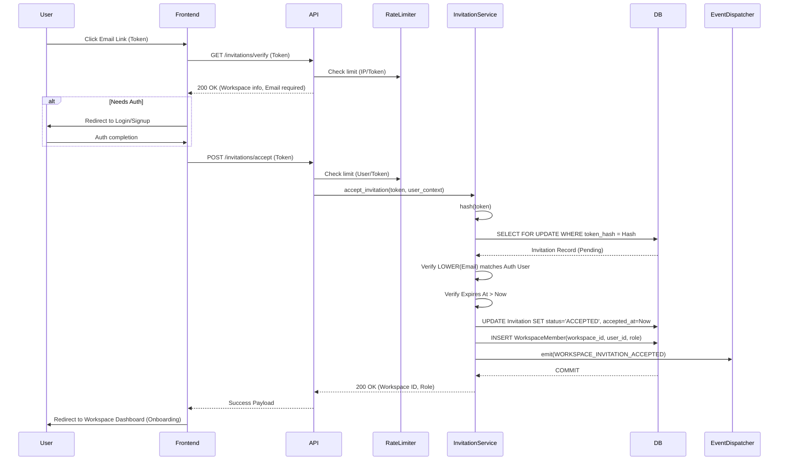

# F4.2 — Invitation Acceptance Flow
## Enterprise Architecture & Design Blueprint

**Program:** RAGuard V2  
**Epic:** Epic 4 (User & Role Management)  
**Status:** Architecture Blueprint (Architect Reviewed)  

---

## 1. High-Level Architecture & Workflow
The Invitation Acceptance flow bridges an unauthenticated/authenticated user into a workspace via a secure cryptographic token. It guarantees that an invitation is uniquely consumed exactly once, only by the intended recipient (matching email), and seamlessly translates the invitation into a `WorkspaceMember` entity.

### Complete Workflow
1. **Token Resolution:** The user clicks an invite link containing the raw base64url token. The frontend calls `GET /api/v1/invitations/verify` to resolve token state without consuming it.
2. **Authentication Gate:** The user is prompted to log in or register. The system tracks the pending invitation intent.
3. **Acceptance Submission:** Authenticated user posts to `POST /api/v1/invitations/accept` with the token.
4. **Validation & Locking:** The service initiates a transaction, applying pessimistic row-level locking (`SELECT ... FOR UPDATE`) on the `WorkspaceInvitation` entity.
5. **Consumption & Provisioning:** If valid (unexpired, unrevoked, matching normalized email), the invitation is marked `ACCEPTED`. A `WorkspaceMember` is created.
6. **Onboarding Context:** Domain events are fired. The user's active workspace session context is updated to the newly joined workspace.

---

## 2. Sequence Diagram


---

## 3. Database & Entity Design

### No New Migrations Required (Leverages F4.1 & existing `WorkspaceMember`)

**Key constraints validated during transaction:**
- **Email Normalization Matching:** The authenticated user's `email` (lowercased) must exactly match the `WorkspaceInvitation.email` (lowercased). Prevents bypasses due to case-sensitivity.
- **Idempotency (Unique Constraint Handler):** A user attempting to accept an invitation they've already accepted results in a `409 Conflict`. Handled safely via `INSERT` catching `IntegrityError` on the `WorkspaceMember` unique index.

### Concurrency Strategy
- **Pessimistic Locking:** `SELECT * FROM workspace_invitations WHERE token_hash = :hash FOR UPDATE`. This strictly prevents a race condition where double-clicking the accept button could yield duplicate `WorkspaceMember` records or violate state invariants.
- **Optimistic Locking:** The `version` column is incremented upon transition as a secondary defensive layer.

---

## 4. API Design

### Request/Response Schemas

**1. Verify Token (Public/Auth-optional)**
`GET /api/v1/invitations/verify?token=...`
- **Rate Limit:** 30 requests / minute / IP.
- **Response:** `200 OK`
```json
{
  "success": true,
  "data": {
    "workspace_name": "Acme Corp",
    "invited_email": "jane@acme.com",
    "role": "ADMIN",
    "status": "PENDING"
  }
}
```

**2. Accept Invitation (Requires Auth)**
`POST /api/v1/invitations/accept`
- **Rate Limit:** 10 requests / minute / User.
- **Request Body:**
```json
{
  "token": "raw_base64url_token_here"
}
```
- **Response:** `200 OK`
```json
{
  "success": true,
  "data": {
    "workspace_id": "uuid",
    "role": "ADMIN"
  }
}
```

### Validation Rules & Rejection Matrix
- **Expired:** HTTP 400.
- **Revoked:** HTTP 400.
- **Reused/Accepted:** HTTP 400.
- **Duplicate Acceptance:** HTTP 409 (User is already a member).
- **Email Mismatch:** HTTP 403 (Authenticated email does not match invitation).

---

## 5. Security & Multi-Tenant Isolation
- **SHA-256 Token Verification:** The API receives the plaintext token, immediately hashes it via SHA-256, and queries the database using the hash. Plaintext tokens are NEVER stored or logged.
- **Replay Protection:** State machine strictly transitions `PENDING -> ACCEPTED`. Once accepted, the row lock releases and subsequent queries see `ACCEPTED`, rejecting the replay.
- **Enumeration Protection:** If a token is completely invalid, returns a generic `404 Not Found` without exposing workspace details.
- **Multi-Tenant Isolation:** `WorkspaceMember` insertion is explicitly bound to the `workspace_id` resolved from the locked invitation row.

---

## 6. Audit & Domain Events
- **Audit Log (Success):** Action `INVITATION_ACCEPTED`. Target: `WorkspaceMember`. Actor: accepting user.
- **Audit Log (Failure):** Action `INVITATION_ACCEPT_FAILED` (Security enhancement). Captures mismatched emails or expired attempts. Crucial for SOC2 monitoring.
- **Domain Event:** `WORKSPACE_INVITATION_ACCEPTED` is published for async onboarding and notifications.

---

## 7. Edge Cases & Future Compatibility
- **Existing Member Detection:** If already a member, marks invite as `CANCELED` (duplicate) and informs the user.
- **SSO Compatibility (F4.9):** Handled via JIT provisioning if email matches.
- **Domain Verification (F4.8):** Invitation acts as an explicit override for out-of-domain users.
- **First Login / Onboarding:** Frontend detects acceptance and triggers wizard.
