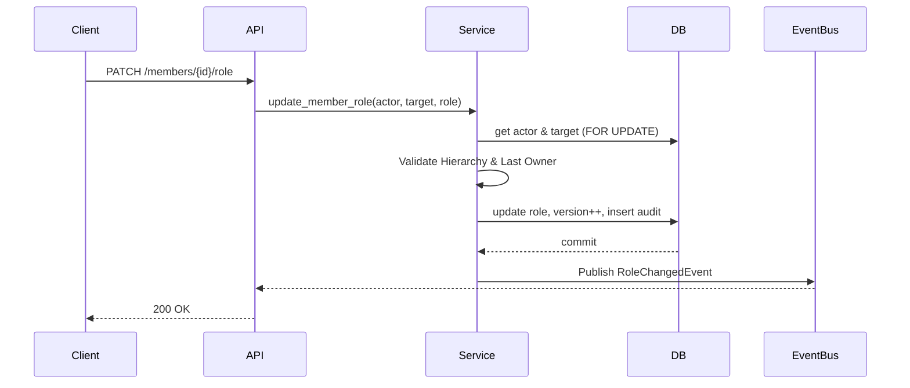

# F4.5 — Role Assignment / Reassignment Architecture Blueprint

## 1. Executive Summary
This blueprint defines the enterprise role assignment and reassignment system for workspace members. It enforces strict privilege boundaries, preventing escalation and self-promotion, while maintaining transaction safety through pessimistic locking. The design integrates tightly with the centralized `PermissionRegistry`, emitting domain events to invalidate RBAC caches and ensure active sessions immediately reflect updated permissions.

## 2. Business Requirements
- Enable delegated administration by allowing Owners and Admins to manage member roles.
- Guarantee security by strictly preventing privilege escalation.
- Prevent accidental workspace abandonment by enforcing "Last Owner Protection".
- Maintain a comprehensive, immutable audit log of all role mutations for compliance.

## 3. Functional Requirements
- **Privilege Enforcement**:
  - `OWNER` can assign or revoke `OWNER`.
  - `ADMIN` cannot assign or modify an `OWNER`.
  - `MEMBER` and `VIEWER` cannot change roles.
  - Self-promotion is strictly prevented.
  - Demotion of the last `OWNER` is strictly prevented.
- **Bulk Updates**: Support batch role assignments up to 100 members.
- **Dry-run Mode**: API support for validating role changes without committing them.
- **Real-time Enforcement**: Publish events to invalidate Redis caches and refresh active session permissions.

## 4. Non-Functional Requirements
- **Consistency**: High consistency guarantees using PostgreSQL `SELECT FOR UPDATE`.
- **Latency**: API response $<200ms$ for single mutations.
- **Audibility**: SOC2-ready audit trails for every mutation.
- **Idempotency**: Requests assigning the same role are treated as no-ops but returned successfully.

## 5. High-Level Architecture
- **API Layer**: `PATCH /api/v1/workspaces/{id}/members/{member_id}/role` and `POST /api/v1/workspaces/{id}/members/bulk`.
- **Service Layer**: `WorkspaceMembershipService.update_member_role` with explicit actor vs. target role hierarchy validation.
- **Data Layer**: `WorkspaceMemberRepository` with pessimistic row locking.
- **Event Layer**: Dispatches `WorkspaceMemberRoleChangedEvent`.
- **Cache Layer**: Redis Pub/Sub listener invalidates user permission caches.

## 6. Database Design
Reuses existing tables:
- `workspace_members`: Updates `role` and increments `version`.
- `audit_logs`: Records the mutation with `old_role` and `new_role`.

## 7. Migration Requirements
- Explicitly **None**. Reuses existing schema.

## 8. Entity Changes
- No structural changes to `WorkspaceMember`. Logic enhancements in the domain service.

## 9. Repository Design
- `get_by_id_for_update`: Fetches membership record with `with_for_update()` for the target member.
- `count_active_owners`: Evaluates workspace health to enforce Last Owner Protection.

## 10. Service Layer Design
- **Actor Validation**: Verifies actor is ACTIVE and has `USERS_MEMBER_UPDATE_ROLE`.
- **Hierarchy Validation**: Checks `actor.role` vs `target.role` vs `new_role`.
- **Lock Acquisition**: Acquires row lock on target member.
- **State Validation**: Checks for Last Owner demotion.
- **Mutation & Audit**: Updates role, increments version, creates `AuditLog`.
- **Event Dispatch**: Publishes domain event post-commit.

## 11. API Design
**Update Role**:
`PATCH /api/v1/workspaces/{workspace_id}/members/{member_id}/role`

**Bulk Update**:
`POST /api/v1/workspaces/{workspace_id}/members/bulk`

## 12. Request/Response Schemas
```python
class UpdateRoleRequest(BaseModel):
    role: WorkspaceRole
    dry_run: bool = False

class UpdateRoleResponse(BaseModel):
    member_id: UUID4
    old_role: str
    new_role: str
    status: str
```

## 13. Validation Rules
- `role` must be a valid enum member.
- `dry_run` bypasses commit and event dispatch, returning expected outcome.

## 14. State Machine
- `ACTIVE (Role A)` -> `ACTIVE (Role B)`
- `SUSPENDED (Role A)` -> `SUSPENDED (Role B)` (Role updates allowed on suspended accounts).

## 15. Sequence Diagram


## 16. RBAC & Authorization
- Guarded by `Permission.USERS_MEMBER_UPDATE_ROLE`.
- Runtime hierarchy checks in the service layer supplement API guards.

## 17. Multi-Tenant Isolation
- Both actor and target must explicitly belong to the `workspace_id` specified in the path.

## 18. Concurrency Strategy
- Pessimistic locking (`FOR UPDATE`) on the target member prevents race conditions (e.g., simultaneous demotion of two owners).

## 19. Audit Logging
- Action: `workspace.member.role_changed`
- Details: `old_role`, `new_role`, `target_user_id`, `actor_id`.

## 20. Domain Events
- Event: `WORKSPACE_MEMBER_ROLE_CHANGED`
- Payload: `workspace_id`, `user_id`, `old_role`, `new_role`.

## 21. Security Review
- Privilege Escalation: Mitigated by strict ADMIN restrictions.
- Self-Promotion: Mitigated by checking if `actor.id == target.id` combined with promotion constraints.

## 22. Performance Considerations
- Lookups are indexed. Lock duration is minimal (in-memory validation).

## 23. Failure Recovery
- Database rollbacks ensure no partial state. Email/Cache failures do not fail the HTTP request.

## 24. Edge Cases
- Updating to the same role (returns 200 OK without DB write).
- Attempting to update a deleted user (returns 404).

## 25. Testing Strategy
- Unit tests: Hierarchy bypass attempts, last owner demotion, self-promotion.
- Integration tests: Bulk updates, concurrent updates to the same user.

## 26. Future Compatibility
- The `role` column uses string identifiers, fully supporting migration to Custom RBAC ID references in the future.

## 27. Risks
- Delay in Redis cache invalidation might leave stale permissions active for a few seconds.

## 28. Final Recommendation
- Proceed with implementation utilizing existing `WorkspaceMembershipService` skeleton.
