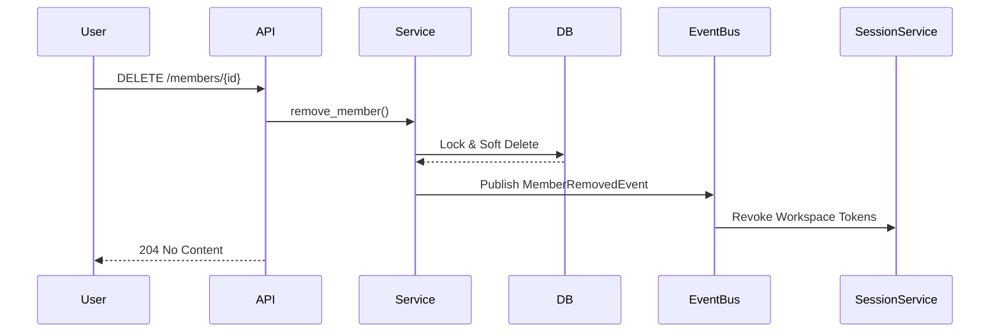

# F4.6 — Member Removal Architecture Blueprint

## 1. Executive Summary
This blueprint outlines the enterprise member removal workflow. It focuses on non-destructive soft deletions to maintain relational integrity and audit trails. The workflow includes safeguards like "Last Owner Protection", self-leave flows, and cleanup cascades that handle pending invitations, API key revocations, and active session flushing.

## 2. Business Requirements
- Enable workspace Owners and Admins to remove members.
- Enable users to voluntarily leave workspaces.
- Ensure data integrity by soft-deleting memberships instead of physical rows.
- Support compliance workflows by ensuring no audit log or historical action is orphaned.

## 3. Functional Requirements
- **Soft Removal**: Mark memberships as `LEFT` or `is_deleted=True`.
- **Restore Support**: Allow administrators to undo removals.
- **Last Owner Protection**: Prevent the final workspace owner from being removed or leaving.
- **Self-Leave Workflow**: Members can remove themselves without administrative intervention.
- **Cleanup Cascade**: When a member is removed, revoke their workspace-scoped API keys and clear their workspace active sessions.
- **Global Account Intact**: The user's platform account and memberships in other workspaces remain fully intact.

## 4. Non-Functional Requirements
- **Consistency**: High database transaction guarantees.
- **Event-Driven**: Rely on domain events to handle asynchronous cleanup (sessions, API keys).
- **Traceability**: Audit log must record if it was an admin removal vs self-leave.

## 5. High-Level Architecture
- **API Layer**: `DELETE /api/v1/workspaces/{id}/members/{member_id}` and `POST /api/v1/workspaces/{id}/members/leave`.
- **Service Layer**: `remove_member` core logic.
- **Event Bus**: Dispatches `WorkspaceMemberRemovedEvent`.
- **Subscribers**: Session management listener (flushes Redis tokens), API Key listener (revokes keys).

## 6. Database Design
- `workspace_members`: `is_deleted = True`, `status = 'LEFT'`, `version += 1`.
- `audit_logs`: Standard audit entry.

## 7. Migration Requirements
- Explicitly **None**. Reuses existing schema fields.

## 8. Entity Changes
- No structural changes to models.

## 9. Repository Design
- Exclude `is_deleted=True` from default queries. Provide an explicit `include_deleted` flag for restore workflows.

## 10. Service Layer Design
- **Actor Validation**: Check if `actor.id == member_id` (Self-Leave).
- **Permission Validation**: If not self-leave, require `USERS_MEMBER_REMOVE` and hierarchy checks.
- **Lock Acquisition**: Pessimistic lock on target member.
- **Safeguard Validation**: Enforce Last Owner rule.
- **State Update**: Soft-delete target member.
- **Event Dispatch**: `WORKSPACE_MEMBER_REMOVED`.

## 11. API Design
**Remove Member (Admin)**:
`DELETE /api/v1/workspaces/{workspace_id}/members/{member_id}`

**Leave Workspace (Self)**:
`POST /api/v1/workspaces/{workspace_id}/members/leave`

## 12. Request/Response Schemas
```python
class RemoveMemberResponse(BaseModel):
    member_id: UUID4
    status: str
    removed_at: datetime
```

## 13. Validation Rules
- Admin cannot remove an Owner.
- Final owner cannot leave.

## 14. State Machine
- `ACTIVE` -> `LEFT` (via remove/leave)
- `SUSPENDED` -> `LEFT` (via remove)
- `LEFT` -> `ACTIVE` (via restore)

## 15. Sequence Diagram


## 16. RBAC & Authorization
- Guarded by `Permission.USERS_MEMBER_REMOVE`.
- Self-leave bypasses RBAC.

## 17. Multi-Tenant Isolation
- Target member is queried with strict `workspace_id` filtering.

## 18. Concurrency Strategy
- Pessimistic locking prevents simultaneous role change and removal conflicts.

## 19. Audit Logging
- Action: `workspace.member.removed`
- Details: `is_self_removal: bool`, `target_user_id`, `actor_id`.

## 20. Domain Events
- Event: `WORKSPACE_MEMBER_REMOVED`
- Listeners: Token Revocation, API Key Revocation.

## 21. Security Review
- Ensures isolated session revocation (only tokens for the specific workspace are cleared). Global platform access remains.

## 22. Performance Considerations
- Soft deletes are $O(1)$ indexed updates.

## 23. Failure Recovery
- Standard transaction boundaries. Event replay for failed downstream cleanup.

## 24. Edge Cases
- Removing an already removed member returns 404 or 409 safely.

## 25. Testing Strategy
- Self-leave flows. Admin removal hierarchies. Last Owner constraints. Event dispatcher invocation checks.

## 26. Future Compatibility
- Asset Reassignment: Event payload can trigger "unassigned asset" workflows in Document/Knowledge services.

## 27. Risks
- Delay in token revocation could allow brief continued access post-removal.

## 28. Final Recommendation
- Approve blueprint. Use robust event-driven cleanup to ensure high performance on the primary API request.
