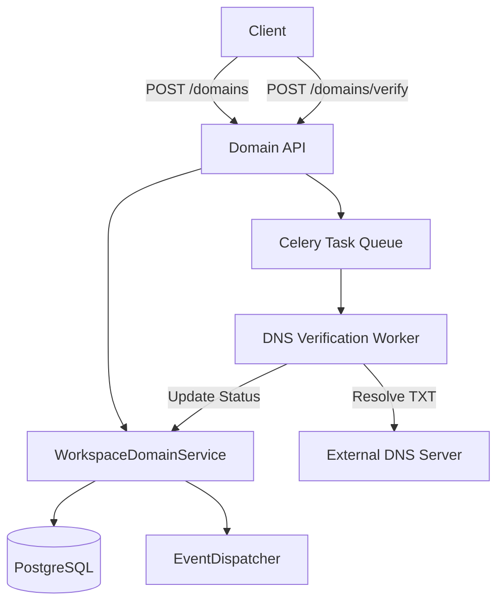

# F4.8 — Domain Verification Architecture Blueprint

## 1. Executive Summary
This document outlines the architecture for the F4.8 Domain Verification feature. It establishes the enterprise-grade foundation necessary for organizations to cryptographically prove ownership of their DNS domains. Verified domains serve as the trust anchor for subsequent enterprise features, including SAML/OIDC SSO, Just-In-Time (JIT) provisioning, automatic workspace joining, and advanced user lifecycle management.

## 2. Business Requirements
- **Trust Anchor:** Establish verifiable cryptographic proof of domain ownership.
- **Enterprise Features Enablement:** Unlock enterprise features dependent on domain ownership (SSO, Auto-Join).
- **Abuse Prevention:** Strictly prevent domain hijacking, duplicate registrations across isolated workspaces, and unauthorized wildcards.
- **Compliance:** Support comprehensive audit logging (SOC2/ISO27001) for all domain lifecycle events.

## 3. Functional Requirements
- **DNS TXT Verification:** Generate unique, cryptographically secure tokens to be placed in DNS TXT records.
- **Domain Lifecycle:** Manage status transitions (PENDING, VERIFYING, VERIFIED, FAILED, REVOKED, EXPIRED).
- **Multiple Domains:** Support multiple domains per workspace with one designated Primary Domain.
- **Verification Management:** Automatic background retry policies, manual re-verification triggers, and expiration handling.
- **Domain Normalization:** Handle IDNA (Punycode), lowercase normalization, and case-insensitive matching.
- **Wildcard/Subdomain:** Explicitly manage security around subdomain verification and wildcard restrictions.
- **Ownership Transfer:** Secure workflows for transferring domain ownership between workspaces.

## 4. Non-Functional Requirements
- **Security:** CSRF protection, rate-limiting on verification triggers, abuse prevention against TXT record enumeration.
- **Performance:** Background worker offloading for DNS resolution to avoid blocking API threads.
- **Concurrency:** Optimistic locking to prevent race conditions during verification status changes.
- **Observability:** Prometheus metrics tracking DNS latency, success/fail rates, and failure reasons.

## 5. High-Level Architecture
The Domain Verification system operates asynchronously. The API layer provisions cryptographically secure tokens. A Celery background worker periodically polls the target domain's DNS TXT records (`_raguard-challenge.<domain>`). 

## 6. Database Design

### 6.1 `workspace_domains` Table
| Column | Type | Constraints | Description |
|---|---|---|---|
| `id` | UUID | PK | Unique identifier |
| `workspace_id` | UUID | FK | Reference to workspace |
| `domain_name` | VARCHAR(255) | NOT NULL | Punycode normalized domain name |
| `verification_token_hash` | VARCHAR(64) | NOT NULL, UNIQUE | SHA-256 hash of the cryptographically secure token |
| `status` | VARCHAR(50) | NOT NULL | Enum: PENDING, VERIFYING, VERIFIED, FAILED, REVOKED, EXPIRED |
| `is_primary` | BOOLEAN | DEFAULT False | Is the primary domain for the workspace |
| `last_verified_at` | TIMESTAMPTZ | NULL | Timestamp of last successful verification |
| `token_expires_at` | TIMESTAMPTZ | NOT NULL | Expiry of the verification token (e.g. 7 days) |
| `dns_last_checked_at` | TIMESTAMPTZ | NULL | Timestamp of last DNS lookup |
| `error_reason` | TEXT | NULL | Last verification failure reason |
| `version` | INTEGER | NOT NULL, DEFAULT 1 | Optimistic locking counter |
| `created_at` | TIMESTAMPTZ | NOT NULL | Creation timestamp |
| `updated_at` | TIMESTAMPTZ | NOT NULL | Update timestamp |

**Indexes:**
- `UNIQUE INDEX ix_workspace_domains_domain` ON `workspace_domains (domain_name)` WHERE `status IN ('VERIFIED')` (Prevents duplicate verified domains).
- `INDEX ix_workspace_domains_workspace_id` ON `workspace_domains (workspace_id)`.

### 6.2 `domain_cooldowns` Table
| Column | Type | Constraints | Description |
|---|---|---|---|
| `domain_name` | VARCHAR(255) | PK | Domain in cooldown |
| `released_by_workspace_id` | UUID | NOT NULL | Workspace that revoked/deleted the domain |
| `cooldown_expires_at` | TIMESTAMPTZ | NOT NULL | Timestamp when cooldown ends (24 hours post-release) |

## 7. Migration Requirements
- `2026080X_add_workspace_domains_table.py`: Creates the table and associated constraints.

## 8. Domain Events
- `DOMAIN_ADDED_EVENT`
- `DOMAIN_VERIFICATION_STARTED_EVENT`
- `DOMAIN_VERIFIED_EVENT`
- `DOMAIN_VERIFICATION_FAILED_EVENT`
- `DOMAIN_REVOKED_EVENT`
- `DOMAIN_PRIMARY_CHANGED_EVENT`

## 9. Services Design
**`WorkspaceDomainService`**
- `add_domain(workspace_id, domain)`: Normalizes (IDNA), checks global duplicates and active `domain_cooldowns`. Generates a 256-bit token, displays it exactly once to the client, stores ONLY the `SHA-256(token)` hash, and sets status to `PENDING`.
- `trigger_verification(workspace_id, domain_id)`: Rate limited. Enqueues a Celery task, updates status to `VERIFYING`.
- `set_primary_domain(workspace_id, domain_id)`: Atomic transaction to unset existing primary and set the new one.
- `remove_domain(workspace_id, domain_id)`: Hard deletes or marks as REVOKED, and injects a 24-hour record into the `domain_cooldowns` table to prevent immediate takeover.

**`DNSVerificationWorker`** (Celery)
- Resolves TXT records for `_raguard-challenge.<domain>`.
- Applies SHA-256 hashing to all discovered TXT records and compares them against the stored `verification_token_hash`.
- Implements exponential backoff for DNS propagation.
- Gracefully handles NXDOMAIN, SERVFAIL, and timeout exceptions.
- Updates database via `WorkspaceDomainService` and emits domain events.

## 10. API Contracts

### `POST /api/v1/workspaces/{id}/domains`
**Request:** `{"domain_name": "example.com"}`
**Response:** `{"id": "...", "domain_name": "example.com", "verification_token": "raguard-verification=...", "status": "PENDING"}`

### `POST /api/v1/workspaces/{id}/domains/{domain_id}/verify`
**Request:** `{}`
**Response:** `202 Accepted` (Background task triggered).

### `GET /api/v1/workspaces/{id}/domains`
**Response:** List of domain objects with current verification status and DNS check timestamps.

### `PATCH /api/v1/workspaces/{id}/domains/{domain_id}/primary`
**Request:** `{}` (Headers: `If-Match: <version>`)
**Response:** `200 OK`

## 11. Security & Concurrency
- **Duplicate Prevention:** Strict partial unique indexing guarantees a domain can only be `VERIFIED` by a single workspace at a time.
- **Verification Token Security:** Tokens are 256-bit cryptographically secure strings. They are generated and sent to the client once. The database strictly stores the `SHA-256` hash. TXT validation compares hashes, mirroring the Workspace Invitations security model.
- **Domain Ownership Cooldown:** Releasing or revoking a verified domain triggers a strict 24-hour cooldown window (`domain_cooldowns` table). Another workspace cannot claim or verify the domain until the cooldown expires, protecting against race conditions and accidental abandonments.
- **Ownership Transfer:** Requires the original workspace to revoke or delete, endure the 24-hour cooldown, and then the new workspace can verify.
- **Wildcard Domains:** `*.domain.com` explicitly rejected at API validation unless verified through support/manual override. Subdomains (`sub.domain.com`) are allowed and verified independently.
- **Optimistic Locking:** `version` field required for `set_primary_domain` and status mutations.

## 12. Redis Usage & Caching
- **Rate Limiting:** IP and Workspace-level rate limits on `/verify` endpoint (`auth:rate-limit:domain-verify:{workspace_id}`).
- **DNS Cache:** Temporary caching of DNS failures to prevent spamming upstream resolvers.

## 13. Audit Logging
Audit logs generated for:
- Domain addition/removal.
- 24-hour Cooldown activation and expiration.
- Verification success/failure (with DNS resolution details).
- Primary domain switches.

## 14. Architecture Review Improvements Applied
- **IDN Support:** Added mandatory IDNA Punycode translation at the API boundary to prevent homoglyph attacks.
- **DNS Timeout Protection:** Celery worker enforced with strict 5-second DNS resolution timeouts to prevent worker starvation.
- **SOC2 Auditability:** Added `error_reason` and `dns_last_checked_at` to provide a complete diagnostic trail for failed verification attempts.
- **Verification Token Security:** Upgraded from plaintext storage to SHA-256 hash comparison models to prevent database-compromise token abuse.
- **Domain Ownership Cooldown:** Injected the `domain_cooldowns` locking table to enforce 24-hour safe periods post-domain release.
