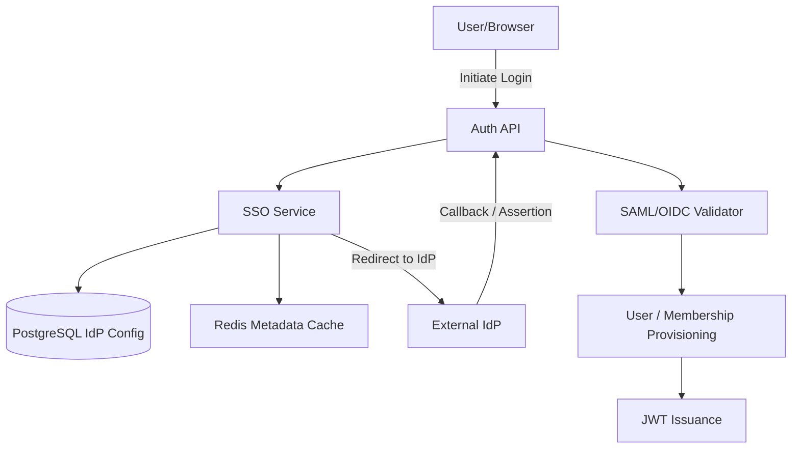

# F4.9 — SSO Configuration Architecture Blueprint

## 1. Executive Summary
This document outlines the architecture for the F4.9 SSO Configuration feature. It introduces the `IdentityProvider` entity, enabling enterprise customers to configure custom SAML 2.0 and OIDC integrations per workspace. This lays the foundation for enterprise adoption, allowing integration with Okta, Microsoft Entra ID, Google Workspace, and Ping Identity.

## 2. Business Requirements
- **Protocol Support:** Support industry standard SAML 2.0 and OpenID Connect (OIDC).
- **Automation:** Support metadata URL ingestion and automated certificate/key rotation.
- **Security:** Ensure cryptographically sound validation of signatures, replay protection, and break-glass administrative access.
- **User Lifecycle:** Support Just-In-Time (JIT) provisioning, automatic mapping of IdP groups to Workspace roles, and domain restrictions.

## 3. Functional Requirements
- **IdP Configuration:** Create, read, update, and delete identity providers linked to a workspace.
- **Multiple Providers:** Support multiple IdPs per workspace (e.g. one for internal employees, one for contractors), with an "Active" toggle.
- **Metadata Management:** Ingest and periodically refresh IdP metadata (Certificates, JWKS, Endpoints).
- **Attribute Mapping:** Configurable mapping for Email, Display Name, First Name, Last Name, and Roles/Groups.
- **JIT & Auto-Join:** Provision users automatically on successful login if they match verified domains.
- **Emergency Disable:** A kill switch for specific IdPs and a "Break-glass" local login bypass for workspace owners.

## 4. Non-Functional Requirements
- **Security:** PKCE for OIDC, CSRF nonces, strict RelayState validation, clock skew tolerance configuration (default 300s).
- **Performance:** Redis caching for IdP metadata/JWKS to ensure blazing fast authentication handshakes.
- **High Availability:** IdP health monitoring and background refresh of expiring metadata.

## 5. High-Level Architecture



## 6. Database Design

### 6.1 `identity_providers` Table
| Column | Type | Constraints | Description |
|---|---|---|---|
| `id` | UUID | PK | Unique identifier |
| `workspace_id` | UUID | FK | Reference to workspace |
| `name` | VARCHAR(100) | NOT NULL | Friendly name (e.g., "Corporate Okta") |
| `type` | VARCHAR(20) | NOT NULL | Enum: SAML, OIDC |
| `is_active` | BOOLEAN | DEFAULT True | Is this IdP enabled |
| `entity_id_issuer` | VARCHAR(255) | NOT NULL | IdP Issuer URI / Entity ID |
| `sso_url` | VARCHAR(2048) | NOT NULL | Single Sign-On Endpoint |
| `logout_url` | VARCHAR(2048) | NULL | Single Logout Endpoint |
| `metadata_url` | VARCHAR(2048) | NULL | URL for automatic metadata refresh |
| `certificates` | JSONB | NULL | Stored X.509 certs or JWKS keys |
| `attribute_mapping` | JSONB | NOT NULL | Maps IdP claims to RAGuard attributes |
| `domain_restrictions` | ARRAY(STR) | NULL | List of allowed verified domains |
| `jit_enabled` | BOOLEAN | DEFAULT False | Enable Just-In-Time user creation |
| `force_sso` | BOOLEAN | DEFAULT False | Block local login for matching users |
| `version` | INTEGER | NOT NULL, DEFAULT 1 | Optimistic locking counter |
| `created_at` | TIMESTAMPTZ | NOT NULL | Creation timestamp |
| `updated_at` | TIMESTAMPTZ | NOT NULL | Update timestamp |

## 7. Migration Requirements
- `2026080X_add_identity_providers_table.py`: Creates table and JSONB indexing for fast configuration lookups.

## 8. Domain Events
- `IDP_CREATED_EVENT`
- `IDP_UPDATED_EVENT`
- `IDP_DELETED_EVENT`
- `IDP_METADATA_REFRESHED_EVENT`
- `IDP_LOGIN_SUCCESS_EVENT`
- `IDP_LOGIN_FAILED_EVENT` (Used for security monitoring)

## 9. Services Design
**`IdentityProviderService`**
- `create_idp()`, `update_idp()`, `delete_idp()`: Standard CRUD with `version` locking.
- `refresh_metadata(idp_id)`: Fetches `metadata_url`, parses XML (SAML) or JSON (OIDC), updates `certificates` and endpoints.
- `validate_assertion(idp_id, payload)`: Cryptographically verifies SAML XML Signatures or OIDC JWTs.
- `process_jit_provisioning(idp_id, user_claims)`: Maps claims to User entity. Creates User and WorkspaceMember if `jit_enabled` is true and email domain matches a VERIFIED domain in `workspace_domains`.

**`IdPHealthWorker`** (Celery)
- Runs nightly to execute `refresh_metadata()` on all active IdPs with a `metadata_url`.
- Emits warnings/alerts if X.509 certificates are within 30 days of expiry.
- Orchestrates **Dual Certificate Rotation** during rollover by identifying the incoming Next Certificate and retiring the expired Active Certificate seamlessly.

## 10. Authentication State Machine

The complete authentication lifecycle is strictly enforced via the following state transitions:

```text
START
  ↓
REDIRECT_TO_IDP
  ↓
CALLBACK_RECEIVED
  ↓
SIGNATURE_VALIDATED
  ↓
DOMAIN_VERIFIED
  ↓
JIT_PROVISIONING
  ↓
ROLE_MAPPING
  ↓
JWT_ISSUED
  ↓
SUCCESS
```

### 10.1 Failure States & Handling
Every failure state aborts the authentication sequence and emits specific telemetry:
- **Invalid Signature:** Emits `IDP_LOGIN_FAILED_EVENT` (Reason: Signature mismatch or Tampering).
- **Expired Assertion:** Emits `IDP_LOGIN_FAILED_EVENT` (Reason: Clock skew violation or Stale assertion).
- **Replay Attack:** Emits `IDP_LOGIN_FAILED_EVENT` (Reason: Nonce reuse or Duplicate `InResponseTo`).
- **Unknown Identity Provider:** Emits `IDP_LOGIN_FAILED_EVENT` (Reason: Unregistered Issuer URI).
- **Domain Not Verified:** Emits `IDP_LOGIN_FAILED_EVENT` (Reason: User email domain not mapped to active F4.8 verified domain).
- **Provisioning Failed:** Emits `IDP_LOGIN_FAILED_EVENT` (Reason: Database constraint failure during JIT).
- **Workspace Archived/Suspended/Deleted:** Emits `WORKSPACE_LOCKED_EVENT` (Reason: Workspace lifecycle block).
- **Account Disabled:** Emits `USER_ACCOUNT_DISABLED_EVENT` (Reason: Target user is deactivated).

## 11. API Contracts

### `POST /api/v1/workspaces/{id}/idp`
**Request:** Config payload (type, endpoints, attribute_mapping).
**Response:** `{"id": "...", "status": "ACTIVE"}`

### `GET /api/v1/auth/sso/{workspace_slug}/login`
**Response:** `302 Redirect` to the IdP `sso_url` with generated SAML AuthnRequest or OIDC auth payload (including PKCE/Nonce).

### `POST /api/v1/auth/sso/{workspace_slug}/callback`
**Request:** SAMLResponse or OIDC `code`/`id_token`.
**Response:** Issues standard RAGuard Auth JWTs upon successful validation and JIT execution.

## 12. Security & Protocol Handling
- **Replay Protection:** `InResponseTo` validation for SAML. Nonce validation for OIDC stored temporarily in Redis (`auth:sso:nonce:{nonce}`).
- **XML Security:** Usage of `defusedxml` to prevent XXE (XML External Entity) attacks when parsing SAML metadata and assertions.
- **Dual Certificate Rotation:** Supports simultaneous Active Certificate and Next Certificate storage. During certificate rollover, assertions signed by either certificate are accepted. After successful rotation and metadata refresh, the old certificate is automatically retired to ensure zero authentication downtime.
- **Signature Validation:** Strict enforcement of signed assertions and signed responses (SAML).
- **Clock Skew:** `NotBefore` and `NotOnOrAfter` validated with a strict 300-second allowable skew.
- **Break-Glass:** Workspace Owners bypass `force_sso` restrictions via `/api/v1/auth/login?bypass=true` strictly requiring MFA (Future Epic).

## 13. Redis Caching Strategy
- **IdP Configuration Cache:** `workspace:{workspace_slug}:idp:active`. Avoids a DB roundtrip during the critical path of generating login redirects. Flushed upon `IDP_UPDATED_EVENT`.
- **RelayState Management:** Temporary storage of deep links and origin state mapped to a secure random ID passed in the `RelayState` parameter.

## 14. Audit Logging
Audit logs generated for:
- IdP lifecycle changes (creation, updates to mappings).
- Metadata refresh successes and failures.
- Zero-downtime certificate rollovers.
- JIT user provisioning events.
- SSO authentication failures (invalid signature, expired assertion, replay detected, unregistered domain).

## 15. Architecture Review Improvements Applied
- **Strict Domain Binding:** JIT provisioning explicitly tied to F4.8 Domain Verification. An IdP cannot auto-join a user unless the user's email domain exists in `workspace_domains` with `VERIFIED` status.
- **XXE Prevention:** Explicit mandate for `defusedxml` injected into the blueprint to protect against enterprise SAML vulnerabilities.
- **Metadata Staleness & Dual Rotation:** Added a background Celery worker for automated JWKS/Metadata rotation and explicit support for Dual Certificate rollover to prevent production outages during IdP key rotation.
- **Observability & State Machine Enforcement:** Documented an explicit step-by-step authentication state machine. Mapped every failure condition to a concrete Domain Event (`IDP_LOGIN_FAILED_EVENT`, `WORKSPACE_LOCKED_EVENT`, `USER_ACCOUNT_DISABLED_EVENT`) for accurate SIEM ingestion.
