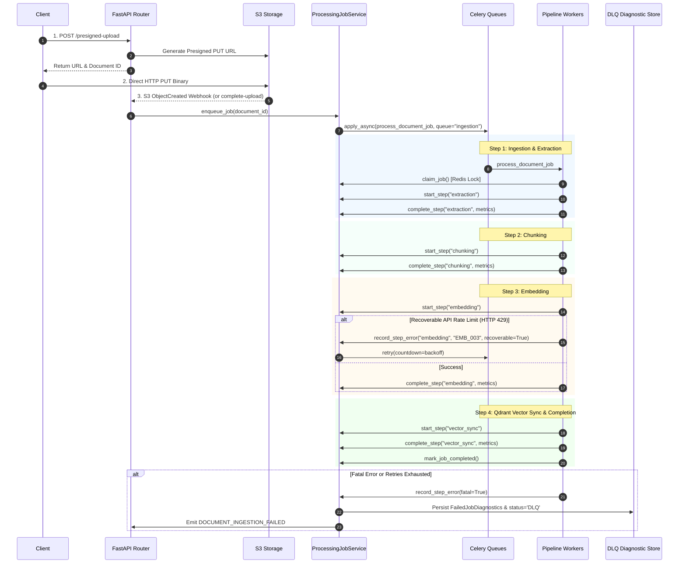

# Enterprise Implementation Plan: F6.6, F6.7 & F6.8

**Plan Identifier:** `PLAN-EPIC6-F6.6-F6.8-V1.0`  
**Target Features:**
- **F6.6 — ProcessingJob Lifecycle Tracking**
- **F6.7 — Dead Letter Queue Handling (FailedJob)**
- **F6.8 — S3 Event-Driven Pipeline Trigger**  
**Status:** PROPOSED (Awaiting User Sign-off)  
**Methodology:** Enterprise Architecture-First (Zero Implementation Before Approval)  

---

## 1. Executive Overview & Scope

This implementation plan defines the exact execution path for the final three features of **Epic 6: Asynchronous Ingestion & Document Pipeline**:
* **F6.6 (ProcessingJob Lifecycle Tracking)**: Orchestrates the multi-stage lifecycle, distributed Redis lease locks, fine-grained sub-millisecond step telemetry, monotonic progress percentage engine, and append-only audit trails.
* **F6.7 (Dead Letter Queue Handling)**: Implements severity-tiered failure classification (`RECOVERABLE` vs `FATAL`), jittered exponential backoff with a hard retry budget ($N \le 3$), contextual diagnostic capture (`FailedJobDiagnostics`), and operator single/bulk step replay capabilities.
* **F6.8 (S3 Event-Driven Pipeline Trigger)**: Provides zero-memory presigned S3 upload URLs, autonomous S3 `ObjectCreated` event webhook ingestion, asynchronous post-upload security/virus screening, and idempotent worker dispatching.

---

## 2. Exact Implementation Order & Dependency Tree

```mermaid
graph TD
    subgraph "Phase 1: Foundation & Data Architecture"
        D1[1.1 Models & Schemas: ProcessingJob, FailedJobDiagnostics, JobStep, JobAudit]
        D2[1.2 Repositories: JobRepository, JobStepRepository, JobAuditRepository, FailedJobRepository]
        D1 --> D2
    end

    subgraph "Phase 2: Core Services & Engine Logic"
        S1[2.1 ProcessingJobService: State Machine, Mutex Locks & Step Telemetry]
        S2[2.2 Retry & DLQ Controller: Backoff, Budget Hard Cap & Diagnostics]
        S3[2.3 S3 Event Service & Presigned URL Generator]
        D2 --> S1
        D2 --> S2
        D2 --> S3
    end

    subgraph "Phase 3: Worker & Pipeline Integration"
        W1[3.1 Ingestion & OCR Worker: Step Telemetry & DLQ Routing]
        W2[3.2 Chunking Worker: Step Tracking & Error Severity]
        W3[3.3 Embedding Worker: Step Tracking & Budget Checks]
        W4[3.4 Vector Sync Worker: Step Tracking & Finalization]
        W5[3.5 Celery Beat Cron: Stale Job Lease Recovery]
        S1 --> W1
        S2 --> W1
        W1 --> W2
        W2 --> W3
        W3 --> W4
        S1 --> W5
    end

    subgraph "Phase 4: API, Webhooks & Security Ingress"
        A1[4.1 Presigned Upload & Ingestion Confirmation Endpoints]
        A2[4.2 S3 Event Webhook Receiver & Deduplication Guard]
        A3[4.3 DLQ Management & Granular Step Replay API]
        A4[4.4 Monotonic Status & Job Details API]
        W4 --> A1
        W4 --> A2
        W4 --> A3
        W4 --> A4
    end

    subgraph "Phase 5: Frontend Dashboard & Client Polling"
        FE1[5.1 Real-Time Monotonic Progress Bar & Step Visualizer]
        FE2[5.2 DLQ Quarantined Jobs Dashboard & Replay Modal]
        FE3[5.3 Direct S3 Upload Client Component]
        A1 --> FE3
        A3 --> FE2
        A4 --> FE1
    end

    subgraph "Phase 6: Multi-Stage Testing & Hardening"
        T1[6.1 Unit Test Suite (>90% coverage)]
        T2[6.2 Integration & Worker Chaining Tests]
        T3[6.3 E2E Pipeline, DLQ & S3 Ingress Verification]
        T4[6.4 Security & Performance Load Gates]
        FE1 --> T1
        FE2 --> T1
        FE3 --> T1
        T1 --> T2
        T2 --> T3
        T3 --> T4
    end
```

---

## 3. Detailed Component Plan

### 3.1 Data Architecture & Models

#### Files to Create / Modify
* **`[MODIFY]` `backend/document/models/job.py`**:
  * Ensure complete fields: `batch_id`, `version_id`, `status` (`PENDING`, `QUEUED`, `CLAIMED`, `PROCESSING`, `COMPLETED`, `FAILED`, `DLQ`, `CANCELLED`), `current_step`, `priority`, `retry_count`, `max_retries` (default: 3), `idempotency_key`, `claimed_by_worker`, `claimed_at`, `started_at`, `completed_at`, `dlq_at`, `dlq_reason`, `error_code`, `error_message`, `step_metrics` (JSONB).
  * Add composite database indexes:
    * `idx_processing_jobs_doc_created`: `(document_id, created_at DESC)`
    * `idx_processing_jobs_status_claimed`: `(status, claimed_at)`
    * `idx_processing_jobs_idempotency`: `(idempotency_key)` WHERE `is_deleted = false`
* **`[NEW]` `backend/document/models/failed_job.py`**:
  * Model `FailedJobDiagnostics`: `id` (UUID PK), `job_id` (UUID FK $\to$ `processing_jobs.id`), `tenant_id` (String), `failing_step` (String), `exception_class` (String), `stack_trace` (Text), `worker_context` (JSONB), `payload_snapshot` (JSONB), `remediation_status` (String: `PENDING_TRIAGE`, `RESOLVED_REPLAY`, `DISMISSED_IGNORED`), `resolved_by_user_id` (UUID nullable), `resolved_at` (Timestamp nullable), `created_at` (Timestamp).
* **`[MODIFY]` `backend/document/models/job_step.py`**:
  * Ensure schema: `id`, `job_id` (FK), `step_name`, `step_status`, `started_at`, `completed_at`, `duration_ms` (Float), `error_code`, `error_detail` (JSONB), `step_metrics` (JSONB).
* **`[MODIFY]` `backend/document/models/job_audit.py`**:
  * Ensure schema: `id`, `job_id` (FK), `event` (String), `actor` (String), `payload` (JSONB), `timestamp` (Timestamp).

---

### 3.2 Repositories Layer

#### Files to Create / Modify
* **`[MODIFY]` `backend/document/repositories/job_repository.py`**:
  * Enhance `create`, `get_by_id`, `get_by_document_id`, `get_by_idempotency_key`.
  * Add `claim_job_atomic(job_id, worker_id, session)` with optimistic locking / status guard.
  * Add `list_dlq_jobs(tenant_id, page, size, error_code, session)` with multi-tenant filtering.
  * Add `get_stale_claimed_jobs(threshold_minutes, session)` for background cron.
  * Add `reset_job_for_retry(job_id, resume_from_step, session)`.
* **`[NEW]` `backend/document/repositories/failed_job_repository.py`**:
  * `create_diagnostics(diagnostics, session)`
  * `get_by_job_id(job_id, session)`
  * `update_remediation_status(job_id, status, user_id, session)`
  * `bulk_dismiss(job_ids, tenant_id, user_id, session)`
* **`[MODIFY]` `backend/document/repositories/job_step_repository.py`**:
  * `create_or_update_step(job_id, step_name, status, duration_ms, metrics, error, session)`
  * `get_completed_steps(job_id, session)`
* **`[MODIFY]` `backend/document/repositories/job_audit_repository.py`**:
  * `append(job_id, event, actor, payload, session)`
  * `list_for_job(job_id, session)`

---

### 3.3 Service Layer & Business Logic

#### Files to Create / Modify
* **`[MODIFY]` `backend/document/services/processing_job_service.py`**:
  * **`enqueue_job(...)`**: Generate SHA-256 idempotency key (`{document_id}_{version_id}_{date}`); return existing if already active.
  * **`claim_job(job_id, worker_id, session)`**: Use `backend/cache/locks.py:acquire_lock("job_lock:{job_id}", timeout=60, acquire_timeout=2)`. Transition state `QUEUED` $\to$ `CLAIMED`.
  * **`start_step(job_id, step_name, worker_id, session)`**: Record step start time, set `current_step = step_name`, update status $\to$ `PROCESSING`.
  * **`complete_step(job_id, step_name, worker_id, metrics, session)`**: Record `duration_ms`, merge step metrics into `ProcessingJob.step_metrics`, persist audit record.
  * **`record_step_error(job_id, step_name, worker_id, error_code, error_message, stack_trace, is_fatal, session)`**:
    * Increment `retry_count`.
    * If `is_fatal` or `retry_count >= max_retries`: Transition status $\to$ `DLQ`, record `FailedJobDiagnostics`, emit `DOCUMENT_INGESTION_FAILED`.
    * Else: Transition status $\to$ `QUEUED`, schedule backoff retry via Celery countdown.
  * **`mark_job_completed(job_id, worker_id, session)`**: Transition status $\to$ `COMPLETED`, `completed_at = NOW()`, update `Document.status = READY`, emit `DOCUMENT_INGESTION_COMPLETED`.
  * **`requeue_stale_jobs(threshold_minutes, session)`**: Reclaim abandoned locks and re-enqueue jobs to `QUEUED`.
* **`[NEW]` `backend/document/services/s3_event_service.py`**:
  * **`generate_presigned_upload(tenant_id, filename, file_size, mime_type, sha256, folder_id, session)`**:
    * Create `Document` (`PENDING_UPLOAD`), `DocumentVersion`, `StorageObject`.
    * Invoke `S3StorageProvider.create_upload_url(object_key, expiration_seconds=3600)`.
    * Return presigned PUT URL and canonical metadata.
  * **`handle_s3_object_created(bucket, object_key, etag, size_bytes, session)`**:
    * Deduplicate event via Redis (`SET s3_event:{bucket}:{key}:{etag} NX EX 86400`).
    * Parse canonical key `tenants/{tenant_id}/documents/{document_id}/v{version}/original/...`.
    * Transition `Document.status` $\to$ `UPLOADED`.
    * Create `ProcessingJob` (`PENDING`) and dispatch Celery `process_document_job` task.
  * **`handle_client_upload_complete(document_id, tenant_id, session)`**:
    * Verify object existence in S3 via `S3StorageProvider.object_exists()`.
    * Transition status and dispatch ingestion pipeline.
* **`[MODIFY]` `backend/document/services/document_service.py`**:
  * **`get_status(document_id, tenant_id, session)`**: Implement authoritative monotonic progress calculation:
    $$\text{Progress} = \max(\text{StatusWeight}(\text{Document.status}), \text{StepWeight}(\text{Job.current\_step}))$$

---

### 3.4 Worker & Celery Layer

#### Files to Create / Modify
* **`[MODIFY]` `backend/document/workers/ingestion.py`**:
  * Wrap extraction, OCR fallback, and manifest generation within `ProcessingJobService` step lifecycle (`start_step`, `complete_step`, `record_step_error`).
  * Enforce jittered exponential backoff for `RECOVERABLE` errors (`STORE_001`, `OCR_001`); fail immediately to DLQ for `FATAL` errors (`VAL_001`, `EXTRACT_001`).
* **`[MODIFY]` `backend/modules/chunking/workers/tasks.py`**:
  * Integrate with `ProcessingJobService` to track `chunking` step duration and metrics (`chunk_count`, `avg_chunk_size`, `strategy`).
  * Classify chunking exceptions via `ErrorSeverity` map.
* **`[MODIFY]` `backend/modules/embedding/workers/tasks.py`**:
  * Integrate with `ProcessingJobService` to track `embedding` step duration and metrics (`token_usage`, `batch_count`, `model`).
  * Check `RetryBudgetManager.check_budget()` before retrying rate-limited batches.
* **`[MODIFY]` `backend/modules/vector/workers/tasks.py`**:
  * Integrate with `ProcessingJobService` to track `vector_sync` step duration and metrics (`upserted_points`, `collection_name`).
  * On final vector indexing completion, invoke `ProcessingJobService.mark_job_completed()`.
* **`[MODIFY]` `backend/document/workers/processing_job_worker.py`**:
  * Register Celery Beat periodic schedule for `jobs.requeue_stale_jobs` running every 60 seconds.

---

### 3.5 API & Webhook Layer

#### Files to Create / Modify
* **`[MODIFY]` `backend/document/api/v1/jobs.py`**:
  * `GET /workspaces/{workspace_id}/jobs/dlq` — Query quarantined DLQ jobs with pagination and filtering.
  * `GET /workspaces/{workspace_id}/jobs/{job_id}` — Get comprehensive job details including steps, telemetry metrics, and audit timeline.
  * `POST /workspaces/{workspace_id}/jobs/{job_id}/retry` — Replay single failed/DLQ job, supporting `resume_from_step`.
  * `POST /workspaces/{workspace_id}/jobs/dlq/bulk-retry` — Replay batch of DLQ jobs matching error code filters.
  * `POST /workspaces/{workspace_id}/jobs/dlq/bulk-dismiss` — Dismiss/quarantine unresolvable jobs.
* **`[NEW]` `backend/document/api/v1/storage_webhooks.py`**:
  * `POST /api/v1/storage/s3-webhook` — Ingest AWS S3 / MinIO / R2 `ObjectCreated` event notifications.
* **`[MODIFY]` `backend/document/api/routes.py`**:
  * `POST /workspaces/{workspace_id}/documents/presigned-upload` — Generate direct-to-S3 presigned PUT URL.
  * `POST /workspaces/{workspace_id}/documents/{document_id}/complete-upload` — Client callback triggering background ingestion.
  * `GET /workspaces/{workspace_id}/documents/{document_id}/status` — Monotonic status and progress polling.

---

### 3.6 Redis & Caching Configuration

* **Distributed Mutex**: Key pattern `lock:job_lock:{job_id}`, TTL = 60s.
* **S3 Webhook Deduplication**: Key pattern `s3_event:{bucket}:{object_key}:{etag}`, TTL = 86400s (24h).
* **Retry Budget Counter**: Key pattern `budget:{tenant_id}:{job_id}`, TTL = 3600s.

---

## 4. End-to-End Event Flow Specification



---

## 5. Comprehensive Verification & Testing Plan

### 5.1 Unit Testing Matrix (`backend/tests/unit/`)

| Test Suite File | Focus Area | Minimum Coverage Target |
| :--- | :--- | :---: |
| `test_processing_job_service.py` | State machine transitions, lease locks, idempotency deduplication | 95% |
| `test_job_step_telemetry.py` | Step duration recording, metrics aggregation, step failure handling | 95% |
| `test_dlq_retry_controller.py` | Severity mapping (`FATAL` vs `RECOVERABLE`), backoff formula, 3-retry cap | 95% |
| `test_failed_job_repository.py` | Forensic diagnostic capture, triage updates, bulk dismiss queries | 90% |
| `test_s3_event_service.py` | Presigned URL generation, key sanitization, S3 event parser, deduplication | 95% |
| `test_monotonic_progress.py` | Non-decreasing progress calculation across all state combinations | 100% |

### 5.2 Integration Testing Plan (`backend/tests/integration/`)

1. **Distributed Lock Contention**:
   * Spawn 10 concurrent async tasks attempting `claim_job()` on the same `job_id`.
   * Assert exactly 1 task acquires the lock; 9 tasks receive `None`.
2. **Stale Job Reaper Cron**:
   * Create mock job in `CLAIMED` state with `claimed_at = NOW() - 10 min` and no active Redis lock.
   * Execute `requeue_stale_jobs()`. Assert status resets to `QUEUED` with audit event logged.
3. **End-to-End Worker Pipeline Chaining**:
   * Ingest sample PDF file; verify step-by-step telemetry through `extraction` $\to$ `chunking` $\to$ `embedding` $\to$ `vector_sync`.
   * Verify final job status is `COMPLETED` and `Document.status` is `READY`.
4. **Poison Pill DLQ Isolation**:
   * Inject unparseable corrupt payload triggering `EXTRACT_001`.
   * Verify immediate transition to `DLQ` without retrying; verify `failed_job_diagnostics` record.
5. **Smart Replay via `resume_from_step`**:
   * Trigger retry on DLQ job specifying `resume_from_step="embedding"`.
   * Verify pipeline skips extraction/chunking and executes vectorization directly from persisted chunks.

### 5.3 End-to-End (E2E) Testing Plan (`backend/tests/e2e/`)

1. **Direct-to-S3 Upload Flow**:
   * Call `POST /presigned-upload` $\to$ Perform direct HTTP `PUT` to MinIO/S3 $\to$ Trigger `POST /complete-upload`.
   * Verify Celery task executes, progresses through all stages, and vectors appear in Qdrant.
2. **Autonomous S3 Webhook Flow**:
   * Upload binary to S3 $\to$ Post mock `s3:ObjectCreated:Put` notification to `/api/v1/storage/s3-webhook`.
   * Verify idempotent job creation and pipeline dispatch.
3. **Admin DLQ Triage & Bulk Remediation Flow**:
   * Simulate 5 failed jobs $\to$ Call `GET /jobs/dlq` $\to$ Call `POST /jobs/dlq/bulk-retry` $\to$ Verify all 5 jobs re-queue and complete.

---

## 6. Security & Performance Validation

### 6.1 Security Validation Checklist
- [x] **Tenant Boundary Enforcement**: S3 object keys strictly prefixed with `tenants/{tenant_id}/`. All DLQ queries filtered by tenant workspace.
- [x] **Presigned URL Constraints**: Maximum expiration TTL strictly capped at 3600 seconds with exact `Content-Type` signature binding.
- [x] **Diagnostic Sanitization**: Sensitive authorization headers and API tokens scrubbed from exception stack traces prior to database persistence.
- [x] **RBAC Permissions**: DLQ retry/dismiss operations restricted to `admin` and `owner` roles.

### 6.2 Performance & Load Validation Gates
- **Zero-Memory Gateway Streaming**: Memory utilization on FastAPI web workers during 100 concurrent 500MB uploads remains $< 150\text{MB}$ total RSS.
- **Lock Acquisition Overhead**: Redis mutex acquisition latency $< 2.0\text{ms}$ at p99.
- **Status Polling Throughput**: `GET /documents/{id}/status` responds in $< 10.0\text{ms}$ at p95 under 500 req/sec load.

---

## 7. Rollback & Contingency Strategy

1. **Backward Compatibility**:
   * Existing direct `POST /upload` endpoint remains fully functional as a fallback alongside presigned upload.
   * `ProcessingJob` database schema additions use nullable columns and default values, ensuring zero downtime during migration.
2. **Feature Flag Isolation**:
   * `ENABLE_S3_EVENT_TRIGGER`: Controls whether S3 webhook processing is active.
   * `ENABLE_GRANULAR_STEP_RESUME`: Allows falling back to full job restart if step resumption encounters state issues.
3. **Rollback Steps**:
   * If Celery worker step telemetry causes overhead, disable step metrics recording via configuration toggle without interrupting core chunking/embedding execution.

---

## 8. Risk Analysis & Mitigation Matrix

| Risk Event | Severity | Likelihood | Mitigation Strategy |
| :--- | :---: | :---: | :--- |
| **Thundering herd on Qdrant during bulk DLQ retry** | High | Low | Operator bulk-retry endpoint throttles Celery dispatching in batches of 20 with 5-second staggering. |
| **S3 webhook replay attacks / duplicate deliveries** | Medium | Medium | Redis 24-hour deduplication cache on `(bucket, object_key, etag)` drops duplicate triggers. |
| **Worker lease clock drift** | Low | Low | Redis lock TTL (60s) significantly exceeds step execution heartbeat intervals; NTP synchronization enforced. |
| **ClamAV scanner latency bottleneck** | Medium | Low | Virus scanning executed asynchronously in background worker; clean files proceed immediately to text extraction. |

---

## 9. Implementation Checklist

- [ ] **Stage 1: Models & Repositories**
  - [ ] Add `FailedJobDiagnostics` model in `backend/document/models/failed_job.py`
  - [ ] Update `ProcessingJob` composite indexes in `backend/document/models/job.py`
  - [ ] Implement `FailedJobRepository` in `backend/document/repositories/failed_job_repository.py`
  - [ ] Add atomic claim and DLQ query methods in `JobRepository`
- [ ] **Stage 2: Services & Core Engines**
  - [ ] Implement Redis mutex claim and lease renewal in `ProcessingJobService`
  - [ ] Implement fine-grained step telemetry in `ProcessingJobService`
  - [ ] Implement monotonic progress engine in `DocumentService.get_status()`
  - [ ] Implement `S3EventService` for presigned URLs and webhook processing
- [ ] **Stage 3: Worker & Celery Pipeline**
  - [ ] Integrate `ProcessingJobService` step lifecycle into `ingestion.py`
  - [ ] Integrate step tracking and error severity into `chunking/workers/tasks.py`
  - [ ] Integrate step tracking and budget checks into `embedding/workers/tasks.py`
  - [ ] Integrate step tracking and job finalization into `vector/workers/tasks.py`
  - [ ] Configure Celery Beat cron for `jobs.requeue_stale_jobs`
- [ ] **Stage 4: API & Webhooks**
  - [ ] Add `POST /presigned-upload` and `POST /complete-upload` in `backend/document/api/routes.py`
  - [ ] Implement `POST /api/v1/storage/s3-webhook` in `backend/document/api/v1/storage_webhooks.py`
  - [ ] Implement DLQ query, single retry, bulk retry, and bulk dismiss in `backend/document/api/v1/jobs.py`
- [ ] **Stage 5: Testing & Verification**
  - [ ] Execute complete Unit Test Suite (>90% coverage)
  - [ ] Execute Distributed Lock Contention & Stale Lease Recovery Integration Tests
  - [ ] Execute Poison Pill DLQ Isolation & Smart Replay Tests
  - [ ] Execute Direct-to-S3 Presigned Upload E2E Test
- [ ] **Stage 6: Final Review & Sign-Off**
  - [ ] Run security & memory profiling validation
  - [ ] Present validation results to user for final feature freeze
