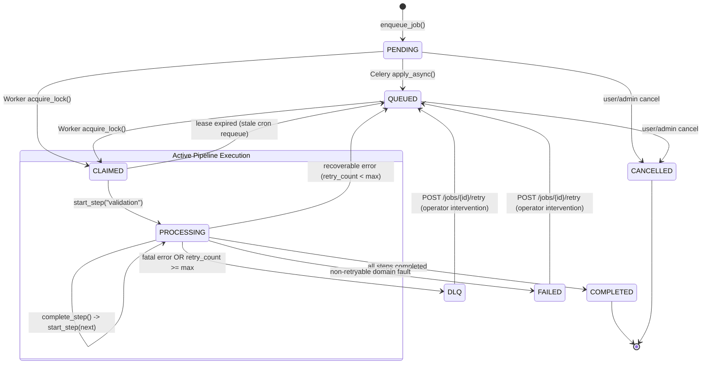
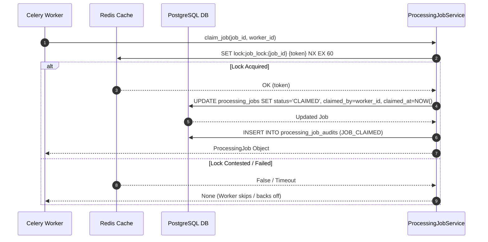
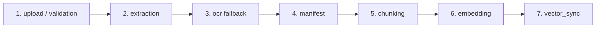
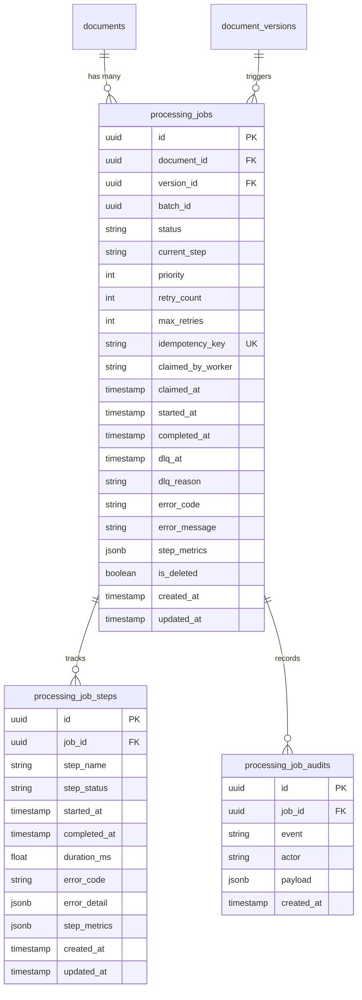

# Enterprise Architecture Design: F6.6 — ProcessingJob Lifecycle Tracking

**Document Identifier:** `ARCH-EPIC6-F6.6-V1.0`  
**Status:** PROPOSED (Architecture Review)  
**Target Module:** `backend/document/` & `backend/tasks/`  
**Target Score:** 10/10 Architecture & Production Readiness  

---

## 1. Executive Summary & Problem Context

In high-throughput RAG pipelines, asynchronous multi-stage document ingestion (file validation $\to$ text extraction $\to$ OCR $\to$ chunking $\to$ embedding $\to$ vector indexing) requires an authoritative, distributed, and deterministic lifecycle tracking system. 

Prior to standardizing F6.6, workers across disparate Celery queues (`ingestion`, `embeddings`, `indexing`) operated with partial lifecycle awareness. Feature F6.6 formalizes the end-to-end `ProcessingJob` lifecycle, establishing:
1. **Deterministic State Machine**: A formal finite state machine (FSM) governing state transitions, legal invariants, and terminal outcomes.
2. **Distributed Claim & Lease Protocol**: Redis-backed distributed locking preventing race conditions between concurrent Celery workers.
3. **Step-Level Execution Telemetry**: Granular step tracking (`ProcessingJobStep`) recording sub-millisecond latencies, payload metrics, and worker attribution.
4. **Monotonic Progress Engine**: Authoritative mapping of composite pipeline states to deterministic progress percentages ($0\% \to 100\%$) for real-time client polling.
5. **Tamper-Evident Audit Trail**: Complete append-only audit logging (`ProcessingJobAudit`) for compliance and debugging.

---

## 2. Core Architectural Principles

* **Single Source of Truth (SSOT)**: `ProcessingJob` is the authoritative orchestrator entity, while `Document.status` mirrors high-level aggregation.
* **At-Least-Once Processing with Idempotency**: Jobs are deduplicated via deterministic SHA-256 idempotency keys (`{document_id}_{version_id}_{date}`).
* **Fail-Safe Lease Expiration**: Worker claims are bound to Redis mutexes with heartbeat lease renewal; stalled jobs are automatically identified and re-queued via background cron.
* **Zero Overhead State Auditing**: Audit logging occurs asynchronously within database transactions using append-only relational structures.

---

## 3. Finite State Machine (FSM) Specification

### 3.1 Lifecycle States

| State | Category | Description | Allowable Next States |
| :--- | :--- | :--- | :--- |
| `PENDING` | Transient | Job registered in database; awaiting broker dispatch or worker claim. | `QUEUED`, `CLAIMED`, `CANCELLED` |
| `QUEUED` | Transient | Task enqueued in Redis broker queue (`ingestion`, `embeddings`, `indexing`). | `CLAIMED`, `CANCELLED` |
| `CLAIMED` | Active | Acquired by worker under distributed Redis lock; lease clock active. | `PROCESSING`, `FAILED`, `DLQ`, `QUEUED` |
| `PROCESSING`| Active | Actively executing a specific pipeline step (`validation`, `extraction`, etc.). | `PROCESSING` (next step), `COMPLETED`, `FAILED`, `DLQ` |
| `COMPLETED` | Terminal | All pipeline steps executed successfully; vectors indexed in Qdrant. | None (Terminal) |
| `FAILED` | Terminal | Non-recoverable fatal error encountered or retries exhausted. | `QUEUED` (via explicit operator retry) |
| `DLQ` | Quarantine| Job moved to Dead Letter Queue for isolation and operator remediation. | `QUEUED` (via explicit operator replay) |
| `CANCELLED` | Terminal | Job cancelled via user/admin action prior to completion. | None (Terminal) |

### 3.2 State Transition Diagram

### 3.3 State Transition Invariants & Guard Conditions

1. **Terminal State Immutability**: Once a job reaches `COMPLETED` or `CANCELLED`, no automated worker may mutate its state.
2. **Monotonic Retry Increment**: `retry_count` is monotonically incremented on each non-fatal step failure.
3. **Lease Guard**: A worker cannot execute `start_step` unless it holds the valid Redis lock token for `job_lock:{job_id}`.
4. **Idempotency Guard**: Re-enqueuing an identical `idempotency_key` returns the existing active job without creating duplicate records.

---

## 4. Distributed Locking & Worker Claim Protocol

### 4.1 Redis Mutex Architecture

To prevent duplicate execution when Celery deliveries are duplicated (`acks_late=True`), all worker claims utilize Redis distributed locks via `backend/cache/locks.py`:

### 4.2 Stale Job Recovery Mechanism

Workers that crash or become partitioned leave jobs in `CLAIMED` or `PROCESSING` state. A background Celery Beat cron job (`jobs.requeue_stale_jobs`) runs every 60 seconds:
1. Queries `processing_jobs` where `status = 'CLAIMED'` and `claimed_at < NOW() - 5 minutes`.
2. Verifies if `lock:job_lock:{job_id}` exists in Redis.
3. If no lock exists or worker heartbeat is dead:
   - Resets status to `QUEUED`.
   - Clears `claimed_by_worker` and `claimed_at`.
   - Emits `JOB_REQUEUED_STALE` audit event.

---

## 5. Fine-Grained Step Telemetry

### 5.1 Pipeline Step Hierarchy

Each job consists of distinct, sequentially executed steps tracked via `processing_job_steps`:

### 5.2 Step Telemetry Schema & Payload Tracking

For every step, the worker records:
* `started_at` & `completed_at` (UTC timestamp)
* `duration_ms` (precise microsecond/millisecond execution time)
* `step_status` (`PENDING`, `RUNNING`, `COMPLETED`, `FAILED`, `SKIPPED`)
* `step_metrics` JSON payload:
  * **extraction**: `{"char_count": 45120, "detected_lang": "en", "ocr_used": false}`
  * **chunking**: `{"chunk_count": 84, "strategy": "hierarchical", "avg_chunk_size": 537}`
  * **embedding**: `{"token_usage": 18240, "batch_count": 2, "embedding_model": "text-embedding-3-small"}`
  * **vector_sync**: `{"upserted_points": 84, "collection": "tenant_123_kb", "qdrant_latency_ms": 42.1}`

---

## 6. Monotonic Progress Calculation Engine

To eliminate progress UI jitter (where progress jumps backwards during retries), the engine combines `Document.status` and `ProcessingJobStep` execution states into a strict monotonic score:

$$\text{Progress} = \max\left(\text{Base}(\text{Document.status}), \text{StepWeight}(\text{Job.current\_step})\right)$$

### 6.1 Progress Percentage Matrix

| Stage | Step Name | Base % | Max Step % | Description |
| :--- | :--- | :---: | :---: | :--- |
| **Ingestion** | `upload` / `validation` | 10% | 20% | Binary stored, virus scan passed |
| **Ingestion** | `extraction` | 20% | 30% | Unstructured text extracted |
| **Ingestion** | `ocr` | 30% | 40% | Tesseract OCR applied if scanned |
| **Ingestion** | `manifest` | 40% | 45% | Storage manifest generated |
| **Chunking** | `chunking` | 50% | 65% | Text chunked & doubly-linked |
| **Embedding** | `embedding` | 65% | 85% | Vector embeddings generated |
| **Indexing** | `vector_sync` | 85% | 95% | Points upserted to Qdrant |
| **Finalization**| `ready` | 100% | 100% | Document fully queryable |

---

## 7. Data Models & Database Architecture

### 7.1 Entity Relationship Diagram

### 7.2 Indexing Optimization Strategy

To support high-frequency worker polling and dashboard querying:
* `idx_processing_jobs_doc_created`: `(document_id, created_at DESC)` — Rapid lookup of latest job.
* `idx_processing_jobs_status_claimed`: `(status, claimed_at)` — Stale job reaper optimization.
* `idx_processing_jobs_idempotency`: `(idempotency_key)` WHERE `is_deleted = false` — Deduplication guard.
* `idx_processing_job_steps_lookup`: `(job_id, step_name)` — Step upsert and duration aggregation.
* `idx_processing_job_audits_job`: `(job_id, created_at ASC)` — Chronological audit timeline retrieval.

---

## 8. Audit Logging & Event Dispatching

### 8.1 In-Process & Cross-Process Domain Events

When state transitions occur, `ProcessingJobService` publishes structured events via `EventDispatcher` (`backend/core/events/dispatcher.py`):
1. `EventType.DOCUMENT_INGESTION_STARTED`: Dispatched on `claim_job()`.
2. `EventType.CHUNKING_STARTED` / `CHUNKING_COMPLETED`: Emitted during chunk transition.
3. `EventType.EMBEDDING_STARTED` / `EMBEDDING_COMPLETED`: Emitted during vectorization.
4. `EventType.VECTORS_INDEXED`: Emitted upon Qdrant synchronization.
5. `EventType.DOCUMENT_INGESTION_COMPLETED`: Emitted upon full pipeline success.
6. `EventType.DOCUMENT_INGESTION_FAILED`: Emitted when transitioning to `FAILED` or `DLQ`.

---

## 9. Verification & Acceptance Criteria

| Criteria ID | Target Requirement | Validation Mechanism |
| :--- | :--- | :--- |
| **AC-6.6.1** | Idempotency deduplication | Enqueueing identical document/version within same window returns existing job without duplicate insertion. |
| **AC-6.6.2** | Distributed Mutex Protection | Concurrent worker claims on same `job_id` result in exactly one successful claim; others receive `None`. |
| **AC-6.6.3** | Stale Lease Recovery | Artificially abandoned claimed jobs are reclaimed by cron after threshold timeout. |
| **AC-6.6.4** | Monotonic Progress Guarantee | Simulated step execution produces strictly non-decreasing progress percentage. |
| **AC-6.6.5** | Step Telemetry Accuracy | `duration_ms` matches actual wall-clock execution time within $\pm 2\%$. |
