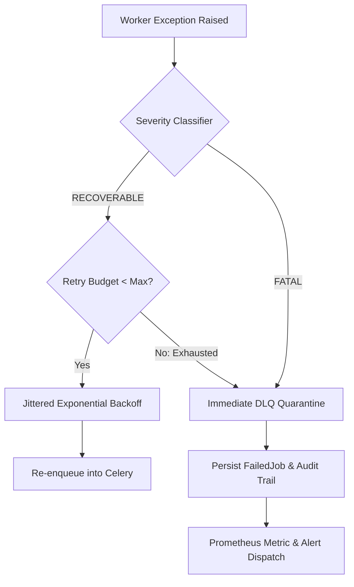
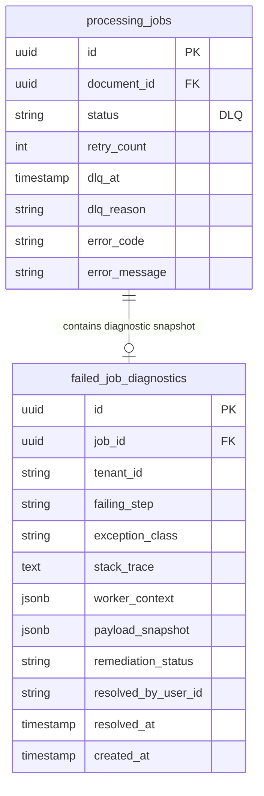
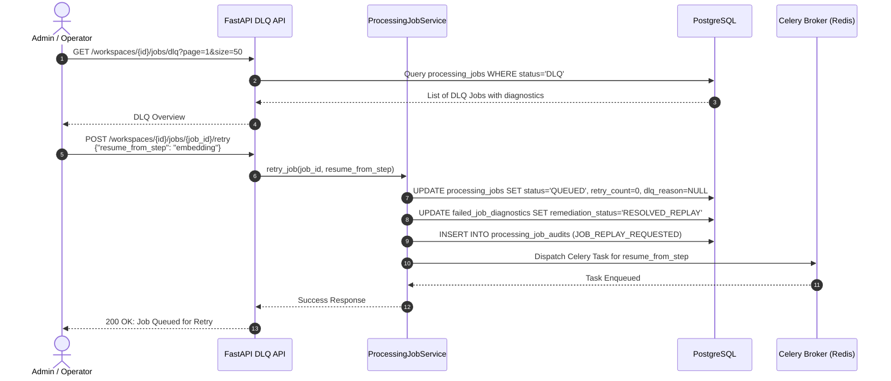

# Enterprise Architecture Design: F6.7 — Dead Letter Queue Handling (FailedJob)

**Document Identifier:** `ARCH-EPIC6-F6.7-V1.0`  
**Status:** PROPOSED (Architecture Review)  
**Target Module:** `backend/document/` & `backend/tasks/` & `backend/modules/retry/`  
**Target Score:** 10/10 Architecture & Production Readiness  

---

## 1. Executive Summary & Problem Context

In distributed asynchronous document processing, background tasks are susceptible to transient faults (e.g., brief network timeouts, rate limits) and permanent faults (e.g., malformed PDF binaries, invalid encryption keys, unsupported codecs). 

Without an enterprise-grade Dead Letter Queue (DLQ) strategy:
1. **Poison Pills**: Malformed files repeatedly crash workers, causing head-of-line blocking.
2. **Cascading Retry Storms**: Unconstrained retries overwhelm downstream vector databases (Qdrant) and external LLM/OCR APIs.
3. **Data Loss & Context Blindness**: Failed jobs vanish into worker logs without structured diagnostic snapshots, preventing root cause analysis.

Feature F6.7 establishes a unified **Dead Letter Queue (DLQ) and FailedJob Management Architecture** that isolates unrecoverable failures, enforces strict retry budgets with jittered exponential backoff, captures full forensic failure contexts, and provides operator remediation capabilities with granular step-level replay.

---

## 2. Error Severity Taxonomy & Routing Rules

The system classifies all exceptions into two deterministic severity tiers based on `backend/document/schemas/errors.py`:

### 2.1 Error Code Classification Matrix

| Error Domain | Error Code | Default Severity | Description | Action |
| :--- | :--- | :--- | :--- | :--- |
| **Validation** | `VAL_001`–`VAL_005` | `FATAL` | Size limit, bad MIME, virus detected, path traversal | Immediate DLQ |
| **Storage** | `STORE_001` | `RECOVERABLE` | Transient S3 connection failure / timeout | Retry with backoff |
| **Storage** | `STORE_002` | `FATAL` | Artifact not found / 404 NoSuchKey | Immediate DLQ |
| **Extraction**| `EXTRACT_001` | `FATAL` | Corrupted file structure / parser exception | Immediate DLQ |
| **Extraction**| `EXTRACT_002` | `RECOVERABLE` | Scanned image detected; fallback to OCR | Route to OCR step |
| **Extraction**| `EXTRACT_003` | `FATAL` | Unsupported MIME format | Immediate DLQ |
| **OCR** | `OCR_001`–`OCR_002` | `RECOVERABLE` | OCR engine timeout / service unavailable | Retry with backoff |
| **Chunking** | `CHK_001`–`CHK_003` | `RECOVERABLE` | Memory pressure / temporary parsing failure | Retry with backoff |
| **Embedding** | `EMB_003`, `EMB_005` | `RECOVERABLE` | Provider rate limit (HTTP 429) / network timeout | Retry with backoff |
| **Embedding** | `EMB_001`, `EMB_002` | `FATAL` | Invalid API key / unsupported dimension | Immediate DLQ |
| **Vector** | `VEC_003`, `VEC_005` | `RECOVERABLE` | Qdrant gRPC timeout / cluster leader re-election | Retry with backoff |
| **Vector** | `VEC_001`, `VEC_002` | `FATAL` | Collection schema mismatch / dimension conflict | Immediate DLQ |

---

## 3. Retry Strategy & Backoff Formulation

### 3.1 Jittered Exponential Backoff Formula

To prevent the "Thundering Herd" problem against shared services (PostgreSQL, Qdrant, Ollama/OpenAI), all recoverable retries apply full jitter exponential backoff:

$$t_{\text{backoff}} = \min\left(t_{\text{max}}, 2^{\text{attempt}} \times t_{\text{base}}\right) + \text{Uniform}(0, \text{jitter}_{\text{max}})$$

* **Base Delay ($t_{\text{base}}$)**: 5.0 seconds
* **Max Backoff ($t_{\text{max}}$)**: 300.0 seconds (5 minutes)
* **Jitter ($\text{jitter}_{\text{max}}$)**: 3.0 seconds
* **Max Retries ($N_{\text{max}}$)**: 3 attempts (enforced per `RetryBudgetManager.HARD_CAP = 3`)

### 3.2 Retry Schedule

| Attempt | Base Delay | Exponential Multiplier | Full Delay Range (with Jitter) |
| :---: | :---: | :---: | :---: |
| **1** | 5.0 s | $2^0 = 1$ | 5.0 s – 8.0 s |
| **2** | 5.0 s | $2^1 = 2$ | 10.0 s – 13.0 s |
| **3** | 5.0 s | $2^2 = 4$ | 20.0 s – 23.0 s |
| **Exhausted** | — | — | **Transition to DLQ** |

---

## 4. FailedJob & DLQ Data Architecture

When a job enters `DLQ`, forensic execution data is captured to facilitate rapid diagnostics and replay.

### 4.1 Schema Definition (`FailedJob` / `ProcessingJob` DLQ Extension)

### 4.2 Diagnostic Payload Invariants

The `failed_job_diagnostics` record preserves:
1. `failing_step`: Exact pipeline step during failure (`chunking`, `embedding`, `vector_sync`).
2. `stack_trace`: Sanitized Python stack trace (sensitive API credentials redacted).
3. `worker_context`: Worker node ID, memory utilization, Celery delivery tag.
4. `payload_snapshot`: Serialized parameters and intermediate IDs required to reconstruct task state.
5. `remediation_status`: `PENDING_TRIAGE`, `RESOLVED_REPLAY`, `DISMISSED_IGNORED`.

---

## 5. Operator Remediation & Replay Engine

### 5.1 Remediation Workflow

### 5.2 Granular Step Resumption (`resume_from_step`)

When replaying a failed job, operators can choose:
* **Full Restart (`resume_from_step = None`)**: Re-runs from initial document validation.
* **Smart Resume (`resume_from_step = "embedding"`)**: Bypasses already completed steps (`validation`, `extraction`, `chunking`), loading previously persisted artifacts directly from storage, saving computation and API tokens.

### 5.3 Batch Operations API

To handle bulk remediation during upstream outages (e.g., Qdrant network partition restored):
* `POST /workspaces/{id}/jobs/dlq/bulk-retry`: Replays up to 100 DLQ jobs matching a specific `error_code` filter.
* `POST /workspaces/{id}/jobs/dlq/bulk-dismiss`: Soft-deletes unresolvable malformed jobs.

---

## 6. Observability, Metrics & Alerting

### 6.1 Prometheus Metrics Specification

| Metric Name | Type | Labels | Description |
| :--- | :--- | :--- | :--- |
| `raguard_jobs_dlq_total` | Counter | `tenant_id`, `step_name`, `error_code` | Cumulative jobs moved to DLQ |
| `raguard_jobs_retry_total` | Counter | `step_name`, `attempt`, `severity` | Total automated retry attempts |
| `raguard_dlq_active_count` | Gauge | `tenant_id`, `error_domain` | Current count of un-remediated DLQ jobs |
| `raguard_dlq_remediation_duration_seconds` | Histogram | `action` (`replay`, `dismiss`) | Time from failure to remediation |

### 6.2 Alerting Thresholds

* **Critical Alert (P1)**: DLQ rate $> 5$ jobs/minute across all tenants.
* **Warning Alert (P2)**: Any single tenant has $> 25$ unresolved DLQ jobs.
* **Poison Pill Alert (P2)**: Same document ID fails $> 3$ consecutive manual replays.

---

## 7. Retention & Purge Policy

* **Active DLQ Retention**: Jobs remain queryable in DLQ state for 30 days.
* **Automated Archival**: A monthly cron job archives resolved diagnostic logs to cold storage (S3 Glacier / Parquet export) after 90 days.

---

## 8. Verification & Acceptance Criteria

| Criteria ID | Target Requirement | Validation Mechanism |
| :--- | :--- | :--- |
| **AC-6.7.1** | Fatal Error Immediate Isolation | Injecting a `VAL_001` or `EXTRACT_003` error transitions job to `DLQ` on first attempt without retrying. |
| **AC-6.7.2** | Max Retries Enforcement | Injecting a recoverable `STORE_001` error triggers exactly 3 backoff retries before transitioning to `DLQ`. |
| **AC-6.7.3** | Contextual Diagnostic Capture | Verified that stack trace, worker ID, and step context are fully persisted in `failed_job_diagnostics`. |
| **AC-6.7.4** | Granular Step Replay | Triggering retry with `resume_from_step="embedding"` skips extraction and chunking, resuming directly at vectorization. |
| **AC-6.7.5** | Multi-Tenant DLQ Isolation | Tenant A cannot view or replay DLQ jobs belonging to Tenant B. |
