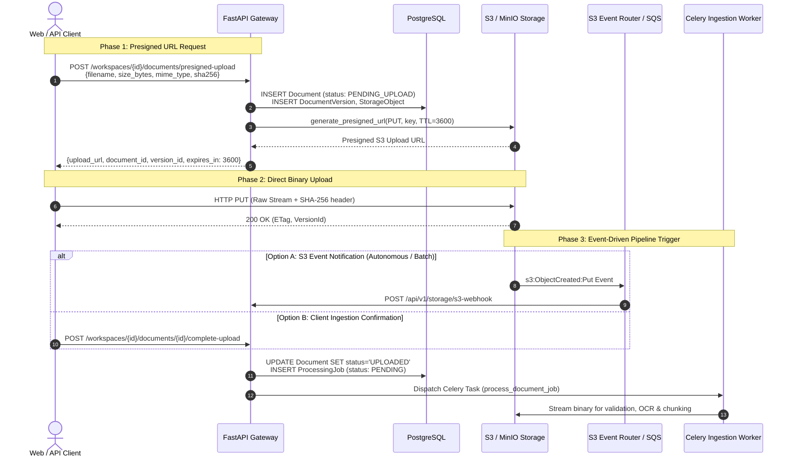

# Enterprise Architecture Design: F6.8 — S3 Event-Driven Pipeline Trigger

**Document Identifier:** `ARCH-EPIC6-F6.8-V1.0`  
**Status:** PROPOSED (Architecture Review)  
**Target Module:** `backend/document/storage/` & `backend/document/services/` & `backend/tasks/`  
**Target Score:** 10/10 Architecture & Production Readiness  

---

## 1. Executive Summary & Problem Context

In enterprise knowledge ingestion, uploading large documents (large PDF handbooks, technical manuals, audio transcriptions up to 500MB+) directly through synchronous FastAPI HTTP application servers introduces severe bottlenecks:
1. **API Server Memory Bloat**: Buffering large streams in web worker memory starves API processes and degrades HTTP request latency.
2. **Connection Fragility**: Long-lived HTTP upload connections frequently drop on mobile or unstable networks.
3. **Lack of True Event-Driven Scale**: Inability to process batch ingestion from automated external data lakes (e.g., automated document dumps into S3 buckets).

Feature F6.8 establishes an **S3 Event-Driven Ingestion Pipeline** featuring:
1. **Direct-to-S3 Presigned Upload Architecture**: Zero-memory footprint on API servers via time-limited, cryptographically scoped presigned PUT URLs.
2. **Dual-Trigger Notification Engine**: Supports both **S3 ObjectCreated Event Notifications** (via AWS SNS/SQS/Webhook) and **Client Ingestion Confirmation Callbacks** (`POST /complete-upload`).
3. **Asynchronous Post-Upload Screening & Quarantine**: Background validation of uploaded S3 binaries (antivirus, magic-byte inspection, SHA-256 integrity verification) before pipeline dispatch.
4. **Idempotent Ingestion Dispatcher**: Deduplication of duplicate S3 event deliveries via S3 ETag / Object Version keys.

---

## 2. Architectural Blueprint & High-Level Flow



---

## 3. Presigned Upload Protocol Specification

### 3.1 Upload Initiation Schema (`POST /presigned-upload`)

**Request Payload:**
```json
{
  "filename": "annual_financial_report_2026.pdf",
  "file_size_bytes": 45892040,
  "mime_type": "application/pdf",
  "checksum_sha256": "e3b0c44298fc1c149afbf4c8996fb92427ae41e4649b934ca495991b7852b855",
  "folder_id": "3fa85f64-5717-4562-b3fc-2c963f66afa6"
}
```

**Response Payload:**
```json
{
  "document_id": "9b1deb4d-3b7d-4bad-9bdd-2b0d7b3dcb6d",
  "version_id": "1a2b3c4d-5e6f-7a8b-9c0d-1e2f3a4b5c6d",
  "upload_url": "https://raguard-storage.s3.us-east-1.amazonaws.com/tenants/t-123/documents/9b1deb4d/v1/original/annual_financial_report_2026.pdf?X-Amz-Algorithm=AWS4-HMAC-SHA256...",
  "object_key": "tenants/t-123/documents/9b1deb4d/v1/original/annual_financial_report_2026.pdf",
  "expires_in_seconds": 3600,
  "required_headers": {
    "Content-Type": "application/pdf"
  }
}
```

### 3.2 Security Constraints on Presigned URLs

1. **Strict Object Key Scoping**: The URL is bound strictly to `tenants/{tenant_id}/documents/{document_id}/v{version}/original/{sanitized_filename}`.
2. **Short-Lived Expiration**: Maximum TTL of 3600 seconds (1 hour).
3. **MIME Enforcement**: Presigned signature includes `Content-Type` matching the declared MIME type.
4. **Tenant Isolation**: S3 bucket policies restrict access tokens to the tenant's cryptographic boundary.

---

## 4. S3 Event Processing & Ingestion Dispatcher

### 4.1 S3 Event Payload Parser

When AWS S3 triggers an event notification (`s3:ObjectCreated:Put` or `s3:ObjectCreated:CompleteMultipartUpload`), the payload is ingested via `POST /api/v1/storage/s3-webhook`:

```json
{
  "Records": [
    {
      "eventVersion": "2.1",
      "eventSource": "aws:s3",
      "awsRegion": "us-east-1",
      "eventName": "ObjectCreated:Put",
      "s3": {
        "bucket": {
          "name": "raguard-production-storage"
        },
        "object": {
          "key": "tenants/tenant_001/documents/9b1deb4d-3b7d-4bad-9bdd-2b0d7b3dcb6d/v1/original/report.pdf",
          "size": 45892040,
          "eTag": "0123456789abcdef0123456789abcdef",
          "versionId": "null"
        }
      }
    }
  ]
}
```

### 4.2 Webhook Verification & Deduplication

To ensure robust, zero-duplication execution:
1. **Webhook Signature Validation**: When using SNS/HTTP endpoints, signatures are verified against AWS public signing certificates.
2. **Redis Idempotency Guard**:
   ```
   lock_key = f"s3_event:{bucket}:{object_key}:{eTag}"
   SET lock_key "1" NX EX 86400
   ```
   If key already exists, event is acknowledged (`HTTP 200 OK`) and discarded as duplicate.
3. **Object Key Resolution**: Parses `tenant_id`, `document_id`, `version_number` from the canonical S3 key structure.

---

## 5. Asynchronous Screening & Quarantine

Prior to launching deep parsing/OCR tasks, the ingestion worker executes an asynchronous screening stage:

```mermaid
graph TD
    Trigger[S3 Event Received] --> VerifyExist[1. Verify S3 Object Exists & Size Match]
    VerifyExist -->|Mismatch / Not Found| Fail404[Transition to FAILED: STORE_002]
    VerifyExist -->|Valid| StreamHead[2. Stream Initial 8KB Header]
    
    StreamHead --> MagicByte{Magic Bytes Match MIME?}
    MagicByte -->|No / Corrupt| Quarantine[Quarantine Object & Mark FAILED: VAL_003]
    MagicByte -->|Yes| ClamAV[3. Stream Binary to ClamAV Scanner]
    
    ClamAV --> VirusCheck{Infection Detected?}
    VirusCheck -->|Yes: Infected| S3Delete[Delete / Move to S3 Quarantine Bucket]
    S3Delete --> VirusFail[Mark FAILED: VAL_005 & Alert SecOps]
    
    VirusCheck -->|Clean| EnqueuePipeline[4. Launch Full Ingestion Pipeline (F6.2 - F6.5)]
```

---

## 6. Multi-Cloud & Local Storage Compatibility

The design leverages the unified `StorageProvider` abstraction (`backend/document/storage/`):

| Provider | Implementation Class | Presigned URL Support | Event Trigger Support |
| :--- | :--- | :---: | :--- |
| **AWS S3** | `S3StorageProvider` | Native AWS S3 SDK | S3 Event Notification $\to$ SQS / SNS / Webhook |
| **MinIO** | `S3StorageProvider` | Native S3 API | MinIO Bucket Notifications $\to$ Webhook |
| **Cloudflare R2**| `S3StorageProvider` | S3-Compatible API | R2 Event Notifications $\to$ Webhook |
| **Local Dev** | `LocalStorageProvider` | Direct HTTP Stream | In-process EventDispatcher |

---

## 7. Observability, Metrics & Telemetry

### 7.1 Key Prometheus Metrics

| Metric Name | Type | Description |
| :--- | :--- | :--- |
| `raguard_s3_presigned_urls_generated_total` | Counter | Total presigned upload URLs issued |
| `raguard_s3_events_received_total` | Counter | Total S3 ObjectCreated events processed |
| `raguard_s3_events_deduplicated_total` | Counter | Duplicate S3 events dropped |
| `raguard_s3_upload_to_trigger_duration_seconds` | Histogram | Latency between presigned URL issue and S3 trigger |
| `raguard_s3_quarantine_total` | Counter | Files quarantined due to virus or validation failure |

---

## 8. Verification & Acceptance Criteria

| Criteria ID | Target Requirement | Validation Mechanism |
| :--- | :--- | :--- |
| **AC-6.8.1** | Presigned URL Signature | Direct binary upload via generated presigned URL successfully stores object in S3 without API server memory usage. |
| **AC-6.8.2** | Event Notification Trigger | Mock S3 `ObjectCreated:Put` payload to webhook successfully updates Document status to `UPLOADED` and enqueues Celery job. |
| **AC-6.8.3** | Event Deduplication | Sending duplicate S3 webhook payloads with identical ETag results in exactly one Celery job execution. |
| **AC-6.8.4** | Malicious Binary Quarantine | Uploading an EICAR test signature triggers ClamAV detection, deletes S3 object, and transitions job to `DLQ` (`VAL_005`). |
| **AC-6.8.5** | Multi-Provider Fallback | Switching storage provider config between `s3`, `minio`, and `local` functions seamlessly with identical interfaces. |
