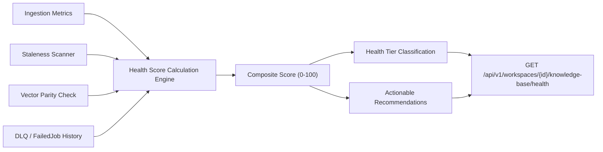

# Enterprise Architecture Specification: Feature F7.2 — Knowledge Health Score Calculation

**Document ID:** ARCH-F7.2-001  
**Version:** 1.0.0  
**Status:** PROPOSED / ARCHITECTURE REVIEW  
**Author:** Enterprise Solutions Architect  
**Epic:** Epic 7 — Knowledge Base  
**Target Delivery:** Milestone 2 (Knowledge Platform)

---

## 1. Executive Summary & Algorithmic Formulation
Feature F7.2 establishes an automated, multi-dimensional Health Score Engine for enterprise knowledge bases. On a scale of 0 to 100, the Knowledge Health Score evaluates how complete, fresh, high-quality, and reliably indexed a workspace's corpus is for RAG retrieval.

---

## 2. Multi-Dimensional Scoring Mathematical Model

$$\text{Health Score} = \min(100, \max(0, w_c \cdot S_c + w_f \cdot S_f + w_q \cdot S_q + w_r \cdot S_r))$$

Where the weights $w$ satisfy:
$$\sum w_i = 1.0 \quad (w_c = 0.30, \; w_f = 0.25, \; w_q = 0.25, \; w_r = 0.20)$$

### 2.1 Dimension Breakdown
1. **Coverage Dimension ($S_c \in [0, 100]$, Weight: 30%)**:
   $$S_c = 100 \times \frac{N_{\text{indexed}}}{N_{\text{total}} + \epsilon}$$
   Evaluates the proportion of uploaded documents that are fully processed and vectorized in Qdrant vs pending/failed.

2. **Freshness Dimension ($S_f \in [0, 100]$, Weight: 25%)**:
   $$S_f = 100 \times \left(1.0 - \frac{N_{\text{stale}}}{N_{\text{active}} + \epsilon}\right)$$
   Penalizes knowledge bases containing documents whose content has exceeded staleness or expiration thresholds.

3. **Chunk & Extraction Quality Dimension ($S_q \in [0, 100]$, Weight: 25%)**:
   $$S_q = 100 \times \left(1.0 - \text{Penalty}_{\text{empty}} - \text{Penalty}_{\text{ocr\_low\_conf}} - \text{Penalty}_{\text{variance}}\right)$$
   Evaluates chunk consistency, OCR text extraction confidence, and penalizes empty or truncated text chunks.

4. **Pipeline Reliability Dimension ($S_r \in [0, 100]$, Weight: 20%)**:
   $$S_r = 100 \times \left(1.0 - \min\left(1.0, \frac{N_{\text{DLQ\_30d}}}{N_{\text{jobs\_30d}} + \epsilon}\right)\right)$$
   Reflects recent ingestion stability, rewarding workspaces with 0 Dead Letter Queue failures.

---

## 3. Health Tier Categorization & Actionable Recommendations

| Tier | Score Range | Status Indicator | Automated Recommendations |
| :--- | :--- | :--- | :--- |
| **EXCELLENT** | 90 – 100 | 🟢 Optimal | Corpus is in prime state for production RAG generation. |
| **GOOD** | 75 – 89 | 🟡 Healthy | Minor optimizations recommended (e.g. review 2 aging docs). |
| **DEGRADED** | 50 – 74 | 🟠 Warning | Stale docs or failed jobs detected; trigger re-indexing/remediation. |
| **CRITICAL** | 0 – 49 | 🔴 Action Required | Severe indexing failures, orphan vectors, or corrupted extractions. |

---

## 4. API Specification

- `GET /api/v1/workspaces/{workspace_id}/knowledge-base/health`:
  - Returns real-time health score, dimension sub-scores, tier, and prioritized recommendations.
- `POST /api/v1/workspaces/{workspace_id}/knowledge-base/health/recalculate`:
  - Triggers on-demand re-evaluation of all 4 dimensions and updates workspace health cache in Redis.
