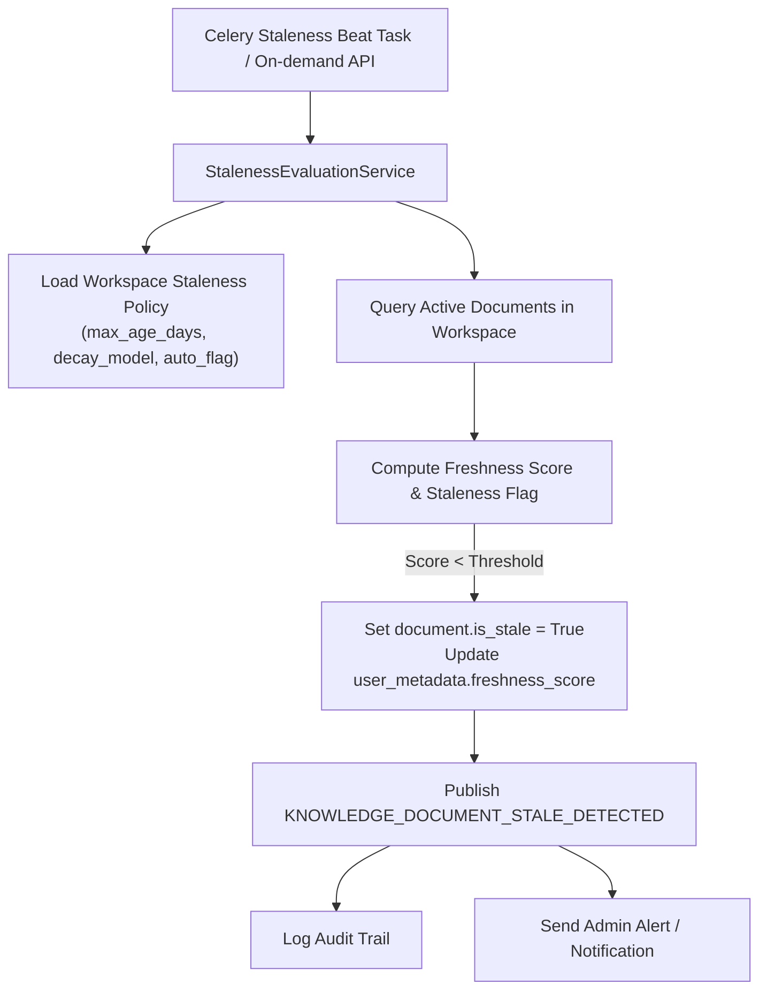

# Enterprise Architecture Specification: Feature F7.3 — Stale Document Detection

**Document ID:** ARCH-F7.3-001  
**Version:** 1.0.0  
**Status:** PROPOSED / ARCHITECTURE REVIEW  
**Author:** Enterprise Solutions Architect  
**Epic:** Epic 7 — Knowledge Base  
**Target Delivery:** Milestone 2 (Knowledge Platform)

---

## 1. Executive Summary & Problem Context
Knowledge base content decays over time as business policies, software documentation, and product specifications evolve. Retrieval from stale documents leads to high hallucination and incorrect LLM responses. Feature F7.3 implements automated freshness decay evaluation, configurable staleness policies per workspace, automated stale tagging, and bulk remediation mechanisms.

---

## 2. Freshness Decay Model & Policies

### 2.1 Decay Computation
The freshness $F(d, t) \in [0.0, 1.0]$ of document $d$ at time $t$ is modeled as:
$$F(d, t) = \exp\left(-\lambda \cdot \frac{\Delta t}{T_{\text{max}}}\right)$$
Where:
- $\Delta t = t - \max(d.\text{updated\_at}, d.\text{created\_at})$ (or time elapsed past `user_metadata.expiry_date` if present).
- $T_{\text{max}}$ is the workspace staleness threshold (e.g. 90 days).
- $\lambda$ is the decay slope parameter (default $\lambda = 1.0$).

A document is marked **Stale** ($d.\text{is\_stale} = \text{True}$) whenever $F(d, t) < F_{\text{threshold}}$ (default $0.35$) or $\Delta t > T_{\text{max}}$.



---

## 3. Policy & Remediation Capabilities

### 3.1 Workspace Staleness Policy Schema
```python
class StalenessPolicyDTO(BaseModel):
    workspace_id: UUID
    max_age_days: int = Field(default=90, ge=1, le=3650)
    inactivity_threshold_days: int = Field(default=60, ge=1, le=3650)
    auto_stale_flagging: bool = Field(default=True)
    decay_model: str = Field(default="exponential")  # exponential | linear
    notify_owners_on_stale: bool = Field(default=True)
```

### 3.2 Bulk Remediation Actions
1. **Mark as Reviewed (`MARK_REVIEWED`)**: Resets the document's staleness timer for a configurable extension period (e.g. +90 days) and adds an audit record with reviewer ID.
2. **Archive Stale (`ARCHIVE`)**: Automatically moves stale documents to the archive state, detaching them from active vector search.
3. **Trigger Re-ingestion (`REPROCESS`)**: Queues document for fresh extraction and vector re-indexing.

---

## 4. API Endpoints
- `GET /api/v1/workspaces/{workspace_id}/knowledge-base/staleness/report`: Comprehensive inventory of stale documents, average corpus age, and aging distribution histogram.
- `PUT /api/v1/workspaces/{workspace_id}/knowledge-base/staleness/policy`: Update staleness thresholds and automation rules.
- `POST /api/v1/workspaces/{workspace_id}/knowledge-base/staleness/remediate`: Execute bulk remediation on a batch of document IDs.
