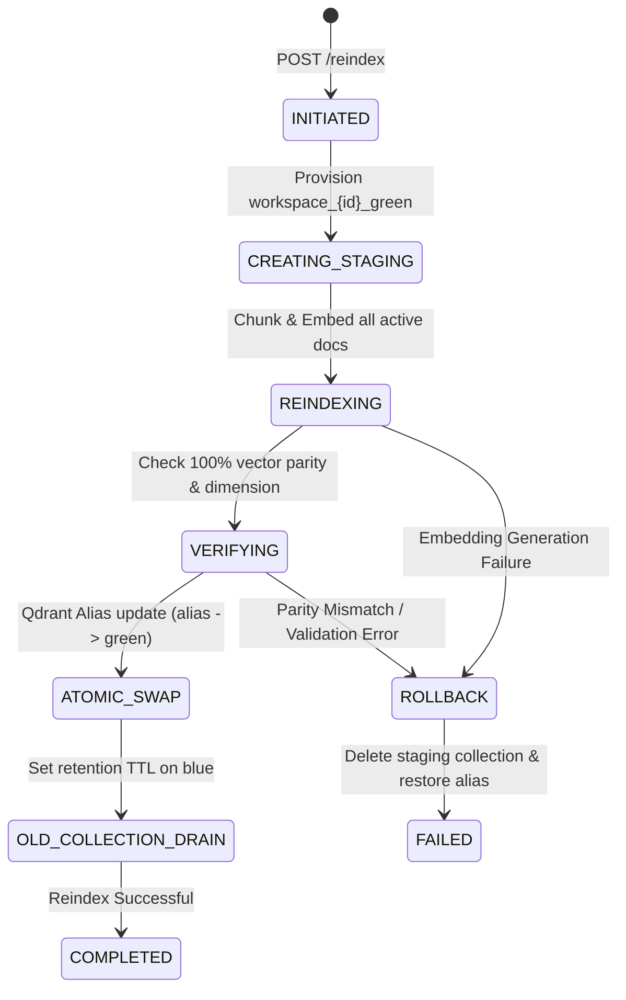

# Enterprise Architecture Specification: Feature F7.4 — Vector Re-Index Workflow (Qdrant Namespace Swap)

**Document ID:** ARCH-F7.4-001  
**Version:** 1.0.0  
**Status:** PROPOSED / ARCHITECTURE REVIEW  
**Author:** Enterprise Solutions Architect  
**Epic:** Epic 7 — Knowledge Base  
**Target Delivery:** Milestone 2 (Knowledge Platform)

---

## 1. Executive Summary & Problem Context
When vector embedding models are rotated (e.g. migrating from `text-embedding-ada-002` to `text-embedding-3-large`), chunking hyperparameters changed, or corpus indexing repaired, indexing directly into live production collections causes downtime, query latency spikes, and partial retrieval failures.

Feature F7.4 designs a **Zero-Downtime Blue-Green Vector Re-Indexing Engine** using atomic Qdrant Collection Alias Swaps and multi-stage verification gates.

---

## 2. Blue-Green Re-Indexing Architecture & Lifecycle



### 2.1 Qdrant Alias Layer Strategy
- **Virtual Namespace Alias**: `workspace_{workspace_id}_vectors` (Live RAG retrieval queries always target this alias).
- **Physical Collections**:
  - `workspace_{workspace_id}_v1` (Active Blue Collection)
  - `workspace_{workspace_id}_v2` (Staging Green Collection)

### 2.2 Atomic Alias Cutover Mechanism
The cutover is executed via a single atomic transaction in Qdrant:
```json
{
  "actions": [
    {
      "delete_alias": {
        "alias_name": "workspace_123_vectors"
      }
    },
    {
      "create_alias": {
        "collection_name": "workspace_123_v2",
        "alias_name": "workspace_123_vectors"
      }
    }
  ]
}
```
If anything fails during the re-indexing or verification phase, the alias remains strictly attached to `v1` with **zero downtime or retrieval interruption**.

---

## 3. Re-Indexing Worker & Verification Gates

### 3.1 Verification Gate Criteria
Before triggering the atomic swap, the system validates:
1. **Count Parity**: Total vectors in the green collection must match the expected chunk count from PostgreSQL.
2. **Dimension Match**: Vector dimensionality matches the target embedding model configuration (e.g. 1536 or 3072).
3. **Point Integrity**: Sampling vector similarity probe queries to confirm cosine distance search works as expected.

### 3.2 Rollback & Cleanup Safeguards
- **Failed Re-Index**: If staging re-index fails, staging collection `workspace_{id}_v2` is immediately deleted, and the job status transitions to `FAILED` with detailed diagnostics.
- **Post-Swap Drain**: The old collection `workspace_{id}_v1` is kept in a quarantined state for a grace period (e.g. 24 hours) before asynchronous pruning to enable instant manual rollback if needed.

---

## 4. API Endpoints
- `POST /api/v1/workspaces/{workspace_id}/knowledge-base/reindex`: Start background blue-green re-indexing job.
- `GET /api/v1/workspaces/{workspace_id}/knowledge-base/reindex/{job_id}`: Stream / poll real-time re-index progress and stage metrics.
- `POST /api/v1/workspaces/{workspace_id}/knowledge-base/reindex/{job_id}/cancel`: Abort in-progress re-index and destroy staging collection.
- `POST /api/v1/workspaces/{workspace_id}/knowledge-base/reindex/{job_id}/rollback`: Instant rollback to previous collection alias within quarantine window.
