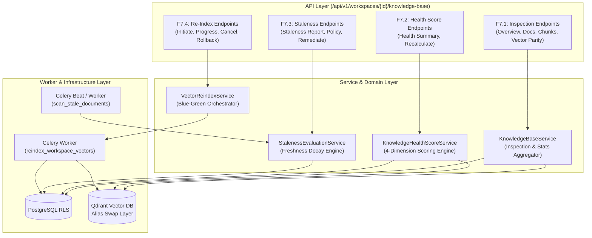

# Implementation Plan: Epic 7 — Knowledge Base (Features F7.1–F7.4)

Implement the enterprise multi-tenant **Knowledge Base** layer (Epic 7), delivering workspace knowledge inspection, multi-dimensional knowledge health scoring, automated stale document detection & decay lifecycle management, and zero-downtime blue/green vector re-indexing with Qdrant collection alias swaps.

---

## User Review Required

> [!IMPORTANT]
> **Zero-Downtime Blue-Green Namespace Swap Strategy (F7.4)**:
> Vector re-indexing creates an isolated staging collection (e.g. `workspace_{id}_staging_{job_id}`). Active RAG retrieval continues uninterrupted against the virtual collection alias `workspace_{id}_vectors`. Only upon passing 100% parity and dimension verification gates does the atomic Qdrant alias cutover execute. The old collection is preserved in a quarantined state for a 24-hour grace period to facilitate instant rollback if required.

> [!NOTE]
> **Backward Compatibility & Event Bus**:
> All operations emit domain events (`KNOWLEDGE_BASE_INSPECTED`, `KNOWLEDGE_HEALTH_CALCULATED`, `KNOWLEDGE_DOCUMENT_STALE_DETECTED`, `VECTOR_REINDEX_COMPLETED`) through the central `EventDispatcher`, ensuring seamless observability and audit logging.

---

## Proposed Changes



---

### Component 1: Domain Models, Repositories & Schemas (F7.1–F7.4)

#### [NEW] [knowledge_base_dto.py](file:///d:/RAGuard/backend/modules/knowledge_base/schemas/knowledge_base_dto.py)
- Pydantic DTOs for:
  - `KnowledgeBaseOverviewDTO`: Comprehensive workspace summary (document counts, chunk metrics, Qdrant vector count, storage size, MIME distribution).
  - `DocumentKnowledgeStatusDTO`: Document-level indexing and chunk metadata.
  - `ChunkInspectionDetailDTO`: Detailed chunk metadata (token count, point ID, snippet, vector state, bounding box/page).
  - `VectorParityValidationDTO`: 1:1 parity audit between PostgreSQL chunks and Qdrant points.

#### [NEW] [health_score_dto.py](file:///d:/RAGuard/backend/modules/knowledge_base/schemas/health_score_dto.py)
- Pydantic DTOs for:
  - `KnowledgeHealthScoreDTO`: Overall score ($0–100$), tier classification (`EXCELLENT`, `GOOD`, `DEGRADED`, `CRITICAL`), dimension sub-scores (Coverage $30\%$, Freshness $25\%$, Quality $25\%$, Reliability $20\%$), and prioritized recommendations.
  - `DimensionScoreDTO`: Breakdown of individual score calculation details.

#### [NEW] [staleness_dto.py](file:///d:/RAGuard/backend/modules/knowledge_base/schemas/staleness_dto.py)
- Pydantic DTOs for:
  - `StalenessPolicyDTO`: Configurable workspace staleness parameters (`max_age_days`, `decay_model`, `inactivity_threshold_days`, `auto_stale_flagging`).
  - `StaleDocumentItemDTO`: Stale document metadata, age, freshness decay score, expiry status.
  - `StalenessReportDTO`: Aggregate staleness analytics, aging distribution, and total stale ratio.
  - `BulkRemediationRequestDTO`: Remediation actions (`MARK_REVIEWED`, `ARCHIVE`, `REPROCESS`).
  - `BulkRemediationResultDTO`: Counts of modified, archived, and queued documents.

#### [NEW] [reindex_dto.py](file:///d:/RAGuard/backend/modules/knowledge_base/schemas/reindex_dto.py)
- Pydantic DTOs for:
  - `ReindexRequestDTO`: Target embedding model, chunk size override, force flag.
  - `ReindexJobDTO`: Job lifecycle status (`INITIATED`, `STAGING_CREATED`, `INDEXING`, `VERIFYING`, `SWAPPING`, `COMPLETED`, `ROLLED_BACK`, `FAILED`), progress percentage, vector counts, elapsed time, staging collection name.

#### [NEW] [reindex_job.py](file:///d:/RAGuard/backend/modules/knowledge_base/models/reindex_job.py)
- SQLAlchemy model `VectorReindexJob`:
  - `id` (UUID pk)
  - `workspace_id` (String/UUID indexed)
  - `status` (String: `INITIATED`, `PROCESSING`, `VERIFYING`, `COMPLETED`, `FAILED`, `CANCELLED`, `ROLLED_BACK`)
  - `source_alias` (String)
  - `staging_collection` (String)
  - `previous_collection` (String, nullable)
  - `target_model` (String)
  - `total_documents` (Integer)
  - `processed_documents` (Integer)
  - `total_vectors_indexed` (Integer)
  - `parity_verified` (Boolean)
  - `error_message` (String, nullable)
  - `started_at`, `completed_at` (DateTime)

---

### Component 2: Service Orchestrators & Business Logic

#### [NEW] [knowledge_base_service.py](file:///d:/RAGuard/backend/modules/knowledge_base/services/knowledge_base_service.py)
- Aggregates workspace statistics from PostgreSQL (`Document`, `DocumentVersion`, `StorageObject`) and Qdrant (`get_collection_points_count`).
- Resolves paginated document lists with chunk counts and indexing states.
- Performs vector parity validation comparing active version chunk counts against Qdrant index counts.

#### [NEW] [health_score_service.py](file:///d:/RAGuard/backend/modules/knowledge_base/services/health_score_service.py)
- Implements the mathematical 4-dimension scoring engine:
  - Coverage ($30\%$): Successfully processed & vectorized vs total docs.
  - Freshness ($25\%$): Freshness decay score across active documents.
  - Quality ($25\%$): Variance in chunk sizing, OCR confidence penalties, empty chunk penalization.
  - Reliability ($20\%$): Failed job / DLQ error rate over the last 30 days.
- Maps composite score to health tiers and derives context-aware recommendations.

#### [NEW] [staleness_service.py](file:///d:/RAGuard/backend/modules/knowledge_base/services/staleness_service.py)
- Computes exponential and linear freshness decay curves: $F(d, t) = \exp(-\lambda \cdot \Delta t / T_{\text{max}})$.
- Evaluates workspace document staleness, updates `user_metadata.freshness_score` and `is_stale` flags.
- Dispatches `KNOWLEDGE_DOCUMENT_STALE_DETECTED` events.
- Executes bulk remediation: `MARK_REVIEWED` (extends expiration), `ARCHIVE` (soft-archives), or `REPROCESS` (re-queues extraction).

#### [NEW] [vector_reindex_service.py](file:///d:/RAGuard/backend/modules/knowledge_base/services/vector_reindex_service.py)
- Coordinates zero-downtime Blue-Green vector re-indexing:
  1. Creates staging collection `workspace_{id}_staging_{job_id}` in Qdrant with target vector configuration.
  2. Dispatches Celery re-indexing task.
  3. Executes verification gate (checks vector count matches chunk count, tests vector distance query).
  4. Performs atomic alias swap via Qdrant `update_collection_aliases`.
  5. Handles graceful rollback and cleanup.

---

### Component 3: Background Workers & Celery Tasks

#### [NEW] [reindex_worker.py](file:///d:/RAGuard/backend/modules/knowledge_base/workers/reindex_worker.py)
- Celery task `reindex_workspace_vectors(job_id: str)`:
  - Fetches all active documents and versions for the workspace.
  - Generates chunks and embeddings with target model in batches.
  - Upserts points into staging collection.
  - Updates progress in `VectorReindexJob`.
  - On completion, triggers verification and atomic alias swap.

#### [NEW] [staleness_worker.py](file:///d:/RAGuard/backend/modules/knowledge_base/workers/staleness_worker.py)
- Celery task `evaluate_workspace_staleness_task(workspace_id: str)`:
  - Runs periodic background scan of workspace documents, tagging stale files and logging metric alerts.

---

### Component 4: REST API Endpoints & Route Mounting

#### [NEW] [knowledge_base.py](file:///d:/RAGuard/backend/api/v1/routes/knowledge_base.py)
- Endpoints mounted under `/api/v1/workspaces/{workspace_id}/knowledge-base`:
  - `GET /overview`: Overview statistics and vector parity.
  - `GET /documents`: Paginated document catalog with filters.
  - `GET /documents/{document_id}/chunks`: Detailed chunk inspection.
  - `GET /vectors/validate`: Parity audit.
  - `GET /health`: Multi-dimension health score and recommendations.
  - `POST /health/recalculate`: Force recalculation.
  - `GET /staleness/report`: Staleness breakdown and aging histogram.
  - `PUT /staleness/policy`: Update staleness thresholds.
  - `POST /staleness/remediate`: Bulk remediation actions.
  - `POST /reindex`: Initiate blue/green re-index.
  - `GET /reindex/{job_id}`: Track re-index job progress.
  - `POST /reindex/{job_id}/cancel`: Abort re-index and destroy staging.
  - `POST /reindex/{job_id}/rollback`: Rollback alias to previous collection.

#### [MODIFY] [router.py](file:///d:/RAGuard/backend/api/v1/router.py)
- Register `knowledge_base.py` router under `api_v1_router`.

---

## Verification Plan

### Automated Tests
1. **Unit Tests**:
   - `test_knowledge_base_service.py`: Verify overview aggregation, chunk detail mapping, and vector parity validation.
   - `test_health_score_service.py`: Verify mathematical scoring across all 4 dimensions, edge cases (0 documents, all stale, 100% failed jobs), tier assignments, and recommendations.
   - `test_staleness_service.py`: Test decay formula, threshold evaluation, staleness policy persistence, and bulk remediation (`MARK_REVIEWED`, `ARCHIVE`, `REPROCESS`).
   - `test_vector_reindex_service.py`: Test staging collection provisioning, verification gate checks, atomic alias swap execution, cancellation, and rollback.

2. **Integration Tests**:
   - `test_knowledge_base_api.py`: Test all REST API endpoints under `/api/v1/workspaces/{workspace_id}/knowledge-base` with JWT authentication and workspace RBAC enforcement.
   - `test_reindex_workflow_integration.py`: End-to-end simulation of blue-green re-indexing with simulated Qdrant alias swap and verification gates.

3. **Full Regression Test**:
   - Execute entire pytest suite to ensure 100% pass rate (465+ passing tests).

```bash
python -m pytest tests/unit/backend/modules/knowledge_base/ tests/integration/test_knowledge_base_api.py -v
```

### Manual Verification
- Validate OpenAPI interactive documentation at `/docs` for all new `/api/v1/workspaces/{workspace_id}/knowledge-base/*` endpoints.
- Confirm tenant isolation by asserting requests for `workspace_A` cannot view or modify data for `workspace_B`.
