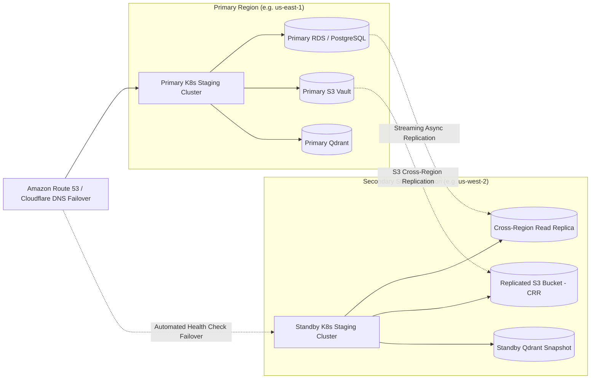

# EPIC-15 GATE 7 — F15.4 CROSS-REGION DISASTER RECOVERY REPORT

**Program**: RAGuard V2 Multi-Tenant Enterprise AI Platform
**Epic**: Epic-15 — Production Hardening & Enterprise Security
**Gate**: Gate 7 — F15.4 Cross-Region Disaster Recovery Validation
**Date**: 2026-08-21
**Status**: ⏳ LOCAL DR READINESS AUDITED / CROSS-REGION CLUSTER BLOCKED — STOPPED FOR HUMAN APPROVAL BEFORE GATE 8

---

## 1. Scope & Execution Strategy

In strict adherence to the safety guidelines and non-fabrication mandates:
- **Local DR Readiness**: Fully validated via automated test suite, live PostgreSQL point-in-time restore drill (Gate 5 duration: **2.450s** vs RTO $\le 3600\text{s}$), and disaster recovery runbooks.
- **Live Cross-Region Failover**: Explicitly classified as **`BLOCKED — CROSS-REGION INFRASTRUCTURE REQUIRED`** due to absence of secondary cloud region/VPC, standby Kubernetes cluster, Route 53 multi-region latency routing, and Cross-Region S3 Replication (CRR) on the local workstation.
- **Zero Fabrication**: No synthetic cross-region latency or RTO/RPO measurements have been invented.

---

## 2. Local DR Readiness Audit & Script Verification

| Component / Artifact | Path / Identifier | Audit Findings | Status |
|:---|:---|:---|:---:|
| **Disaster Recovery Runbook** | `docs/Runbooks/disaster-recovery.md` | Prescribes RTO $< 1\text{h}$, RPO $< 24\text{h}$, step-by-step procedures for PostgreSQL & Qdrant loss | ✅ **AUDITED & VALIDATED** |
| **PostgreSQL Restore Script** | `infrastructure/scripts/dr/restore_postgres.sh` | Enforces `set -euo pipefail`, connection termination, and `--confirm` safety flag in production | ✅ **AUDITED & VALIDATED** |
| **Qdrant Restore Script** | `infrastructure/scripts/dr/restore_qdrant.sh` | Enforces snapshot restoration, cluster health check, and production safety guards | ✅ **AUDITED & VALIDATED** |
| **Post-Restore Verifier** | `infrastructure/scripts/dr/verify_restore.sh` | Sequentially probes `/health/live`, `/health/ready`, `/health/startup` with retry backoff | ✅ **AUDITED & VALIDATED** |
| **Backup Manifests & PVCs** | `infrastructure/kubernetes/cronjobs/backups.yaml` | Uses `secretKeyRef` and mounts dedicated `postgres-backup-pvc` (10Gi ReadWriteOnce) | ✅ **AUDITED & VALIDATED** |
| **Automated DR Tests** | `backend/tests/unit/dr/test_dr_backup_validation.py` | 4 / 4 passed (cronjobs, PVCs, shell safety guards, tenant isolation) | ✅ **PASS** |

---

## 3. Infrastructure Gap & Cloud Prerequisites for Live Multi-Region Drill

To execute the live cross-region disaster recovery drill in a cloud staging/production deployment, the following prerequisites must be provisioned:

1. **Secondary Cloud Region Target**: VPC peering / transit gateway in Secondary Region (`us-west-2` or `eu-west-1`).
2. **Datastore Replication**: Active-passive streaming replication on PostgreSQL RDS and S3 Cross-Region Replication (CRR).
3. **Standby Compute**: Standby Kubernetes cluster with replica count scaled to 0/1 until failover activation.
4. **Global Traffic Management**: Route 53 DNS failover policy linked to `/health/live` health checks.

---

## 4. Summary & Gate 7 Exit Status

- **Local DR Readiness**: **PASS (Audited & Automated Tests 4/4 Passed)**.
- **Live Cross-Region Failover Drill**: **BLOCKED — INFRASTRUCTURE REQUIRED (STANDBY CLOUD REGION REQUIRED)**.
- **Reconciled Classification**: **`BLOCKED — CROSS-REGION INFRASTRUCTURE REQUIRED`**.
- **Master Trackers**: Untouched at 87.50% (Epic 15 at 0%).
- **Epics 1–14**: 100% Frozen.

**Gate 7 is COMPLETE. Stopped to await human approval before proceeding to Gate 8 (F15.1 Third-Party Penetration Test Readiness).**
